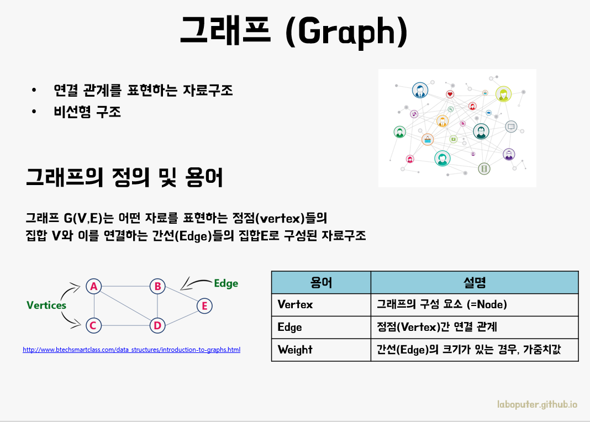
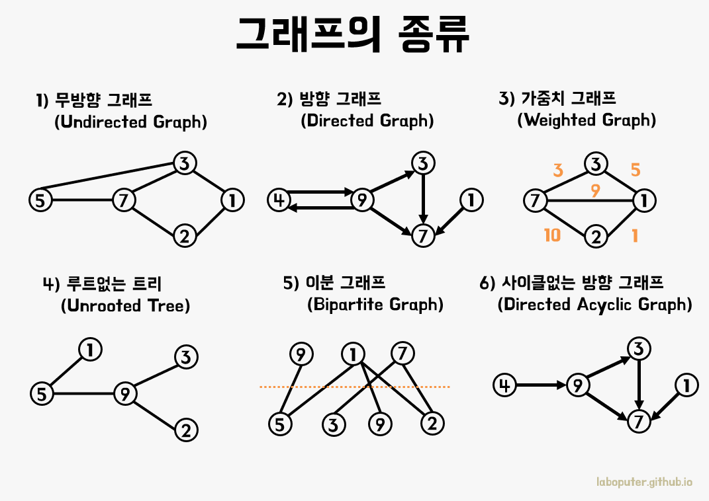
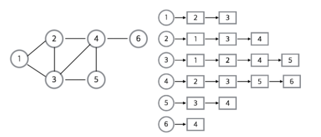
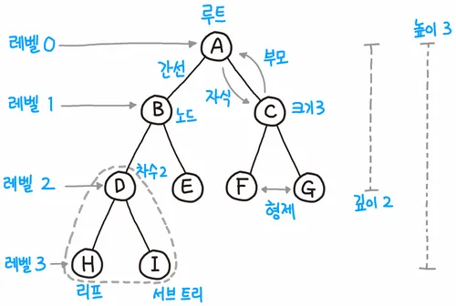
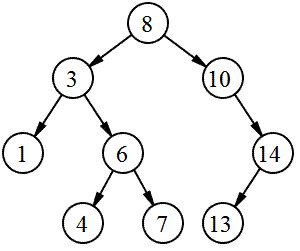

# 자료구조

 
 

### 그래프

---

- **정점(Vertex)**과 **간선(Edge)**으로 이루어진 자료구조

**정점**(Node, Vertex) : 데이터를 저장하는 위치

**간선**(Edge) : 정점(노드)을 연결하는 선. 링크(Link) 또는 브랜치(branch)로도 불린다.

**차수**(Degree) : 무방향 그래프에서 하나의 정점에 인접한 정점의 수를 의미한다.

 
 

### 그래프 종류

---

1. **무방향 그래프** : 간선(Edge)의 방향이 없는 그래프
2. **방향 그래프** : 방향성이 있는 그래프
3. **가중치 그래프** : 간선의 가중치값이 존재하는 그래프
4. **루트없는 트리** : 간선을 통해 정점 간 잇는 방법이 한가지인 그래프(트리)
5. **이분 그래프** : 그래프의 정점을 겹치지 않게 두 그룹으로 나눈 후 다른 그룹끼리만 간선이 존재하게 분할할 수 있는 그래프
6. **사이클이 없는 방향 그래프** : 정점에서 출발해 자기 자신으로 돌아오는 경로(사이클)가 없는 그래프

 
 

### 그래프 구현

---

`인접 행렬 방식`

2차원 배열을 사용하여 연결 상태를 나타낸다.

노드들 간에 직접 연결이 되어 있으면 1을, 아니면 0을 넣어서 행렬을 완성시킨 것이다.

- 공간복잡도 : O(n²)

- 두 정점에 대한 연결 정보를 조회하는 시간복잡도 : O(1)
- 한 개의 노드에 연결된 모든 노드를 확인하는 시간복잡도 : O(n)

무조건 2차원 배열이 필요하기 때문에 필요 이상의 공간이 낭비되는 단점이 있다.

 
 

`인접 리스트 방식 `

연결 리스트를 사용하여 연결 상태를 나타냄

- 공간복잡도 : O(V + E) ( V:노드, E:간선 )

- 두 정점에 대한 연결 정보를 조회하는 시간복잡도 : O(V)
- 한 개의 노드에 연결된 모든 노드를 확인하는 시간복잡도 : O(V)

 
 

### 그래프 탐색

---

> 모든 노드를 탐색하기 위해 간선을 따라 순회하는 것

- **DFS** : Depth First Search

깊이 우선 탐색 (최대한 깊게 탐색한 후 나오는 방식)

주로 재귀호출과 스택을 사용해서 구현

- **BFS** : Breadth First Search

너비 우선 탐색 (이웃한 노드들을 순차적으로 탐색)

주로 큐(Queue)와 반복문을 사용해서 구현

   
   

### 트리

---

그래프의 특수 형태로, **계층 구조**를 갖고 있는 자료구조

- 트리는 항상 루트(root)에서부터 시작된다.
- 루트는 자식(child)를 가지며, 간선(edge)로 연결되어 있다.
- 자식 노드의 개수는 차수(degree)라고 하며, 크기는 자신을 포함한 모든 자식 노드의 개수다.
- 높이는 현재 위치에서부터 리프(leaf)까지의 거리이다.
- 깊이는 루트에서부터 현재 노드까지의 거리다.

- 노드 : 트리를 구성하는 기본 원소

  - 루트 노드(root node) : 트리에서 부모가 없는 최상위 노드, 트리의 시작점
  - 부모 노드(parent node) : 루트 노드 방향으로 직접 연결된 노드
  - 자식 노드(child node) : 루트 노드 반대방향으로 직접 연결된 노드
  - 형제 노드(siblings node) : 같은 부모 노드를 갖는 노드들
  - 리프 노드(leaf node) : 루트 노드를 제외한 차수가 1인 정점을 뜻한다. 쉽게 말해 자식이 없는 노드.

- 모든 트리는 그래프이지만, 일부 그래프는 트리가 아니다.

- node가 n개면 edge는 n-1개

### 이진트리

---

부모 노드 밑의 자식 노드 개수(=차수, degree)를 최대 2개로 제한하는, 트리의 가장 간단한 형태다.

두 자식 노드를 보통 왼쪽 자식과 오른쪽 자식으로 구분짓는다.

루트가 x라고 하면 **왼쪽 노드**는 `2 + x + 1`, **오른쪽 노드**는 `2 + x + 2`값을 갖는 규칙이 있다.

#### 이진 트리 순회 방법

- 중위 순회(in-order traversal) : 왼쪽 자손, 자신, 오른쪽 자손 순서로 방문하는 순회방법으로, 정렬된 결과를 얻을 수 있다.
- 전위 순회(pre-order traversal) : 자신, 왼쪽 자손, 오른쪽 자손 순서로 방문하는 순회방법.
- 후위 순회(post-order traversal) : 왼쪽 자손, 오른쪽 자손, 자신 순서로 방문하는 순회방법.
- 레벨 순서 순회(lever-order traversal) : 너비 우선 순회(BFS)라고도 하며, 노드를 레벨 순서로 방문하는 순회 방법이다. 위의 세 가지 방법은 **스택**을 활용하여 구현할 수 있는 반면 레벨 순서 순회는 **큐**를 활용해 구현할 수 있다.

위의 트리를 순회하면 다음과 같다.

- In-order: 1 3 4 6 7 8 10 13 14
- Pre-order: 8 3 1 6 4 7 10 14 13
- Post-order: 1 4 7 6 3 13 14 10 8
- Level-order: 8 3 10 1 6 14 4 7 13

 

#### 이진 탐색 트리(Binary Search Tree)

이진 트리의 일종으로, 노드의 왼쪽 가지에는 노드의 값보다 작은 값들만 있고, 오른쪽 가지에는 큰 값들만 있도록 구성되어 있다. 자식 노드들도 동일한 방법으로 정렬되어 있어 이진 탐색 트리의 어느 노드를 잡아도 동일한 규칙으로 정렬되어 있다.

이렇게 구성해 두면 어떤 값 n을 찾을 때, 루트 노드와 비교해서 n이 더 작다면 루트 노드보다 큰 값들만 모여 있는 오른쪽 가지는 전혀 탐색할 필요가 없다. 마찬가지로 루트 노드의 왼쪽 자식보다 n이 크다면 왼쪽 자식의 왼쪽 가지는 탐색할 필요가 없다.

트리 자체가 이진 탐색을 하기에 적합한 구성이 된다.

값을 찾을 때 뿐만 아니라 값을 삽입하거나 삭제할 때도 똑같은 과정을 거치므로, 이상적인 상황에서 탐색/삽입/삭제 모두 시간복잡도가 `O(logN)`이 된다.
