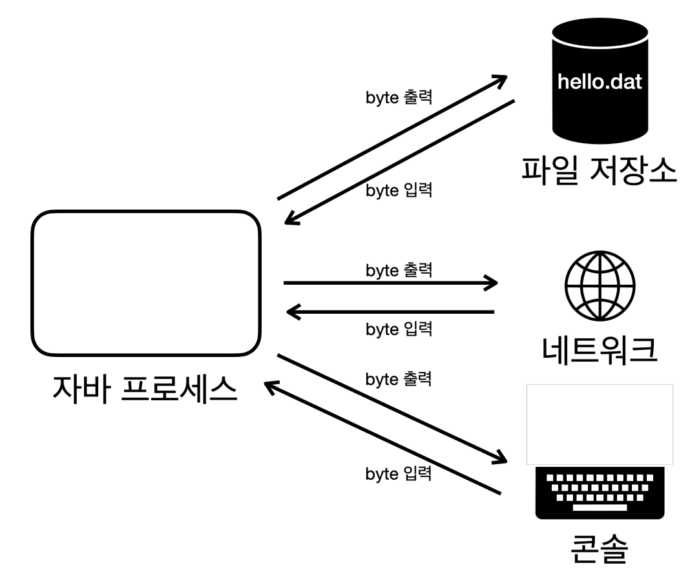
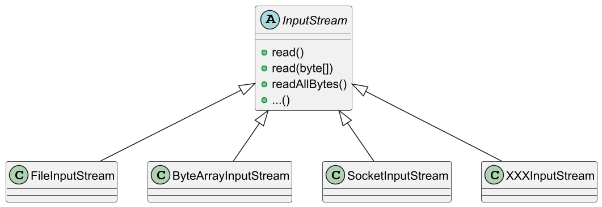

# 자바 - InputStream, OutputStream



현대의 컴퓨터는 대부분 `byte` 단위로 데이터를 주고 받는다. (bit 단위는 너무 작기 때문에 byte 단위를 기본으로 사용한다.)
이렇게 데이터를 주고 받는 것을 **Input/Output(I/O)** 라고 한다.

자바 내부에 있는 데이터를 외부에 있는 파일에 저장하거나, 네트워크를 통해 전송하거나
콘솔에 출력할 때 모두 byte 단위로 데이터를 주고받는다.

만약 파일, 네트워크, 콘솔 각각 데이터를 주고 받는 방식이 다르다면 상당히 불편할 것이다.
이런 문제를 해결하기 위해 자바는 `InputStream`, `OutputStream`이라는 기본 추상 클래스를 제공한다.




스트림을 사용하면 파일을 사용하든, 소켓을 통해 네트워크를 사용하든 모두 일관된 방식으로
데이터를 주고 받을 수 있다. 그리고 각각의 구현 클래스들은 자신에게 맞는 추가 기능도 함께 제공한다.

`InputStream`과 `OutputStream`이 다양한 스트림들을 추상화하여 여러 장점을 가질 수 있다.

- **일관성**
  - 모든 종류의 입출력 작업에 대해 동일한 인터페이스(부모의 메서드)를 사용할 수 있다.
- **유연성**
  - 실제 데이터소스나 목적지가 무엇인지에 관계없이 동일한 방식으로 코드를 작성할 수 있다.
- **확장성**
  - 새로운 유형의 입출력 스트림을 쉽게 추가할 수 있다.
- **재사용성**
  - 다양한 스트림 클래스들을 조합하여 복잡한 입출력 작업을 수행할 수 있다.
  - 예를 들어 `BufferedInputStream`을 사용하여 성능을 향상시키거나, `DataInputStream`을 사용하여
    기본 데이터 타입을 쉽게 읽을 수 있다.
- **에러 처리**
  - 표준화된 예외 처리 메커니즘을 통해 일관된 방식으로 오류를 처리할 수 있다.

---

## 메모리 스트림 예제

```java
import java.io.ByteArrayInputStream;
import java.io.ByteArrayOutputStream;
import java.io.IOException;
import java.util.Arrays;

public class ByteArrayStreamMain {
    public static void main(String[] args) throws IOException {

        byte[] input = {1, 2, 3};

        //메모리에 쓰기
        ByteArrayOutputStream bos = new ByteArrayOutputStream();

        bos.write(input);

        bos.close();

        //메모리에서 읽기
        ByteArrayInputStream bis = new ByteArrayInputStream(bos.toByteArray());

        byte[] bytes = bis.readAllBytes();
        System.out.println("bytes = " + Arrays.toString(bytes));
        //bytes = [1, 2, 3]

        bis.close();
    }
}
```

- `ByteArrayOutputStream`, `ByteArrayInputStream`을 사용하면 메모리에 스트림을 쓰고 읽을 수 있다.
- 이 클래스들은 `OutputStream`, `InputStream`을 상속받았기 때문에 부모의 기능을 모두 사용할 수 있다. 

---

## 콘솔 스트림 예제

```java
import java.io.IOException;
import java.io.PrintStream;
import java.nio.charset.StandardCharsets;

public class PrintStreamMain {
    public static void main(String[] args) throws IOException {

        PrintStream ps = System.out;

        byte[] bytes = "Hello\n".getBytes(StandardCharsets.UTF_8);

        ps.write(bytes);        //Hello
        ps.println("Print!");   //Print!
    }
}
```

- 우리가 자주 사용하는 `System.out`은 사실 `PrintStream`이다. 이 스트림은 `OutputStream`을 상속받는다.
- 이 스트림은 자바가 시작될 때 자동으로 만들어진다.
- `write(byte[]`) : 부모 클래스(`OutputStream`)가 제공하는 기능
- `println(String)` : `PrintStream` 자체적으로 제공하는 추가 기능

> 참고로 `ByteArrayStream`이나 `PrintStream`같은 경우 메모리를 대상으로 하는
> 스트림으로 GC 대상이 되어서 따로 `close()` 메서드를 호출하지 않아도 별 문제는 없다.
> 
> 하지만, 원칙적으로는 `close()`를 호출해주는 것이 좋다. 그래야 나중에 이런 메모리 기반의
> 스트림을 다른 I/O 스트림으로 변경해도 문제가 발생하지 않는다.

---

[이전 ↩️ - 스트림](https://github.com/genesis12345678/TIL/blob/main/Java/adv_1/io/stream.md)

[메인 ⏫](https://github.com/genesis12345678/TIL/blob/main/Java/adv_1/Main.md)

[다음 ↪️ - 파일 입출력 성능 최적화](https://github.com/genesis12345678/TIL/blob/main/Java/adv_1/io/perform.md)