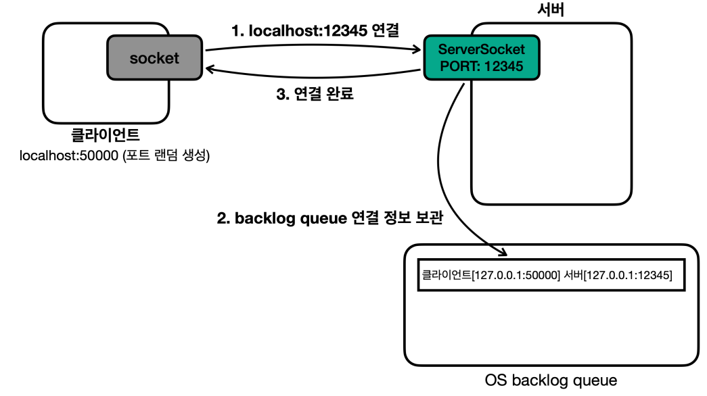
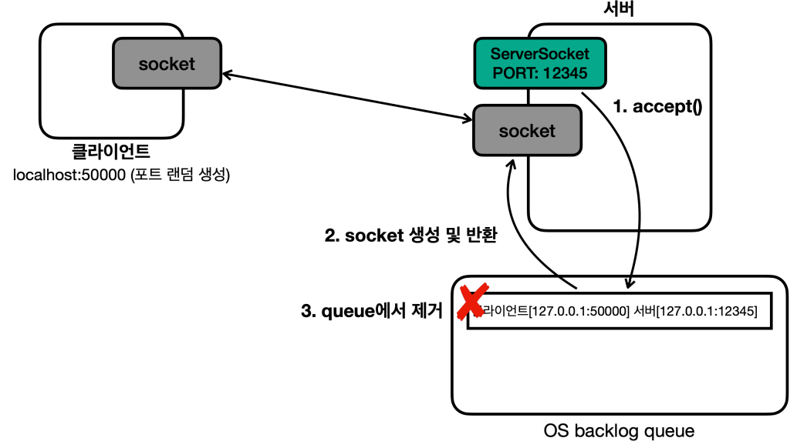
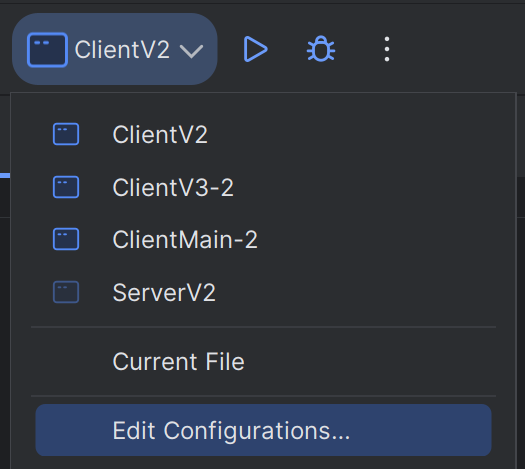
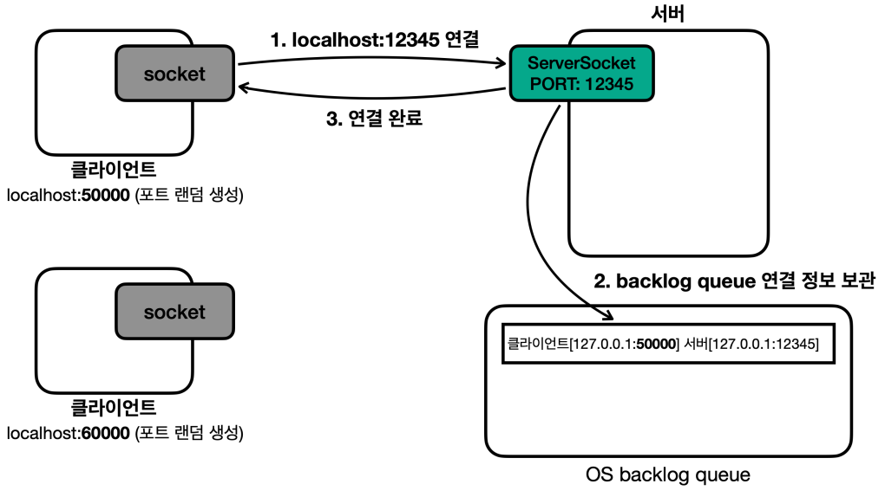
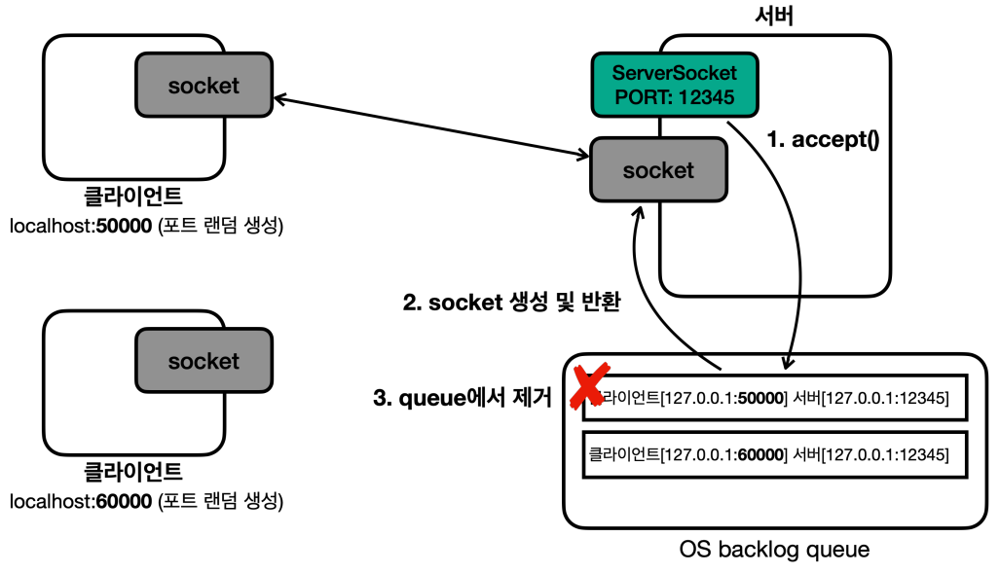
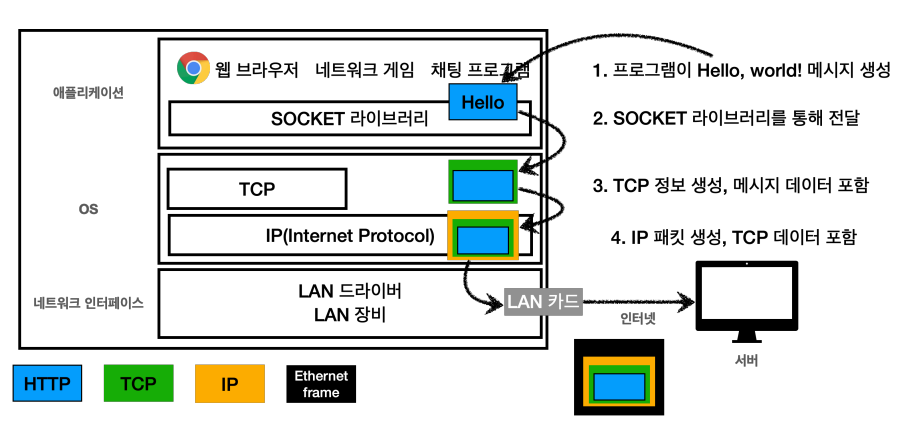
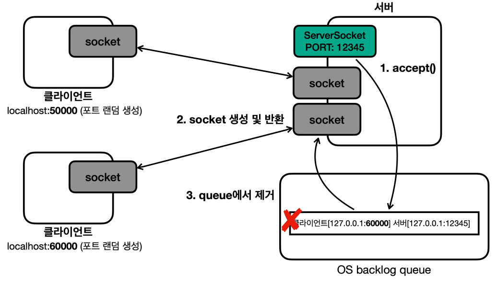
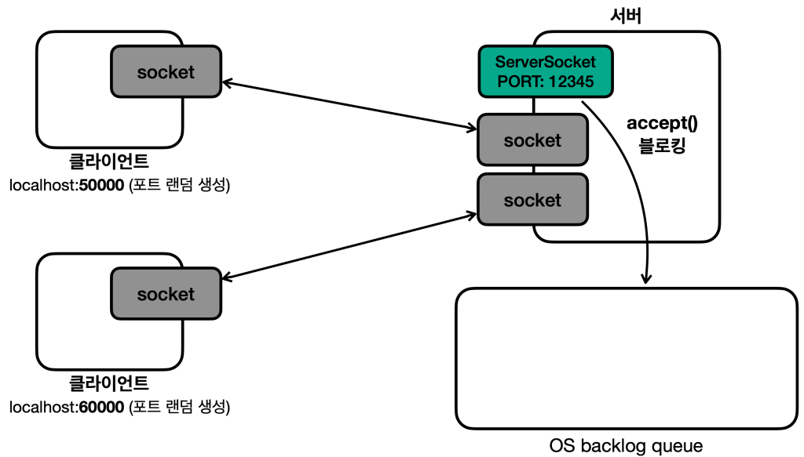
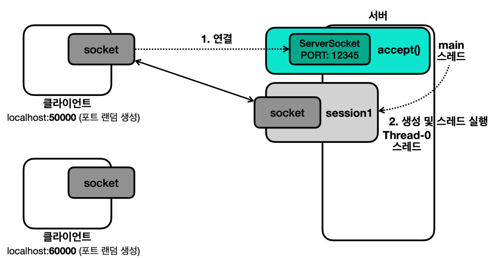
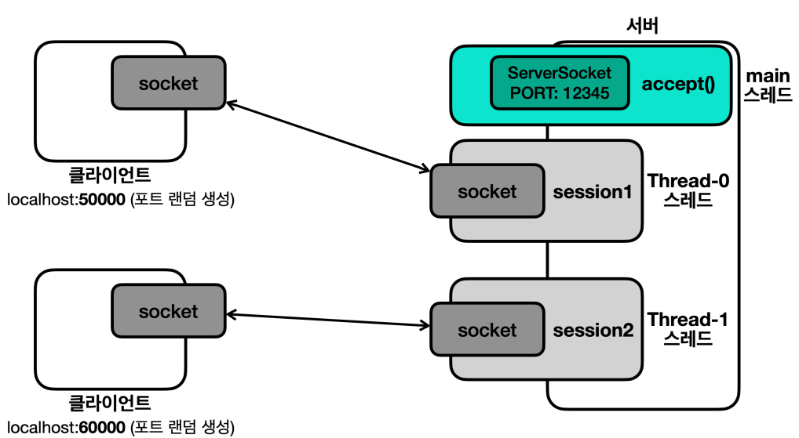

# 자바 - 네트워크 프로그램 예제

간단하게 클라이언트가 "Hello"를 서버에 전달하면 서버는 클라이언트 요청에
" World!"라는 단어를 더해서 "Hello World!"를 클라이언트에 응답하는 프로그램을 만들어보자.

TCP/IP 네트워킹으로 작성하며, 다음은 공통으로 사용될 로깅 유틸 클래스이다.

```java
import java.time.LocalTime;
import java.time.format.DateTimeFormatter;

public abstract class MyLogger {

    private static final DateTimeFormatter formatter = DateTimeFormatter.ofPattern("HH:mm:ss.SSS");

    public static void log(Object obj) {

        String time = LocalTime.now().format(formatter);

        System.out.printf(
            "%s [%9s] %s\n", time, Thread.currentThread().getName(), obj
        );
    }
}
```

---

## V1

```java
import java.io.DataInputStream;
import java.io.DataOutputStream;
import java.io.IOException;
import java.net.Socket;

import static util.MyLogger.*;

/**
 * TCP/IP 네트워킹 클라이언트 - V1
 */
public class ClientV1 {

    private static final int PORT = 12345;

    public static void main(String[] args) throws IOException {

        log("클라이언트 시작");

        Socket socket = new Socket("localhost", PORT);
        DataInputStream input = new DataInputStream(socket.getInputStream());
        DataOutputStream output = new DataOutputStream(socket.getOutputStream());
        log("소켓 연결: " + socket);

        //서버에게 문자 보내기
        String message = "Hello";
        output.writeUTF(message);
        log("client -> server: " + message);

        //서버로부터 문자 받기
        String received = input.readUTF();
        log("client <- server: " + received);

        //자원 정리
        input.close();
        output.close();
        socket.close();
        log("연결 종료: " + socket);
    }
}
```
```java
import java.io.DataInputStream;
import java.io.DataOutputStream;
import java.io.IOException;
import java.net.ServerSocket;
import java.net.Socket;

import static util.MyLogger.log;

/**
 * TCP/IP 네트워킹 서버 - V1
 */
public class ServerV1 {

    private static final int PORT = 12345;

    public static void main(String[] args) throws IOException {

        log("서버 시작");

        ServerSocket serverSocket = new ServerSocket(PORT);

        log("서버 소켓 시작 - 리스닝 포트: " + PORT);
        Socket socket = serverSocket.accept();
        log("소켓 연결: " + socket);

        DataInputStream input = new DataInputStream(socket.getInputStream());
        DataOutputStream output = new DataOutputStream(socket.getOutputStream());

        //클라이언트로부터 문자 받기
        String received = input.readUTF();
        log("client -> server: " + received);

        //클라이언트에게 문자 보내기
        String message = received + " World!";
        output.writeUTF(message);
        log("client <- server: " + message);

        //자원 정리
        input.close();
        output.close();
        socket.close();
        serverSocket.close();

        log("연결 종료: " + socket);
    }
}
```

먼저 서버를 실행하면 다음과 같다.
```text
17:57:30.876 [     main] 서버 시작
17:57:30.879 [     main] 서버 소켓 시작 - 리스닝 포트: 12345
```

그리고 클라이언트를 실행하면 다음과 같이 통신이 수행된다.
```text
17:57:48.435 [     main] 클라이언트 시작
17:57:48.472 [     main] 소켓 연결: Socket[addr=localhost/127.0.0.1,port=12345,localport=54709]
17:57:48.473 [     main] client -> server: Hello
17:57:48.474 [     main] client <- server: Hello World!
17:57:48.475 [     main] 연결 종료: Socket[addr=localhost/127.0.0.1,port=12345,localport=54709]
```
> 클라이언트의 localport는 랜덤으로 생성된다.
```text
17:57:30.876 [     main] 서버 시작
17:57:30.879 [     main] 서버 소켓 시작 - 리스닝 포트: 12345
17:57:48.470 [     main] 소켓 연결: Socket[addr=/127.0.0.1,port=54709,localport=12345]
17:57:48.473 [     main] client -> server: Hello
17:57:48.473 [     main] client <- server: Hello World!
17:57:48.474 [     main] 연결 종료: Socket[addr=/127.0.0.1,port=54709,localport=12345]
```

- `localhost`는 현재 사용 중인 컴퓨터 자체를 가리키는 특별한 호스트 이름이다.
- `localhost`는 "127.0.0.1"이라는 IP 주소로 매핑되며, "127.0.0.1"은 IP 주소 체계에서
루프백 주소로 지정된 특별한 IP 주소이다. 이 주소는 컴퓨터가 스스로를 가리킬 때 사용되며,
`localhost`와 동일하게 취급된다.
- "127.0.0.1"은 컴퓨터가 네트워크 인터페이스를 통해 외부로 나가지 않고, 자신에게 직접
네트워크 패킷을 보낼 수 있도록 한다.

**코드를 분석해보자.**

TCP/IP 통신에서는 통신할 대상 서버를 찾을 때 호스트 이름이 아니라 IP 주소가 필요하다.
먼저 호스트 이름으로 IP를 어떻게 찾는지 알아보자.

```java
import java.net.InetAddress;
import java.net.UnknownHostException;

public class InetAddressMain {
    public static void main(String[] args) throws UnknownHostException {

        InetAddress localhost = InetAddress.getByName("localhost");
        System.out.println(localhost);

        InetAddress google = InetAddress.getByName("google.com");
        System.out.println(google);
    }
}
```
```text
localhost/127.0.0.1
google.com/142.250.206.238
```

- 자바의 `InetAddress` 클래스를 사용하면 호스트 이름으로 대상 IP를 찾을 수 있다.
- 찾는 과정은 다음과 같다.
  1. 자바는 `InetAddress.getByName("호스트명")` 메서드로 해당하는 IP 주소를 조회한다.
  2. 이 과정에서 시스템의 호스트 파일을 먼저 확인한다.(`\etc\hosts`)
  3. 호스트 파일에 정의되어 있지 않다면, DNS 서버에 요청해서 IP 주소를 얻는다.

### 클라이언트 코드

**클라이언트와 서버의 연결은 `Socket`을 사용한다.**
```java
//PORT=12345
Socket socket = new Socket("localhost", PORT);
```

- `localhost`를 통해 자신의 컴퓨터에 있는 12345 포트에 TCP 접속을 시도한다.
  - `localhost`는 IP가 아니므로 해당하는 IP를 먼저 찾는다.(내부에서 `InetAddress`를 사용)
  - `localhost`는 "127.0.0.1"이라는 IP에 매핑되어 있다.
  - "127.0.0.1:12345"에 TCP 접속을 시도한다.
- 연결이 성공적으로 완료되면 `Socket` 객체를 생성한다.
- `Socket`은 서버와 연결되어 있는 **연결점**이며, `Socket` 객체를 통해서 서버와 통신할 수 있다.

**클라이언트와 서버 간의 데이터 통신은 `Socket`이 제공하는 스트림을 사용한다.**

```java
DataInputStream input = new DataInputStream(socket.getInputStream());
DataOutputStream output = new DataOutputStream(socket.getOutputStream());
```


- `Socket`은 서버와 데이터를 주고 받기 위한 스트림을 제공한다.
- `InputStream` : 서버에서 전달한 데이터를 클라이언트가 받을 때 사용
- `OutputStream` : 클라이언트에서 서버에 데이터를 전달할 때 사용
- `InputStream`, `OutputStream`은 모든 데이터를 byte로 변환해서 전달해야 하기 때문에 번거롭다.
그래서 `DataInputStream`, `DataOutputStream`과 같은 보조 스트림과 같이 사용한다.

**사용한 자원은 반드시 정리해야 한다.**
```java
//자원 정리
input.close();
output.close();
socket.close();
log("연결 종료: " + socket);
```

### 서버 코드

서버는 특정 포트를 열어두어야 한다. 그래야 클라이언트가 해당 포트를 지정해서
접속할 수 있다.

```java
ServerSocket serverSocket = new ServerSocket(PORT);
```

- 서버는 `ServerSocket`이라는 특별한 소켓을 사용한다.
- 지정한 포트를 사용해서 서버 소켓을 생성하면, 클라이언트는 해당 포트로
서버에 연결할 수 있다.

**클라이언트와 서버의 연결 과정은 다음과 같다.**



- 서버가 "12345" 포트로 서버 소켓을 열어둔다. 클라이언트는 이제 12345 포트로 서버에 접속할 수 있다.
- 클라이언트가 "12345" 포트에 연결을 시도한다.
- 이때 OS 계층에서 **TCP 3-way handshake**가 발생하고, TCP 연결이 완료된다.
- TCP 연결이 완료되면 서버는 `OS backlog queue`라는 곳에 클라이언트와 서버의
TCP 연결 정보를 보관한다.
  - 이 연결 정보에는 클라이언트와 서버의 `IP`, `PORT` 정보가 모두 들어있다.

TCP 연결 시에는 클라이언트와 서버 모두 `IP`, `PORT` 정보가 필요하다. 그런데 클라이언트의 경우
클라이언트 자신의 포트를 지정한 적이 없다.

서버의 경우 포트가 명확하게 지정되어 있어야 한다. 그래야 클라이언트에서 서버에
어떤 포트에 접속할지 알 수 있다. 반면에 서버에 접속하는 클라이언트의 경우에는 자신의
포트가 명확하게 지정되어 있지 않아도 된다. 클라이언트는 보통 포트를 생략하는데, 생략할 경우
클라이언트 PC에 남아있는 포트 중 하나가 랜덤으로 할당된다. (클라이언트의 포트도 명시적으로
할당할 수는 있다, 하지만 잘 사용하지 않는다.)

```java
Socket socket = serverSocket.accept();
```

- **서버 소켓은 단지 클라이언트와 서버의 TCP 연결만 지원하는 특별한 소켓이다.**
- 실제 클라이언트와 서버가 정보를 주고 받으려면 `Socket` 객체가 필요하다.
- `accpet()` 메서드를 호출하면 TCP 연결 정보를 기반으로 `Socket` 객체를 만들어서 반환한다.

`accept()` 호출 과정은 다음과 같다.



- `accept()`를 호출하면 `backlog queue`에서 TCP 연결 정보를 조회한다.
  - **만약 TCP 연결 정보가 없다면, 연결 정보가 생성될 때까지 대기한다.(블로킹)**
- 해당 정보를 기반으로 `Socket` 객체를 생성한다.
- 사용한 TCP 연결 정보는 `backlog queue`에서 제거된다.
- 클라이언트와 서버의 `Socket`은 TCP 연결되어 있고, 스트림을 통해 메시지를 주고받을 수 있다.

```java
DataInputStream input = new DataInputStream(socket.getInputStream());
DataOutputStream output = new DataOutputStream(socket.getOutputStream());
```

클라이언트의 `Output`은 서버의 `Input`이고, 반대로 서버의 `Output`은
클라이언트의 `Input`이다.

**사용한 자원은 반드시 정리해야 한다.**
```java
//자원 정리
input.close();
output.close();
socket.close();
serverSocket.close();
log("연결 종료: " + socket);
```

---

## V2

이제 메시지를 계속 주고 받고 원할 때 종료할 수 있도록 만들어보자.

```java
/**
 * TCP/IP 네트워킹 클라이언트 - V2
 */
public class ClientV2 {

    private static final int PORT = 12345;

    public static void main(String[] args) throws IOException {

        log("클라이언트 시작");

        Socket socket = new Socket("localhost", PORT);

        DataInputStream input = new DataInputStream(socket.getInputStream());
        DataOutputStream output = new DataOutputStream(socket.getOutputStream());
        log("소켓 연결: " + socket);

        Scanner sc = new Scanner(System.in);

        while (true) {
            System.out.print("전송 문자: ");
            String message = sc.nextLine();

            //서버에게 문자 보내기
            output.writeUTF(message);
            log("client -> server: " + message);

            if (message.equals("exit")) {
                break;
            }

            //서버로부터 문자 받기
            String received = input.readUTF();
            log("client <- server: " + received);
        }

        //자원 정리
        log("연결 종료: " + socket);
        input.close();
        output.close();
        socket.close();
    }
}
```
```java
import java.io.DataInputStream;
import java.io.DataOutputStream;
import java.io.IOException;
import java.net.ServerSocket;
import java.net.Socket;

import static util.MyLogger.log;

/**
 * TCP/IP 네트워킹 서버 - V2
 */
public class ServerV2 {

    private static final int PORT = 12345;

    public static void main(String[] args) throws IOException {

        log("서버 시작");

        ServerSocket serverSocket = new ServerSocket(PORT);

        log("서버 소켓 시작 - 리스닝 포트: " + PORT);
        Socket socket = serverSocket.accept();
        log("소켓 연결: " + socket);

        DataInputStream input = new DataInputStream(socket.getInputStream());
        DataOutputStream output = new DataOutputStream(socket.getOutputStream());

        while (true) {

            //클라이언트로부터 문자 받기
            String received = input.readUTF();
            log("client -> server: " + received);

            if (received.equals("exit")) {
                break;
            }

            //클라이언트에게 문자 보내기
            String message = received + " World!";
            output.writeUTF(message);
            log("client <- server: " + message);
        }

        //자원 정리
        log("연결 종료: " + socket);
        input.close();
        output.close();
        socket.close();
        serverSocket.close();
    }
}
```

```text
20:25:27.591 [     main] 클라이언트 시작
20:25:27.608 [     main] 소켓 연결: Socket[addr=localhost/127.0.0.1,port=12345,localport=63702]
전송 문자: hello
20:25:33.515 [     main] client -> server: hello
20:25:33.516 [     main] client <- server: hello World!
전송 문자: Network
20:25:37.742 [     main] client -> server: Network
20:25:37.743 [     main] client <- server: Network World!
전송 문자: exit
20:25:41.149 [     main] client -> server: exit
20:25:41.150 [     main] 연결 종료: Socket[addr=localhost/127.0.0.1,port=12345,localport=63702]
```
```text
20:22:30.807 [     main] 서버 시작
20:22:30.810 [     main] 서버 소켓 시작 - 리스닝 포트: 12345
20:25:27.608 [     main] 소켓 연결: Socket[addr=/127.0.0.1,port=63702,localport=12345]
20:25:33.515 [     main] client -> server: hello
20:25:33.516 [     main] client <- server: hello World!
20:25:37.742 [     main] client -> server: Network
20:25:37.743 [     main] client <- server: Network World!
20:25:41.149 [     main] client -> server: exit
20:25:41.149 [     main] 연결 종료: Socket[addr=/127.0.0.1,port=63702,localport=12345]
```

> **같은 클라이언트 동시에 실행하기**
> 
> 서버는 여러 클라이언트의 연결을 처리할 수 있어야 한다. IntelliJ에서 같은 
> `main()` 메서드를 실행하려면 설정이 필요하다.
> 
> 
> 
> 

그런데 새로운 클라이언트가 접속하면 정상 수행되지 않는다. 처음 접속한 클라이언트만 
작동하고 중간에 새로 연결한 클라이언트는 소켓 연결은 되지만 서버로부터 아무런
응답이 오지 않는다.

```text
20:31:30.552 [     main] 클라이언트 시작
20:31:30.569 [     main] 소켓 연결: Socket[addr=localhost/127.0.0.1,port=12345,localport=63994]
전송 문자: hello2
20:31:41.007 [     main] client -> server: hello2
```

**왜 이런 것일까? 이번에는 여러 클라이언트가 접속하는 상황일 때를 분석해보자.**



- 서버는 "12345" 서버 소켓을 열어둔다.
- 50000번 랜덤 포트를 사용하는 클라이언트가 먼저 "12345" 포트의 서버에 접속을 시도한다.
- 이때 OS 계층에서 **TCP 3-way handshake**가 발생하고, TCP 연결이 완료된다.
- TCP 연결이 완료되면 서버는 `OS backlog queue`라는 곳에 클라이언트와
서버의 TCP 연결 정보를 보관한다.

여기서 중요한 점은, 이 시점에 **TCP 3-way handshake**가 완료되었기 때문에 클라이언트와
서버의 TCP 연결은 이미 완료되었고, 클라이언트의 소켓 객체도 정상 생성된다. (이 시점에
서버의 소켓 객체(서버 소켓 X)는 생성되지 않았다.)


- 이번에는 60000번 랜덤 포트를 사용하는 클라이언트가 "12345" 포트의 서버에
접속을 시도하고 연결을 완료한다.
- 50000번, 60000번 클라이언트 모두 서버와 연결이 완료되었고, 클라이언트의 소켓도
정상 생성된다.



- 서버가 클라이언트와 데이터를 주고 받으려면 소켓을 획득해야 한다.
- `accept()` 메서드를 호출하면 `backlog queue`의 정보를 기반으로 소켓 객체를 하나 생성한다.
- 큐이므로 순서대로 데이터를 꺼낸다. 처음 50000번 클라이언트의 접속 정보를 기반으로
서버에 소켓이 하나 생성된다.
- 50000번 클라이언트와 서버는 소켓의 스트림을 통해 서로 데이터를 주고 받을 수 있다.
- 60000번 클라이언트도 서버와 TCP 연결이 되었기 때문에 서버로 메시지를 보낼 수 있다.
  - 아직 서버에 소켓 객체가 없더라도 메시지는 보낼 수 있다. TCP 연결은 이미 완료되었다.

**여기서 잠깐 다음 그림을 확인해보자.**



소켓을 통해 스트림으로 메시지를 주고 받는다는 것은 사실 이러한 과정을 거친다.
자바 애플리케이션은 소켓 객체의 스트림을 통해 데이터를 주고 받는다. 과정은 다음과 같다.

- 클라이언트 : 애플리케이션 **→ OS TCP 송신 버퍼 →** 클라이언트 네트워크 카드
- 서버 : 서버 네트워크 카드 **→ OS TCP 송신 버퍼 →** 애플리케이션

여기서 60000번 클라이언트가 보낸 메시지는 서버 애플리케이션에서 아직 읽지 않았기 때문에
**서버 OS의 TCP 수신 버퍼에서 대기하게 된다.**

**여기서 핵심은 소켓 객체 없이 서버 소켓만으로도 TCP 연결은 완료된다는 것이다.**
(서버 소켓은 연결만 담당한다.) 하지만 연결 이후에 서로 메시지를 주고 받으려면 소켓 객체가 필요하다.

`accept()`는 이미 연결된 TCP 연결 정보를 기반으로 서버 측에 소켓 객체를 생성한다.
그리고 이 소켓 객체가 있어야 스트림을 사용해서 메시지를 주고 받을 수 있다.



이렇게 소켓을 연결하면 소켓의 스트림을 통해 OS TCP 수신 버퍼에 있는 메시지를 읽고 쓸 수 있다.



`accept()` 메서드는 `backlog queue`에 새로운 연결 정보가 도착할 때까지 블로킹 상태로
대기한다. 새로운 연결 정보가 오지 않으면 계속 대기하는 블로킹 메서드이다.

**결론적으로 둘 이상의 클라이언트가 작동하지 않는 이유는 다음과 같다.**

- **새로운 클라이언트가 접속했을 때 서버의 `main` 스레드는 `accept()` 메서드를 절대로 호출할 수 없다.**
왜냐하면 `while` 문으로 기존 클라이언트와 메시지를 주고 받는 부분만 반복하기 때문이다.
- `accept()`를 호출해야 소켓 객체를 생성하고 클라이언트와 메시지를 주고 받을 수 있다.

**결국 2개의 블로킹 작업으로 인해 별도의 스레드가 필요한 것이다.**
여기서 2개의 블로킹 작업은 `accept()`와 `readXxx()`이다.
`accept()`는 클라이언트와 서버의 연결을 처리하기 위해 대기하고,
`readXxx()`는 클라이언트의 메시지를 받아서 처리하기 위해 대기한다.

**각각의 블로킹 작업은 별도의 스레드에서 처리해야 한다. 그렇지 않으면 다른
블로킹 메서드 때문에 계속 대기할 수 있다.**

---

## V3

이번에는 여러 클라이언트가 동시에 접속할 수 있도록 해보자. 구조는 다음과 같다.



- 서버의 `main` 스레드는 서버 소켓을 생성하고, 서버 소켓의 `accept()`를 반복해서 호출해야 한다.
- 클라이언트가 서버에 접속하면 서버 소켓의 `accept()` 메서드가 `Socket`을 반환한다.
- `main` 스레드는 이 정보를 기반으로 `Session` 이라는 별도의 객체(스레드)를 만들고, 새로운 스레드에서
이 객체를 실행한다.
- `Session` 객체와 `Thread-0`은 연결된 클라이언트와 메시지를 주고 받는다.



- 새로운 TCP 연결이 발생하면 `main` 스레드에서 새로운 `Session` 객체를
별도의 스레드에서 실행한다. 이 과정을 반복하는 것이다.

**정리하면 `main` 스레드와 `Session` 담당 스레드로 역할을 분리한 것이다.**

**`main` 스레드**는 새로운 연결이 있을 때마다 `Session` 객체와 별도의 스레드를 생성하고,
별도의 스레드가 `Session` 객체를 실행하도록 한다.
**`Session` 담당 스레드**는 자신의 소켓이 연결된 클라이언트와 메시지를 반복해서
주고 받는 역할을 담당한다.

```java
import java.io.DataInputStream;
import java.io.DataOutputStream;
import java.io.IOException;
import java.net.Socket;
import java.util.Scanner;

import static util.MyLogger.log;

/**
 * TCP/IP 네트워킹 클라이언트 - V3
 */
public class ClientV3 {

    private static final int PORT = 12345;

    public static void main(String[] args) throws IOException {

        log("클라이언트 시작");

        Socket socket = new Socket("localhost", PORT);

        DataInputStream input = new DataInputStream(socket.getInputStream());
        DataOutputStream output = new DataOutputStream(socket.getOutputStream());
        log("소켓 연결: " + socket);

        Scanner sc = new Scanner(System.in);
        while (true) {
            System.out.print("전송 문자: ");
            String message = sc.nextLine();

            //서버에게 문자 보내기
            output.writeUTF(message);
            log("client -> server: " + message);

            if (message.equals("exit")) {
                break;
            }

            //서버로부터 문자 받기
            String received = input.readUTF();
            log("client <- server: " + received);
        }

        //자원 정리
        log("연결 종료: " + socket);
        input.close();
        output.close();
        socket.close();
    }
}
```
```java
import java.io.DataInputStream;
import java.io.DataOutputStream;
import java.io.IOException;
import java.net.Socket;

import static util.MyLogger.log;

/**
 * TCP/IP 네트워킹 세션 스레드 - V3
 */
public class SessionV3 implements Runnable {

    private final Socket socket;

    public SessionV3(Socket socket) {
        this.socket = socket;
    }

    @Override
    public void run() {
        try {
            DataInputStream input = new DataInputStream(socket.getInputStream());
            DataOutputStream output = new DataOutputStream(socket.getOutputStream());

            while (true) {

                //클라이언트로부터 문자 받기
                String received = input.readUTF();
                log("client -> server: " + received);

                if (received.equals("exit")) {
                    break;
                }

                //클라이언트에게 문자 보내기
                String message = received + " World!";
                output.writeUTF(message);
                log("client <- server: " + message);
            }

            //자원 정리
            log("연결 종료: " + socket);
            input.close();
            output.close();
            socket.close();

        } catch (IOException e) {
            throw new RuntimeException(e);
        }
    }
}
```
`Session`의 목적은 소켓이 연결된 클라이언트와 메시지를 반복해서 주고 받는 것이다.
```java
import java.io.IOException;
import java.net.ServerSocket;
import java.net.Socket;

import static util.MyLogger.log;

/**
 * TCP/IP 네트워킹 서버 - V3
 */
public class ServerV3 {

    private static final int PORT = 12345;

    public static void main(String[] args) throws IOException {

        log("서버 시작");

        ServerSocket serverSocket = new ServerSocket(PORT);

        log("서버 소켓 시작 - 리스닝 포트: " + PORT);

        while (true) {
            Socket socket = serverSocket.accept(); //블로킹
            log("소켓 연결: " + socket);

            SessionV3 session = new SessionV3(socket);
            Thread thread = new Thread(session); //스레드 생성

            thread.start();
        }
    }
}
```
- `main` 스레드는 서버 소켓을 생성하고, `accept()`를 호출해서 연결을 대기한다.
- 새로운 연결이 추가될 때마다 `Session` 객체를 생성하고 별도의 스레드에서
`Session` 객체를 실행하는 과정을 반복한다.

```text
11:22:21.977 [     main] 서버 시작
11:22:21.981 [     main] 서버 소켓 시작 - 리스닝 포트: 12345
11:22:29.361 [     main] 소켓 연결: Socket[addr=/127.0.0.1,port=55858,localport=12345]
11:22:47.894 [     main] 소켓 연결: Socket[addr=/127.0.0.1,port=55880,localport=12345]
11:22:58.861 [ Thread-0] client -> server: hello1
11:22:58.862 [ Thread-0] client <- server: hello1 World!
11:23:04.153 [ Thread-1] client -> server: hello2
11:23:04.153 [ Thread-1] client <- server: hello2 World!
```

서버 소켓을 통해 소켓을 연결하는 부분과 각 클라이언트와 메시지를 주고 받는 부분을 
별도의 스레드로 나누었다. 즉 **블로킹 되는 부분을 별도의 스레드로 나누어** 문제를 해결했다.

**그런데 여기서 문제가 하나 있다. 서버와 연결된 클라이언트에서 `exit`를 입력해 정상적으로
종료하는 것이 아닌 IDE의 `Stop` 버튼으로 강제 종료를 하면 다음 예외가 발생한다.**

```text
Exception in thread "Thread-0" java.lang.RuntimeException: java.net.SocketException: Connection reset
```

클라이언트의 연결을 직접 종료하면 클라이언트 프로세스가 종료되면서 클라이언트와 서버의
TCP 연결도 함께 종료된다. 이때 서버에서 `readUTF()`로 메시지를 읽으려고 할때 예외가 발생한다.

**여기서 심각한 문제는 이렇게 예외가 발생해버리면 서버에서 자원 정리 코드를 호출하지
못한다는 점이다.** 자바 객체는 GC가 되지만 자바 외부의 자원은 자동으로 GC가 되는 게 아니다.
따라서 반드시 정리를 해주어야 한다.

---

[이전 ↩️ - File, Files](https://github.com/genesis12345678/TIL/blob/main/Java/adv_1/files/files.md)

[메인 ⏫](https://github.com/genesis12345678/TIL/blob/main/Java/adv_1/Main.md)

[다음 ↪️ - 자원 정리 이해](https://github.com/genesis12345678/TIL/blob/main/Java/adv_1/network/resourceclose.md)