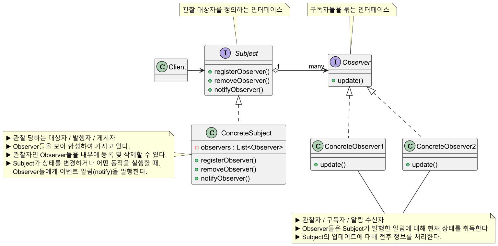
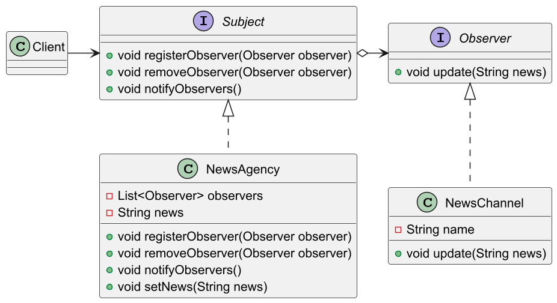

# 옵저버 패턴

## 옵저버 패턴 정의

한 객체의 상태가 바뀌면 그 객체에 의존하는 다른 객체에게 연락이 가고 자동으로 내용이 갱신되는 방식으로 **일대다** 의존성을 정의한다.

## 옵저버 패턴 구조

## 옵저버 패턴 예제 코드 - 1

**구독자에게만 새로운 소식 전달하기**

## 옵저버 패턴 예제 코드 - 2

**날씨 정보가 변경됨에 따라 각각의 옵저버들이 다르게 표현하기**

## 패턴 장단점

### 장점

- `Subject`의 상태 변경을 주기적으로 조회하지 않고 자동으로 감지할 수 있다.
- 발행자의 코드를 변경하지 않고 새 구독자 클래스를 도입할 수 있어 **OCP** 원칙을 준수한다.
- 런타임 시점에 발행자와 구독 알림 관계를 맺을 수 있다.
- 상태를 변경하는 객체(`Subject`)와 변경을 감지하는 객체(`Observer`)의 관계를 느슨하게 유지할 수 있다.

### 단점

- 구독자는 알림 순서를 제어할 수 없고, 무작위 순서로 알림을 받는다.
  - 하드 코딩으로 구현할 수 있겠지만, 권장되지는 않는 방법이다.
  - 또한 **`Observer`는 알림 순서에 의존하면 안된다.**
- 옵저버 패턴을 자주 구성하면 구조와 동작을 알아보기 힘들어져 코드 복잡도가 증가한다.
- 다수의 옵저버 객체를 등록 이후 해지하지 않는다면 메모리 누수가 발생할 수도 있다.

## 실전에서 사용되는 전략 패턴

- `java.util.Observer` / `java.util.Observable`
  - 자바에서 내장 객체로 옵저버 패턴을 지원하지만, 거의 사용되지 않는다.
- `java.util.EventListener`
- `javax.servlet.http.HttpSessionBindingListener`
- `javax.servlet.http.HttpSessionAttributeListener`
- `javax.faces.event.PhaseListener`

---

### 참고

- [참고 블로그](https://inpa.tistory.com/entry/GOF-%F0%9F%92%A0-%EC%98%B5%EC%A0%80%EB%B2%84Observer-%ED%8C%A8%ED%84%B4-%EC%A0%9C%EB%8C%80%EB%A1%9C-%EB%B0%B0%EC%9B%8C%EB%B3%B4%EC%9E%90)
- [참고 사이트](https://refactoring.guru/ko/design-patterns/observer)
- [참고 강의](https://www.inflearn.com/course/%EA%B0%9D%EC%B2%B4%EC%A7%80%ED%96%A5-%EB%94%94%EC%9E%90%EC%9D%B8-%ED%8C%A8%ED%84%B4-%EC%96%84%EC%BD%94/dashboard)
- [참고 책](https://www.yes24.com/Product/Goods/108192370)