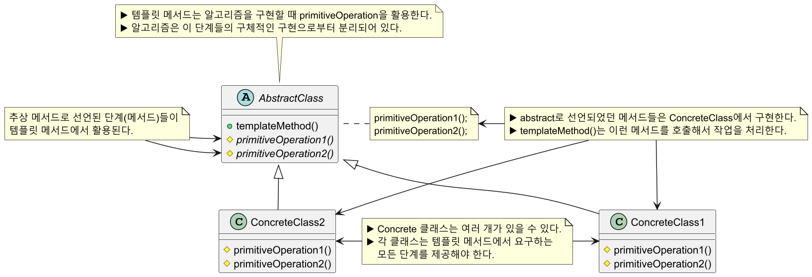
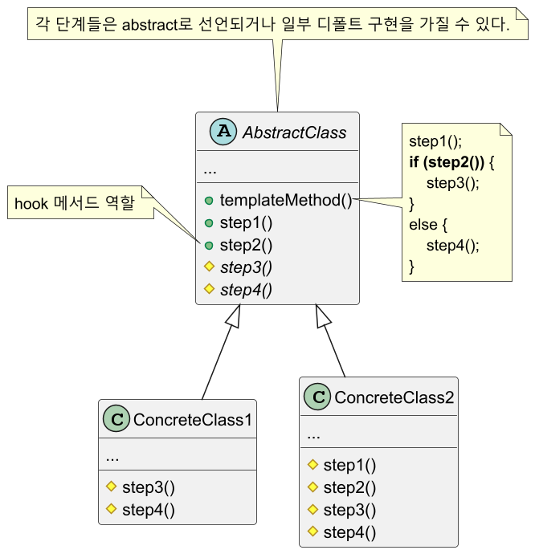
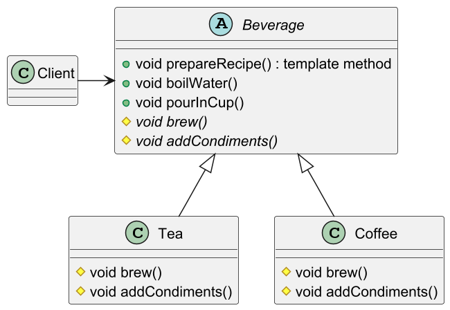
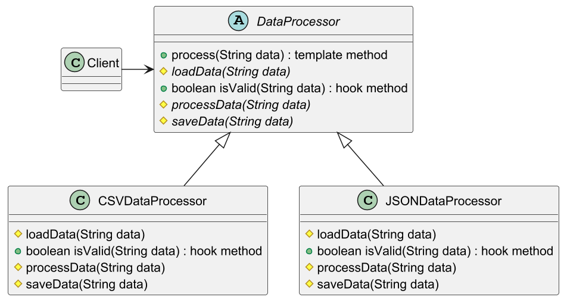

# 템플릿 메서드 패턴

## 템플릿 메서드 패턴 정의

알고리즘의 골격을 정의한다. 템플릿 메서드를 사용하면 알고리즘의 일부 단계를
서브클래스에서 구현할 수 있으며, 알고리즘의 구조는 그대로 유지하면서 알고리즘의
특정 단계를 서브클래스에서 재정의할 수도 있다.

## 템플릿 메서드 패턴 구조



### hook 메서드



## 템플릿 메서드 패턴 예제 코드 - 1



```java
//Abstract Class
public abstract class Beverage {

    //Template Method
    //서브클래스에서 재정의하지 못하게 final 선언
    public final void prepareRecipe() {
        boilWater();
        brew();
        pourInCup();
        addCondiments();
    }

    public void boilWater() {
        System.out.println("Boiling water");
    }

    public void pourInCup() {
        System.out.println("Pouring into cup");
    }

    protected abstract void brew();
    protected abstract void addCondiments();
}
```
```java
//Concrete Class
public class Coffee extends Beverage {

    @Override
    protected void brew() {
        System.out.println("Dripping coffee through filter");
    }

    @Override
    protected void addCondiments() {
        System.out.println("Adding sugar and milk");
    }
}
```
```java
//Concrete Class
public class Tea extends Beverage {

    @Override
    protected void brew() {
        System.out.println("Steeping the tea");
    }

    @Override
    protected void addCondiments() {
        System.out.println("Adding lemon");
    }
}
```
```java
//Client
public class Client {
    public static void main(String[] args) {

        Beverage tea = new Tea();
        Beverage coffee = new Coffee();

        System.out.println("\nMaking tea...");
        tea.prepareRecipe();
        //Output
        //Making tea...
        //Boiling water
        //Steeping the tea
        //Pouring into cup
        //Adding lemon

        System.out.println("\nMaking coffee...");
        coffee.prepareRecipe();
        //Output
        //Making coffee...
        //Boiling water
        //Dripping coffee through filter
        //Pouring into cup
        //Adding sugar and milk
    }
}
```

## 템플릿 메서드 패턴 예제 코드 - 2



```java
//Abstract Class
public abstract class DataProcessor {

    //Template Method
    public final void process(String data) {
        loadData(data);
        if (isValid(data)) {
            processData(data);
            saveData(data);
        } else {
            System.err.println("Data is invalid, processing aborted.");
        }
    }

    protected abstract void loadData(String data);

    //hook method
    //서브클래스에서 선택적으로 재정의 할 수 있도록 일반 메서드로 정의
    boolean isValid(String data) {
        return true;
    }

    protected abstract void processData(String data);
    protected abstract void saveData(String data);
}
```
```java
//Concrete Class
public class CSVDataProcessor extends DataProcessor {

    @Override
    protected void loadData(String data) {
        System.out.println("Loading data from CSV file: " + data);
    }

    @Override
    public boolean isValid(String data) {
        return data != null && data.contains("CSV");
    }

    @Override
    protected void processData(String data) {
        System.out.println("Processing CSV data");
    }

    @Override
    protected void saveData(String data) {
        System.out.println("Saving CSV data to database");
    }
}
```
```java
//Concrete Class
public class JSONDataProcessor extends DataProcessor {

    @Override
    protected void loadData(String data) {
        System.out.println("Loading data from JSON file: " + data);
    }

    @Override
    public boolean isValid(String data) {
        return data != null && data.contains("JSON");
    }

    @Override
    protected void processData(String data) {
        System.out.println("Processing JSON data");
    }

    @Override
    protected void saveData(String data) {
        System.out.println("Saving JSON data to database");
    }
}
```
```java
//Client
public class Client {
    public static void main(String[] args) {

        DataProcessor csvProcessor = new CSVDataProcessor();
        csvProcessor.process("CSV data");
        //Output
        //Loading data from CSV file: CSV data
        //Processing CSV data
        //Saving CSV data to database

        DataProcessor jsonProcessor = new JSONDataProcessor();
        jsonProcessor.process("XML data");
        //Output
        //Loading data from JSON file: XML data
        //Data is invalid, processing aborted.
    }
}
```

## 템플릿 메서드 패턴 장단점

### 템플릿 메서드 패턴 장점

- 클라이언트가 대규모 알고리즘의 특정 부분만 재정의하도록 하여 알고리즘의 
다른 부분에 발생하는 변경 사항의 영향을 덜 받도록 한다.
- 상위 추상클래스로 로직을 공통화하여 코드의 중복을 줄일 수 있다.
- 서브클래스의 역할을 줄이고, 핵심 로직을 상위클래스에서 관리하므로 관리가 용이해진다.

### 템플릿 메서드 패턴 단점

- 알고리즘의 제공된 골격에 의해 유연성이 제한될 수 있다.
- 알고리즘의 구조가 복잡할수록 템플릿 로직 형태를 유지하기 어려워진다.
- 추상 메서드가 많아지면서 클래스의 생성, 관리가 어려워질 수 있다.
- 상위클래스에서 선언된 추상 메서드를 서브클래스에서 구현할 때, 그 메서드가 어느 타이밍에서
호출되는지 클래스 로직을 이해해야 할 필요가 있다.
- 로직에 변화가 생겨 상위클래스를 수정할 때, 모든 서브클래스의 수정이 필요할 수도 있다.
- 서브클래스를 통해 기본 단계 구현을 억제하여 **리스코프 치환 법칙**을 위반할 여지가 있다.

## 실전에서 사용되는 템플릿 메서드 패턴

- `java.io.InputStream`, `java.io.OutputStream`,
`java.io.Reader`, `java.io.Writer`의 일반 메서드를 서브클래스가 재정의
- `java.util.AbstractList`, `java.util.AbstractSet`
, `java.util.AbstractMap`의 일반 메서드를 서브클래스가 재정의
- `javax.servlet.http.HttpServlet`의 모든 `doXxx()` 메서드는 기본적으로 "HTTP 405(Method Not Allowed)"
에러를 기본값 응답으로 보낸다. 서브클래스에서 이 메서드들을 재정의하여 사용한다.

---

### 참고

- [참고 블로그](https://inpa.tistory.com/entry/GOF-%F0%9F%92%A0-%ED%85%9C%ED%94%8C%EB%A6%BF-%EB%A9%94%EC%86%8C%EB%93%9CTemplate-Method-%ED%8C%A8%ED%84%B4-%EC%A0%9C%EB%8C%80%EB%A1%9C-%EB%B0%B0%EC%9B%8C%EB%B3%B4%EC%9E%90)
- [참고 사이트](https://refactoring.guru/ko/design-patterns/template-method)
- [참고 강의](https://www.inflearn.com/course/%EA%B0%9D%EC%B2%B4%EC%A7%80%ED%96%A5-%EB%94%94%EC%9E%90%EC%9D%B8-%ED%8C%A8%ED%84%B4-%EC%96%84%EC%BD%94/dashboard)
- [참고 책](https://www.yes24.com/Product/Goods/108192370)