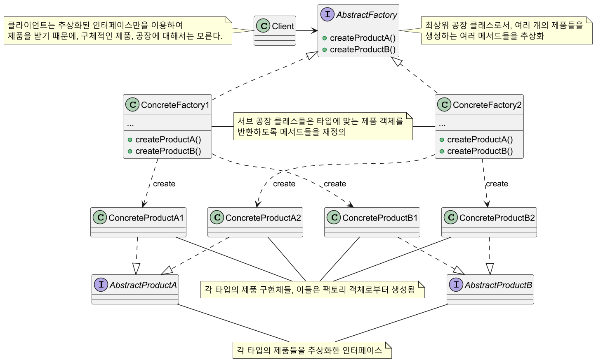
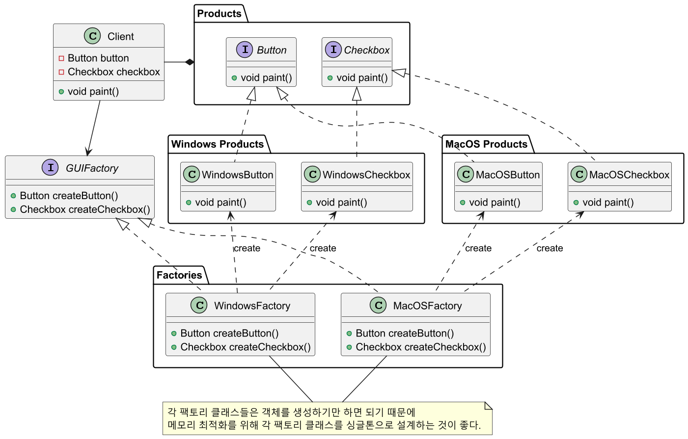
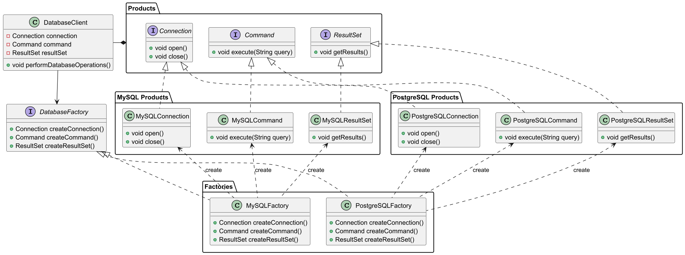

# 추상 팩토리 패턴

## 추상 팩토리 패턴 정의

구상 클래스에 의존하지 않고도 서로 연관되거나 의존적인 객체로 이루어진 제품군을 생산하는 
인터페이스를 제공한다. 구상 클래스는 서브 클래스에서 만든다.

## 추상 팩토리 패턴 구조

## 추상 팩토리 패턴 예제 코드 - 1

만약 새로운 리눅스 제품군이 추가되어야 한다면 리눅스에 맞는 제품들과 팩토리 클래스만 추가해주면 된다.
클라이언트 코드는 변경할 필요가 없다.

각 팩토리 클래스들은 객체를 생성하기만 하면 되기 때문에 메모리 최적화를 위해 각 팩토리 클래스를
싱글톤으로 설계하는 것이 좋다.

## 추상 팩토리 패턴 예제 코드 - 2

## 추상 팩토리 패턴 장단점

### 추상 팩토리 장점

- 객체를 생성하는 코드를 분리하여 클라이언트 코드와 결합도를 낮출 수 있다.
- 팩토리에서 생성되는 제품들의 상호 호한을 보장할 수 있다.
- 제품 생성 코드를 한 곳으로 캡슐화하여 유지보수에 용이한 코드를 만들 수 있다.(**SRP** 준수)
- 기존 클라이언트 코드를 변경하지 않고 새로운 제품군을 확장할 수 있다.(**OCP** 준수)

### 추상 팩토리 단점

- 각 제품마다 팩토리 객체들을 모두 구현해주어야 하기 때문에 클래스가 증가하여 코드가 복잡해질 수 있다.
- 추상 팩토리의 세부사항이 변경되면 모든 팩토리 브 클래스에 대한 수정이 필요하다.
- 새로운 종류의 제품 확장이 어렵다. 기존 팩토리에 새로운 제품을 추가하면 모든 팩토리 클래스에
메서드를 추가해야 한다.

## 실전에서 사용되는 추상 팩토리 패턴

- `javax.xml.parsers.DocumentBuilderFactory.newInstance()`
- `javax.xml.transform.TransformerFactory.newInstance()`
- `javax.xml.xpath.XPathFactory.newInstance()`

---

### 참고

- [참고 블로그](https://inpa.tistory.com/entry/GOF-%F0%9F%92%A0-%EC%B6%94%EC%83%81-%ED%8C%A9%ED%86%A0%EB%A6%ACAbstract-Factory-%ED%8C%A8%ED%84%B4-%EC%A0%9C%EB%8C%80%EB%A1%9C-%EB%B0%B0%EC%9B%8C%EB%B3%B4%EC%9E%90)
- [참고 사이트](https://refactoring.guru/ko/design-patterns/abstract-factory)
- [참고 강의](https://www.inflearn.com/course/%EA%B0%9D%EC%B2%B4%EC%A7%80%ED%96%A5-%EB%94%94%EC%9E%90%EC%9D%B8-%ED%8C%A8%ED%84%B4-%EC%96%84%EC%BD%94/dashboard)
- [참고 책](https://www.yes24.com/Product/Goods/108192370)