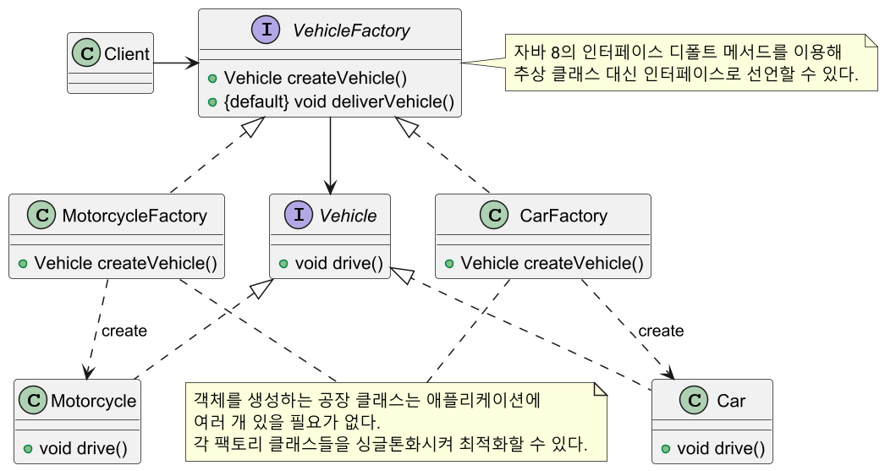
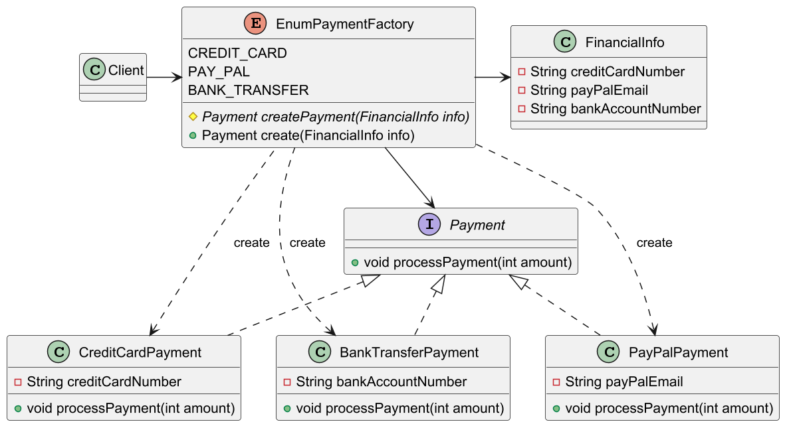

# 팩토리 메서드 패턴

## 팩토리 메서드 패턴 정의

객체를 생성할 때 필요한 인터페이스를 만든다. 어떤 클래스의 인스턴스를 만들지는 서브클래스에서 결정한다.
팩토리 메서드 패턴을 사용하면 클래스 인스턴스 만드는 일을 서브클래스에게 맡기게 된다.

## 팩토리 메서드 패턴 구조


## 팩토리 메서드 패턴 예제 코드 - 1



```java
//Product
public interface Vehicle {
    void drive();
}
```
```java
//Concrete Product
public class Car implements Vehicle {

    @Override
    public void drive() {
        System.out.println("Driving a car!");
    }
}
```
```java
//Concrete Product
public class Motorcycle implements Vehicle {

    @Override
    public void drive() {
        System.out.println("Riding a motorcycle!");
    }
}
```
```java
//Creator
public interface VehicleFactory {

    //추상 메서드
    Vehicle createVehicle();

    //디폴트 메서드
    default void deliverVehicle() {
        Vehicle vehicle = createVehicle();
        System.out.print("Delivering the vehicle: ");
        vehicle.drive();
    }
}
```
```java
//Concrete Creator
public class CarFactory implements VehicleFactory {

    @Override
    public Vehicle createVehicle() {
        return new Car();
    }
}
```
```java
//Concrete Creator
public class MotorcycleFactory implements VehicleFactory {

    @Override
    public Vehicle createVehicle() {
        return new Motorcycle();
    }
}
```
```java
//Client
public class Client {
    public static void main(String[] args) {

        VehicleFactory[] factories = {
            new CarFactory(),
            new MotorcycleFactory()
        };

        for (VehicleFactory factory : factories) {
            factory.deliverVehicle();
        }
        
        //Output
        //Delivering the vehicle: Driving a car!
        //Delivering the vehicle: Riding a motorcycle!
    }
}
```

## 팩토리 메서드 패턴 예제 코드 - 2


```java
//Product
public interface Payment {
    void processPayment(int amount);
}
```
```java
//Concrete Product
public class CreditCardPayment implements Payment {

    private final String creditCardNumber;

    public CreditCardPayment(String creditCardNumber) {
        this.creditCardNumber = creditCardNumber;
    }

    @Override
    public void processPayment(int amount) {
        System.out.printf("Credit card: $%d by [%s]\n", amount, creditCardNumber);
    }
}
```
```java
//Concrete Product
public class BankTransferPayment implements Payment {

    private final String bankAccountNumber;

    public BankTransferPayment(String bankAccountNumber) {
        this.bankAccountNumber = bankAccountNumber;
    }

    @Override
    public void processPayment(int amount) {
        System.out.printf("Bank transfer: $%d by [%s]\n", amount, bankAccountNumber);
    }
}
```
```java
//Concrete Product
public class PayPalPayment implements Payment {

    private final String payPalEmail;

    public PayPalPayment(String payPalEmail) {
        this.payPalEmail = payPalEmail;
    }

    @Override
    public void processPayment(int amount) {
        System.out.printf("PayPal: $%d by [%s]\n", amount, payPalEmail);
    }
}
```
```java
//Creator
public interface PaymentFactory {
    Payment createPayment(FinancialInfo info);
}
```
```java
//Concrete Creator
public class CreditCardPaymentFactory implements PaymentFactory {

    @Override
    public Payment createPayment(FinancialInfo info) {
        return new CreditCardPayment(info.creditCardNumber);
    }
}
```
```java
//Concrete Creator
public class BankTransferPaymentFactory implements PaymentFactory {

    @Override
    public Payment createPayment(FinancialInfo info) {
        return new BankTransferPayment(info.bankAccountNumber);
    }
}
```
```java
//Concrete Creator
public class PayPalPaymentFactory implements PaymentFactory {

    @Override
    public Payment createPayment(FinancialInfo info) {
        return new PayPalPayment(info.payPalEmail);
    }
}
```
```java
public class FinancialInfo {

    String creditCardNumber;
    String payPalEmail;
    String bankAccountNumber;

    public FinancialInfo(String creditCardNumber, String payPalEmail, String bankAccountNumber) {
        this.creditCardNumber = creditCardNumber;
        this.payPalEmail = payPalEmail;
        this.bankAccountNumber = bankAccountNumber;
    }
}
```
```java
//Client
public class Client {
    public static void main(String[] args) {

        FinancialInfo userInfo = new FinancialInfo(
            "1234-5678-9012-3456",
            "user@example.com",
            "987654321"
        );

        for (Payment payment : payments) {
            payment.processPayment(100);
        }

        PaymentFactory[] factories = {
            new CreditCardPaymentFactory(),
            new PayPalPaymentFactory(),
            new BankTransferPaymentFactory()
        };

        for (EnumPaymentFactory factory : factories) {
            Payment payment = factory.create(userInfo);
            payment.processPayment(150);
        }
        
        //Output
        //Credit card: $150 by [1234-5678-9012-3456]
        //PayPal: $150 by [user@example.com]
        //Bank transfer: $150 by [987654321]
    }
}
```

만약 `Concrete Product`들의 생성 방식이 달라져도, 해당 팩토리의 `createPayment` 메서드만 수정하면 되기 때문에
클라이언트 코드에는 수정해야 할 부분이 없다.

첫 번째 예제에서 팩토리 클래스들은 싱글톤으로 구성하는 것이 좋다고 했는데, 모든 클래스들을
싱글톤으로 구성하는 것보다 **Enum**을 이용하면 효율적인 작업이 가능하다.

**Enum** 타입 자체가 `public static final`이기 때문에 따로 싱글톤을 구현하지 않아도
단일한 객체만 생성됨이 보장된다.

바로 위 예제를 **Enum**을 사용한 팩토리 메서드 패턴으로 변경하면 다음과 같다.



```java
public enum EnumPaymentFactory {

    CREDIT_CARD {
        @Override
        protected Payment createPayment(FinancialInfo info) {
            return new CreditCardPayment(info.creditCardNumber);
        }
    },
    PAY_PAL {
        @Override
        protected Payment createPayment(FinancialInfo info) {
            return new PayPalPayment(info.payPalEmail);
        }
    },
    BANK_TRANSFER {
        @Override
        protected Payment createPayment(FinancialInfo info) {
            return new BankTransferPayment(info.bankAccountNumber);
        }
    };

    public Payment create(FinancialInfo info) {
        return createPayment(info);
    }

    abstract protected Payment createPayment(FinancialInfo info);
}
```
```java
//Client
public class Client {
    public static void main(String[] args) {

        FinancialInfo userInfo = new FinancialInfo(
            "1234-5678-9012-3456",
            "user@example.com",
            "987654321"
        );

        EnumPaymentFactory[] factories = {
            EnumPaymentFactory.CREDIT_CARD,
            EnumPaymentFactory.PAY_PAL,
            EnumPaymentFactory.BANK_TRANSFER
        };

        for (EnumPaymentFactory factory : factories) {
            Payment payment = factory.create(userInfo);
            payment.processPayment(150);
        }
        
        //Output
        //Credit card: $150 by [1234-5678-9012-3456]
        //PayPal: $150 by [user@example.com]
        //Bank transfer: $150 by [987654321]
    }
}
```

## 팩토리 메서드 패턴 장단점

### 팩토리 메서드 장점

- 생성자(`Creator`)와 구현 객체(`Concrete Product`)의 강한 결합을 피할 수 있다.
- 객체 생성 후 공통으로 할 일을 수행하도록 지정할 수 있다.
- 캡슐화, 추상화를 통해 생성되는 객체의 구체적인 타입을 감출 수 있다.
- 객체 생성 코드를 한 곳(패키지, 클래스 등)으로 이동하여 코드를 유지보수하기 쉬워진다.(**SRP** 준수)
- 기존 코드를 수정하지 않고 새로운 유형의 제품 인스턴스를 쉽게 도입할 수 있다.(**OCP** 준수)

### 팩토리 메서드 단점

- 각 제품 구현체마다 팩토리 객체들을 모두 구현해주어야 하기 때문에 구현체가 늘어날 때마다
팩토리 클래스가 증가한다.(서브 클래스 수 폭발)
- 코드의 복잡성이 증가한다.

## 실전에서 사용되는 팩토리 메서드 패턴

- `java.util.Calendar.getInstance()`
- `java.util.ResourceBundle.getBundle()`
- `java.text.NumberFormat.getInstance()`
- `java.nio.charset.Charset.forName()`
- `java.net.URLStreamHandlerFactory.createURLStreamHandler(String)`
- `java.util.EnumSet.of()`
- `javax.xml.bind.JAXBContext.createMarshaller()`

---

### 참고

- [참고 블로그](https://inpa.tistory.com/entry/GOF-%F0%9F%92%A0-%ED%8C%A9%ED%86%A0%EB%A6%AC-%EB%A9%94%EC%84%9C%EB%93%9CFactory-Method-%ED%8C%A8%ED%84%B4-%EC%A0%9C%EB%8C%80%EB%A1%9C-%EB%B0%B0%EC%9B%8C%EB%B3%B4%EC%9E%90)
- [참고 사이트](https://refactoring.guru/ko/design-patterns/factory-method)
- [참고 강의](https://www.inflearn.com/course/%EA%B0%9D%EC%B2%B4%EC%A7%80%ED%96%A5-%EB%94%94%EC%9E%90%EC%9D%B8-%ED%8C%A8%ED%84%B4-%EC%96%84%EC%BD%94/dashboard)
- [참고 책](https://www.yes24.com/Product/Goods/108192370)