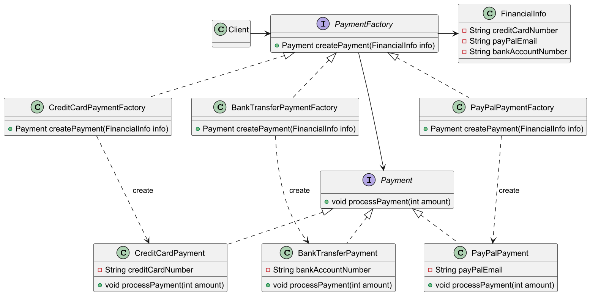

# 팩토리 메서드 패턴

## 팩토리 메서드 패턴 정의

객체를 생성할 때 필요한 인터페이스를 만든다. 어떤 클래스의 인스턴스를 만들지는 서브클래스에서 결정한다.
팩토리 메서드 패턴을 사용하면 클래스 인스턴스 만드는 일을 서브클래스에게 맡기게 된다.

## 팩토리 메서드 패턴 구조

## 팩토리 메서드 패턴 예제 코드 - 1

**팩토리 메서드 패턴으로 여러 종류의 이동 수단을 만들어본다.**

> 자바 8의 디폴트 메서드를 이용해 최상위 공장 클래스를 추상 클래스 대신 인터페이스로 선언할 수 있다.

> 객체를 생성하는 공장 클래스는 애플리케이션에 여러 개 있을 필요가 없다. 따라서 각 팩토리 클래스들을
> **싱글톤**화시켜 최적화 하는 것이 가장 좋다.

## 팩토리 메서드 패턴 예제 코드 - 2

만약 `Concrete Product`들의 생성 방식이 달라져도, 해당 팩토리의 `createPayment` 메서드만 수정하면 되기 때문에
클라이언트 코드에는 수정해야 할 부분이 없다.

첫 번째 예제에서 팩토리 클래스들은 싱글톤으로 구성하는 것이 좋다고 했는데, 모든 클래스들을
싱글톤으로 구성하는 것보다 **Enum**을 이용하면 효율적인 작업이 가능하다.

**Enum** 타입 자체가 `public static final`이기 때문에 따로 싱글톤을 구현하지 않아도
단일한 객체만 생성됨이 보장된다.

바로 위 예제를 **Enum**을 사용한 팩토리 메서드 패턴으로 변경하면 다음과 같다.

## 팩토리 메서드 패턴 장단점

### 팩토리 메서드 장점

- 생성자(`Creator`)와 구현 객체(`Concrete Product`)의 강한 결합을 피할 수 있다.
- 객체 생성 후 공통으로 할 일을 수행하도록 지정할 수 있다.
- 캡슐화, 추상화를 통해 생성되는 객체의 구체적인 타입을 감출 수 있다.
- 객체 생성 코드를 한 곳(패키지, 클래스 등)으로 이동하여 코드를 유지보수하기 쉬워진다.(**SRP** 준수)
- 기존 코드를 수정하지 않고 새로운 유형의 제품 인스턴스를 쉽게 도입할 수 있다.(**OCP** 준수)

### 팩토리 메서드 단점

- 각 제품 구현체마다 팩토리 객체들을 모두 구현해주어야 하기 때문에 구현체가 늘어날 때마다
팩토리 클래스가 증가한다.(서브 클래스 수 폭발)
- 코드의 복잡성이 증가한다.

## 실전에서 사용되는 팩토리 메서드 패턴

- `java.util.Calendar.getInstance()`
- `java.util.ResourceBundle.getBundle()`
- `java.text.NumberFormat.getInstance()`
- `java.nio.charset.Charset.forName()`
- `java.net.URLStreamHandlerFactory.createURLStreamHandler(String)`
- `java.util.EnumSet.of()`
- `javax.xml.bind.JAXBContext.createMarshaller()`

---

### 참고

- [참고 블로그](https://inpa.tistory.com/entry/GOF-%F0%9F%92%A0-%ED%8C%A9%ED%86%A0%EB%A6%AC-%EB%A9%94%EC%84%9C%EB%93%9CFactory-Method-%ED%8C%A8%ED%84%B4-%EC%A0%9C%EB%8C%80%EB%A1%9C-%EB%B0%B0%EC%9B%8C%EB%B3%B4%EC%9E%90)
- [참고 사이트](https://refactoring.guru/ko/design-patterns/factory-method)
- [참고 강의](https://www.inflearn.com/course/%EA%B0%9D%EC%B2%B4%EC%A7%80%ED%96%A5-%EB%94%94%EC%9E%90%EC%9D%B8-%ED%8C%A8%ED%84%B4-%EC%96%84%EC%BD%94/dashboard)
- [참고 책](https://www.yes24.com/Product/Goods/108192370)