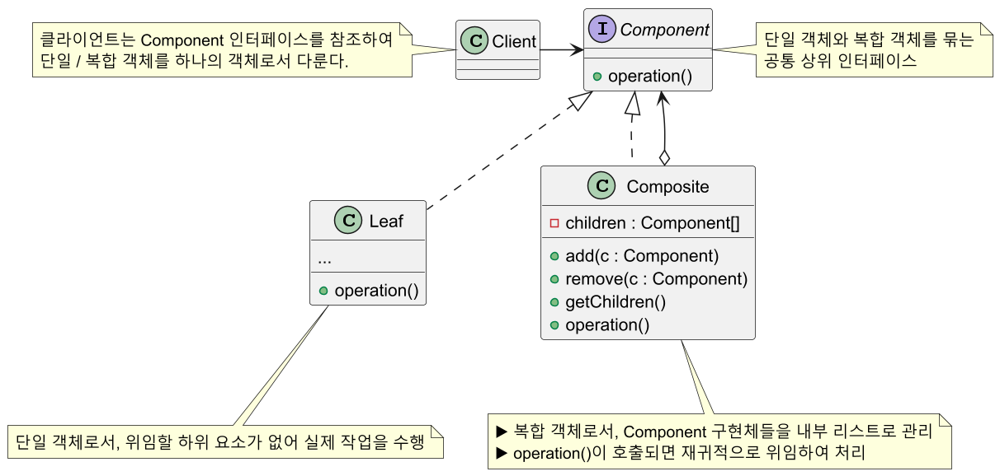
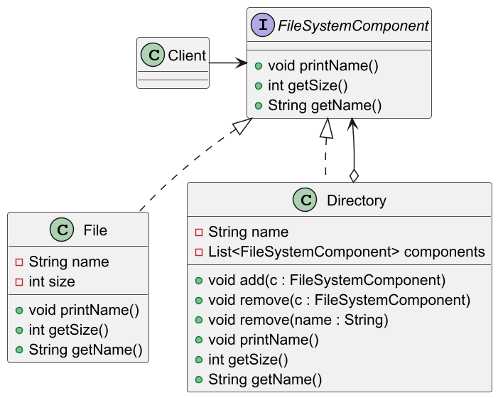
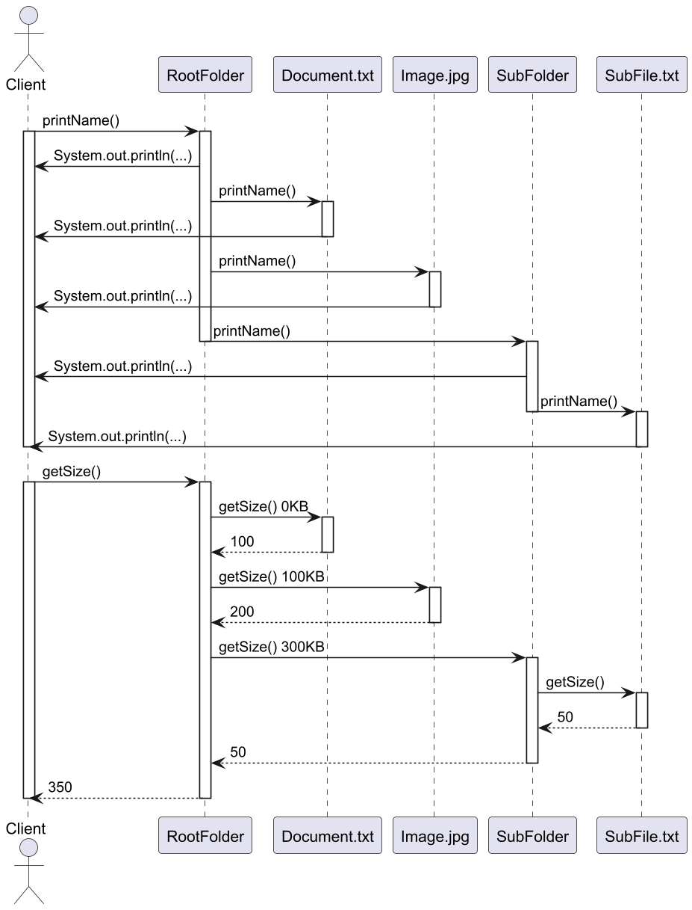

# 복합체 패턴

## 복합체 패턴 정의

객체를 트리구조로 구성해서 부분-전체 계층구조를 구현한다. 복합체(컴포지트) 패턴을 사용하면
클라이언트에서 개별 객체와 복합 객체를 똑같은 방법으로 다룰 수 있다.

## 복합체 패턴 구조



## 복합체 패턴 예제 코드 - 1



```java
//Component
public interface FileSystemComponent {
    void printName();
    int getSize();
    String getName();
}
```
```java
//Leaf
public class File implements FileSystemComponent {

    private final String name;
    private final int size;

    public File(String name, int size) {
        this.name = name;
        this.size = size;
    }

    @Override
    public void printName() {
        System.out.println("File: " + name);
    }

    @Override
    public int getSize() {
        return size;
    }

    @Override
    public String getName() {
        return name;
    }
}
```
```java
//Composite
public class Directory implements FileSystemComponent {

    private final String name;
    private final List<FileSystemComponent> components = new ArrayList<>();

    public Directory(String name) {
        this.name = name;
    }

    public void add(FileSystemComponent component) {
        components.add(component);
    }

    public void remove(FileSystemComponent component) {
        components.remove(component);
    }

    public void remove(String name) {
        components.removeIf(
            component -> component.getName().equals(name)
        );
    }

    @Override
    public void printName() {
        System.out.println("Directory: " + name);
        for (FileSystemComponent component : components) {
            component.printName();
        }
    }

    @Override
    public int getSize() {
        int totalSize = 0;

        for (FileSystemComponent component : components) {
            totalSize += component.getSize();
        }

        return totalSize;
    }

    @Override
    public String getName() {
        return name;
    }
}
```
```java
//Client
public class Client {
    public static void main(String[] args) {
        
        File file1 = new File("Document.txt", 100);
        File file2 = new File("Image.jpg", 200);

        Directory subDir = new Directory("SubFolder");
        subDir.add(new File("SubFile.txt", 50));

        Directory rootDir = new Directory("RootFolder");
        rootDir.add(file1);
        rootDir.add(file2);
        rootDir.add(subDir);

        /*
         * RootFolder
         *   ↳ Document.txt (100KB)
         *   ↳ Image.jpg (200KB)
         *   ↳ SubFolder
         *      ↳ SubFile.txt (50KB)
         */

        print(rootDir);
        //Output
        //Directory: RootFolder
        //File: Document.txt
        //File: image.jpg
        //Directory: SubFolder
        //File: SubFile.txt
        //Total Size: 350 KB

        rootDir.remove("Image.jpg");
        print(rootDir);
        //Output
        //Directory: RootFolder
        //File: Document.txt
        //Directory: SubFolder
        //File: SubFile.txt
        //Total Size: 150 KB

        rootDir.remove(subDir);
        print(rootDir);
        //Output
        //Directory: RootFolder
        //File: Document.txt
        //Total Size: 100 KB
    }

    public static void print(FileSystemComponent component) {
        component.printName();
        System.out.println("Total Size: " + component.getSize() + " KB");
    }
}
```



## 복합체 패턴 예제 코드 - 2


```java
//Component
public interface UIComponent {
    void render();
    void add(UIComponent component);
    void remove(UIComponent component);
}
```
```java
//Leaf
public class TextBox implements UIComponent {

    private final String text;

    public TextBox(String text) {
        this.text = text;
    }

    @Override
    public void render() {
        System.out.println("TextBox: " + text);
    }

    @Override
    public void add(UIComponent component) {
        throw new UnsupportedOperationException();
    }

    @Override
    public void remove(UIComponent component) {
        throw new UnsupportedOperationException();
    }
}
```
```java
//Leaf
public class Button implements UIComponent {

    private final String label;

    public Button(String label) {
        this.label = label;
    }

    @Override
    public void render() {
        System.out.println("Button: " + label);
    }

    @Override
    public void add(UIComponent component) {
        throw new UnsupportedOperationException();
    }

    @Override
    public void remove(UIComponent component) {
        throw new UnsupportedOperationException();
    }
}
```
```java
//Composite
public class Panel implements UIComponent {

    private final String name;
    private final List<UIComponent> components = new ArrayList<>();

    public Panel(String name) {
        this.name = name;
    }

    @Override
    public void render() {
        System.out.println("Panel: " + name);
        for (UIComponent component : components) {
            component.render();
        }
    }

    @Override
    public void add(UIComponent component) {
        components.add(component);
    }

    @Override
    public void remove(UIComponent component) {
        components.remove(component);
    }
}
```
```java
//Composite
public class Window implements UIComponent {

    private final String title;
    private final List<UIComponent> components = new ArrayList<>();

    public Window(String title) {
        this.title = title;
    }

    @Override
    public void render() {
        System.out.println("Window: " + title);
        for (UIComponent component : components) {
            component.render();
        }
    }

    @Override
    public void add(UIComponent component) {
        components.add(component);
    }

    @Override
    public void remove(UIComponent component) {
        components.remove(component);
    }
}
```
```java
//Client
public class Client {
    public static void main(String[] args) {
        
        Button submitButton = new Button("Submit");
        Button cancelButton = new Button("Cancel");
        TextBox usernameField = new TextBox("Username");

        Panel formPanel = new Panel("Form");
        formPanel.add(submitButton);
        formPanel.add(cancelButton);
        formPanel.add(usernameField);

        Window mainWindow = new Window("Main");
        mainWindow.add(formPanel);

        /*
         * mainWindow
         *   ↳ formPanel
         *      ↳ submitButton
         *      ↳ cancelButton
         *      ↳ usernameField
         */

        print(mainWindow);
        //Output
        //Window: Main
        //Panel: Form
        //Button: Submit
        //Button: Cancel
        //TextBox: Username

        formPanel.remove(cancelButton);
        print(mainWindow);
        //Output
        //Window: Main
        //Panel: Form
        //Button: Submit
        //TextBox: Username
    }

    public static void print(UIComponent component) {
        component.render();
    }
}
```

## 복합체 패턴 장단점

### 복합체 패턴 장점

- 단일 객체와 복합 객체를 동일하게 여기기 때문에 묶어서 연산하거나 관리할 때 편리하다.
- 다형성과 재귀를 통해 복잡한 트리 구조를 보다 편리하게 구성할 수 있다.
- 수평적, 수직적 모든 방향으로 객체를 확장할 수 있다.
- 새로운 Leaf 클래스를 추가하더라도 클라이언트는 추상화된 인터페이스만을 
바라본다.(**OCP** 준수, 단일 부분 확장 용이)

### 복합체 패턴 단점

- 재귀 호출 특성 상 트리의 깊이가 깊어질수록 디버깅이 어렵다.
- 설계가 지나치게 범용성을 갖기 때문에 새로운 요소를 추가할 때 복합 객체에서
구성 요소에 제약을 갖기 힘들다.
- 계층형 구조에서 Leaf 객체와 Composite 객체들을 모두 동일한 인터페이스로 다루어야 하는데,
이 공통 인터페이스 설계가 까다로울 수 있다.
  - 복합 객체가 가지는 부분 객체의 종류를 제한할 필요가 있을 때
  - 수평적 방향으로만 확장이 가능하도록 Leaf를 제한하는 Composite를 만들 때

## 실전에서 사용되는 복합체 패턴

- `java.awt.Container`
- `javax.faces.component.UIComponent`

---

### 참고

- [참고 블로그](https://inpa.tistory.com/entry/GOF-%F0%9F%92%A0-%EB%B3%B5%ED%95%A9%EC%B2%B4Composite-%ED%8C%A8%ED%84%B4-%EC%99%84%EB%B2%BD-%EB%A7%88%EC%8A%A4%ED%84%B0%ED%95%98%EA%B8%B0)
- [참고 사이트](https://refactoring.guru/ko/design-patterns/composite)
- [참고 강의](https://www.inflearn.com/course/%EA%B0%9D%EC%B2%B4%EC%A7%80%ED%96%A5-%EB%94%94%EC%9E%90%EC%9D%B8-%ED%8C%A8%ED%84%B4-%EC%96%84%EC%BD%94/dashboard)
- [참고 책](https://www.yes24.com/Product/Goods/108192370)