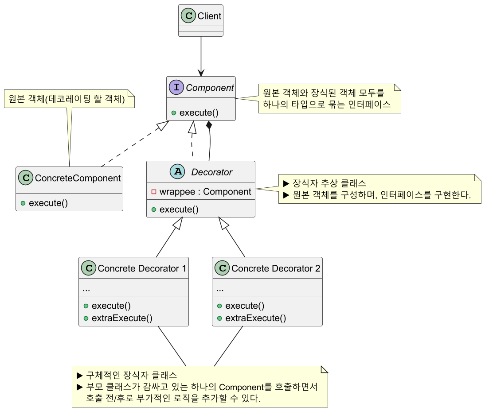
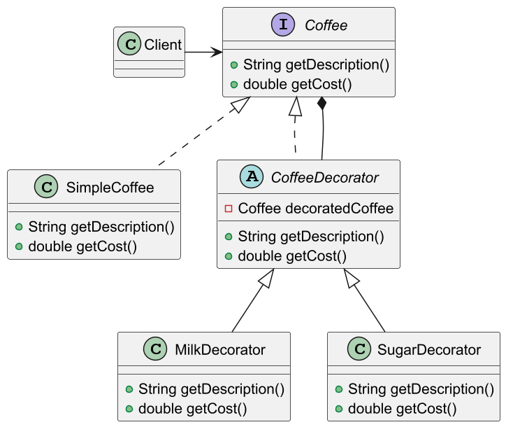
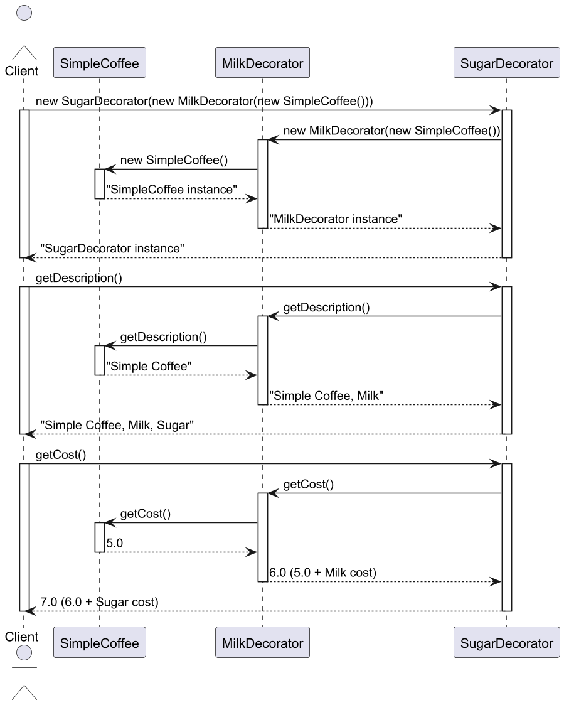
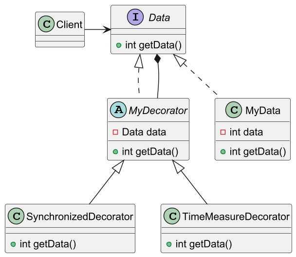

# 데코레이터 패턴

## 데코레이터 패턴 정의

객체들을 새로운 행동을 포함한 특수 래퍼 객체 내에 넣어서 위 행동들을 해당 객체들에 연결시키는 구조적 디자인 패턴

데코레이터 패턴으로 객체를 추가 요소를 동적으로 더할 수 있으며, 서브클래스를 만들 때보다 훨씬 유연하게 기능을 확장할 수 있다.

## 데코레이터 패턴 구조



## 데코레이터 패턴 예제 코드 - 1

**데코레이터 패턴으로 커피 메뉴에 포함될 수 있는 재료들의 조합을 생성한다.** 
일반적인 방법으로는 모든 조합을 미리 클래스로 정의해야 하며, 새로운 재료가 늘어날 때마다 
클래스는 배수로 늘어날 것이다.



```java
//Component
public interface Coffee {
    String getDescription();
    double getCost();
}
```
```java
//Concrete Component
public class SimpleCoffee implements Coffee {

    @Override
    public String getDescription() {
        return "Simple coffee";
    }

    @Override
    public double getCost() {
        return 5.0;
    }
}
```
```java
//Decorator
public abstract class CoffeeDecorator implements Coffee {

    private final Coffee decoratedCoffee;

    public CoffeeDecorator(Coffee coffee) {
        this.decoratedCoffee = coffee;
    }

    @Override
    public String getDescription() {
        return decoratedCoffee.getDescription();
    }

    @Override
    public double getCost() {
        return decoratedCoffee.getCost();
    }
}
```
```java
//Concrete Decorators
public class MilkDecorator extends CoffeeDecorator {

    public MilkDecorator(Coffee coffee) {
        super(coffee);
    }

    @Override
    public String getDescription() {
        return super.getDescription() + ", Milk";
    }

    @Override
    public double getCost() {
        return super.getCost() + 1.5;
    }
}
```
```java
//Concrete Decorators
public class SugarDecorator extends CoffeeDecorator {

    public SugarDecorator(Coffee coffee) {
        super(coffee);
    }

    @Override
    public String getDescription() {
        return super.getDescription() + ", Sugar";
    }

    @Override
    public double getCost() {
        return super.getCost() + 0.5;
    }
}
```
```java
//Client
public class Client {
    public static void main(String[] args) {

        //커피
        Coffee simpleCoffee = new SimpleCoffee();
        print(simpleCoffee); //Simple coffee $5.0

        //커피 + 우유
        Coffee milkCoffee = new MilkDecorator(new SimpleCoffee());
        print(milkCoffee); //Simple coffee, Milk $6.5

        //커피 + 우유 + 설탕
        Coffee milkAndSugarCoffee = new SugarDecorator(new MilkDecorator(new SimpleCoffee()));
        print(milkAndSugarCoffee); //Simple coffee, Milk, Sugar $7.0
    }

    public static void print(Coffee coffee) {
        System.out.println(
            coffee.getDescription() + " $" + coffee.getCost()
        );
    }
}
```



> 데코레이터 순서는 원본 대상 객체 생성자를 장식자 생성자가 래핑하는 형태로 보면 된다.
> 
> ex) `new 장식자(new 원본())`

## 데코레이터 패턴 예제 코드 - 2

**html 태그를 사용해 다양한 글씨체를 출력하듯이, 각각의 html 태그를 데코레이터로 생각해
텍스트를 여러 태그로 감싸보자.**


```java
//Component
public interface Text {
    String getContent();
}
```
```java
//Concrete Component
public class PlainText implements Text {

    private final String content;

    public PlainText(String content) {
        this.content = content;
    }

    @Override
    public String getContent() {
        return content;
    }
}
```
```java
//Base Decorator
public abstract class TextDecorator implements Text {

    private final Text decoratedText;

    public TextDecorator(Text text) {
        this.decoratedText = text;
    }

    @Override
    public String getContent() {
        return decoratedText.getContent();
    }
}
```
```java
//Concrete Decorators
public class BoldDecorator extends TextDecorator {

    public BoldDecorator(Text text) {
        super(text);
    }

    @Override
    public String getContent() {
        return "<b>" + super.getContent() + "</b>";
    }
}
```
```java
//Concrete Decorators
public class ItalicDecorator extends TextDecorator {

    public ItalicDecorator(Text text) {
        super(text);
    }

    @Override
    public String getContent() {
        return "<i>" + super.getContent() + "</i>";
    }
}
```
```java
//Concrete Decorators
public class UnderlineDecorator extends TextDecorator {

    public UnderlineDecorator(Text text) {
        super(text);
    }

    @Override
    public String getContent() {
        return "<u>" + super.getContent() + "</u>";
    }
}
```
```java
//Client
public class Client {
    public static void main(String[] args) {

        //plain text
        Text text = new PlainText("Hello, Decorator Pattern!");
        System.out.println("Plain text: " + text.getContent());
        //Plain text: Hello, Decorator Pattern!

        //plain + bold text
        text = new BoldDecorator(text);
        System.out.println("Bold text: " + text.getContent());
        //Bold text: <b>Hello, Decorator Pattern!</b>

        //plain + bold + italic text
        text = new ItalicDecorator(text);
        System.out.println("Bold and italic text: " + text.getContent());
        //Bold and italic text: <i><b>Hello, Decorator Pattern!</b></i>

        //plain + bold + italic + underline text
        text = new UnderlineDecorator(text);
        System.out.println("Bold, italic, and underlined text: " + text.getContent());
        //Bold, italic, and underlined text: <u><i><b>Hello, Decorator Pattern!</b></i></u>

        //plain + italic + underline
        Text anotherText = new UnderlineDecorator(new ItalicDecorator(new PlainText("Another example"))
        );
        System.out.println("Underlined and italic text: " + anotherText.getContent());
        //Underlined and italic text: <u><i>Another example</i></u>
    }
}
```

## 데코레이터 패턴 예제 코드 - 3

**데이터를 가져올 때도 동기화 처리, 시간 측정 등과 같은 부가 처리 기능 요구 사항을 처리해야 할 수 있다.**
매번 새로운 클래스를 만드는 대신 데코레이터 패턴으로 기능 확장에 유연하게 대처해보자.



```java
//Component
public interface Data {
    int getData();
}
```
```java
//Concrete Component
public class MyData implements Data {

    private final int data;

    public MyData(int data) {
        this.data = data;
    }

    @Override
    public int getData() {
        return data;
    }
}
```
```java
//Base Decorator
public abstract class MyDataDecorator implements Data {

    private final Data data;

    public MyDataDecorator(Data data) {
        this.data = data;
    }

    @Override
    public int getData() {
        return data.getData();
    }
}
```
```java
//Concrete Decorators
public class SynchronizedDecorator extends MyDataDecorator {

    public SynchronizedDecorator(Data data) {
        super(data);
    }

    @Override
    public int getData() {
        synchronized (this) {
            System.out.println("동기화 데코레이터 처리 시작");
            int result = super.getData();
            System.out.println("동기화 데코레이터 처리 완료");
            return result;
        }
    }
}
```
```java
//Concrete Decorators
public class TimeMeasureDecorator extends MyDataDecorator {

    public TimeMeasureDecorator(Data data) {
        super(data);
    }

    @Override
    public int getData() {
        System.out.println("시간 측정 데코레이터 처리 시작");
        long start = System.nanoTime();
        int result = super.getData();
        long end = System.nanoTime();
        System.out.println(end - start + "n/s");
        System.out.println("시간 측정 데코레이터 처리 완료");

        return result;
    }
}
```
```java
//Client
public class Client {
    public static void main(String[] args) {

        MyData data = new MyData(10);

        System.out.println("\n==========TimeMeasureDecorator==========\n");
        Data data1 = new TimeMeasureDecorator(data);
        data1.getData();

        System.out.println("\n==========SynchronizedDecorator -> TimeMeasureDecorator==========\n");
        Data data2 = new SynchronizedDecorator(new TimeMeasureDecorator(data));
        data2.getData();

        System.out.println("\n==========TimeMeasureDecorator -> SynchronizedDecorator==========\n");
        Data data3 = new TimeMeasureDecorator(new SynchronizedDecorator(data));
        data3.getData();

        //Output
        //==========TimeMeasureDecorator==========
        //
        //시간 측정 데코레이터 처리 시작
        //3000n/s
        //시간 측정 데코레이터 처리 완료
        //
        //==========SynchronizedDecorator -> TimeMeasureDecorator==========
        //
        //동기화 데코레이터 처리 시작
        //시간 측정 데코레이터 처리 시작
        //600n/s
        //시간 측정 데코레이터 처리 완료
        //동기화 데코레이터 처리 완료
        //
        //==========TimeMeasureDecorator -> SynchronizedDecorator==========
        //
        //시간 측정 데코레이터 처리 시작
        //동기화 데코레이터 처리 시작
        //동기화 데코레이터 처리 완료
        //26800n/s
        //시간 측정 데코레이터 처리 완료
    }
}
```

실행 결과를 보면 알 수 있듯이, 어떤 걸 먼저 장식하느냐에 따라 효과가 완전히 달라진다.
따라서 장식자를 감쌀 때 예상한 결과가 나오는지 충분한 검토를 수행해야 한다.

## 데코레이터 패턴 장단점

### 데코레이터 장점

- 서브클래스를 만들 때보다 훨씬 유연하게 기능을 확장할 수 있다.
- 객체를 여러 데코레이터로 래핑하여 여러 동작을 결합할 수 있다.
- 런타임에 동적으로 기능을 변경할 수 있다.
- 각 장식자 클래스마다 고유의 책임을 가져 **SRP** 원칙을 준수한다.
- 클라이언트 코드 수정없이 기능 확장이 필요하면 새로운 장식자 클래스를 추가하면 되므로 **OCP** 원칙을 준수한다.

### 데코레이터 단점

- 장식자 일부를 제거하고 싶을 때, 래퍼 스택에서 특정 래퍼를 제거하기 어렵다.
- 데코레이터를 조합하는 초기 생성코드가 복잡해질 수 있다.
  - `new A(new B(new C(new D(...))))`
- 데코레이터의 행동이 데코레이터 스택 내의 순서에 의존하지 않는 방식으로 데코레이터를 구현하기가 어렵다.
  - 어느 장식자를 먼저 데코레이팅 하느냐에 따라 데코레이터 스택 순서가 결졍되는데, 순서에 의존하지 않는
    방식으로 데코레이터를 구현하기는 어렵다.

## 실전에서 사용되는 데코레이터 패턴

- 자바의 I/O 메서드
  - `InputStream`, `OutputStream`, `Reader`, `Writer`의 생성자를 활용한 래퍼
- `java.util.Collections`의 메서드들
  - `checkedXxx()`, `synchronizedXxx()`, `unmodifiableXxx()`
- `javax.servlet.http.HttpServletRequestWrapper`, `HttpServletResponseWrapper` 

---

### 참고

- [참고 블로그](https://inpa.tistory.com/entry/GOF-%F0%9F%92%A0-%EB%8D%B0%EC%BD%94%EB%A0%88%EC%9D%B4%ED%84%B0Decorator-%ED%8C%A8%ED%84%B4-%EC%A0%9C%EB%8C%80%EB%A1%9C-%EB%B0%B0%EC%9B%8C%EB%B3%B4%EC%9E%90)
- [참고 사이트](https://refactoring.guru/ko/design-patterns/decorator)
- [참고 강의](https://www.inflearn.com/course/%EA%B0%9D%EC%B2%B4%EC%A7%80%ED%96%A5-%EB%94%94%EC%9E%90%EC%9D%B8-%ED%8C%A8%ED%84%B4-%EC%96%84%EC%BD%94/dashboard)
- [참고 책](https://www.yes24.com/Product/Goods/108192370)