# 스트림 데이터 수집

<b>예제 클래스</b>

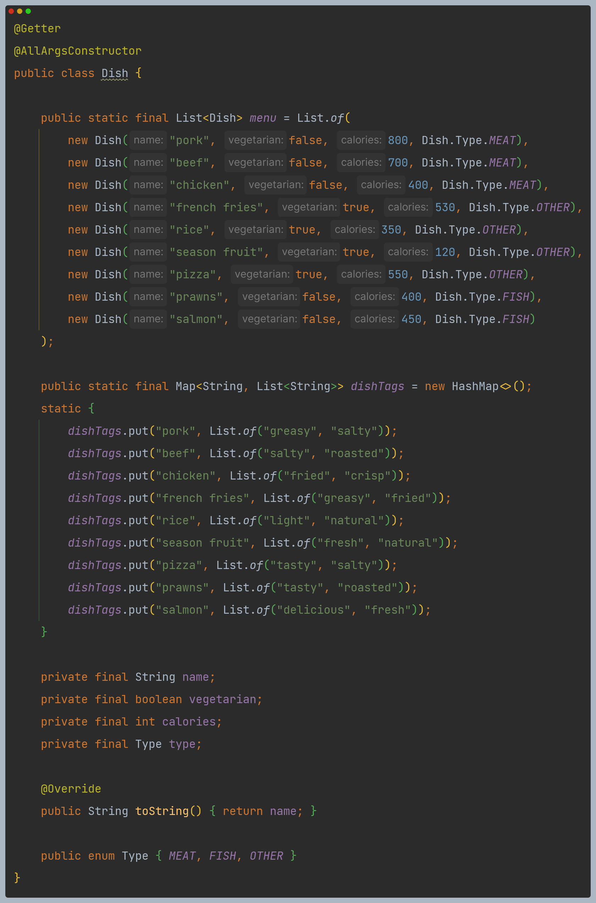

## 리듀싱과 요약

### 스트림값에서 최댓값 / 최솟값 검색

- `Collectors.maxBy`, `Collectors.minBy` 두 개의 메서드를 이용해서 스트림의 최댓값과 최솟값을
계산할 수 있다.
- 두 컬렉터는 스트림의 요소를 비교하는 데 사용할 `Comparator`를 인수로 받는다.
- 다음 코드는 칼로리가 가장 높은 요리를 찾는 코드이다.

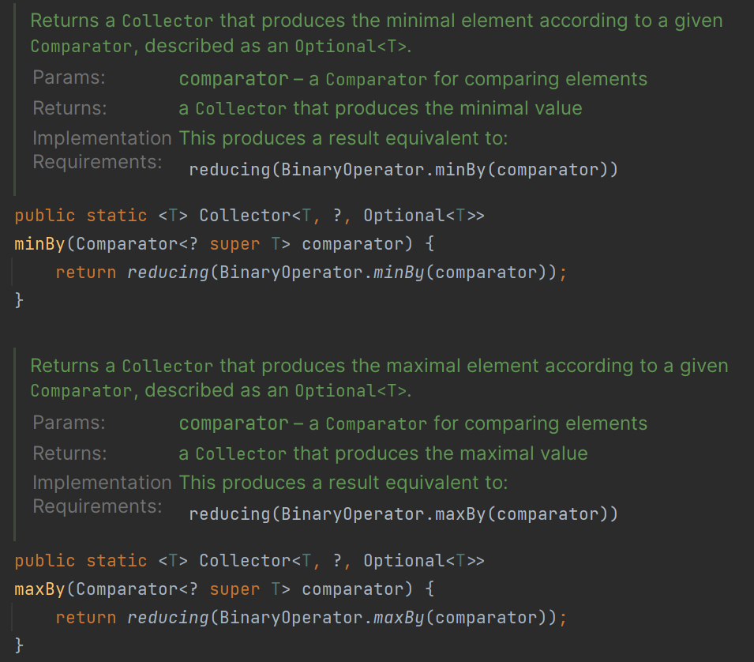

- `Optional`을 반환하는 이유는 스트림이 비어있다면 어떤 값도 반환되지 않기 때문이다.
- IDE는 다음과 같이 변경할 것을 추천한다.

### 요약 연산

- `Collectors` 클래스는 `summingInt`, `summingDouble`, `summingLong`이라는 특별한 요약 팩토리 메서드를 제공한다.
- 예를 들어 `summingInt`는 객체를 `int`로 매핑하는 함수를 인수로 받는다. 인수로 전달된 함수는 객체를 `int`로 매핑한 컬렉터를 반환한다.
- 그리고 `summingInt`가 `collect` 메서드로 전달되면 요약 작업을 수행한다.
- 다음 코드는 메뉴 리스트의 총 칼로리를 계산하는 코드이다.

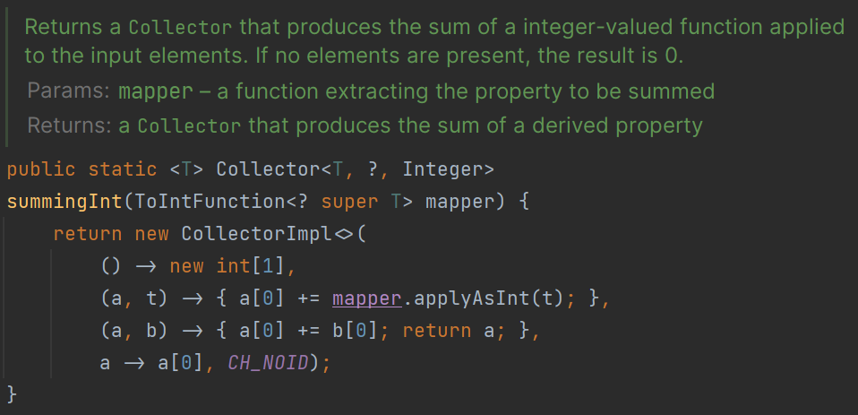

- 이러한 단순 합계 외에 평균값 계산 연산도 기능으로 제공된다.
- `Collectors` 클래스의 `averagingInt`, `averagingDouble`, `averagingLong` 정적 메서드로
숫자 집합의 평균을 계산할 수 있다.

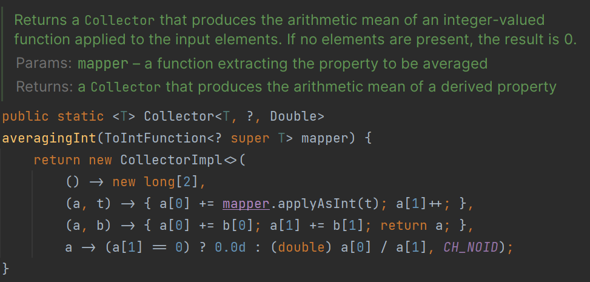

- 또 `Collectors` 클래스의 `summarizingInt`, `summarizingLong`, `summarizingDouble` 정적 메서드를 이용해
하나의 요약 연산으로 요소 수, 합계, 평균, 최댓값, 최솟값 등을 계산할 수 있다.
- 각 메서드는 타입에 맞는 `XxxSummaryStatistics` 클래스를 반환한다.
- 다음 코드는 메뉴 전체 요소 수와 칼로리에 대한 모든 정보를 수집하는 코드다.

### 문자열 연결

- `Collectors`의 `joining` 정적 메서드는 스트림의 각 객체에 `toString` 메서드를 호출해서
추출한 모든 문자열을 하나의 문자열로 연결한 결과를 반환한다.
- 다음은 메뉴의 모든 요리명을 연결하는 코드다.

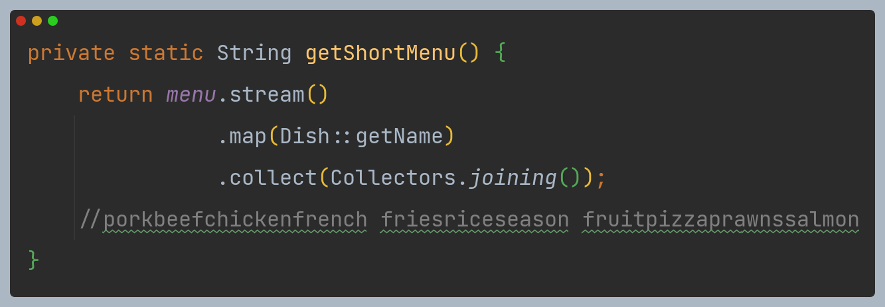

- 하지만 결과 문자열을 모두 그대로 붙이기만 해서 해석하기가 어렵다.
- `joining` 정적 메서드는 `delimiter`만 받는 메서드와 `delimiter, prefix, suffix`를 인수로 받도록 오버로드된 정적 메서드도 있다.

### 범용 리듀싱 요약 연산

- 지금까지 위에서 본 모든 컬렉터는 `reducing` 정적 메서드로도 구현할 수 있다.
- 예를 들어 다음 코드는 `reducing` 메서드로 메뉴의 모든 칼로리 합계를 계산하는 코드다.

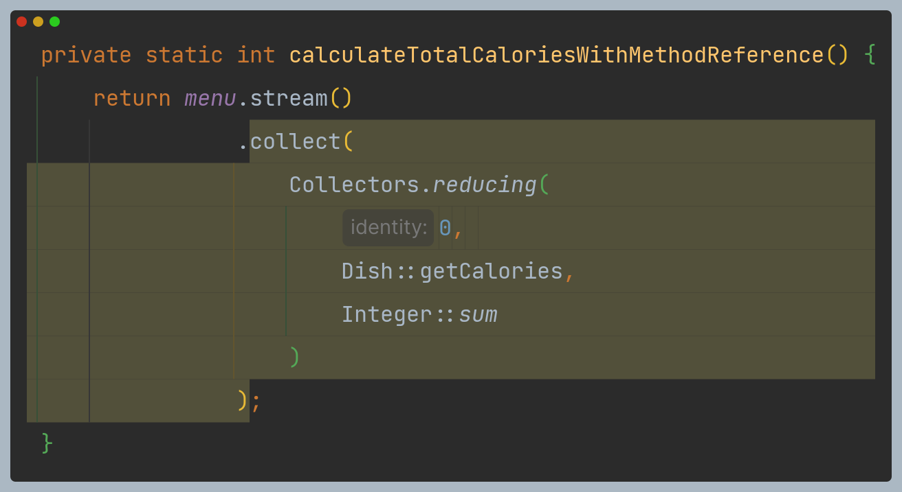

- `reducing`은 리듀싱 연산의 시작값(스트림에 요소가 없을 때는 반환값), 변환 함수, 연산 함수를 인수로 받는다.
- 다음과 같이 한 개의 인수를 받는 오버로드된 `reducing` 메서드로 가장 칼로리가 높은 요리를 찾을 수도 있다.

- 한 개의 인수를 갖는 `reducing` 정적 메서드는 세 개의 인수를 갖는 `reducing` 메서드에서 스트림의
첫 번째 요소를 시작 요소, 즉 첫 번째 인수로 받으며, 자신을 그대로 반환하는 항등 함수(`identity function`)를
두 번재 인수로 받는 상황에 해당한다.
- 즉, 한 개의 인수를 갖는 `reducing` 컬렉터는 시작값이 없으므로 빈 스트림이 넘겨졌을 때 시작값이
설정되지 않는 상황이 벌어진다.
- 그래서 한 개의 인수를 갖는 `reducing`은 `Optional`을 반환한다.
- 다음 코드는 `joining` 컬렉터를 `reducing` 컬렉터로 변경한 예제 코드다.

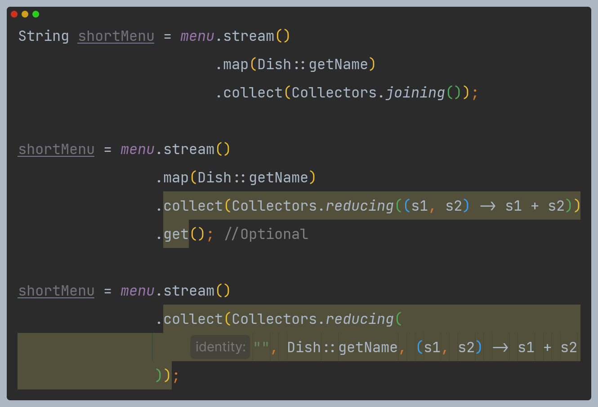

---

## 그룹화

- `Collectors`의 `groupingBy` 정적 메서드를 이용해서 메뉴를 그룹화할 수 있다.
- 다음 코드는 각 요리를 타입별로 그룹화하는 코드다.

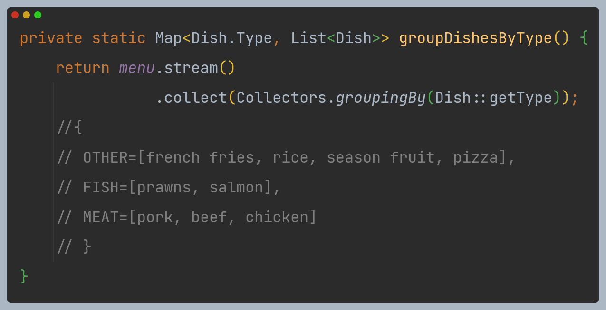

- `groupingBy` 메서드에 전달한 함수를 기준으로 스트림이 그룹화되므로 이를 **분류 함수(classification function)** 라고 한다.
- 단순한 속성 접근자 대신 복잡한 분류 기준이 필요한 상황에서는 메서드 참조를 분류 함수로 사용할 수 없다.
- 다음 코드는 메서드 참조 대신 람다 표현식으로 필요한 로직을 구현한 코드다.

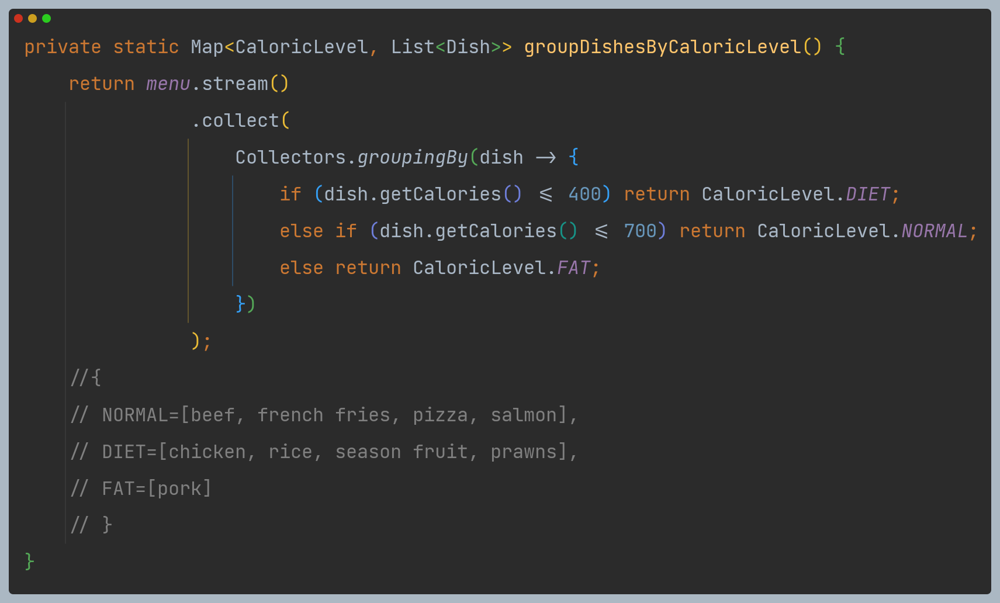

### 그룹화된 요소 조작

- 요소를 그룹화 한 다음에 각 결과 그룹의 요소를 조작하는 연산이 필요할 수 있다.
- 다음 코드는 타입별로 그룹화하고, 500칼로리가 넘는 요리만 필터링하는 코드다.

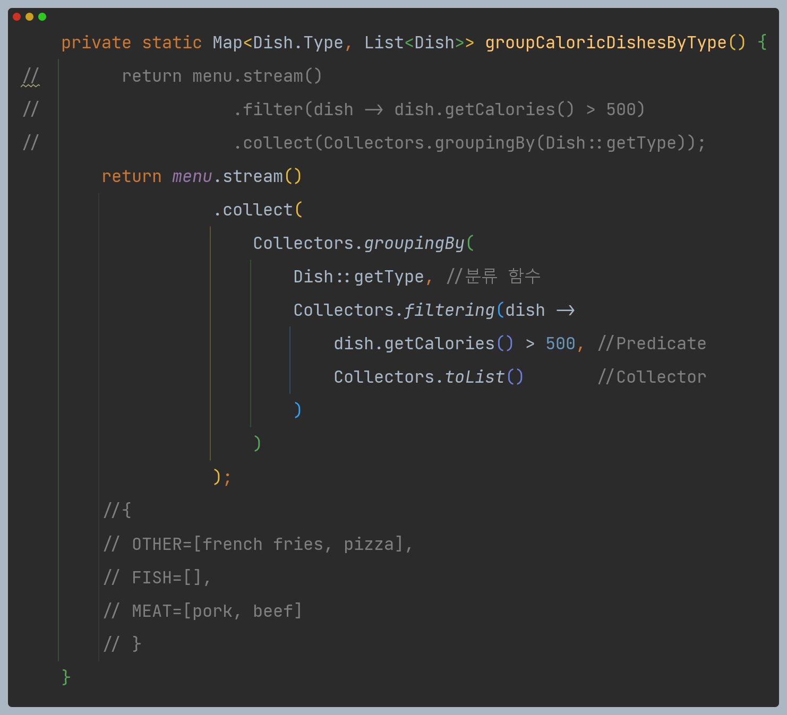

- 주석 처리된 코드를 사용하면 `FISH` 종류 요리가 없어 아예 `FISH`라는 키가 사라진다. 기대한 결과가 아니다.
- 그룹화된 항목을 조작하는 다른 유용한 기능 중 또 다른 하나로 매핑 함수를 이용해 요소를 변환하는 작업이 있다.
- `Collectors` 클래스는 매핑 함수와 각 항목에 적용한 함수를 모으는 데 사용하는 또 다른 컬렉터를
인수로 받는 `mapping` 메서드를 제공한다.
- 다음 코드는 타입별로 그룹화하고, 각 요리를 이름으로 변환하는 코드다.

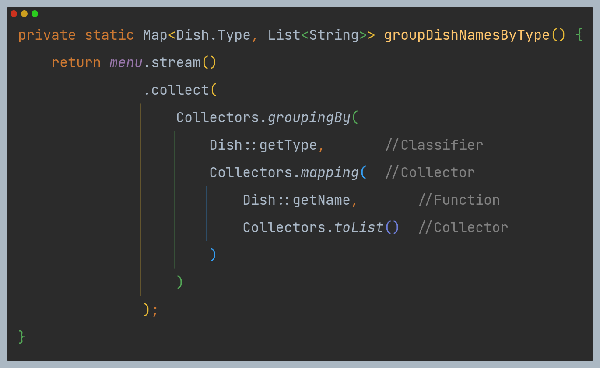

- `flatMapping`도 제공한다.

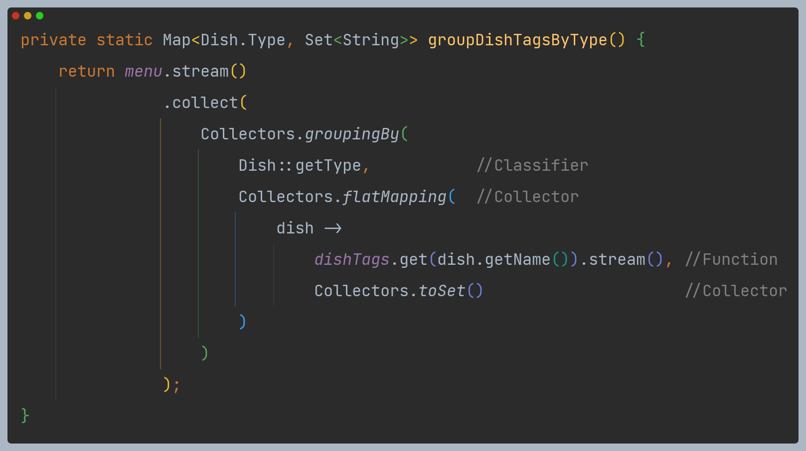

### 다수준 그룹화

- 두 인수를 받는 `groupingBy` 정적 메서드를 이용해 항목을 다수준으로 그룹화할 수 있다.
- `Collectors.groupingBy`는 일반적인 분류 함수와 컬렉터를 인수로 받는다.
- 즉, 바깥쪽 `groupingBy` 메서드에 스트림의 항목을 분류할 두 번째 기준을 정의하는 내부 `groupingBy`를
전달해서 두 수준으로 스트림의 항목을 그룹화할 수 있다.
- 다음 코드는 타입별로 분류된 메뉴를 또 칼로리로 분류하는 코드다.

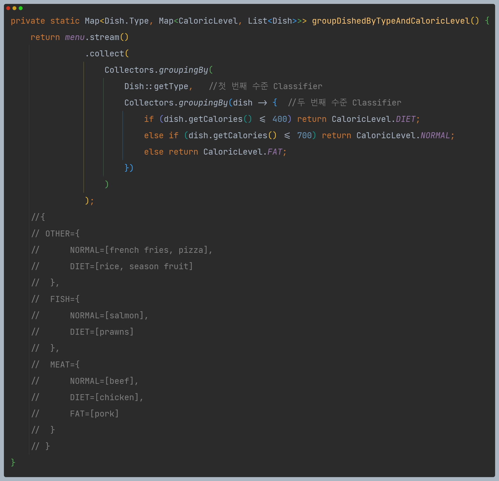

### 서브그룹으로 데이터 수집

- 첫 번째 `groupingBy`로 넘겨주는 컬렉터의 형식은 제한이 없다.
- 예를 들어 다음 코드는 `groupingBy` 컬렉터에 두 번째 인수로 `counting` 컬렉터를 전달해서 
요리의 수를 종류별로 계산하는 코드다.

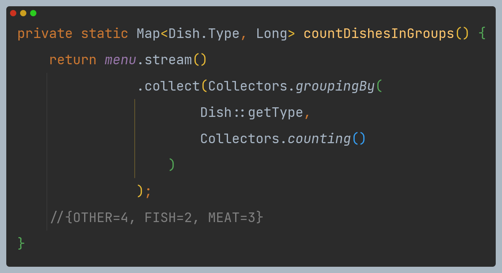

> 분류 함수 한 개의 인수를 갖는 `groupingBy(f)`는 `groupingBy(f, toList())`의 축약형이다.

- 다음 코드는 타입별로 가장 높은 칼로리의 요리를 구하는 코드다.

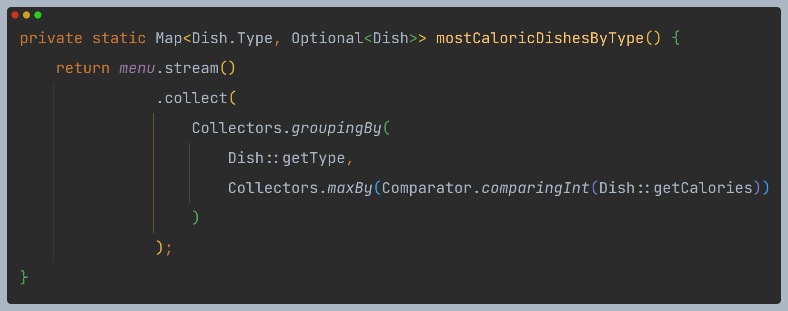

- 정적 메서드 `maxBy`가 반환하는 결과에 따라 값이 `Optional`이 되었다.
- 처음부터 존재하지 않는 키는 맵에 추가되지 않기 때문에 실제로는 `Optional.empty()`를 갖는 값은 없다.
- `groupingBy` 컬렉터는 스트림의 첫 번째 요소를 찾은 이후에야 그룹화 맵에 새로운 키를 (게으르게) 추가한다.
- 리듀싱 컬렉터가 반환하는 형식을 사용하는 상황이므로 굳이 `Optional` 래퍼를 사용할 필요가 없다.
- 다음과 같이 `collectingAndThen` 정적 메서드로 컬렉터가 반환한 결과를 다른 형식으로 활용할 수 있다.

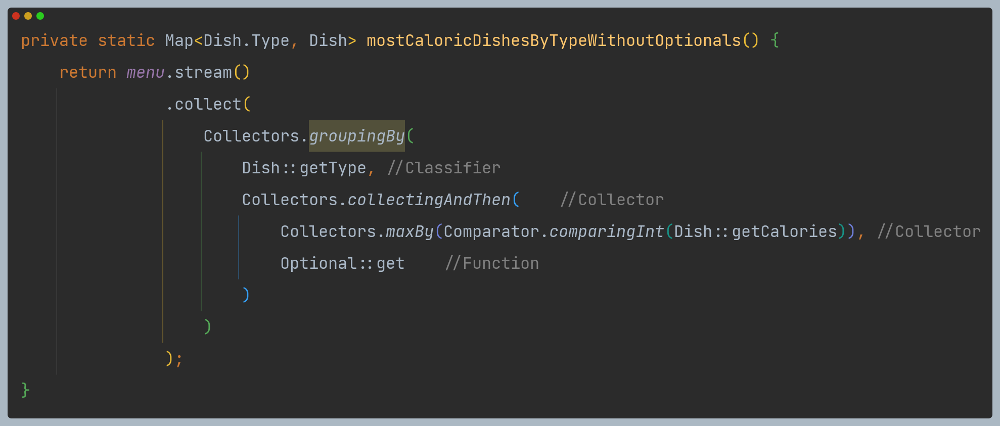

---

## 분할

- 분할은 **분할 함수**라 불리는 `Predicate`를 분류 함수로 사용하는 특수한 그룹화 기능이다.
- 분할 함수는 `Boolean`을 반환하므로 맵의 키 형식은 `true` 또는 `false`만을 갖는 두 개의 그룹으로 분류된다.
- 다음 코드는 채식 요리와 채식이 아닌 요리로 분류하는 코드다.

- 다음 코드와 같이 컬렉터를 두 번째 인수로 받는 오버로드 된 `partitioningBy` 메서드도 있다.
- 채식으로 분할한 다음, 타입별로 분류하는 코드다.

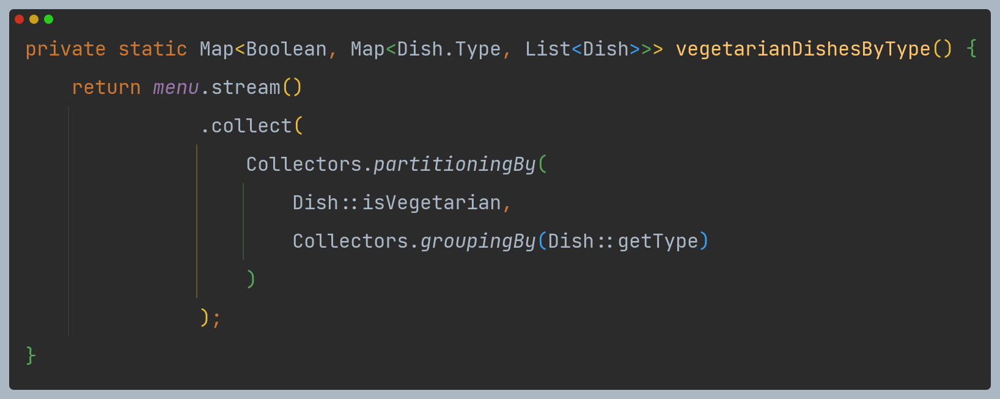

- 다음 코드는 채식으로 분할한 다음, 각각의 그룹에서 가장 칼로리가 높은 요리를 찾는 코드다.

- 다음은 `partitioningBy`를 활용해 숫자를 소수와 비소수로 나누는 코드다.

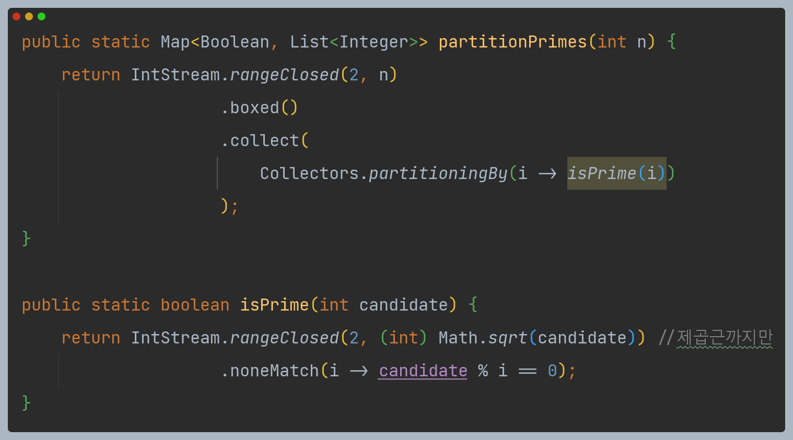

---

## Collector 인터페이스

- `Collecter` 인터페이스는 리듀싱 연산(컬렉터)을 어떻게 구현할지 제공하는 메서드 집합으로 구성된다.
- `toList`, `groupingBy` 등 `Collector` 인터페이스를 구현하는 미리 만들어서 제공되는 컬렉터들이 있다.

- `T`는 수집될 스트림 항목의 제네릭 형식이다.
- `A`는 누적자, 즉 수집 과정에서 중간 결과를 누적하는 객체의 형식이다.
- `R`은 수집 여산 결과 객체의 형식이다.(주로 컬렉션 형식)

### supplier 메서드 - 새로운 결과 컨테이너 만들기

- 이 메서드는 빈 결과로 이루어진 `Supplier`를 반환해야 한다.
- 즉, `supplier()`는 수집 과정에서 빈 누적자 인스턴스를 만드는 파라미터가 없는 함수다.

### accumulator 메서드 - 결과 컨테이너에 요소 추가하기

- 이 메서드는 리듀싱 연산을 수행하는 함수를 반환한다.
- 스트림에서 n번째 요소를 탐색할 때 두 인수, 즉 누적자(스트림의 첫 n-1개 항목을 수집한 상태)와
n번째 요소를 함수에 적용한다.
- 함수의 반환값은 `void`이다. 즉, 요소를 탐색하면서 적용하는 함수에 의해 누적자 내부 상태가 바뀌므로
누적자가 어떤 값일지 단정할 수 없다.

### finisher 메서드 - 최종 변환값을 결과 컨테이너로 적용하기

- 이 메서드는 스트림 탐색을 끝내고 누적자 객체를 최종 결과로 변환하면서 누적 과정을 끝낼 때 호출할 함수를 반환해야 한다.
- 때로는 누적자 객체가 이미 최종 결과인 상황도 있다. 이런 때는 변환 과정이 필요하지 않으므로
항등 함수를 반환할 수 있다.

### combiner 메서드 - 두 결과 컨테이너 병합

- 스트림의 서로 다른 서브파트를 병렬로 처리할 때 누적자가 이 결과를 어떻게 처리할지 정의한다.
- 주로 스트림의 리듀싱을 병렬로 수행할 때 사용된다.

### characteristics 메서드

- 컬렉터의 연산을 정의하는 `Characteristics` 형식의 불변 집합을 반환한다.
- `Characteristics`는 스트림을 병렬로 리듀스할 것인지 그리고 병렬로 리듀스한다면
어떤 최적화를 선택해야 할지 힌트를 제공한다.
- `UNORDERED`
  - 리듀싱 결과는 스트림 요소의 방문 순서나 누적 순서에 영향을 받지 않는다.
- `CONCURRENT`
  - 다중 스레드에서 `accumulator` 함수를 동시에 호출할 수 있으며 이 컬렉터는 스트림의
  병렬 리듀싱을 수행할 수 있다.
  - 컬렉터의 플래그에 `UNORDERED`를 함께 설정하지 않았다면 데이터 소스가 정렬되어 있지 않은
    상황에서만 병렬 리듀싱을 수행할 수 있다.
- `IDENTITY_FINISH`
  - `finisher` 메서드가 반환하는 함수는 단순히 `identity`를 적용할 뿐이므로 이를 생략할 수 있다.
  - 리듀싱 과정의 최종 결과로 누적자 객체를 바로 사용할 수 있다. 또한 누적자 `A`를 결과 `R`로 안전하게 형변환할 수 있다.

다음은 `Collectors.toList()`와 비슷한 `ToListCollection`을 만든 코드다. 사소한 최적화를 제외하면
대체로 비슷하다.

---

## 커스텀 컬렉터로 성능 개선

- `Collector` 인터페이스를 구현하여 위에서 만든 숫자를 소수와 비소수로 분할하는 코드를 개선할 수 있다.
- 에라토스테네스의 체와 같은 원리로 전에 이미 소수로 판별된 수로만 제수(`devisor`)로 제한하면 성능을 개선할 수 있다.
- 하지만 기본 컬렉터 수집 과정에서는 지금까지 발견한 소수 리스트에 접근할 수 없다. 커스텀 클래스로 이 문제를 해결해야 한다.

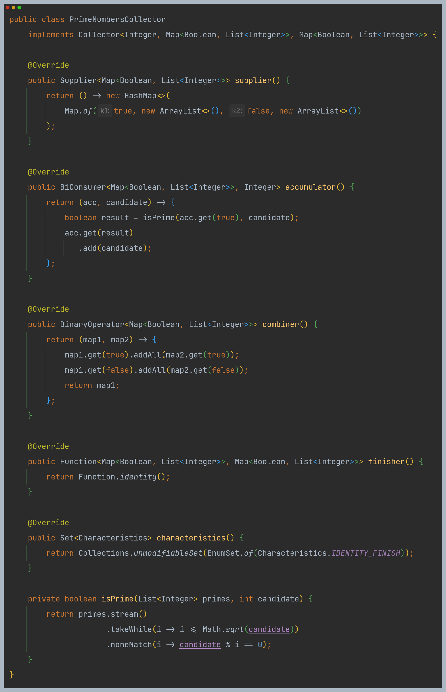

- `accumulator()` 메서드가 최적화의 핵심이다.
- 언제든지 원할 때 수집 과정의 중간 결과, 즉 지금까지 발견한 소수를 포함하는 누적자(`acc`)에 접근할 수 있다.
- 다음과 같이 `Collector` 인터페이스를 구현한 커스텀 클래스를 컬렉터로 넘겨 사용하면 된다.

- 다음은 커스텀 클래스를 사용하지 않았을 때와 사용했을 때의 성능 차이를 비교하는 코드다.

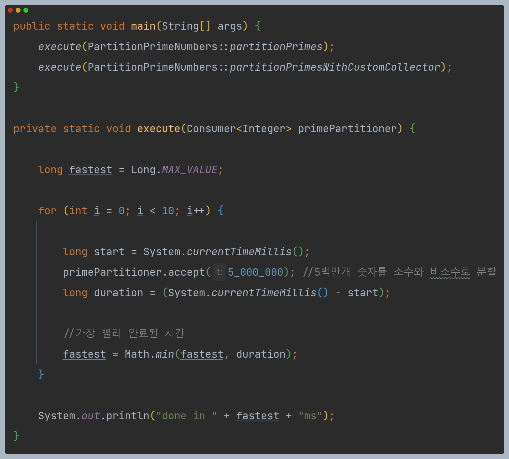

