# 병렬 데이터 처리와 성능

## 병렬 스트림

- 컬렉션에 `parallelStream`을 호출하면 병렬 스트림이 생성된다. 병렬 스트림이란 각각의 스레드에서
처리할 수 있도록 스트림 요소를 여러 청크로 분할한 스트림이다.
- 병렬 스트림을 이용하면 모든 멀티코어 프로세서가 각각의 청크를 처리하도록 할당할 수 있다.
- 다음은 1부터 n까지의 모든 숫자의 합계를 반환하는 코드다. 스트림을 사용한 코드와 전통적인 반복문으로 구현한 코드다.

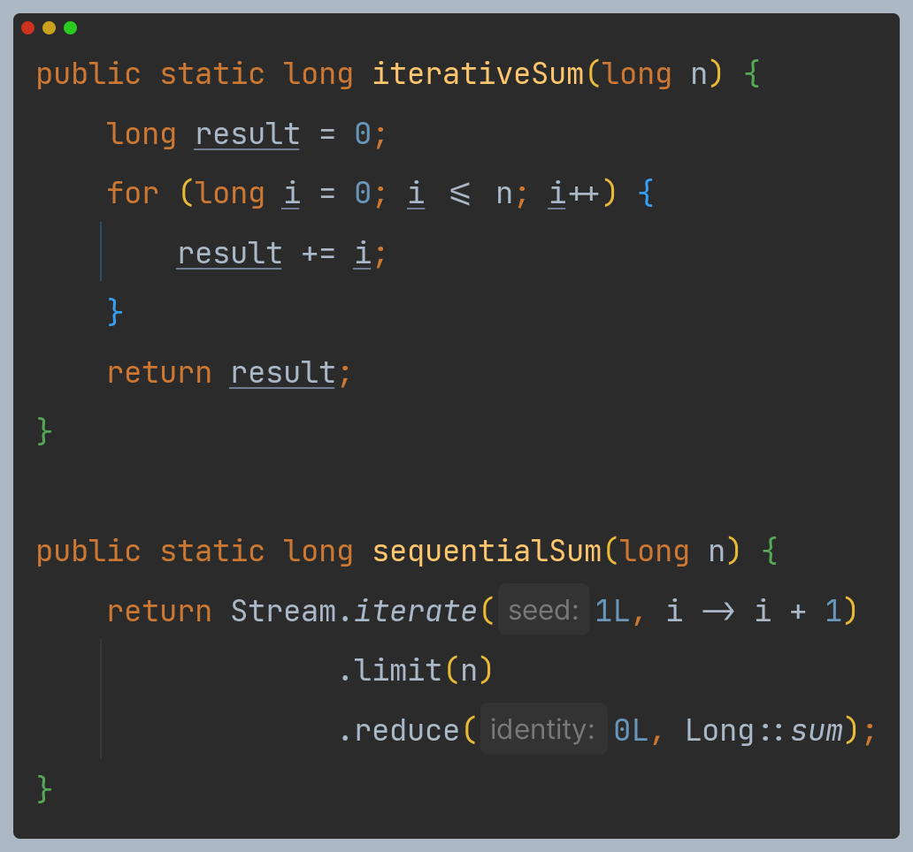

- n이 커진다면 병렬로 처리하는 것이 좋을 것이다.

### 순차 스트림을 병렬 스트림으로 변환하기

- 순차 스트림에 `parallel` 메서드를 호출하면 기존의 함수형 리듀싱 연산(숫자 합계 계산)이 병렬로 처리된다.

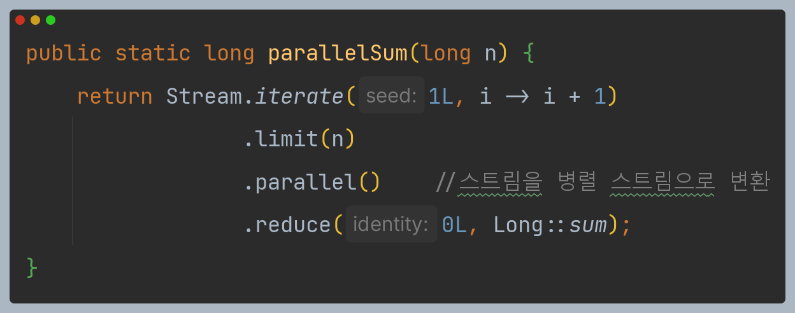

- 병렬 스트림이기 때문에 리듀싱 연산을 여러 청크에 병렬로 수행할 수 있다.
- 리듀싱 연산으로 생성된 부분 결과를 다시 리듀싱 연산으로 합쳐서 전체 스트림의 리듀싱 결과를 도출한다.
- 사실 순차 스트림에 `parallel`을 호출해도 스트림 자체에는 아무 변화도 일어나지 않는다.
- 내부적으로 이후 연산이 병렬로 수행해야 함을 의미하는 `boolean` 플래그가 설정된다.
- 반대로 `sequential`로 병렬 스트림을 순차 스트림으로 바꿀 수 있다. 이 두 메서드를 이용해서
특정 연산을 병렬 또는 순차로 실행할 지 제어할 수 있다.

```text
stream.parallel()
      .filter(...)
      .sequential()
      .map(...)
      .parallel()
      .reduce();
```

- `parallel`과 `sequential` 두 메서드 중 최종적으로 호출된 메서드가 전체 파이프라인에 영향을 미친다.
- 위 예제의 경우 파이프라인의 마지막 호출은 `parallel` 이므로 파이프라인은 전체적으로 병렬로 실행된다.

### 스트림 성능 측정

- JMH를 이용하여 병렬화가 순차나 반복 형식에 비해 성능이 좋아지는지 측정해본다.

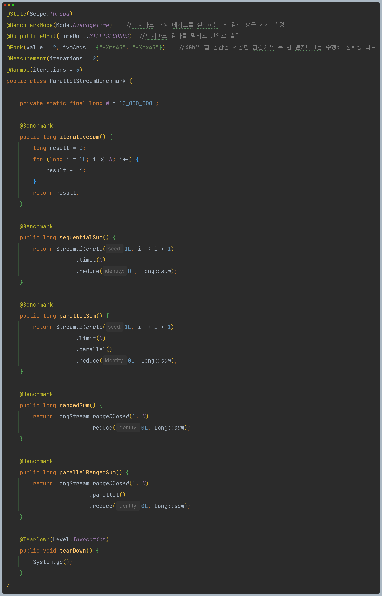


- 전통적인 for 루프를 사용해 반복하는 방법(`iterativeSum`)이 더 저수준으로 동작하며, 특히 기본값을
박싱하거나 언박싱할 필요가 없으므로 순차 스트림(`sequentialSum`)보다는 더 빠를 것이라 예상할 수 있다.
- 하지만 병렬 스트림(`parallelSum`)의 경우 오히려 순차 스트림보다 느린 결과가 나왔다. 두 가지 문제가 있다.
  - **반복 결과로 박생된 객체가 만들어지므로 숫자를 더하려면 언박싱을 해야 한다.**
  - **반복 작업은 병렬로 수행할 수 있는 독립 단위로 나누기가 어렵다.**
- 이전 연산의 결과에 따라 다음 함수의 입력이 달라지기 때문에 `iterate` 연산을 청크로 분할가기가 어렵다.

### 특화된 메서드 사용

- `LongStream.rangeClosed` 메서드는 `iterate`에 비해 다음과 같은 장점을 제공한다.
  - 기본형 `long`을 사용하므로 박싱과 언박싱 오버헤드가 사라진다.
  - 쉽게 청크로 분할할 수 있는 숫자 범위를 생산한다. 예를 들어 `1~20` 범위의 숫자를 각각
    `1~5`, `6~10`, `11~15`, `16~20` 범위의 숫자로 분할할 수 있다.
- 특화된 메서드(`rangedSum`)에 병렬 리듀싱까지 추가해(`parallelRangedSum`) 드디어 순차 실행보다
빠른 성능을 갖는 병렬 리듀싱을 만든 것이다.
- 즉, 올바른 자료구조를 선택해야 병렬 실행도 최적의 성능을 발휘할 수 있다는 사실을 알 수 있다.

### 병렬 스트림의 올바른 사용법

- 병렬 스트림을 잘못 사용하면서 발생하는 많은 문제는 공유된 상태를 바꾸는 알고리즘을 사용하기 때문에 발생한다.

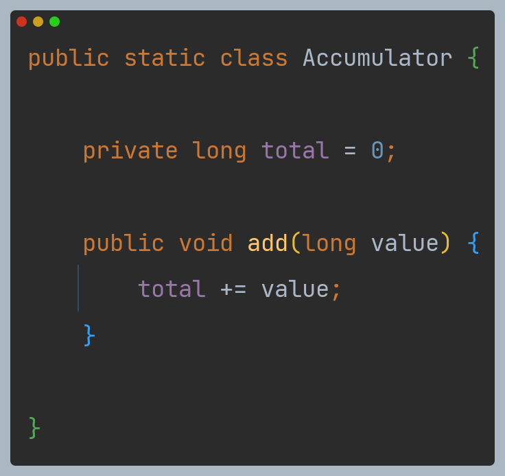

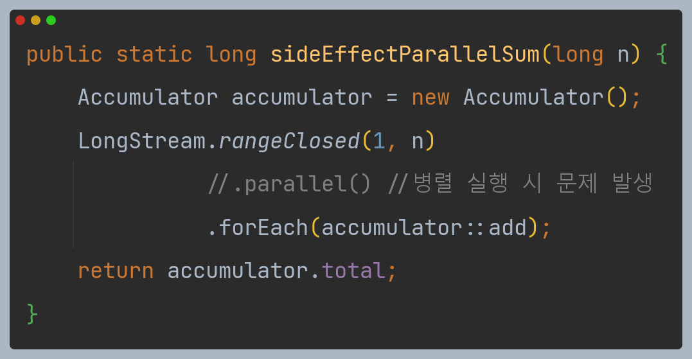

- 위 코드는 순차 실행할 수 있도록 구현되어 있어 병렬로 실행하면 문제가 발생한다.
- `total`에 접근할 때마다 데이터 레이스 문제가 일어난다. 동기화로 문제를 해결하다보면 결국 병렬화라는
특성이 없어질 것이다.
- **병렬 스트림이 올바르게 동작하려면 공유된 가변 상태를 피해야 한다.**

### 병렬 스트림 효과적으로 사용하기

#### 확신이 서지 않으면 직접 측정하자.

- 순차 스트림을 병렬 스트림으로 쉽게 바꿀 수 있다.
- 하지만 언제나 병렬 스트림이 순차 스트림보다 빠른 것은 아니다. 또한 병렬 스트림의 수행 과정은
투명하지 않을 때가 많다.
- 적절한 벤치마크로 직접 성능을 측정하는 것이 바람직하다.

#### 박싱을 주의하자.

- 자동 박싱과 언박싱은 성능을 크게 저하시킬 수 있는 요소다.
- 자바 8은 박싱 동작을 피할 수 있도록 기본형 특화 스트림(`IntStream`, `DoubleStream`, `LongStream`)을 제공하므로, 되도록이면 기본형 
특화 스트림을 사용하는 것이 좋다.

#### 순차 스트림보다 병렬 스트림에서 성능이 떨어지는 연산이 있다.

- 특히 `limit`이나 `findFirst`처럼 요소의 순서에 의존하는 연산을 병렬 스트림에서 수행하려면 
비싼 비용을 치러야 한다.
- 예를 들어 `findAny`는 요소의 순서와 상관없이 연산하므로 `findFirst`보다 성능이 좋다.
- 정렬된 스트림에 `unordered`를 호출하면 비정렬된 스트림을 얻을 수 있다. 스트림에 N개 요소가 있을 때
요소의 순서가 상관없다면 비정렬된 스트림에 `limit`를 호출하는 것이 더 효율적이다.

#### 스트림에서 수행하는 전체 파이프라인 연산 비용을 고려하자.

- 처리해야 할 요소 수가 `N`개, 하나의 요소를 처리하는 데 드는 비용을 `Q`라 하면 전체 스트림 
파이프라인 처리 비용을 `N*Q`로 예상할 수 있다.
- `Q`가 높아진다는 것은 병렬 스트림으로 성능을 개선할 수 있는 가능성이 있음을 의미한다.

#### 소량의 데이터에서는 병렬 스트림이 도움 되지 않는다.

- 소량의 데이터를 처리하는 상황에서는 병렬화 과정에서 생기는 부가 비용을 상쇄할 수 있을 만큼의
이득을 얻지 못한다.

#### 스트림을 구성하는 자료구조가 적절한지 확인하자.

- 예를 들어 `ArrayList`는 `LinkedList`보다 효율적으로 분할할 수 있다. `LinkedList`를 분할하려면
모든 요소를 탐색해야 하지만 `ArrayList`는 요소를 탐색하지 않고도 분할할 수 있기 때문이다.
- 또한 `range` 정적 메서드로 만든 기본형 스트림으로 쉽게 분해할 수 있다.
- 커스텀 `Spliterator`를 구현해서 분해 과정을 완벽하게 제어할 수도 있다.

#### 스트림의 특성과 파이프라인의 중간 연산이 스트림의 특성을 어떻게 바꾸는지에 따라 분해 과정의 성능이 달라질 수 있다.

- 예를 들어 `SIZED` 스트림은 정확히 같은 크기의 두 스트림으로 분할할 수 있으므로 효과적으로
스트림을 병렬 처리할 수 있다.
- 반면 필터 연산이 있으면 스트림의 길이를 예측할 수 없으므로 효과적으로 스트림을 병렬 처리 할 수 있을 지 알 수 없게 된다.

#### 최종 연산의 병합 과정 비용을 살펴보자.

- 병합 과정(예를 들어 `Collector`의 `combine` 메서드)의 비용이 비싸다면 병렬 스트림으로
얻은 성능의 이익이 서브스트림의 부분 결과를 합치는 과정에서 상쇄될 수 있다.

---

## 포크/조인 프레임워크

- 포크/조인 프레임워크는 병렬화할 수 있는 작업을 재귀적으로 작은 작업으로 분할한 다음에 서브 태스크
각각의 결과를 합쳐서 전체 결과를 만들도록 설계되었다.
- 포크/조인 프레임워크에서는 서브태스크를 스레드 풀(`ForkJoinPool`)의 
작업자 스레드에 분산 할당하는 `ExecutorService` 인터페이스를 구현한다.

### RecursiveTask< V >

- 스레드 풀을 이용하려면 `RecursiveTask<V>`의 서브 클래스를 만들어야 한다.
- 여기서 `V`는 병렬화된 태스크가 생성하는 결과 형식 또는 결과가 없을 때는 `RecursiveAction` 형식이다.
- `RecursiveTask`를 정의하려면 추상 메서드 `compute`를 구현해야 한다.
- `compute` 메서드는 태스크를 서브태스크로 분할하는 로직과 더 이상 분할할 수 없을 때 개별
서브태스크의 결과를 생상할 알고리즘을 정의한다.
- 대부분의 `compute` 메서드 구현은 다음과 같은 의사코드 형식을 유지한다.

```text
if(태스크가 충분히 작거나 더 이상 분할할 수 없으면) {
    순차적으로 태스트 계산 
} else {
    태스크를 두 서브태스크로 분할
    태스크가 다시 서브태스크로 분할되도록 이 메서드를 재귀적으로 호출
    모든 서브태스크의 연산이 완료될 때까지 기다림
    각 서브태스크의 결과를 합침
}
```

- 다음은 포크/조인 프레임워크를 이용해서 병렬로 범위의 숫자를 더하는 코드다.

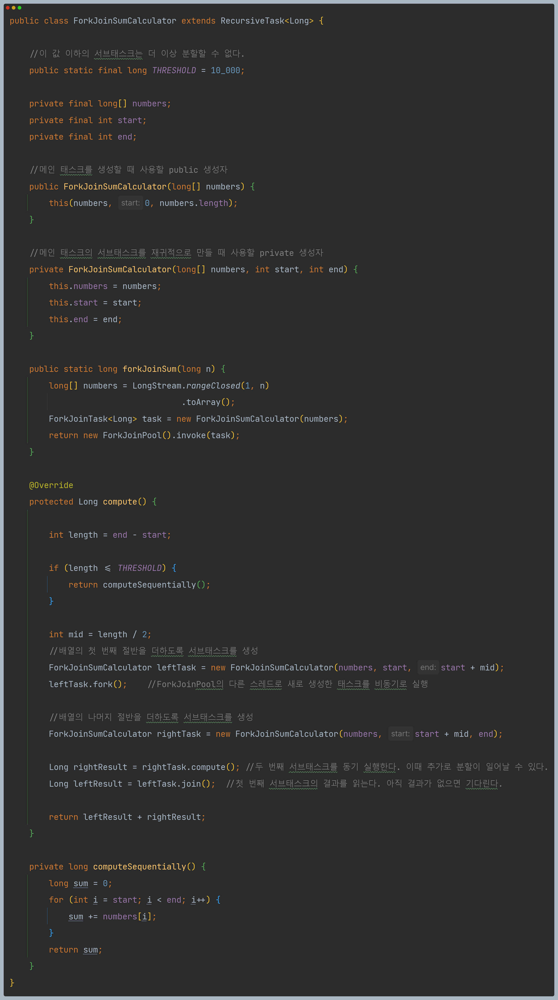

### 포크/조인 프레임워크를 제대로 사용하는 방법

- **`join` 메서드를 태스크에 호출하면 태스크가 생산하는 결과가 준비될 때까지 호출자를 블록시킨다.**
  - 따라서 두 서브태스크가 모두 시작된 다음에 `join`을 호출해야 한다.
  - 그렇지 않으면 각각의 서브태스크가 다른 태스크가 끝나길 기다리는 일이 발생하며 원래 순차 알고리즘보다
   느리고 복잡해진다.
- **`RecursiveTask` 내에서는 `ForkJoinPool`의 `invoke` 메서드를 사용하지 말아야 한다.**
  - 대신 `compute`나 `fork` 메서드를 직접 호출할 수 있다.
  - 순차 코드에서 병렬 계산을 시작할 때만 `invoke`를 사용한다.
- **서브태스크에 `fork` 메서드를 호출해서 `ForkJoinPool`의 일정을 조절할 수 있다.**
  - 왼쪽 작업과 오른쪽 작업 모두에 `fork` 메서드를 호출하는 것이 자연스러울 것 같지만 한쪽 작업에는
    `compute`를 호출하는 것이 효율적이다.
  - 그러면 두 서브태스크의 한 태스크에는 같은 스레드를 재사용할 수 있으므로 풀에서 불필요한 태스크를
    할당하는 오버헤드를 피할 수 있다.
- **포크/조인 프레임워크를 이용하는 병렬 계산은 디버깅이 어렵다.**
  - 포크/조인 프레임워크에서는 `fork`라 불리는 다른 스레드에서 `compute`를 호출하므로 스택 트레이스가
    도움이 되지 않는다.
- **멀티코어에 포크/조인 프레임워크를 사용하는 것이 순차 처리보다 무조건 빠를 거라는 생각은 버려야 한다.**
  - 병렬 처리로 성능을 개선하려면 태스크를 여러 독립적인 서브태스크로 분할할 수 있어야 한다.
    각 서브태스크의 실행시간은 새로운 태스크를 포킹하는 데 드는 시간보다 길어야 한다.
  - 예를 들어 I/O를 한 서브태스크에 할당하고 다른 서브태스크에서는 계산을 실행, 즉 I/O와 계산을
    병렬로 실행할 수 있다.
  - 또한 순차 버전과 병렬 버전의 성능으 비교할 때는 다른 요소도 고려해야 한다.
  - 다른 자바 코드와 마찬가지로 JIT 컴파일러에 의해 최적화되려면 몇 차례의 준비 과정(`warmed up`) 또는
    실행 과정을 거쳐야 한다.
  - 따라서 성능을 측정할 때는 여러 번 프로그램을 실행한 결과를 측정해야 한다.

### [작업 훔치기](https://github.com/genesis12345678/TIL/blob/main/Java/reactive/AsyncProgramming/ForkJoinPool.md#work-stealing)

---

## Spliterator 인터페이스

- 자바 8은 `Spliterator`라는 새로운 인터페이스를 제공한다. "분할할 수 있는 반복자"라는 의미다.
- `Iterator`처럼 소스의 요소 탐색 기능을 제공한다는 점은 같지만 병렬 작업에 특화되어 있다.
- 자바 8은 컬렉션 프레임워크에 포함된 모든 자료구조에 사용할 수 있는 디폴트 `Spliterator` 구현을 제공한다.

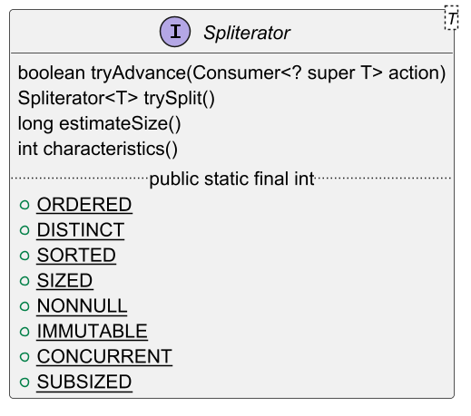

- 여기서 `T`는 `Spliterator`에서 탐색하는 요소의 형식을 가리킨다.
- `tryAdvance` 메서드는 `Spliterator`의 요소를 하나씩 순차적으로 소비하면서 탐색해야 할
요소가 남아있으면 참을 반환한다.
- `trySplit` 메서드는 `Spliterator`의 일부 요소(자신이 반환한 요소)를 분할해서 두 번째
`Spliterator`를 생성하는 메서드다.
- `estimateSize` 메서드는 탐색해야 할 요소 수 정보를 반환한다.

**Spliterator 특성**

| 특성         | 의미                                                                  |
|------------|---------------------------------------------------------------------|
| ORDERD     | 리스트처럼 요소에 정해진 순서가 있으므로 `Spliterator`는 요소를 탐색하고 분할할 때 이 순서에 유의해야 한다. |
| DISTINCT   | x, y 두 요소를 방문했을 때 x.equals(y)는 항상 false를 반환한다.                      |
| SORTED     | 탐색된 요소는 미리 정의된 정렬 순서를 따른다.                                          |
| SIZED      | 크기가 알려진 소스로 `Spliterator`를 생성했으므로 `estimateSize()`는 정확한 값을 반환한다.   |
| NON-NULL   | 탐색하는 모든 요소는 null이 아니다.                                              |
| IMMUTABLE  | 이 `Spliterator`의 소스는 불변이다. 즉, 요소를 탐색하는 동안 요소를 추가, 삭제, 변경할 수 없다.     |
| CONCURRENT | 동기화 없이 `Spliterator`의 소스를 여러 스레드에서 동시에 고칠 수 있다.                      |
| SUBSIZED   | 이 `Spliterator`과 분할되는 모든 `Spliterator`는 `SIZED` 특성을 갖는다.            |

`Spliterator`를 이용하는 프로그램은 이들 특성을 참고해서 `Spliterator`를 더 잘 제어하고 최적화한다.

### 커스텀 Spliterator 구현

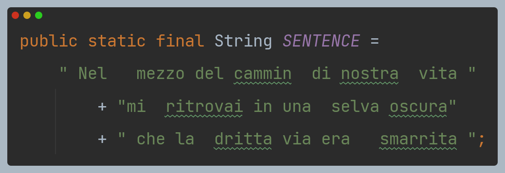

- `Spliterator`를 구현하여 위 문자열의 단어 수를 계산하는 커스텀 클래스를 만들어본다.
- 먼저 다음은 단순 반복문으로 해결하는 버전이다.

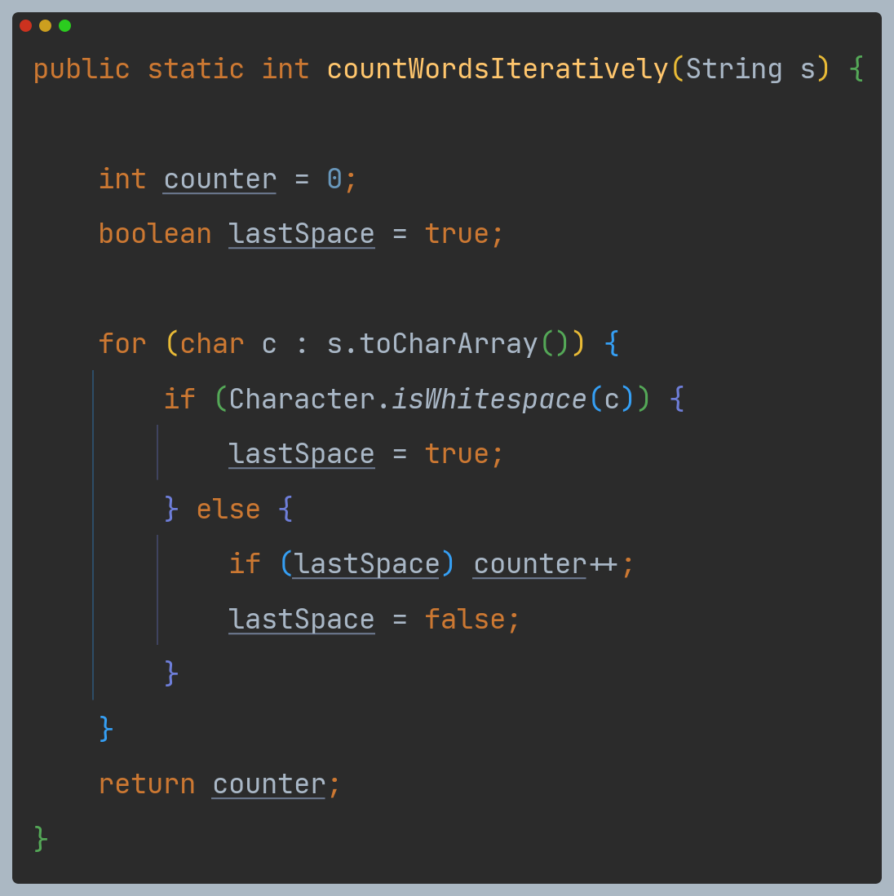

- 다음은 함수형으로 단어 수를 세는 메서드를 구현하기 위해 만든 클래스이다.
- 스트림에 리듀싱 연산을 실행하면서 단어 수를 계산할 수 있다.
- 이때 지금까지 발견한 단어 수와 마지막 문자가 공백이었는지의 상태를 기억해야 하기 때문에
이들 변수 상태를 캡슐화하는 새로운 클래스를 만들어야 한다.

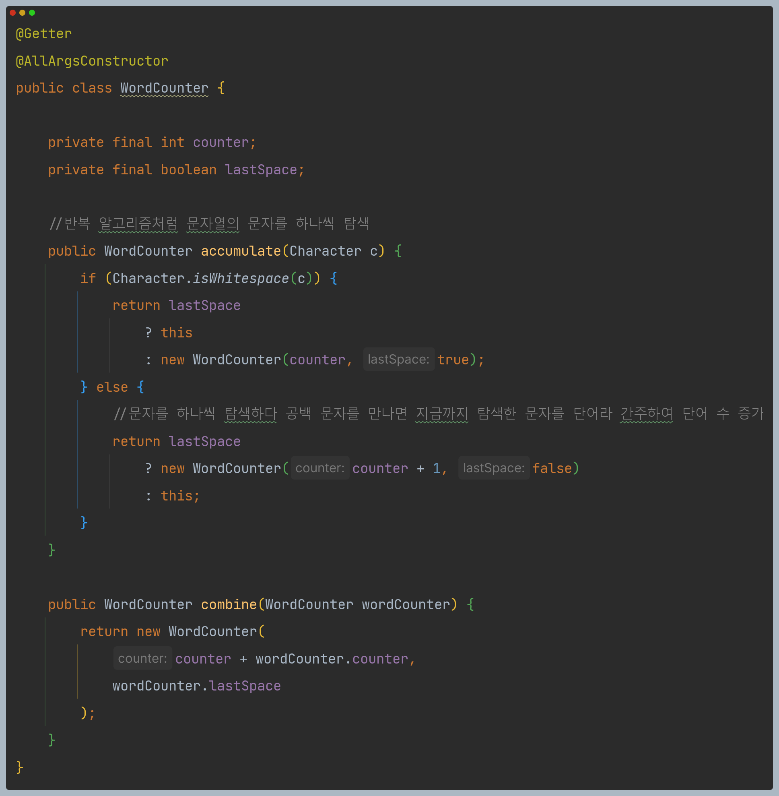

- `accumulate` 메서드는 클래스의 상태를 어떻게 바꿀 것인지 정의한다. (정확히는 불변 클래스이므로
새로운 클래스를 어떤 상태로 생성할 것인지)
- 스트림을 탐색하면서 새로운 문자를 찾을 때마다 `accumulate` 메서드를 호출한다.
- 다음은 이 클래스로 단어 수를 찾기 위한 코드다.


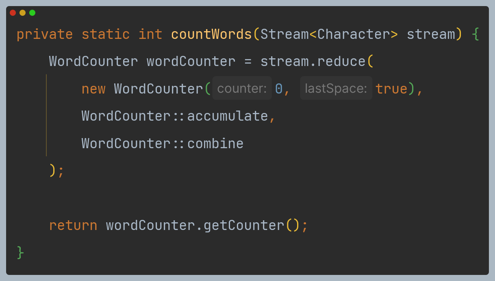

- 하지만 다음과 같이 병렬 스트림으로 변경하면 원하는 결과가 나오지 않는다.


- 원래 문자열을 임의의 위치에서 둘로 나누다보니 예상치 못하게 하나의 단어를 둘로 계산하는
상황이 발생할 수 있다.
- 즉, 순차 스트림을 병렬 스트림으로 바꿀 때 스트림 분할 위치에 따라 잘못된 결과가 나올 수 있다.
- 이 문제를 해결하기 위해 `Spliterator`를 구현하여 문자열을 임의의 위치에서 분할하지 말고
단어가 끝나는 위치에서만 분할하도록 한다.


- `tryAdvance` 메서드는 문자열에서 현재 인덱스에 해당하는 문자를 `Consumer`에 제공한 다음에
인덱스를 증가시킨다.
  - 인수로 전달된 `Consumer`는 스트림을 탐색하면서 적용해야 하는 함수 집합이 작업을 처리할 수 있도록
    소비한 문자를 전달하는 역할을 한다.
  - 이 클래스에서는 스트림을 탐색하면서 하나의 리듀싱 함수, 즉 `WordCounter`의 `accumulate` 메서드만 적용한다.
  - `tryAdvace` 메서드는 새로운 커서 위치가 전체 문자열 길이보다 작으면 참을 반환하며
    이는 반복 탐색해야 할 문자가 남아있음을 의미한다.
- `trySplit`은 반복될 자료구조를 분할하는 로직을 포함하는 가장 중요한 메서드다.
  - 우선 분할 동작을 중단할 한계를 설정해야 한다. 여기서는 아주 작은 한계값(10개)을 설정했지만,
    실전 애플리케이션에서는 너무 많은 태스크를 만들지 않도록 더 높은 한계값을 설정해야 한다.
  - 반대로 분할이 필요한 상황에는 파싱해야 할 문자열 청크의 중간 위치를 기준으로 분할하도록 지시한다.
  - 이때 단어 중간을 분할하지 않도록 빈 문자가 나올 때까지 분할 위치를 이동시킨다.
  - 분할할 위치를 찾았으면 새로운 `Spliterator`를 만든다. 새로 만든 `Splierator`는 현재 위치부터
    분할된 위치까지의 문자를 탐색한다.
- 탐색해야 할 요소의 개수(`estimateSize`)는 `Spliterator`가 파싱할 문자열 전체 길이와
  현재 반복 중인 위치의 차다.
- `characteristics` 메서드는 프레임워크에 `Spliterator`가 `ORDERED`, `SIZED`, `SUBSIZED`, `NONNULL`, `IMMUTABLE`의 특성임을 알려준다.

이제 위 `Spliterator`를 병렬 스트림에 사용할 수 있다.

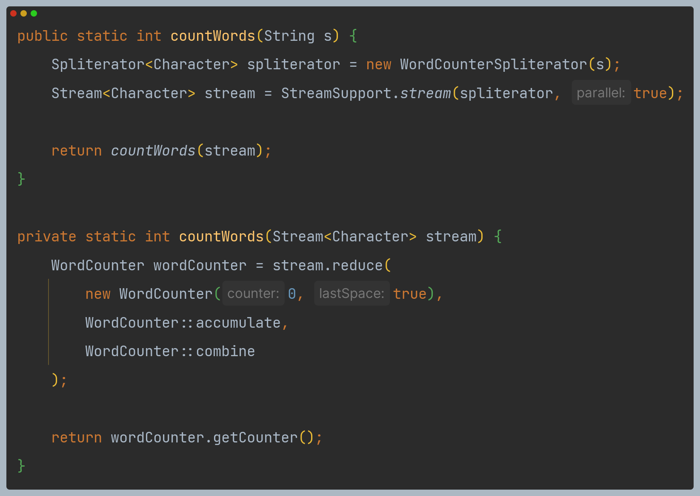

`StreamSupport.stream` 정적 메서드에 전달한 두 번째 `boolean` 인수는 병렬 스트림 생성 여부를 지시한다.