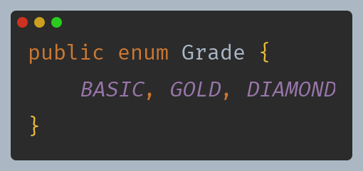
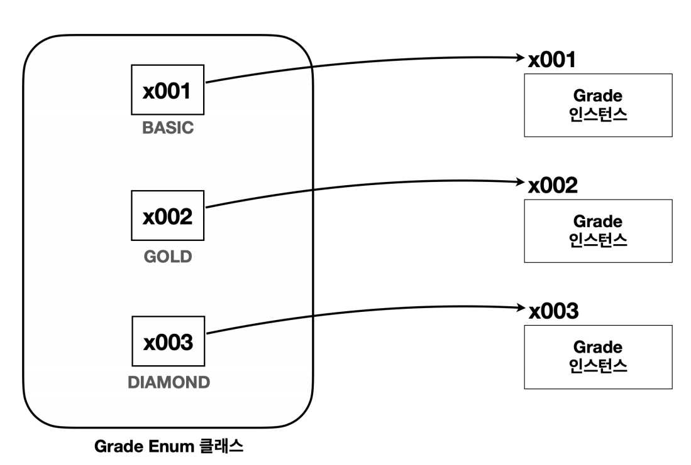
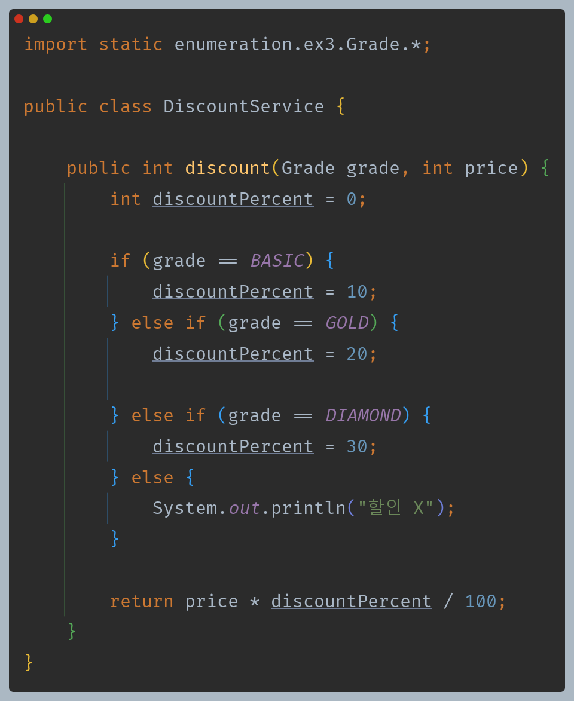
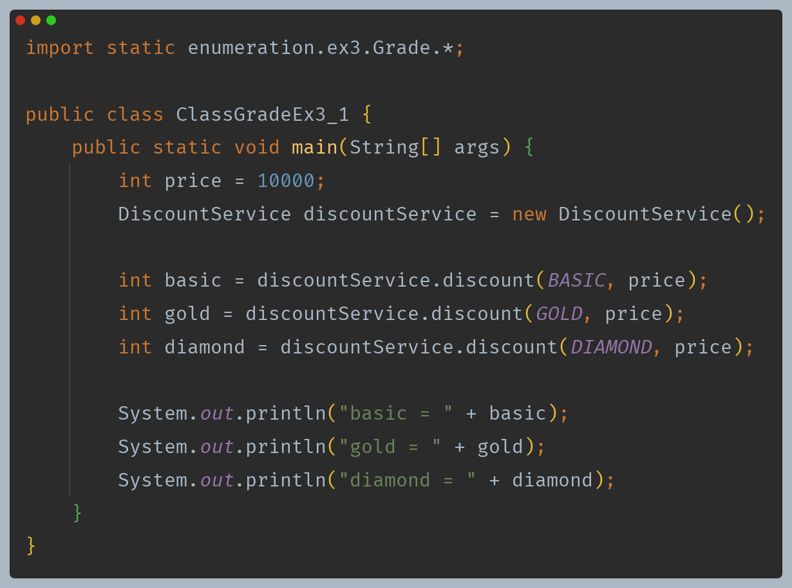
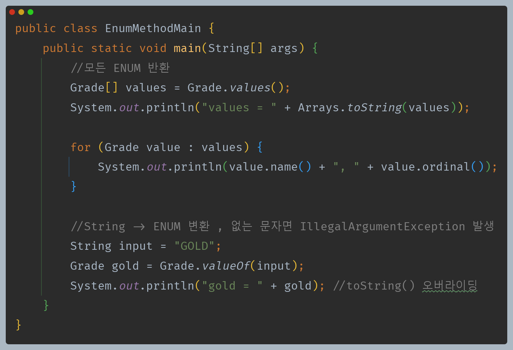
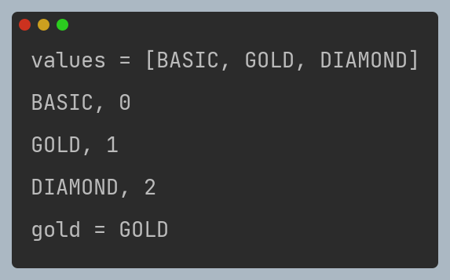

# 자바 - ENUM

## 열거형 - Enum Type

- 자바의 `enum`은 타입 안전성을 제공하고, 코드의 가독성을 높이며, 예상 가능한 값들의 집합을 표현하는 데 사용된다.



- 열거형을 정의할 때는 `class` 대신 `enum`을 사용하며 원하는 상수의 이름을 나열하면 된다.
- 자바의 열거형으로 작성한 코드는 다음과 거의 같다.

```java
public class Grade extends Enum {
    public static final Grade BASIC = new Grade();
    public static final Grade GOLD = new Grade();
    public static final Grade DIAMOND = new Grade();
    
    private Grade() {}
}
```

- 열거형도 클래스이며, 자동으로 `java.lang.Enum`을 상속 받는다.
- 외부에서 임의로 생성할 수 없다.







- **열거형 장점**
  - **타입 안전성 향상** : 열거형은 사전에 정의된 상수들로만 구성되므로, 유효하지 않은 값이 입력될 가능성이 없다. 이런 경우 컴파일 오류가 발생한다.
  - **간결성 및 일관성** : 열거형을 사용하면 코드가 간결하고 명확해지며, 데이터의 일관성이 보장된다.
  - **확장성** : 새로운 타입을 추가하고 싶을 때, ENUM에 새로운 상수를 추가하기만 하면 된다.

---

## 열거형 - 주요 메서드

- 모든 열거형은 `java.lang.Enum` 클래스를 자동으로 상속 받기 때문에 해당 클래스가 제공하는 기능들을 사용할 수 있다.





- `values()` : 모든 ENUM 상수를 포함하는 배열 반환
- `valueOf(String name)` : 주어진 이름과 일치하는 ENUM 상수 반환
- `name()` : ENUM 상수의 이름을 문자열로 반환
- `ordinal()` : ENUM 상수의 선언 순서를 반환
- `toString()` : ENUM 상수의 이름을 문자열로 반환(오버라이딩 가능)

> - 열거형은 `java.lang.Enum` 을 자동으로 상속 받는다.
> - 열거형은 이미 `java.lang.Enum`을 상속 받았기 때문에 추가로 다른 클래스를 상속 받을 수 없다.
> - 열거형은 인터페이스를 구현할 수 있다.
> - 열거형에 추상 메서드를 선언하고, 구현할 수 있다.
>   - 이 경우 익명 클래스와 같은 방식을 사용한다.

---

[이전 ↩️ - 자바(ENUM) - 문자열과 타입 안전성 - ENUM이 생겨난 이유](https://github.com/genesis12345678/TIL/blob/main/Java/mid_1/Enum/TypeSafety.md)

[메인 ⏫](https://github.com/genesis12345678/TIL/blob/main/Java/mid_1/Main.md)

[다음 ↪️ - 자바(ENUM) - 열거형 리팩토링](https://github.com/genesis12345678/TIL/blob/main/Java/mid_1/Enum/Refac.md)