# 자바 - 중첩, 내부 클래스

## 중첩 클래스, 내부 클래스란?

다음과 같이 클래스 안에 클래스를 중첩에서 정의한 클래스를 **중첩 클래스(Nested Class)** 라 한다.

```java
class Outer {
    ...
    //중첩 클래스 
    class Nested {
        ... 
    }
}
```

- 중첩 클래스는 클래스를 정의하는 위치에 따라 분류할 수 있다.

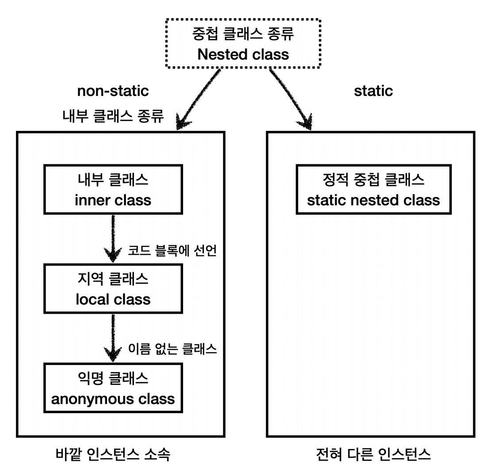

**정적 중첩 클래스**는 바깥 클래스의 안에 있지만 바깥 클래스와 관계 없는 전혀 다른 클래스를 말한다.<br>
**내부 클래스**는 바깥 클래스의 내부에 있으면서 바깥 클래스를 구성하는 요소를 말한다.

- 정적 중첩 클래스는 바깥 클래스와 전혀 다른 클래스이다. 따라서 바깥 클래스의 인스턴스에 소속되지 않는다.
- 내부 클래스는 바깥 클래스를 구성하는 요소이다. 따라서 바깥 클래스의 인스턴스에 속한다.

**중첩 클래스는 언제 사용하나?**
- 내부 클래스를 포함한 모든 중첩 클래스는 특정 클래스가 다른 하나의 클래스 안에서만 사용되거나, 둘이 아주 긴밀하게 연결되어 있는 특별한 경우에만 사용해야 한다.
- 외부의 여러 클래스가 특정 중첩 클래스를 사용한다면 중첩 클래스로 만들면 안된다.

**중첩 클래스를 사용하는 이유**
- **논리적 그룹화** 
  - 특정 클래스가 다른 하나의 클래스 안에서만 사용되는 경우 해당 클래스 안에 포함하는 것이 논리적으로 더 그룹화 된다.
  - 패키지를 열었을 때 다른 곳에서 사용될 필요가 없는 중첩 클래스가 외부에 노출되지 않는 장점도 있다.
- **캡슐화**
  - 중첩 클래스는 바깥 클래스의 `private` 멤버에 접근할 수 있다. 이렇게 해서 둘을 긴밀하게 연결하고 불필요한 `public` 메서드를 제거할 수 있다.

---

## 정적 중첩 클래스

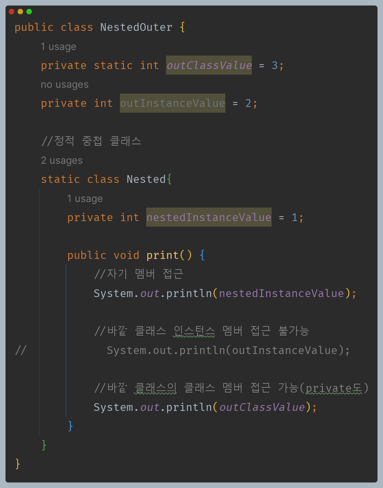

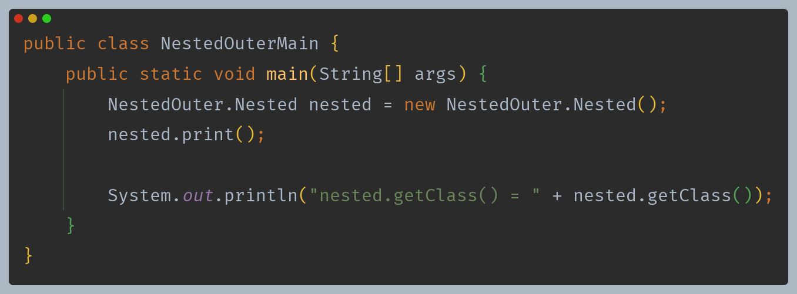


- `new NestedOuter()`로 만든 바깥 클래스의 인스턴스와 `new NestedOuter.Nested()`로 만든 정적 중첩 클래스의 인스턴스는 서로 아무런 관계가 없는 인스턴스이다.
- 단지 클래스 구조상 중첩해 두었을 뿐이다.

**인스턴스가 생성된 상태**


**바깥 클래스의 멤버에 접근**


정적 중첩 클래스는 클래스 두 개를 따로 만든 것과 같으며, 유일한 차이는 정적 중첩 클래스가 바깥 클래스의 `private` 접근 제어자에 접근할 수 있다는 것이다.

## 정적 중첩 클래스 활용

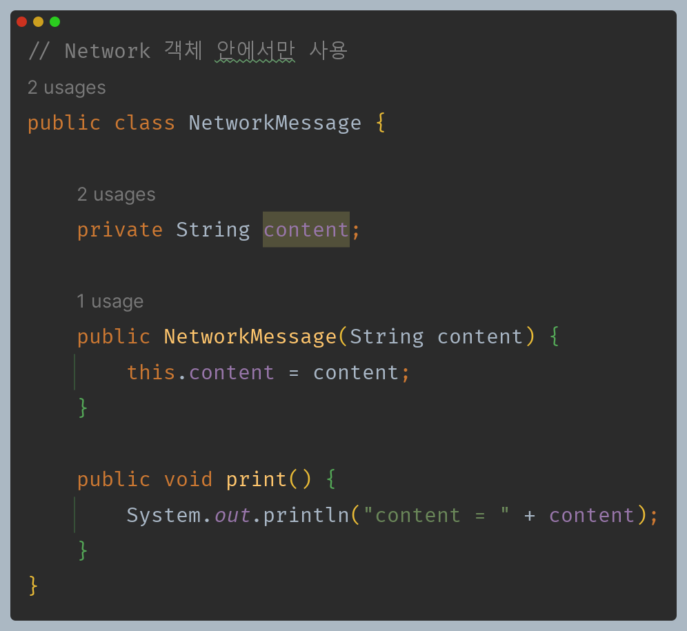


- `main` 코드에서는 `Network` 클래스만 사용하고 `NetworkMessage` 클래스는 오직 `Network` 내부에서만 사용된다.
- 하지만 패키지를 열어보면 두 개의 클래스가 있기 때문에 한번씩은 확인해 봐야 어떻게 동작하는지 파악할 수 있을 것이다.
- 이런 구조를 정적 중첩 클래스로 리팩토링 해볼 수 있다.

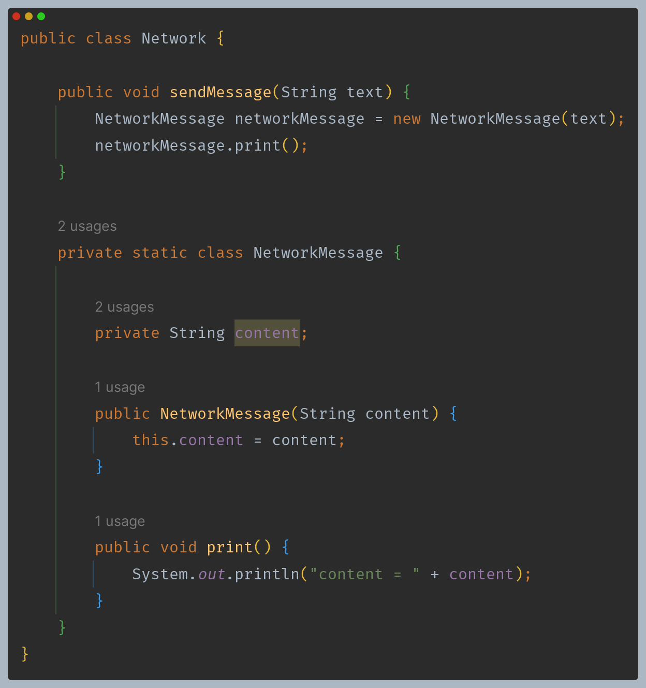

- 정적 중첩 클래스 `NetworkMessage` 의 접근 제어자를 `private`으로 설정했기 때문에 외부에서 이 정적 중첩 클래스에 접근할 수 없다.

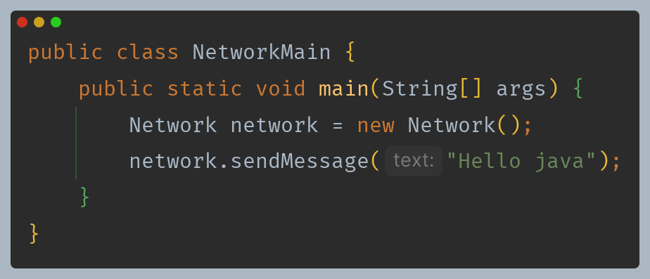


---

## 내부 클래스

- 정적 중첩 클래스는 바깥 클래스와 서로 관계가 없다.
- 하지만 내부 클래스는 바깥 클래스의 인스턴스를 이루는 요소가 된다.


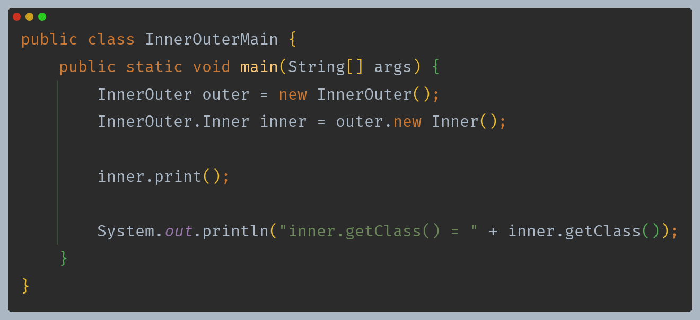


- 내부 클래스는 바깥 클래스의 인스턴스에 소속되기 때문에 바깥 클래스의 인스턴스 정보를 알아야 생성할 수 있다.
- 바깥 클래스의 인스턴스를 먼저 생성해야 내부 클래스의 인스턴스를 생성할 수 있다.

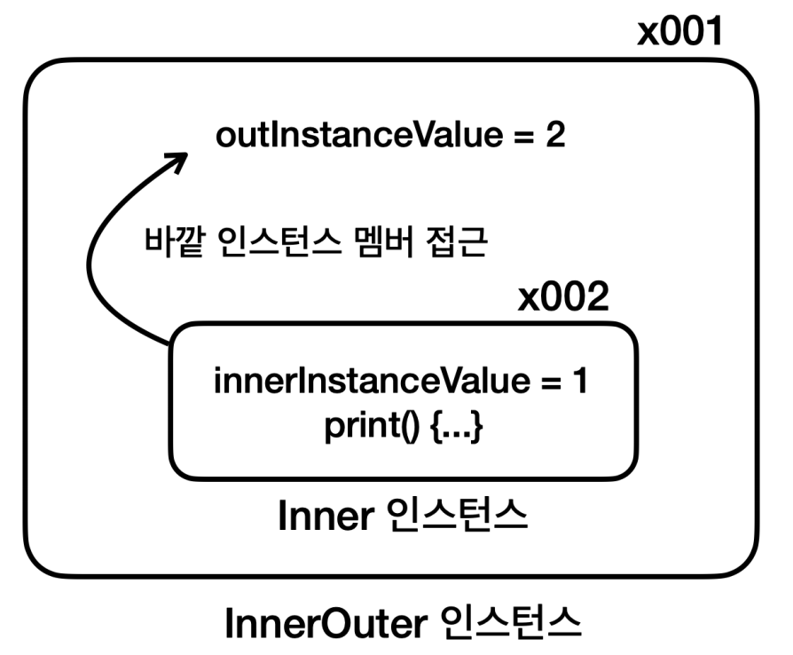

- 개념상 바깥 클래스 인스턴스 내부에서 내부 클래스의 인스턴스가 생성된다.
- 따라서 내부 인스턴스는 바깥 인스턴스를 알기 때문에 바깥 인스턴스의 멤버에 접근할 수 있다.

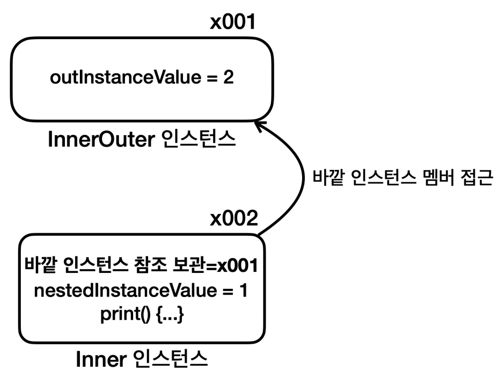

- 실제로는 내부 인스턴스가 바깥 인스턴스 안에 생성되는 것은 아니다.
- 실제로는 내부 인스턴스는 바깥 인스턴스의 참조를 보관하여 이 참조를 통해 바깥 인스턴스의 멤버에 접근할 수 있다.

## 내부 클래스 활용

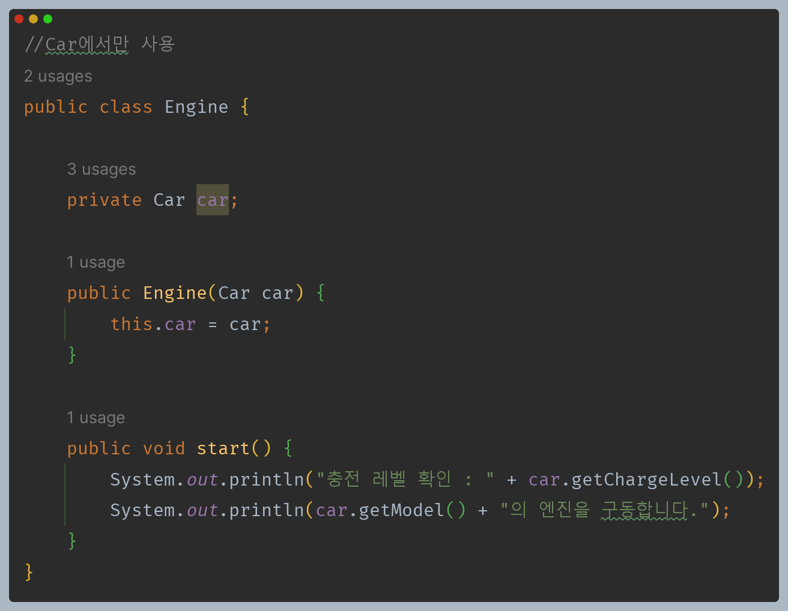

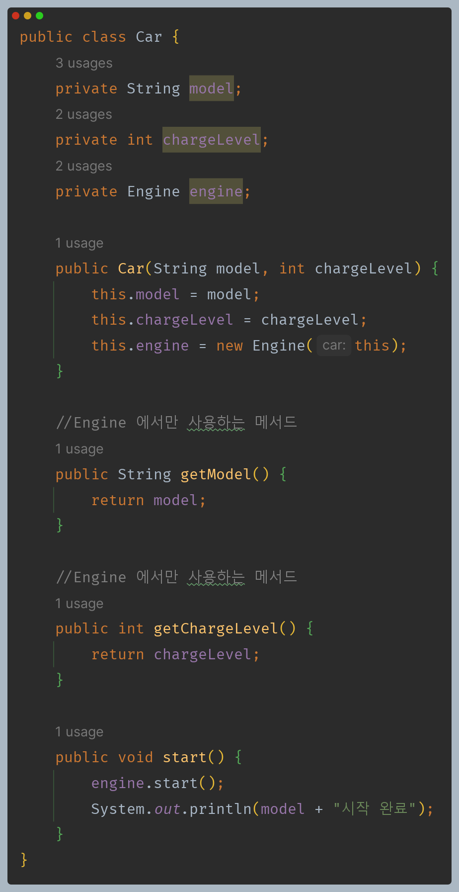

- `Car` 클래스는 `Engine`에서만 사용하는 기능을 위한 메서드(`getter`)를 추가해서, 외부에 노출해야 한다.


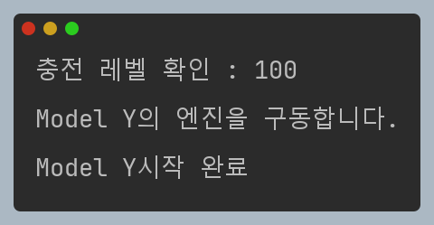

엔진을 차의 내부에서만 사용하도록 내부 클래스로 리팩토링 해보자.

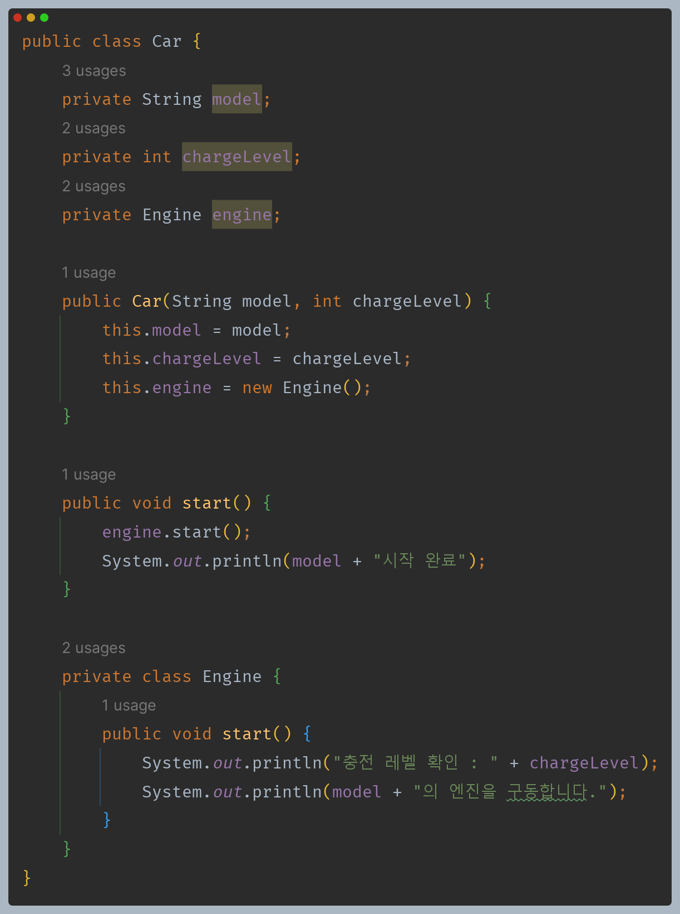

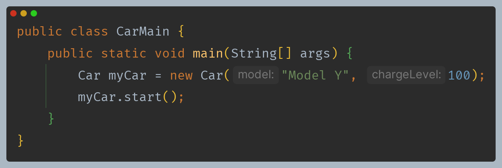

리팩토링 후에는 `getter`와 같은 메서드를 제거했기 때문에 꼭 필요한 메서드만 외부에 노출함으로써 캡슐화를 더 높일 수 있었다.

---

[메인 ⏫](https://github.com/genesis12345678/TIL/blob/main/Java/mid_1/Main.md)

[다음 ↪️ - 자바(중첩, 내부 클래스) - 지역 클래스](https://github.com/genesis12345678/TIL/blob/main/Java/mid_1/Nested/Local.md)