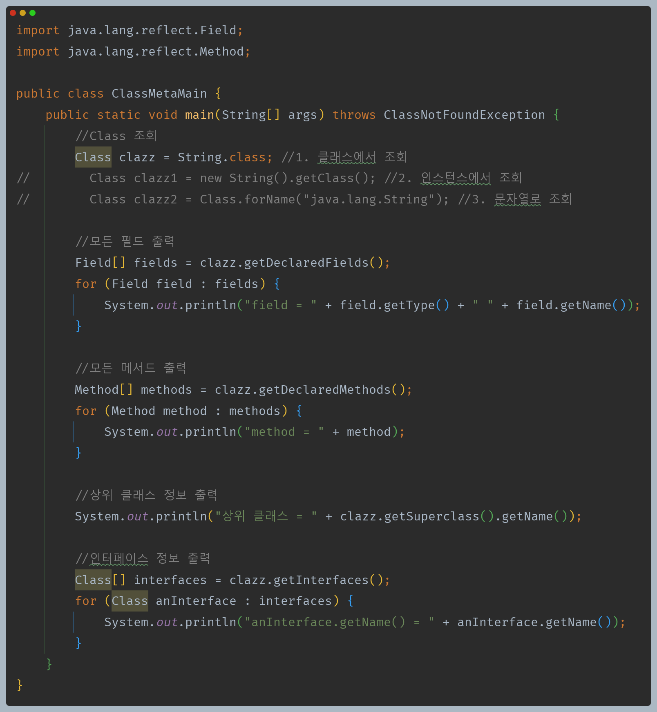
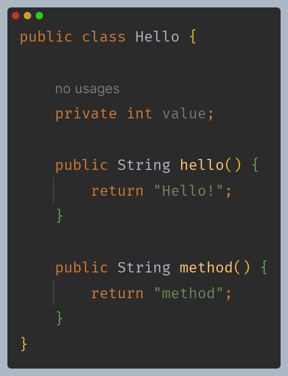
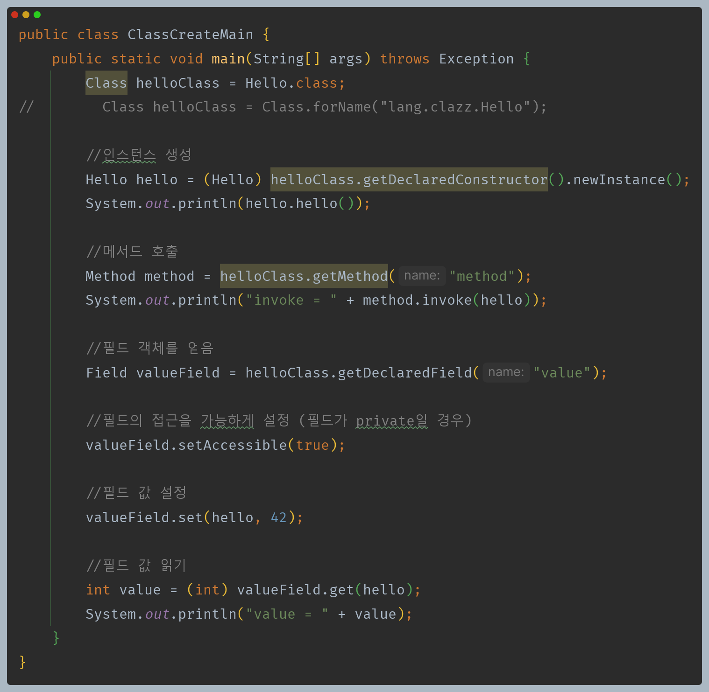
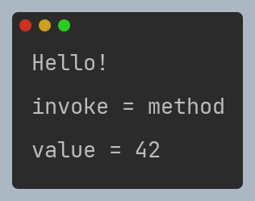

# 자바 - 래퍼, Class 클래스

## Class 클래스

- 자바에서 `Class` 클래스는 클래스의 정보(메타데이터)를 다루는데 사용된다.
- `Class` 클래스를 통해 개발자는 실행 중인 자바 애플리케이션 내에서 필요한 클래스의 속성과 메서드에 대한 정보를 조회하고 조작할 수 있다.
- `Class` 클래스의 주요 기능은 다음과 같다.
  - **타입 정보 얻기** : 클래스 이름, 슈퍼클래스, 인터페이스, 접근 제한자 등과 같은 정보 조회
  - **리플렉션** : 클래스에 정의된 메서드, 필드, 생성자 등을 조회하고 이들을 통해 객체 인스턴스를 생성하거나 메서드를 호출하는 등의 작업을 할 수 있다.
  - **동적 로딩과 생성** : `Class.forName()` 메서드를 사용하여 클래스를 동적으로 로드하고, `newInstance()` 메서드를 통해 새로운 인스턴스를 생성할 수 있다.
  - **애노테이션 처리** : 클래스에 적용된 애노테이션을 조회하고 처리하는 기능을 제공한다.

`Class` 클래스에는 클래스의 모든 정보가 들어있다. 이 정보를 기반으로 인스턴스를 생성하거나, 메서드를 호출하거나, 필드의 값도 변경할 수 있다.

**리플렉션(reflection)**

- `Class`를 사용하면 클래스의 메타 정보를 기반으로 클래스에 정의된 메서드, 필드, 생성자 등을 조회하고 이들을 통해 객체 인스턴스를 생성하거나 메서드를 호출하는 작업을 할 수 있는데, 이런 작업을 **리플렉션** 이라고 한다.
- 또한 애노테이션 정보를 읽어서 특별한 기능을 수행할 수도 있다. 최신 프레임워크들은 이런 기능을 적극 활용한다.

---

[이전 ↩️ - 자바(래퍼 클래스) - 래퍼 클래스]()

[메인 ⏫](https://github.com/genesis12345678/TIL/blob/main/Java/mid_1/Main.md)

[다음 ↪️ - 자바(래퍼 클래스) - System, Random 클래스]()