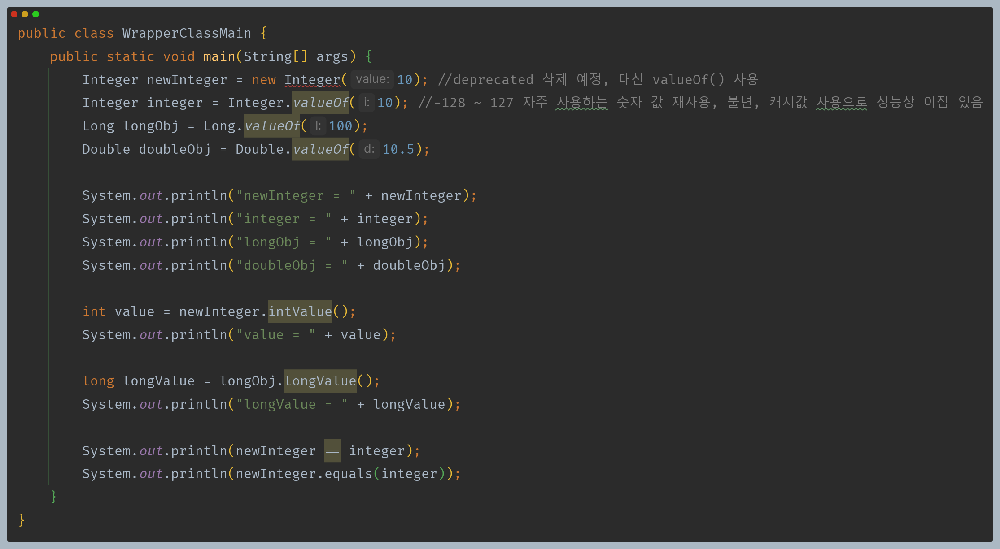
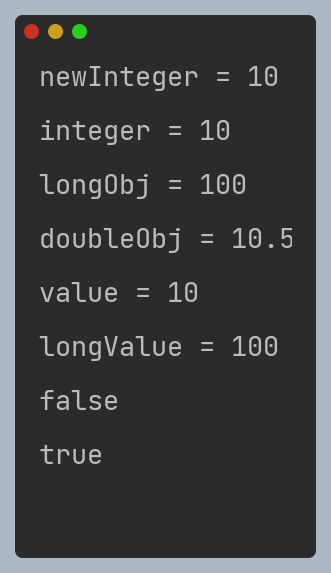
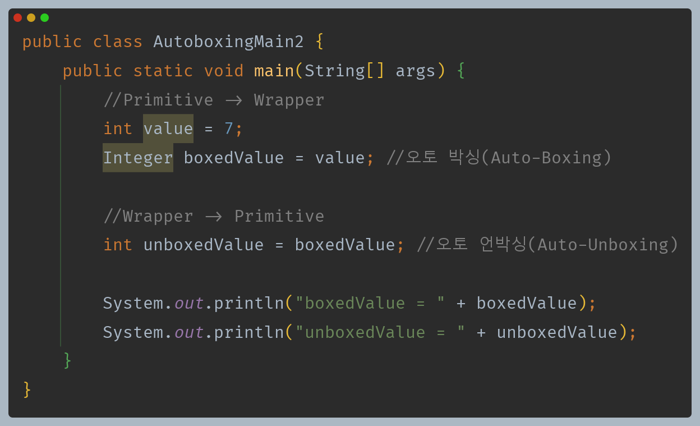
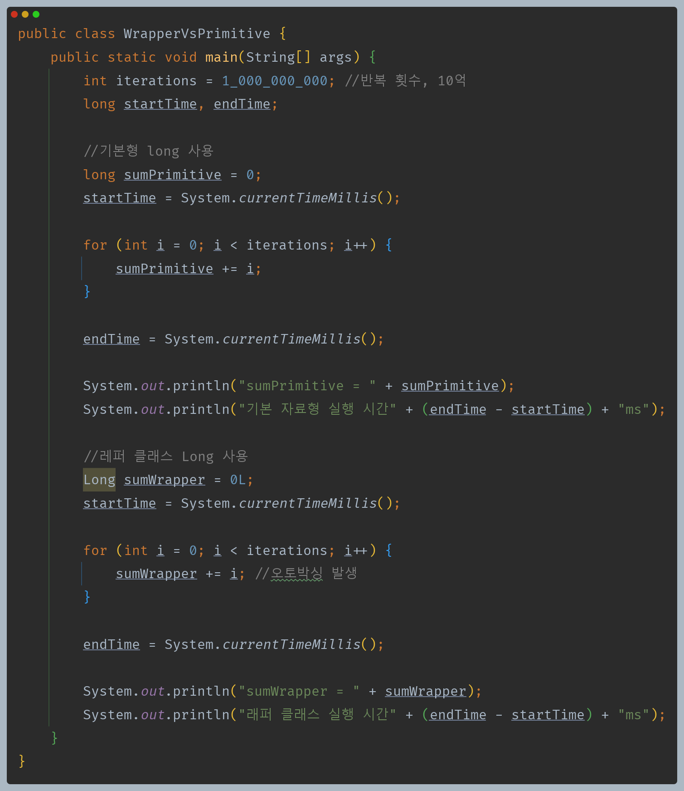
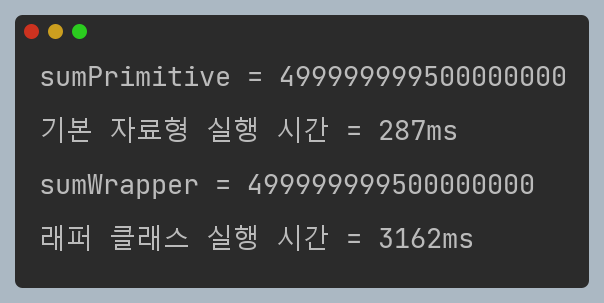

# 자바 - 래퍼, Class 클래스

## 기본형의 한계

- 자바에는 기본형과 참조형이 있고, 기본형은 객체가 아니기 때문에 갖는 한계가 있다.
- **객체가 아니다.**
  - 기본형 데이터는 객체가 아니기 때문에 객체 지향 프로그래밍의 장점을 살릴 수 없다.
  - 예를 들어 메서드를 제공할 수 없다.
  - 객체 참조가 필요한 컬렉션 프레임워크, 제네릭을 사용할 수 없다.
- **`null` 값을 가질 수 없다.**
  - 때로는 데이터가 `없음` 이라는 상태를 나타내야 할 필요가 있는데 기본형은 항상 값을 가지기 때문에 이런 표현을 할 수 없다.

---

## 래퍼 클래스

- 래퍼 클래스는 기본형의 객체 버전으로, 기본형을 객체로 감싸서 더 편리하게 사용하도록 도와준다.
- 자바가 제공하는 기본 래퍼 클래스는 다음과 같은 특징을 가지고 있다.
  - 불변이다.
  - `equals`로 비교해야 한다.



- **래퍼 클래스 생성 - 박싱(Boxing)**
  - 기본형을 래퍼 클래스로 변경하는 것을 **박싱(Boxing)** 이라고 한다.
  - `new Integer()`는 `Deprecated` 되었으니 대신 `valueOf()` 를 사용하면 되고, `valueOf()`는 내부적으로 `new Integer()`를 사용해서 객체를 생성해서 반환한다.
  - 또 `Integer.valueOf()`에는 성능 최적화 기능이 있는데, 일반적으로 자주 사용하는 `-128 ~ 127` 범위의 `Integer` 클래스를 미리 생성해두고 해당 범위의 값을 조회하면 미리 생성된 클래스를 반환한다(문자열 풀 같이).
- **intValue() - 언박싱(UnBoxing)**
  - 래퍼 클래스에 들어있는 기본형 값을 다시 꺼내는 메서드이다.
- **비교는 equals() 사용**
  - 래퍼 클래스는 객체이기 때문에 `==` 비교를 하면 인스턴스의 참조값을 비교한다.
  - 래퍼 클래스는 내부의 값을 비교하도록 `equals()`를 재정의 해두었다.
  - 참고로 `toString()`도 재정의 했기 때문에 객체를 그대로 출력해도 내부에 있는 값을 문자로 출력한다.



---

## 래퍼 클래스 - 오토 박싱


- 위와 같이 `valueOf()`와 `xxxValue()`를 사용해 박싱과 언박싱을 할 수 있다.
- 하지만 이런 박싱과 언박싱을 하는 일은 자주 발생하는데, 매번 직접 해주는 게 많은 불편함이 있었다.
- **그래서 자바는 이런 문제를 해결하기 위해 자바 5부터 오토 박싱, 오토 언박싱을 지원한다.**



- 오토 박싱과 오토 언박싱은 컴파일러가 개발자 대신 `valueOf()`, `xxxValue()` 등의 코드를 추가해주는 기능이다.
- 위 코드는 다음과 동일하게 작동한다.

```java
Integer boxedValue = value; //오토 박싱(Auto-boxing)
Integer boxedValue = Integer.valueOf(value); //컴파일 단계에서 추가 
        
int unboxedValue = boxedValue; //오토 언박싱(Auto-Unboxing)
int unboxedValue = boxedValue.intValue(); //컴파일 단계에서 추가
```

> `valueOf()`는 래퍼 타입을 반환, `parseXxx()`는 기본형을 반환한다.

---

## 래퍼 클래스 성능

- 래퍼 클래스는 객체이기 때문에 기본형보다 다양한 기능을 제공한다.
- 그럼 더 좋은 래퍼 클래스만 제공하면 되지 기본형은 제공하는 이유는 무엇일까?





- 기본형 연산과 래퍼 클래스 연산 시간 차이가 꽤 나는 것을 확인할 수 있다.
- 기본형은 메모리에서 단순히 그 크기만큼의 공간을 차지하고(`int`는 보통 4바이트), 래퍼 클래스의 인스턴스는 내부에 필드로 가지고 있는 기본형의 값 뿐만 아니라
  자바에서 객체 자체를 다루는데 필요한 객체 메타데이터를 포함하므로 더 많은 메모리를 사용한다.(대략 8~16 바이트의 메모리를 추가로 사용)
- **기본형, 래퍼 클래스 어떤 걸 사용해야 할까?**
  - 위 코드는 10억 번 연산했을 때의 결과다. 기본형이든 래퍼 클래스든 1회로 환산하면 둘다 빠르게 수행된다.
  - CPU 연산을 아주 많이 수행하는 특수한 경우이거나, 수만~수십만 이상 연속해서 연산을 수행하는 경우라면 기본형을 사용해서 최적화를 고려할만하다.
  - 그렇지 않은 경우 코드를 유지보수하기 더 나은 것을 선택하면 된다.

---

[메인 ⏫](https://github.com/genesis12345678/TIL/blob/main/Java/mid_1/Main.md)

[다음 ↪️ - 자바(래퍼, Class 클래스) - Class 클래스](https://github.com/genesis12345678/TIL/blob/main/Java/mid_1/Wrapper/Class.md)