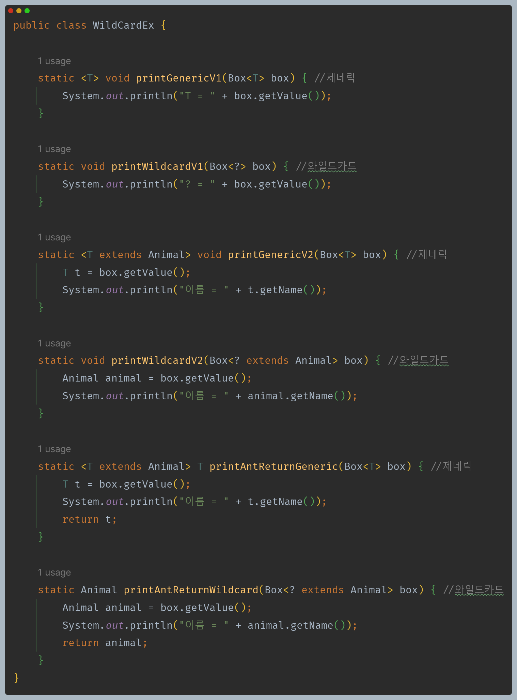
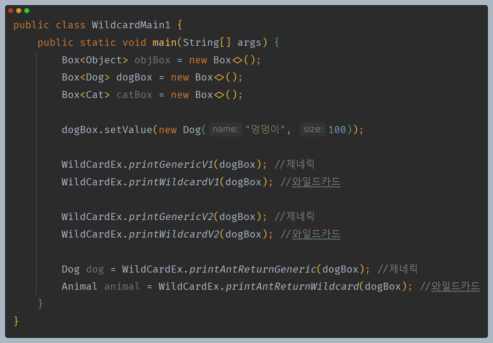
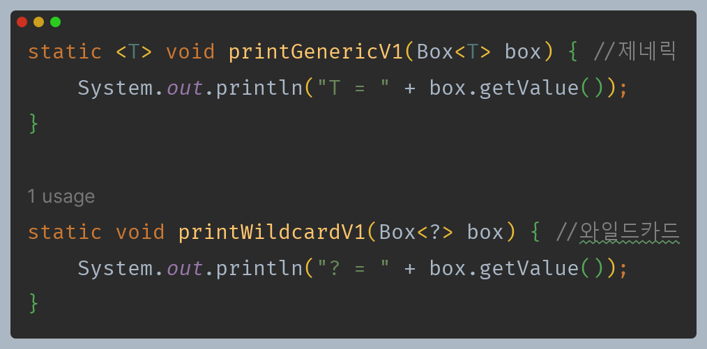
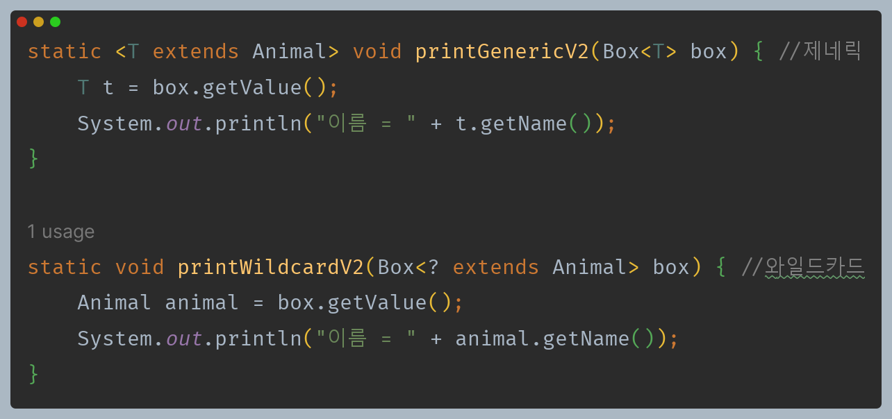
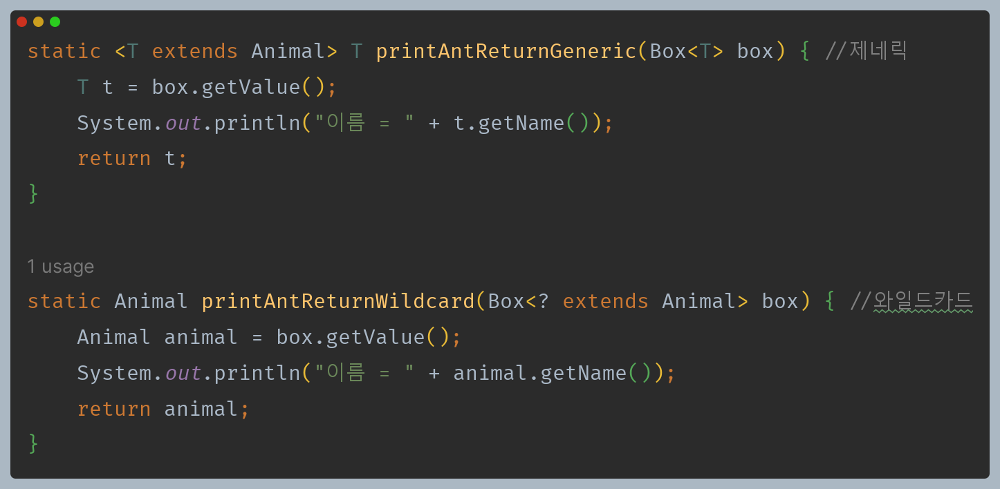
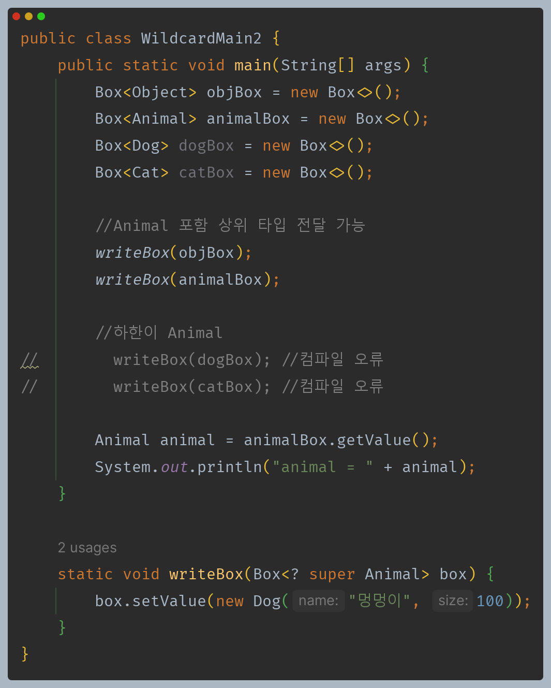

# 자바 - 제네릭

## 와일드카드

- 와일드카드는 제네릭 타입을 조금 더 편리하게 사용할 수 있게 해준다.
- 와일드카드 라는 뜻은 컴퓨터 프로그래밍에서 `?`, `*`와 같이 하나 이상의 문자들을 상징하는 특수 문자를 뜻한다.


단순히 데이터를 넣고 반환하는 제네릭 타입





> **와일드카드는 제네릭 타입이나 제네릭 메서드를 선언하는 것이 아니다. 와일드카드는 이미 만들어진 제네릭 타입을 활용할 때 사용한다.**

---

**비제한 와일드카드**



- 두 메서드는 비슷한 기능을 하는 코드이다. 하나는 제네릭 메서드를, 하나는 일반적인 메서드에 와일드카드를 사용했다.
- 와일드카드는 제네릭 타입이나 제네릭 메서드를 정의할 때 사용하는 것이 아니다. 타입 인자가 정해진 제네릭 타입을 전달 받아서 활용할 때 사용한다.
- 와일드카드인 `?`는 모든 타입을 다 받을 수 있다는 뜻으로 `<? extends Object>`와 같다.
- 이렇게 `?`만 사용해서 제한 없이 모든 타입을 다 받을 수 있는 와일드카드를 비제한 와일드카드라 한다.

_제네릭 메서드 실행 예시_

```java
//1. 전달
printGenericV1(dogBox)

//2. 제네릭 타입 결정 dogBox는 Box<Dog> 타입, 타입 추론 -> T의 타입은 Dog 
static <T> void printGenericV1(Box<T> box) {
    System.out.println("T = " + box.get()); 
}

//3. 타입 인자 결정
static <Dog> void printGenericV1(Box<Dog> box) {
    System.out.println("T = " + box.get());
}

//4. 최종 실행 메서드
static void printGenericV1(Box<Dog> box) {
    System.out.println("T = " + box.get());
}
```

_와일드카드 실행 예시_
```java
//1. 전달
printWildcardV1(dogBox)

//이것은 제네릭 메서드가 아니다. 일반적인 메서드이다.
//2. 최종 실행 메서드, 와일드카드 ?는 모든 타입을 받을 수 있다. 
static void printWildcardV1(Box<?> box) {
    System.out.println("? = " + box.get()); 
}
```

**제네릭 메서드 vs 와일드카드**
- 와일드카드는 일반적인 메서드에 사용할 수 있고, 단순히 매개변수로 제네릭 타입을 받을 수 있는 것 뿐이다.
- 제네릭 메서드처럼 타입을 결정하거나 복잡하게 작동하지 않는다.
- 단순히 일반 메서드에 제네릭 타입을 받을 수 있는 매개변수가 하나 있는 것 뿐이다.
- 제네릭 타입이나 제네릭 메서드를 정의하는 게 꼭 필요한 상황이 아니라면 더 단순한 와일드카드 사용을 권장한다.

---

**상한 와일드카드**



- 제네릭 메서드와 마찬가지로 와일드카드에도 상한 제한을 둘 수 있다.

---

**타입 매개변수가 필요한 이유**

- 와일드 카드는 제네릭을 정의할 때 사용하는 것이 아니라 타입 인자가 전달된 제네릭 타입을 활용할 때 사용한다.
- 따라서 다음과 같은 경우에는 제네릭 타입이나 제네릭 메서드를 사용해야 문제를 해결할 수 있다.



- 제네릭 메서드는 전달한 타입을 명확하게 반환할 수 있다.
- 반면 와일드카드의 경우 전달한 타입을 명확하게 반환할 수 없다.

**메서드의 타입들을 특정 시점에 변경하려면 제네릭 타입이나, 제네릭 메서드를 사용해야 한다.**
- 와일드카드는 이미 만들어진 제네릭 타입을 전달 받아서 활용할 때 사용한다.
- 따라서 메서드의 타입들을 타입 인자를 통해 변경할 수 없다.
- 즉 일반적인 메서드에 사용한다고 생각하면 된다.

제네릭 타입이나 제네릭 메서드가 꼭 필요한 상황이면 `<T>`를 사용하고, 그렇지 않은 상황이면 와일드카드를 사용하는 것을 권장한다.

---

> **기타 - 하한 와일드카드**
> 
> 
> 
> - 와일드카드는 상한 뿐만 아니라 하한도 지정할 수 있다.
> - `?`가 `Animal` 타입을 포함한 `Animal` 타입의 상위 타입만 입력 받을 수 있다는 뜻이다.
> - 참고로 하한은 제네릭 타입이나 제네릭 메서드에는 사용할 수 없고 와일드카드에서만 사용할 수 있다.

---

[이전 ↩️ - 자바(제네릭) - 제네릭 메서드](https://github.com/genesis12345678/TIL/blob/main/Java/mid_2/generic/%EB%A9%94%EC%84%9C%EB%93%9C.md)

[메인 ⏫](https://github.com/genesis12345678/TIL/blob/main/Java/mid_2/Main.md)

[다음 ↪️ - 자바(제네릭) - 타입 이레이저](https://github.com/genesis12345678/TIL/blob/main/Java/mid_2/generic/%EC%9D%B4%EB%A0%88%EC%9D%B4%EC%A0%80.md)