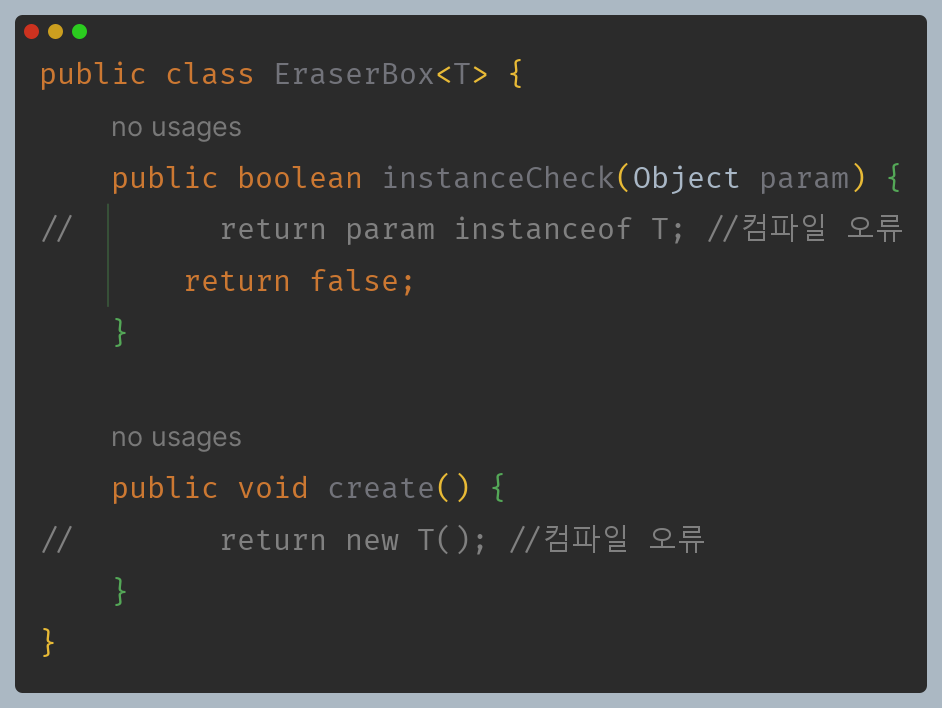

# 자바 - 제네릭

## 타입 이레이저

- 제네릭은 자바 컴파일 단계에서만 사용되고, 컴파일 이후에는 제네릭 정보가 삭제된다. 제네릭에 사용한 타입 매개변수가 모두 사라지는 것이다.
- 즉 컴파일 전인 `.java`에는 제네릭의 타입 매개변수가 존재하지만, 컴파일 이후인 자바 바이트코드 `.class` 에는 타입 매개변수가 존재하지 않는 것이다.

타입 이레이저는 대략 다음과 같은 방식으로 작동한다.

**제네릭 타입 선언**
```java
public class GenericBox<T> { 
    private T value;
    
    public void set(T value) { 
        this.value = value;
    }
    public T get() { 
        return value;
    } 
}
```

**제네릭 타입에 타입 인자 전달**
```java
void main() {
    GenericBox<Integer> box = new GenericBox<Integer>(); 
    box.set(10);
    Integer result = box.get(); 
}
```

이렇게 하면 자바 컴파일러는 컴파일 시점에 타입 매개변수와 타입 인자를 포함한 제네릭 정보를 활용해서 다음과 같이 이해한다.

```java
public class GenericBox<Integer> {
    private Integer value;
    
    public void set(Integer value) {
        this.value = value;
    }
    
    public Integer get() {
        return value;
    }
}
```

컴파일이 모두 끝나면 자바는 제네릭과 관련된 정보를 삭제한다. 이때 `.class` 에 생성된 정보는 다음과 같다.

**컴파일 후**
```java
public class GenericBox {
    private Object value;

    public void set(Object value) {
        this.value = value;
    }

    public Object get() {
        return value;
    }
}
```

상한 제한 없이 선언한 타입 매개변수 `T`는 `Object`로 변환된다.

```java
void main() {
    GenericBox box = new GenericBox(); 
    box.set(10);
    Integer result = (Integer) box.get(); //컴파일러가 캐스팅 추가 
}
```

- 값을 반환 받는 부분을 `Object`로 받으면 안도니다. 자바 컴파일러는 제네릭에서 타입 인자로 지정한 타입으로 캐스팅하는 코드를 추가해준다.
- 이렇게 추가된 코드는 자바 컴파일러가 이미 검증하고 추가했기 때문에 문제가 발생하지 않는다.

---

**타입 매개변수를 제한하면 제한한 타입으로 코드를 변경한다.**

- 타입 매개변수를 제한하면 `T`의 타입 정보가 제거되어도 상한으로 지정한 타입으로 대체되기 때문에 상한으로 지정한 타입의 메서드를 사용하는데는 문제가 없다.
- 그리고 반환 받는 부분은 상한으로 지정한 타입으로 받으면 안되기 때문에 자바 컴파일러가 타입 인자로 지정한 타입으로 캐스팅하는 코드를 넣어준다.

자바의 제네릭은 단순하게 생각하면 개발자가 직접 캐스팅 하는 코드를 컴파일러가 대신 처리해주는 것이다. 자바는 컴파일 시점에 제네릭을 사용한 코드에 문제가 없는지
완벽하게 검증하기 때문에 자바 컴파일러가 추가하는 다운 캐스팅에는 문제가 발생하지 않는다.

자바의 제네릭 타입은 컴파일 시점에만 존재하고, 런타임 시에는 제네릭 정보가 지워지는데 이것을 **타입 이레이저**라 한다.

---

**타입 이레이저 방식의 한계**

- 컴파일 이후에는 제네릭의 타입 정보가 존재하지 않는다.
- `.class`로 자바를 실행하는 런타임에는 직접 지정한 타입 정보가 모두 제거된다.
- 따라서 런타임에 타입을 활용하는 다음과 같은 코드는 작성할 수 없다.

**소스 코드**



- 여기서 `T`는 런타임에 모두 `Object`가 되어버린다.
- `instanceof`는 항상 `Object`와 비교하게 되고, `new T`는 항상 `new Object`가 되어버린다.
- 자바는 이런 문제 때문에 타입 매개변수에 `instanceof`와 `new`를 허용하지 않는다.

**런타임**
```java
class EraserBox {
    public boolean instanceCheck(Object param) {
        return param instanceof Object; // 오류
    }
    public void create() {
        return new Object(); // 오류
    }
}
```

---

[이전 ↩️ - 자바(제네릭) - 와일드카드]()

[메인 ⏫](https://github.com/genesis12345678/TIL/blob/main/Java/mid_2/Main.md)