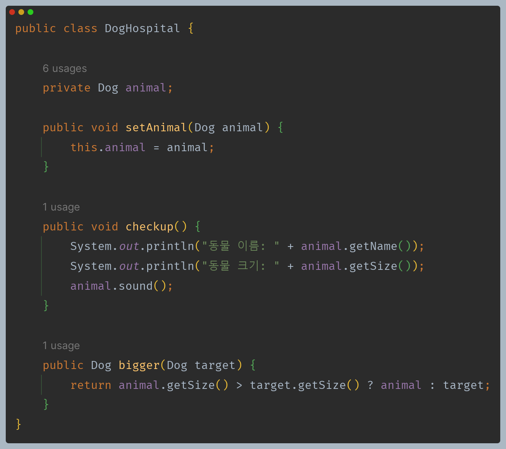
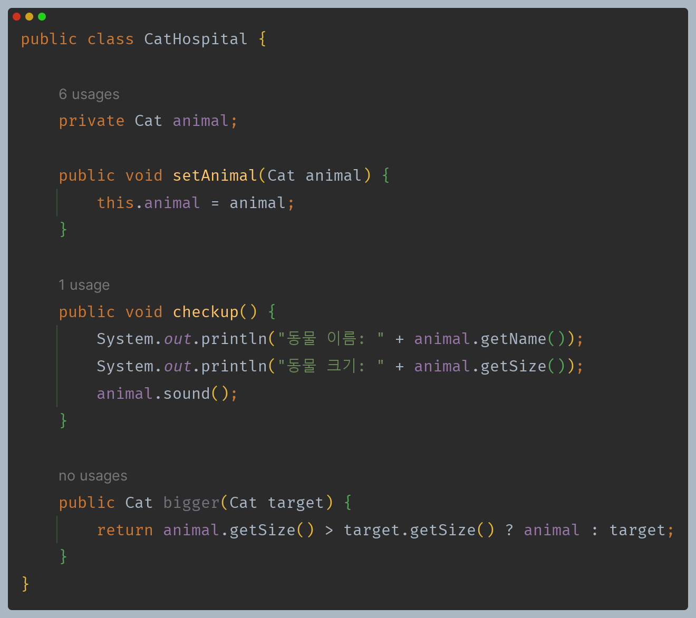
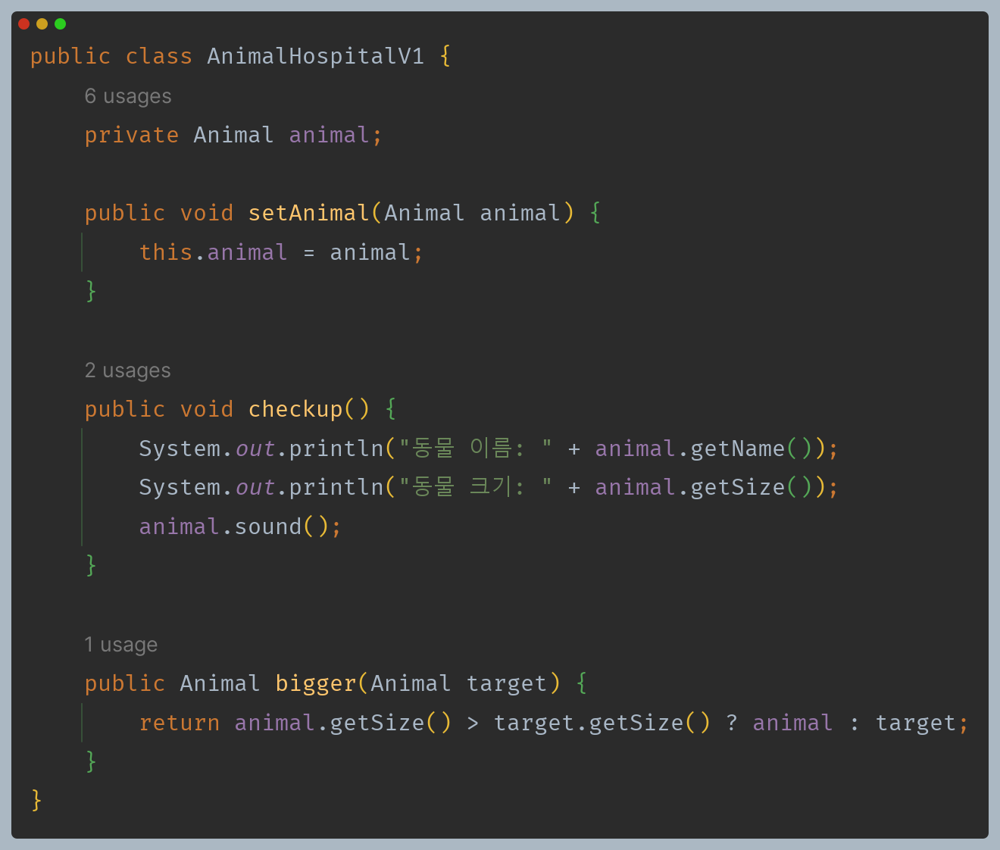
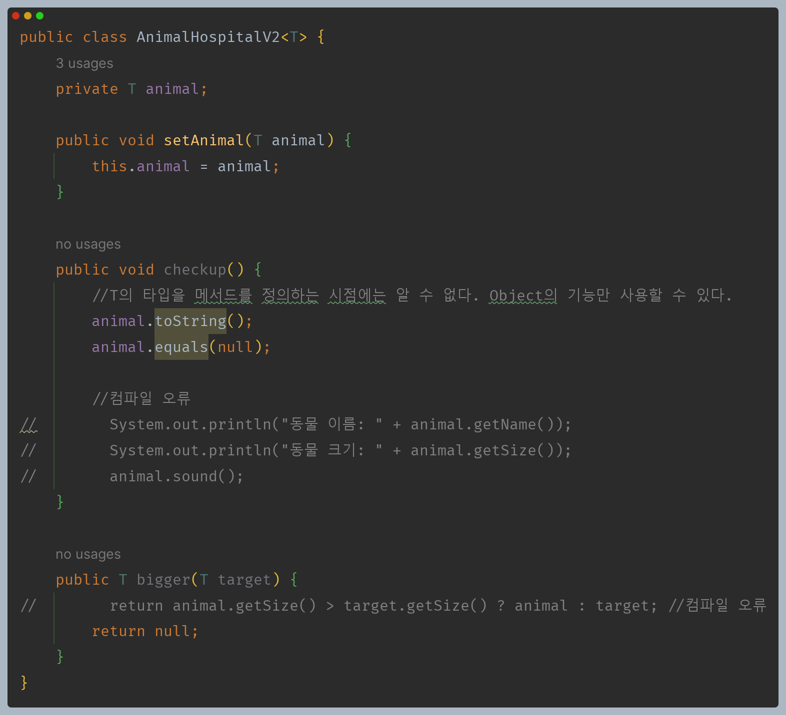
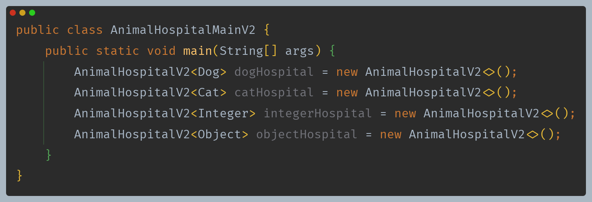
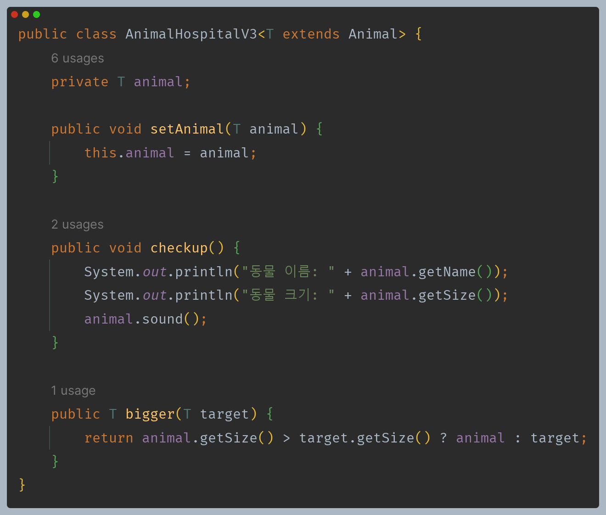
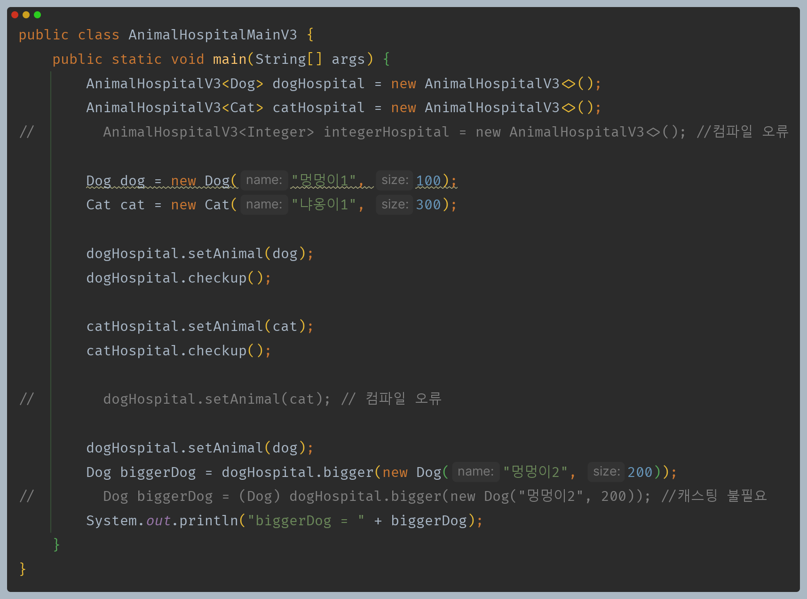

# 자바 - 제네릭

## 타입 매개변수 제한

`Dog`와 `Cat`을 담고 정보를 출력할 수 있는 메서드와 크기 비교를 하는 메서드가 있는 클래스가 있다.

각각 별도의 클래스로 만들었기 때문에 타입 안전성은 명확하게 지킬 수 있지만, 코드 재사용성이 떨어진다.

---

**`Animal` 이라는 부모 타입으로 다형성을 사용해 중복을 제거해보자.**

- 다형성을 사용하여 중복을 제거했지만 문제가 있다.
- `set()`이 부모 타입인 `Animal`을 받기 때문에 `Dog`와 `Cat` 상관없이 들어올 수 있다. 즉, 타입 안전성을 지킬 수 없다.
- 반환 타입도 마찬가지로 부모 타입인 `Animal`이기 때문에 위험한 다운 캐스팅이 필요하다.

---

**이번에는 제네릭을 사용하여 문제를 해결해보자.**

- 앞서 배운 대로 제네릭을 적용했지만 문제가 있다.
- `T`의 타입이 메서드를 정의하는 시점에는 알 수 없기 때문에 메서드에서는 `Object`의 기능만 사용할 수 있다.
- 자바 컴파일러는 어떤 타입이 들어올 지 알 수 없기 때문에 `T`를 어떤 타입이든 받을 수 있는 `Object` 타입으로 가정한다.

- 문제가 한 가지 더 있다.
- 제네릭에서 타입 매개변수를 사용하면 어떤 타입이든 들어올 수 있다.
- 따라서 타입 매개변수를 어떤 타입이든 수용할 수 있는 `Object`로 가정하고 `Object`의 기능만 사용할 수 있다.

---

**타입 매개변수를 특정 타입으로 제한할 수 있다.**

- `<T extends Animal>` 가 핵심이다.
- 타입 매개변수 `T`를 `Animal`과 그 자식만 받을 수 있도록 제한을 두는 것이다. 즉 `T`의 상한이 `Animal`이 되는 것이다.
- 이렇게 하면 타입 인자로 들어올 수 있는 값이 `Animal`과 그 자식으로 제한된다.
- 이제 자바 컴파일러는 `T`에 입력될 수 있는 값의 범위를 예측할 수 있기 때문에 부모 클래스의 기능을 사용할 수 있게 되는 것이다.

제네릭에 타입 매개변수 상한을 사용해서 타입 안전성을 지키면서 상위 타입의 원하는 기능까지 사용할 수 있었다.

---

[이전 ↩️ - 자바(제네릭) - 제네릭](https://github.com/genesis12345678/TIL/blob/main/Java/mid_2/generic/%EC%A0%81%EC%9A%A9.md)

[메인 ⏫](https://github.com/genesis12345678/TIL/blob/main/Java/mid_2/Main.md)

[다음 ↪️ - 자바(제네릭) - 제네릭 메서드](https://github.com/genesis12345678/TIL/blob/main/Java/mid_2/generic/%EB%A9%94%EC%84%9C%EB%93%9C.md)