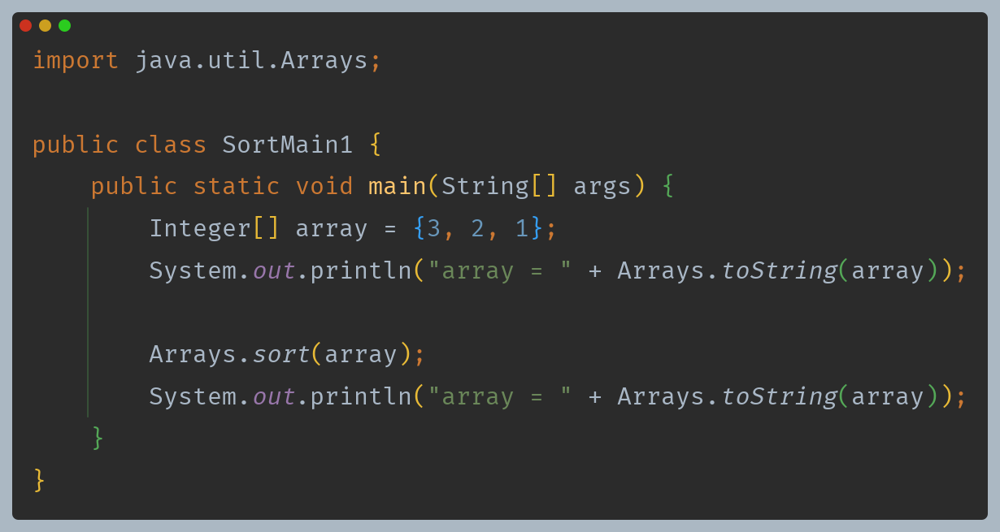
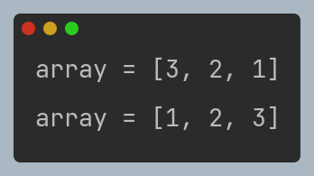
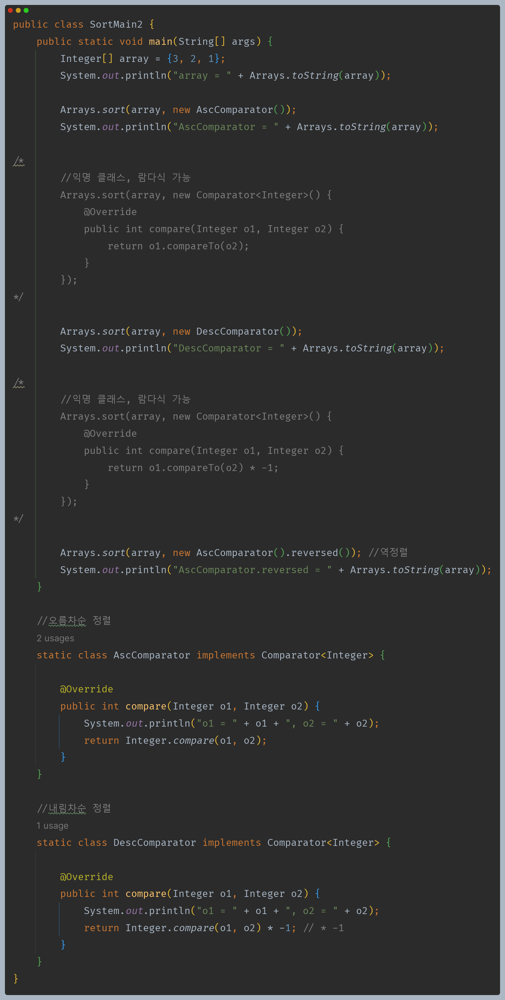
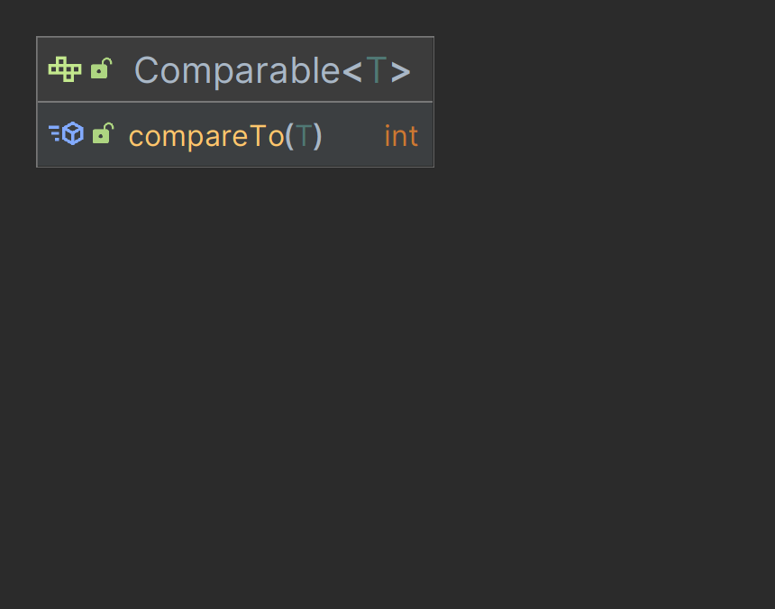
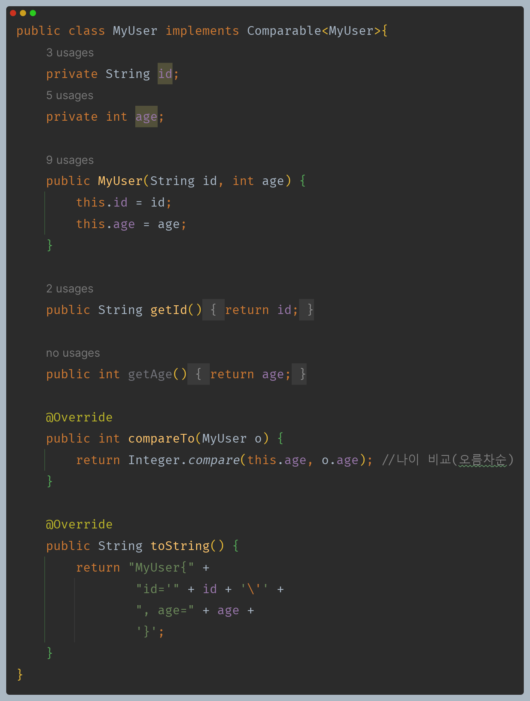
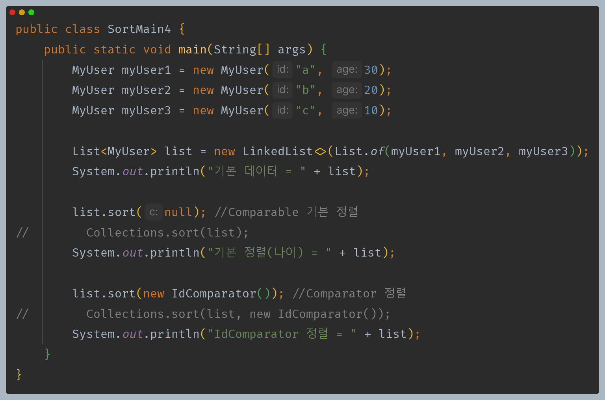

# 자바 - 컬렉션 프레임워크 - 순회, 정렬

## 정렬 - `Comparable`, `Comparator`





- `Arrays` 유틸 클래스의 `sort()`를 사용하면 배열에 들어있는 데이터를 순서대로 정렬할 수 있다.
- 정렬 성능을 높이기 위한 다양한 정렬 알고리즘이 존재한다.
- 자바는 초기에는 **퀵 소트**를 사용했다가 지금은 데이터가 작을 때(32개 이하)는 **듀얼 피벗 퀵소트**를 사용하고, 데이터가 많을 때는 **팀소트**를 사용한다.
- 이런 알고리즘은 평균 `O(n log n)`의 성능을 제공한다.

### 비교자 - Comparator

정렬할 때 비교자(`Comparator`)를 사용하면 두 값을 비교할 때 비교 기준을 직접 제공할 수 있다.

```java
public interface Comparator<T> {
    int compare(T o1, T o2); 
}
```
- 두 인수를 비교해서 결과값을 반환하면 된다.
  - 첫 번째 인수가 더 작으면 음수
  - 두 값이 같으면 0
  - 첫 번째 인수가 더 크면 양수




- `Arrays.sort()`를 사용할 때 비교자(`Comparator`)를 넘겨주면 알고리즘에서 어떤 값이 더 큰지 두 값을 비교할 때 비교자를 사용한다.
- 정렬을 반대로 할 때 `reversed()` 메서드를 사용할 수 있다.
- `Comparator`는 함수형 인터페이스이기 때문에 익명 클래스 및 람다 표현식이 가능하다.

**`Integer`의 `compare()`와 `compareTo()`**


- `compareTo()`를 호출하면 `compare()`를 호출한다.
- `compareTo()`는 인스턴스 메서드, `compare()`는 스태틱 메서드이다.

### 직접 만든 객체 정렬

- 자바가 기본으로 제공하는 `Integer`, `String` 같은 객체를 제외하고 직접 만든 객체를 정렬하려면 어떻게 해야 할까?
- 내가 만든 객체이기 때문에 정렬을 할 때 내가 만든 두 객체 중에 어떤 객체가 더 큰지 알려줄 방법이 필요하다.
- 이때 `Comparable` 인터페이스를 구현하면 된다. 이 인터페이스는 이름 그대로 비교 가능한, 비교할 수 있는 이라는 뜻으로 객체에 비교 기능을 추가해준다.



- 자기 자신과 인수로 넘어온 객체를 비교해서 결과값을 반환하면 된다.
  - 현재 객체가 인수로 주어진 객체보다 더 작으면 음수
  - 두 객체의 크기가 같으면 0
  - 현재 객체가 인수로 주어진 객체보다 더 크면 양수



- 직접 만든 객체가 `Comparable` 인터페이스를 구현했다.
- `compareTo()` 구현을 보면 정렬의 기준을 `age`로 정했다.
- 이 클래스의 기본 정렬 방식을 나이 오름차순으로 정한 것이다.
- `Comparable` 을 통해 구현한 순서를 자연 순서(Natural Ordering)라 한다.


- `Arrays.sort()`를 통해 기본 정렬이 아니라 정렬 방식을 지정하고 싶다면 인수로 비교자(`Comparator`)를 만들어서 넘겨주면 된다.
- 이렇게 비교자를 따로 전달하면 객체가 기본으로 가지고 있는 `Comparable`을 무시하고, 별도로 전달한 비교자를 사용해서 전달한다.
  - `Comparable`는 함수형 인터페이스이기 때문에 익명 클래스 및 람다 표현식이 가능하다.


**만약 `Comparable`도 구현하지 않고, `Comparator`도 제공하지 않은 채 정렬을 시도하면 런타임 오류가 발생한다.(둘 중 하나는 정의해야 한다.)**

- 객체의 기본 정렬 방법은 객체에 `Comparable`을 구현해서 정의한다.
- 이렇게 하면 객체는 이름 그대로 비교할 수 있는 객체가 되고, 기본 정렬 방법을 가지게 된다.
- 기본 정렬 외에 다른 정렬 방법을 사용할 경우 비교자(`Comparator`)를 별도로 구현해서 정렬 메서드에 전달하면 된다. 이 경우 전달한 `Comparator` 가 항상 우선권을 가진다.
- 자바가 제공하는 기본 객체들은 대부분 `Comparable`을 구현해 두었다.

### 리스트 정렬

정렬은 배열 뿐만 아니라 순서가 있는 `List` 같은 자료 구조에도 사용할 수 있다.



- **Collections.sort(list) 또는 Collections.sort(list, Comparator)**
  - 리스트는 순서가 있는 컬렉션이므로 정렬할 수 있다.
  - 별도의 비교자로 정렬하고 싶을 때 비교자를 전달하면 된다.
  - 하지만 이 방식보다는 객체 스스로 정렬 메서드를 가지고 있는 `list.sort()` 사용을 더 권장한다.(둘의 결과는 같다)
- **list.sort(null) 또는 list.sort(Comparator)**
  - `null`을 전달하면 자연적인 순서로 비교, 비교자를 전달하면 전달한 비교자로 비교한다.
  - 자바 1.8 부터 사용


### Tree 구조 정렬

- `TreeSet`, `TreeMap` 과 같은 이진 탐색 트리 구조는 데이터를 보관할 때 데이터를 정렬하면서 보관하기 때문에 정렬 기준을 제공하는 것이 필수다.


- 생성할 때 별도의 비교자를 전달하지 않으면 객체가 구현한 `Comparable`을 사용한다.
- 생성할 때 별도의 비교자를 제공하면 `Comparable` 대신 비교자(`Comparator`)를 사용해서 정렬한다.

**만약 `Comparable`도 구현하지 않고, `Comparator`도 제공하지 않은 채 정렬을 시도하면 런타임 오류가 발생한다.(둘 중 하나는 정의해야 한다.)**

**정리**
- 자바의 정렬 알고리즘은 매우 복잡하고, 또 거의 완성형에 가깝다.
- 자바는 개발자가 복잡한 정렬 알고리즘은 신경 쓰지 않으면서 정렬의 기준만 간단히 변경할 수 있도록, 정렬의 기준을 `Comparable`, `Comparator` 인터페이스를 통해 추상화 해두었다.
- 객체의 정렬이 필요한 경우 `Comparable`을 통해 기본 자연 순서를 제공하고, 자연 순서 외에 다른 정렬 기준이 추가로 필요한 `Comparator`를 제공하면 된다.


---

[이전 ↩️ - 자바(컬렉션 프레임워크) - 자바가 제공하는 `Iterable`, `Iterator`](https://github.com/genesis12345678/TIL/blob/main/Java/mid_2/jcf/%EC%9E%90%EB%B0%94Iterable.md)

[메인 ⏫](https://github.com/genesis12345678/TIL/blob/main/Java/mid_2/Main.md)

[다음 ↪️ - 자바(컬렉션 프레임워크) - 컬렉션 유틸](https://github.com/genesis12345678/TIL/blob/main/Java/mid_2/jcf/Util.md)