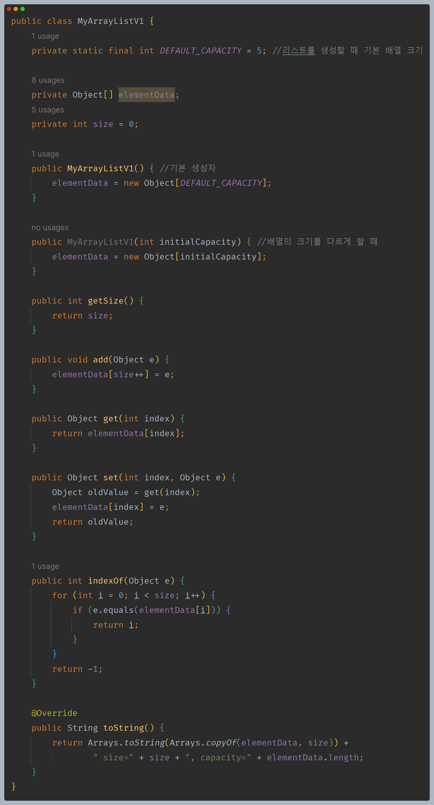
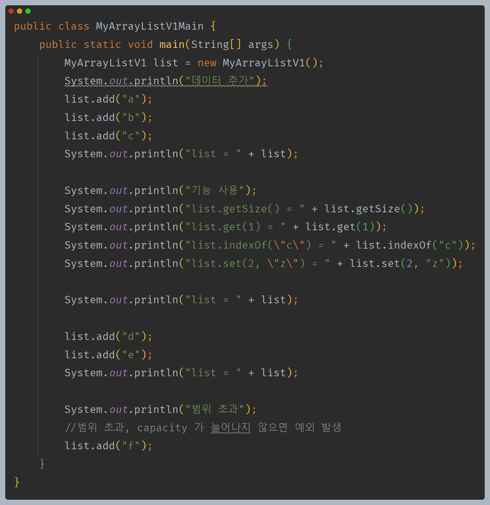
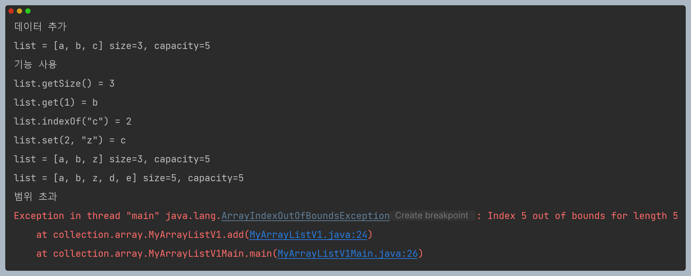
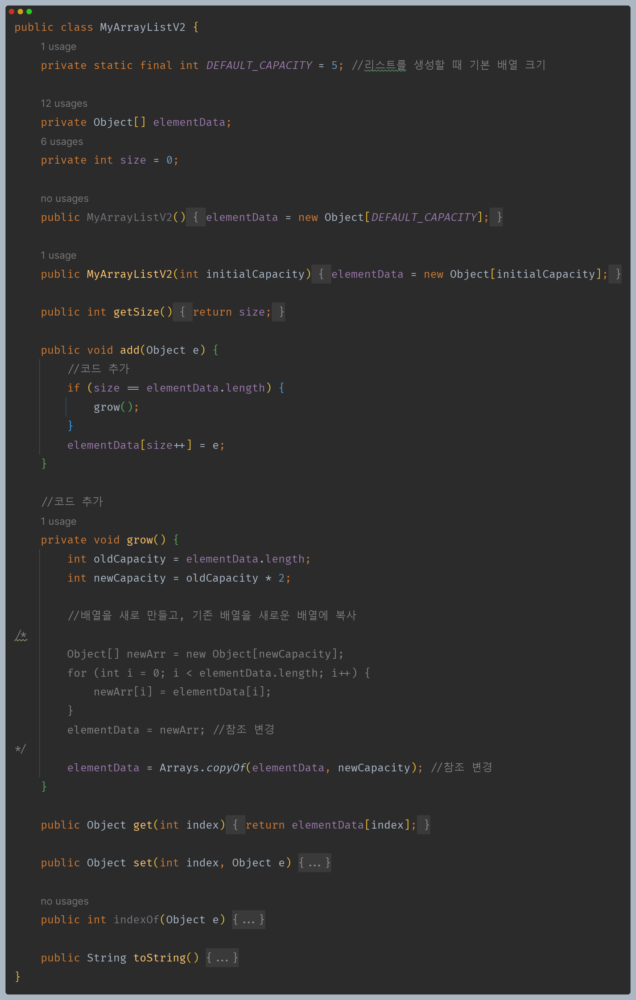
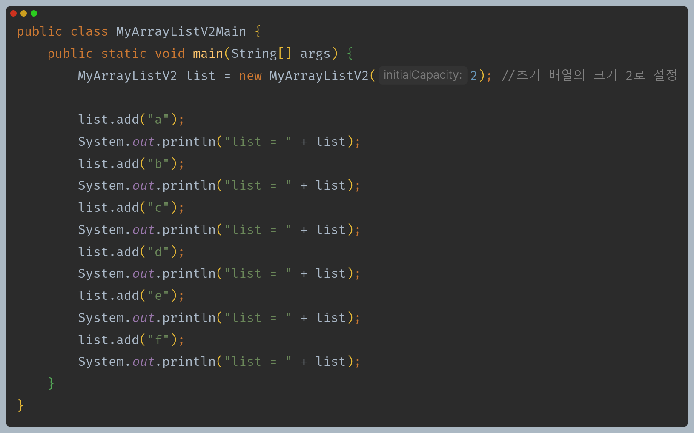
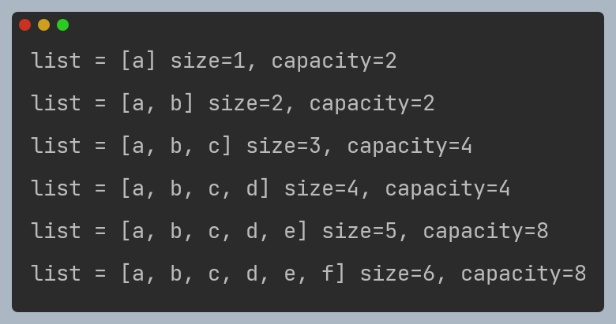
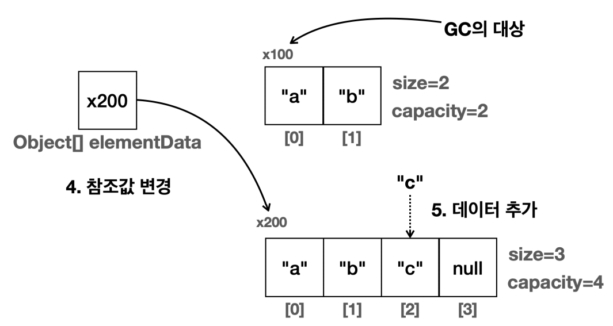
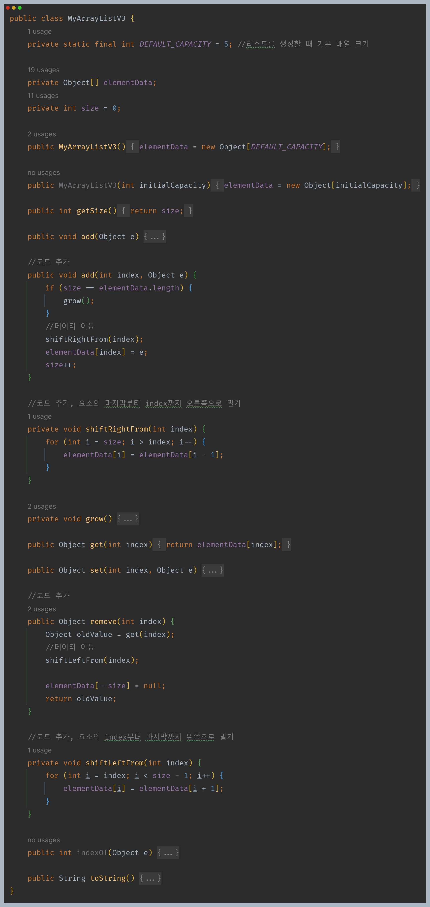
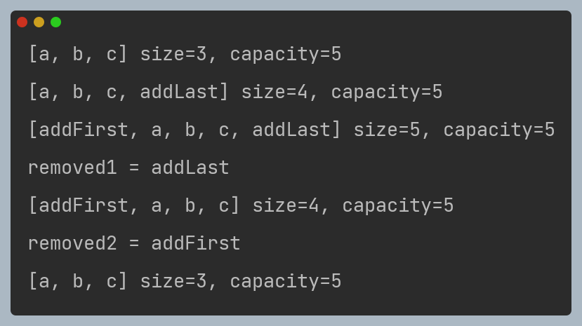

# 자바 - 컬렉션 프레임워크 - ArrayList

## 직접 구현하는 배열 리스트 - 시작

- 배열의 경우 2가지 불편함이 있었다.
  - 배열의 길이를 동적으로 변경할 수 없다.
  - 데이터를 추가하기 불편하다.
    - 데이터를 추가하는 경우 직접 오른쪽으로 한 칸씩 데이터를 이동하는 코드를 작성해야 한다.

**배열의 이런 불편함을 해소하고 동적으로 데이터를 추가할 수 있는 자료 구조를 List(리스트) 라 한다.**

**List 자료구조**
- 순서가 있고, 중복을 허용하는 자료 구조를 리스트라 한다.
- 일반적으로 배열과 리스트는 구분해서 이야기한다. 리스트는 배열보다 유연한 자료 구조로, 크기가 동적으로 변할 수 있다.
- **배열** : 순서가 있고 중복을 허용하지만 크기가 정적으로 고정된다.
- **리스트** : 순서가 있고 중복을 허용하지만 크기가 동적으로 변할 수 있다.

--- 

## 직접 구현하는 배열 리스트 - 동적 배열

데이터를 추가할 때 리스트의 `size`가 배열의 크기인 `capacity`를 넘어가는 상황이라면 더 큰 배열을 만들어서 문제를 해결해보자.

- `grow()` 메서드와 이 메서드를 호출하는 `add()` 메서드가 추가되었다.
- `add()` 메서드에서 데이터를 추가할 때 `size`가 배열의 크기에 도달했다면 더는 데이터를 추가할 수 없다.
- 따라서 이때는 `grow()`를 호출해서 기존 배열을 복사한 새로운 배열을 만들고 배열의 크기도 여유 있게 2배로 늘려준다.
  - `Arrays.copyOf(기존 배열, 새로운 길이)` : 새로운 길이로 배열을 생성하고, 기존 배열의 값을 새로운 배열에 복사한다.

**배열의 크기를 초과할 때**

- 데이터가 하나 추가될 때마다 배열의 크기를 1씩 증가하게 되면 배열을 복사하는 연산이 너무 자주 발생한다.
- 배열을 새로 복사해서 만드는 연산은 배열을 새로 만들고 또 기존 데이터를 복사하는 시간이 걸리므로 가능한 줄이는 것이 좋다.
- 2배씩 증가하면 배열을 새로 만들고 복사하는 연산을 줄일 수 있다. 반면에 배열의 크기를 너무 크게 증가시키면 사용되지 않고 낭비되는 메모리가 많아지는 단점이 발생할 수 있다.
- 여기서는 2배씩 증가했는데, 보통 50% 정도 증가하는 방법을 사용한다.

---

## 직접 구현하는 배열 리스트 - 기능 추가

- `add(index, data)` : `index` 위치에 `data` 추가
- `remove(index)` : `index` 위치에 `data` 삭제

위에서 만든 `add()` 메서드는 리스트의 마지막에 데이터를 추가하기 때문에 배열에 들어있는 기존 데이터는 이동하지 않고 그대로 유지할 수 있다.
하지만 앞이나 중간에 데이터를 추가하고 삭제하는 경우 기존 데이터의 위치를 한 칸씩 옮기는 구현이 필요하다.

- 지금까지 만든 자료 구조를 배열 리스트(`ArrayList`)라 한다.
- List 자료 구조를 사용하는데, 내부의 데이터는 배열(`Array`)에 보관하는 것이다.
- **배열 리스트의 빅오**
  - 데이터 추가
    - 마지막에 추가 : `O(1)`
    - 앞, 중간에 추가 : `O(n)`
  - 데이터 삭제
    - 마지막에 삭제 : `O(1)`
    - 앞, 중간에 삭제 : `O(n)`
  - 인덱스 조회 : `O(1)`
  - 데이터 검색 : `O(n)`
- 배열 리스트는 마지막에 데이터를 추가하거나 마지막에 있는 데이터를 삭제할 때는 `O(1)`로 매우 빠르지만, 중간에 데이터를 추가하거나 삭제하는 경우에는 `O(n)`으로 느리다.
- 배열 리스트는 보통 데이터를 중간에 추가하고 삭제하는 변경보다는, 데이터를 순서대로 입력하고(데이터를 마지막에 추가하고), 순서대로 출력하는 경우에 가장 효율적이다.

---

[이전 ↩️ - 자바(컬렉션 프레임워크(ArrayList)) - 빅오 표기법]()

[메인 ⏫](https://github.com/genesis12345678/TIL/blob/main/Java/mid_2/Main.md)

[다음 ↪️ - 자바(컬렉션 프레임워크(ArrayList)) - 제네릭 적용]()