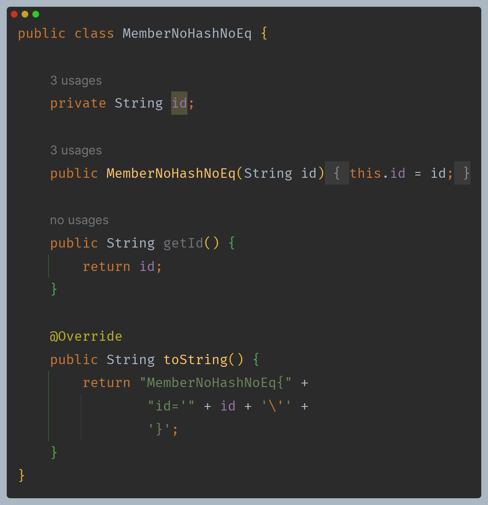
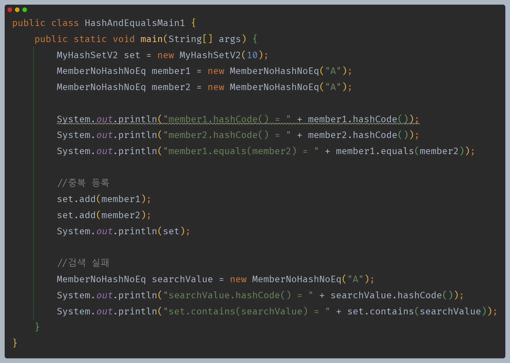
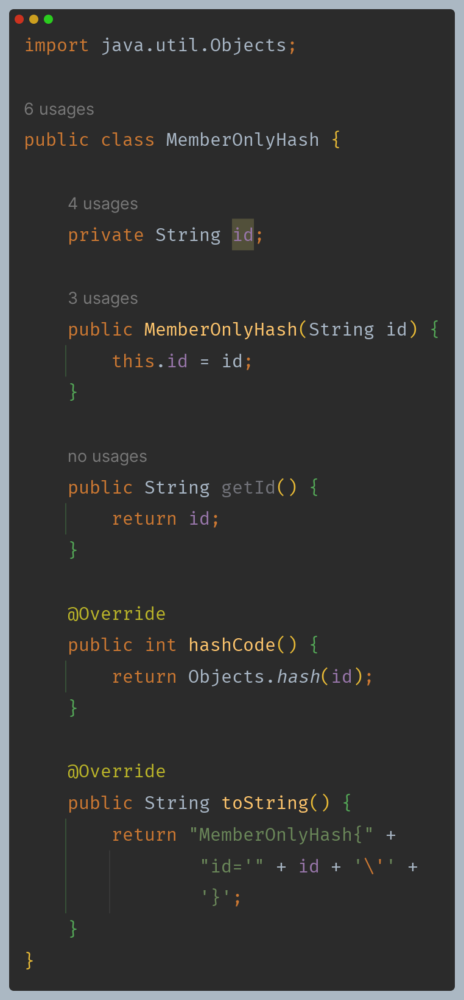
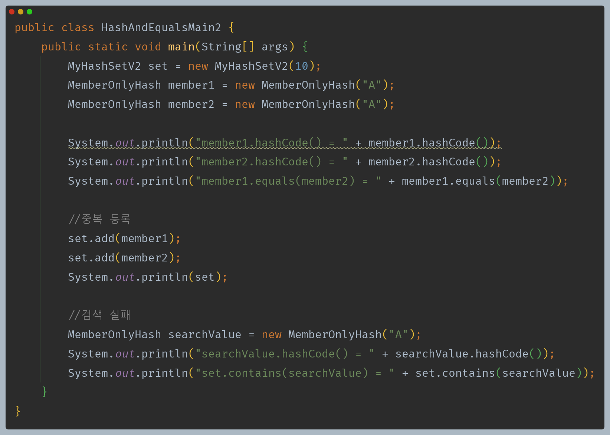
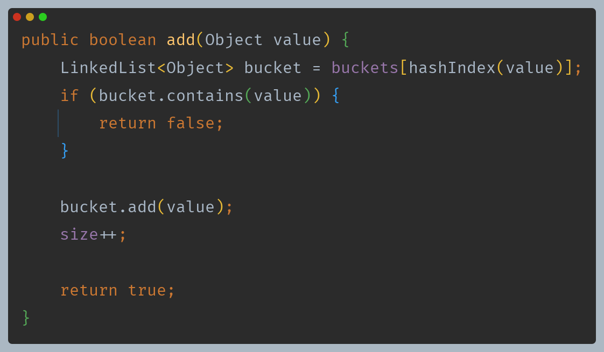
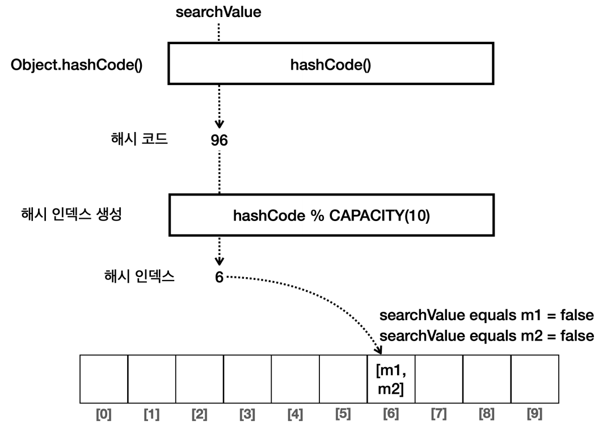
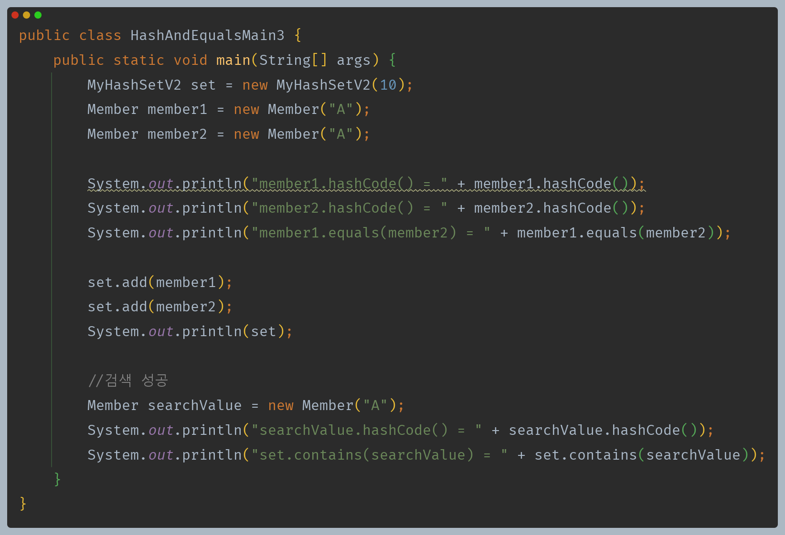
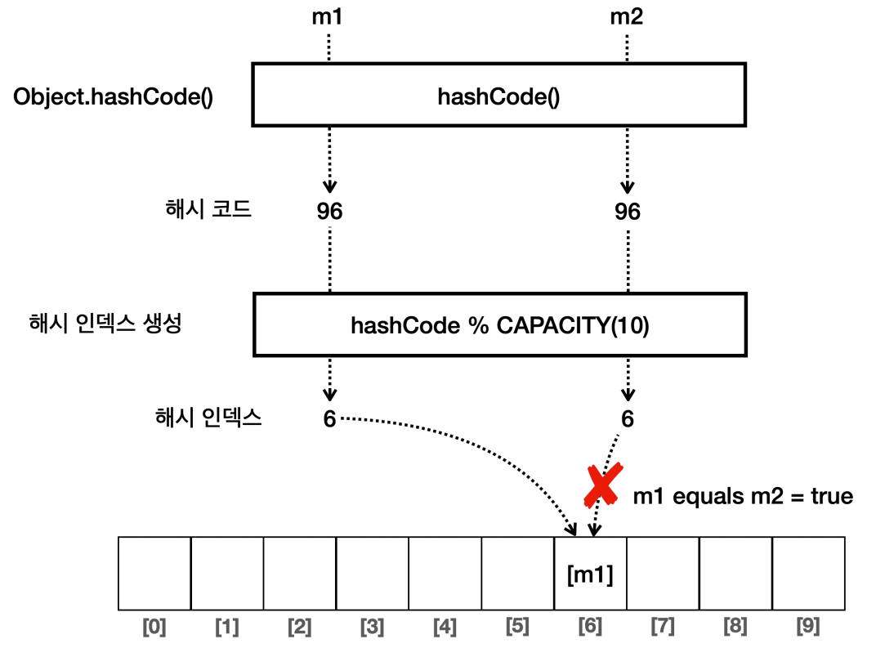
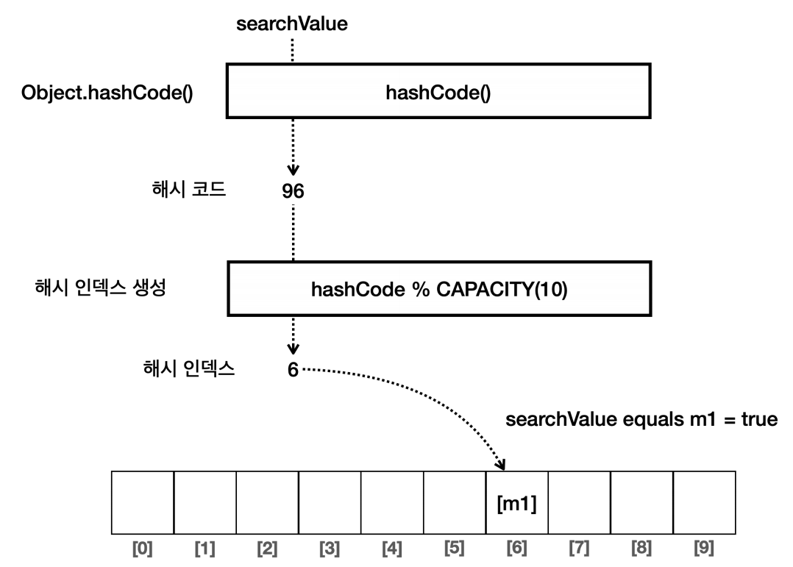

# 자바 - 컬렉션 프레임워크 - HashSet

## equals와 hashCode의 중요성

- 해시 자료 구조를 사용하려면 `hashCode()`도 중요하지만, 해시 인덱스가 충돌할 경우를 대비해서 `equals()`도 반드시 재정의 해야 한다.
- 해시 인덱스가 충돌할 경우 같은 해시 인덱스에 있는 데이터들을 하나하나 비교해서 찾아야 하는데, 이때 `equals()` 를 사용해서 비교한다.
- 해시 인덱스가 같아도 실제 저장된 데이터는 다를 수 있다. 따라서 특정 인덱스에 데이터가 하나만 있어도 `equals()`로 찾는 데이터가 맞는지 검증해야 한다.

**Object의 기본 기능**
- `hashCode()` : 객체의 참조값을 기반으로 해시 코드를 반환한다.
- `equals()` : `==` 동일성 비교를 한다. 따라서 객체의 참조값이 같아야 `true`를 반환한다.

클래스를 만들 때 두 메서드를 재정의하지 않으면 해시 자료 구조에서 `Object`가 기본으로 제공하는 `hashCode()`, `equals()`를 사용하게 된다.
그래서 단순히 인스턴스의 참조를 기반으로 작동한다.

이제 `hashCode()`와 `equals()`를 제대로 구현하지 않은 경우 해시 자료 구조를 사용할 때 어떤 문제들이 발생하는지 알아보자.

---

## hashCode, equals 를 모두 구현하지 않은 경우

- `member1`과 `member2`는 `Object`의 기본 기능을 사용하기 때문에 객체의 참조값을 기반으로 해시 코드를 생성한다.
- 이때 실행할 때마다 값이 달라질 수 있기 때문에 각 해시 코드를 `1004`, `1007`로 가정해본다.
- `member1`과 `member2`는 인스턴스는 다르지만 둘다 같은 `id`를 가지고 있기 때문에 논리적으로 같은 `member`로 보아야 한다.

**데이터 저장 문제**

해시 코드가 서로 다르기 때문에 `id`가 같지만 같은 데이터가 중복 저장된다.

**데이터 검색 문제**

`id`가 A인 객체를 검색하기 위해 객체를 만들어서 검색하지만, 각각 해시 코드가 다르기 때문에 다른 위치에서 데이터를 찾게 되고, 검색에 실패한다.

---

## hashCode는 구현했지만 equals 를 구현하지 않은 경우

`hashCode()`를 재정의 했기 때문에 같은 `id`를 사용하는 두 객체는 같은 해시 코드를 사용한다. 따라서 같은 해시 인덱스에 저장된다.

**데이터 저장 문제**

그런데 `MyHashSetV2`에서 `add()` 로직은 중복 데이터를 체크하기 때문에 같은 데이터가 저장되면 안되는데 저장이 되고 있다.

- `contains()` 내부에서 데이터를 순차 비교할 때 `equals()`를 사용한다.
- 그런데 `eqauls()`를 재정의하지 않았으므로 `Object`의 `equals()`를 사용한다. 따라서 인스턴스의 참조값을 비교한다.
- `member1`과 `member2`는 서로 다른 인스턴스이기 때문에 비교에 실패하고, 중복 데이터가 없다고 판단하고 모두 저장한다.

**데이터 검색 문제**

- 해시 코드가 구현되어 있기 때문에 해시 인덱스를 정확히 찾을 수는 있다.
- `contains()` 메서드에서는 해시 인덱스에 있는 모든 데이터를 `equals()`를 통해 비교해서 같은 값을 찾아야 한다.

- 그런데 `eqauls()`를 재정의하지 않았으므로 `Object`의 `equals()`를 사용한다. 따라서 인스턴스의 참조값을 비교한다.
- `member1`과 `member2`는 서로 다른 인스턴스이기 때문에 비교에 실패하고, 데이터를 찾을 수 없는 것이다.

---

## hashCode와 equals 를 모두 구현한 경우

**데이터 저장**

중복 데이터를 저장하면 안 되므로 `equals()` 비교를 통해 비교하고, `member2`는 같은 데이터가 이미 있으므로 저장에 실패한다.

**데이터 검색**

해시 코드로 해시 인덱스를 찾고, 해시 인덱스 내부의 데이터를 모두 `equals` 비교를 하고, 비교에 성공하므로 `true`를 반환한다.

> **정리**
> - `hashCode()`를 항상 재정의 해야 하는 것은 아니지만, 해시 자료 구조를 사용하는 경우 `hashCode()`와 `equals()`를 반드시 함께 재정의 해야 한다.(IDE의 도움을 받아서)
> 
> **참고**
> - 다른 데이터를 입력해도 같은 해시 코드가 출력될 수 있는데, 이것을 해시 충돌이라 한다.
> - 해시가 충돌하면 결과적으로 같은 해시 인덱스에 보관되고, 성능이 나빠진다.
> - 자바의 해시 함수는 이런 문제를 해결하기 위해 내부에서 복잡한 연산을 수행한다.
> - 복잡한 연산으로 다양한 범위의 해시 코드가 만들어지므로 해시가 충돌할 가능성이 낮아지고, 결과적으로 해시 자료 구조를 사용할 때 성능이 개선된다.
> 
> **해시 함수는 같은 입력에 대해서 항상 동일한 해시 코드를 반환해야 한다.**
> - 좋은 해시 함수는 해시 코드가 한 곳에 뭉치지 않고 균일하게 분포하는 것이 좋다.
> - 그래야 해시 인덱스도 골고루 분포되어서 해시 자료 구조의 성능을 최적화할 수 있다.
> - 자바가 제공하는 해시 함수를 사용하면 최적화된 해시 코드를 구할 수 있다.
> - 하지만 자바가 제공하는 해시 함수를 사용해도 해시 코드가 충돌하는 경우도 간혹 존재한다.
> - `equals()`를 사용해서 다시 비교하기 때문에 해시 코드가 충돌하더라도 문제가 되지 않을 뿐더러, 매우 낮은 확률로 충돌하기 때문에 성능에 대한 부분은 크게 걱정하지 않아도 된다.

---

[이전 ↩️ - 자바(컬렉션 프레임워크(HashSet)) - 직접 구현하는 HashSetV2](https://github.com/genesis12345678/TIL/blob/main/Java/mid_2/jcf/hashSet/MyHashSetV2.md)

[메인 ⏫](https://github.com/genesis12345678/TIL/blob/main/Java/mid_2/Main.md)

[다음 ↪️ - 자바(컬렉션 프레임워크(HashSet)) - 직접 구현하는 HashSetV3(제네릭 적용)](https://github.com/genesis12345678/TIL/blob/main/Java/mid_2/jcf/hashSet/Generic.md)