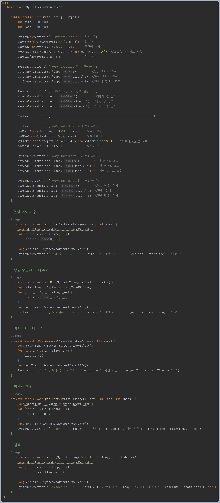

# 자바 - 컬렉션 프레임워크 - List

## 직접 구현한 리스트 성능 비교

**직접 만든 배열 리스트와 연결 리스트 성능 비교 표**

| 기능         | 배열 리스트            | 연결 리스트            |
|------------|-------------------|-------------------|
| 앞에 추가 및 삭제 | `O(n)` - 2371ms   | `O(1)` -  3ms     |
| 평균 추가 및 삭제 | `O(n)` - 1129ms   | `O(n)` - 1358ms   |
| 뒤에 추가 및 삭제 | `O(1)` - 2ms      | `O(n)` - 2797ms   |
| 인덱스 조회     | `O(1)` - 1ms      | `O(n)` - 평균 389ms |
| 검색         | `O(n)` - 평균 338ms | `O(n)` - 평균 606ms |

- **추가, 삭제**
  - **배열 리스트** : 인덱스를 통해 추가나 삭제할 위치를 `O(1)`로 빠르게 찾지만, 추가나 삭제 이후에 데이터를 한칸씩 밀어야 하므로 이 부분이 `O(n)`으로 오래 걸린다.
  - **연결 리스트** : 인덱스를 통해 추가나 삭제할 위치를 `O(n)`으로 느리게 찾지만, 실제 데이터의 추가는 간단한 참조 변경으로 빠르게 `O(1)`로 수행된다.
- **앞에 추가 및 삭제**
  - **배열 리스트** : 추가나 삭제할 위치를 찾는데 `O(1)`, 데이터를 한칸씩 이동 `O(n)` => `O(n)`
  - **연결 리스트** : 추가나 삭제할 위치를 찾는데 `O(1)`, 노드를 변경하는데 `O(1)` => `O(1)`
- **평균 추가 및 삭제**
    - **배열 리스트** : 추가나 삭제할 위치를 찾는데 `O(1)`, 인덱스 이후의 데이터를 한칸씩 이동 `O(n/2)` => `O(n)`
    - **연결 리스트** : 추가나 삭제할 위치를 찾는데 `O(n/2)`, 노드를 변경하는데 `O(1)` => `O(n)`
- **뒤에 추가 및 삭제**
    - **배열 리스트** : 추가나 삭제할 위치를 찾는데 `O(1)`, 이동할 데이터 없음 => `O(1)`
    - **연결 리스트** : 추가나 삭제할 위치를 찾는데 `O(n)`, 노드를 변경하는데 `O(1)` => `O(n)`
- **인덱스 조회**
    - **배열 리스트** : 배열에 인덱스를 사용해서 값을 `O(1)` 로 찾을 수 있음
    - **연결 리스트** : 노드를 인덱스 수 만큼 이동해야 함 `O(n)`
- **검색**
    - **배열 리스트** : 데이터를 찾을 때 까지 배열을 순회 `O(n)`
    - **연결 리스트** : 데이터를 찾을 때 까지 노드를 순회 `O(n)`

**시간 복잡도와 실제 성능**
- 이론적으로 **연결 리스트**의 평균 추가(중간 삽입) 연산은 **배열 리스트**보다 빠를 수 있다. 그러나 실제 성능은 요소의 순차적 접근 속도, 메모리 할당 및 해제 비용,
  CPU 캐시 활용도 등 다양한 요소에 의해 영향을 받는다.
- **배열 리스트**는 요소들이 메모리 상에서 연속적으로 위치하여 CPU 캐시 효율이 좋고, 메모리 접근 속도가 빠르다.
- 반면 **연결 리스트**는 각 요소가 별도의 객체로 존재하고 다음 요소의 참조를 저장하기 때문에 CPU 캐시 효율이 떨어지고, 메모리 접근 속도가 상대적으로 느릴 수 있다.
- **배열 리스트**의 경우 `CAPACITY`를 넘어서면 배열을 다시 만들고 복사하는 과정이 추가되지만, 한번에 2배씩 늘어나기 때문에 이 과정은 가끔 발생하므로 전체 성능에 큰 영향을 주지는 않는다.

즉 이론적으로는 **연결 리스트**가 평균 추가(중간 삽입)에 있어 더 효율적일 수 있지만, 현대 컴퓨터 시스템의 메모리 접근 패턴, CPU 캐시 최적화 등을 고려할 때
**배열 리스트**가 실제 사용 환경에서 더 나은 성능을 보여주는 경우가 많다.

- **배열 리스트 vs 연결 리스트**
  - 대부분의 경우 배열 리스트가 성능상 유리하다.(이런 이유로 실무에서는 주로 배열 리스트를 기본으로 사용)
  - 데이터를 앞쪽에서 추가하거나 삭제하는 일이 압도적으로 많다면 연결 리스트를 고려해보자.

---

[이전 ↩️ - 자바(컬렉션 프레임워크(List)) - 리스트 추상화]()

[메인 ⏫](https://github.com/genesis12345678/TIL/blob/main/Java/mid_2/Main.md)

[다음 ↪️ - 자바(컬렉션 프레임워크(List)) - 자바 리스트]()