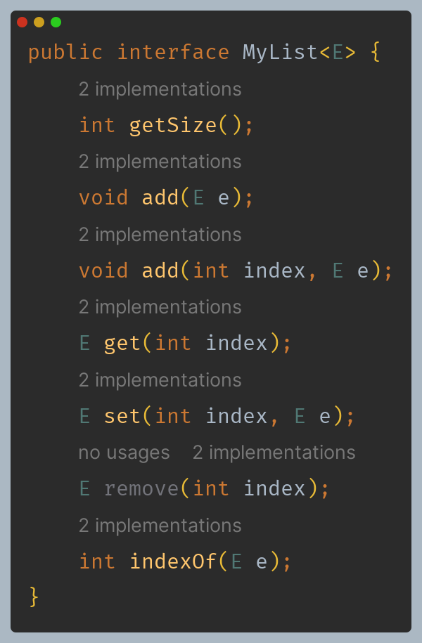
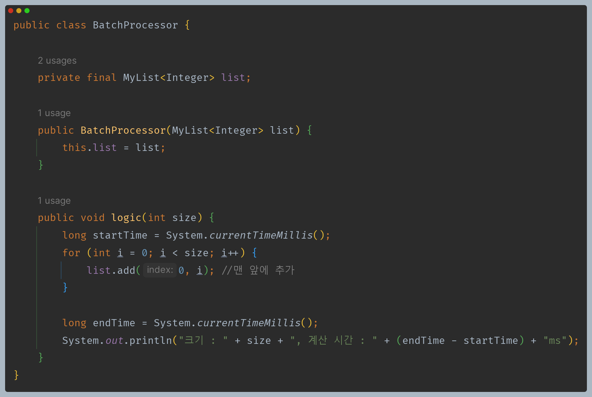
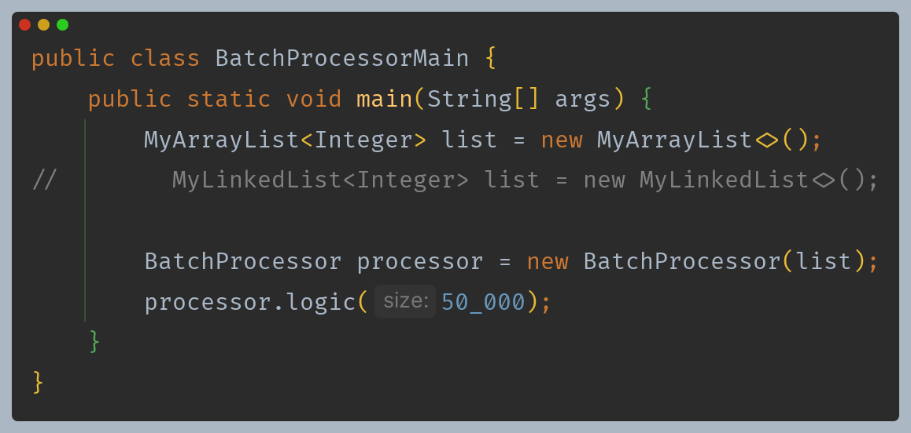
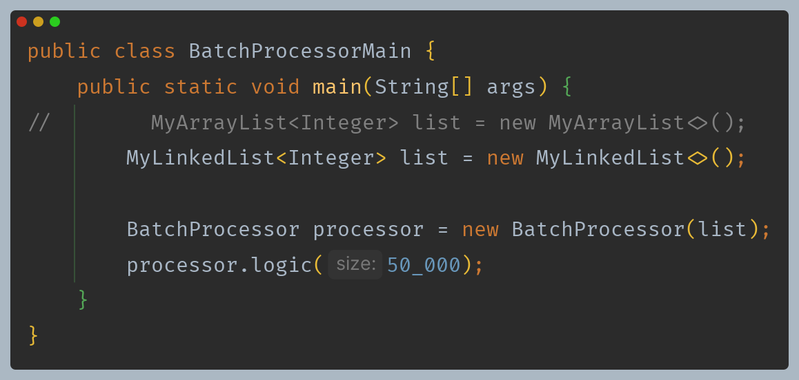
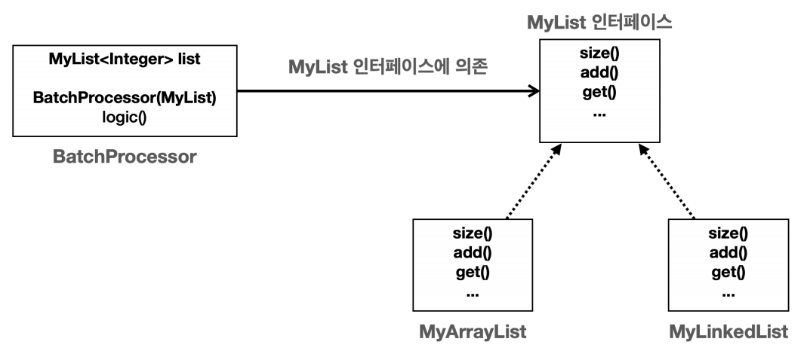
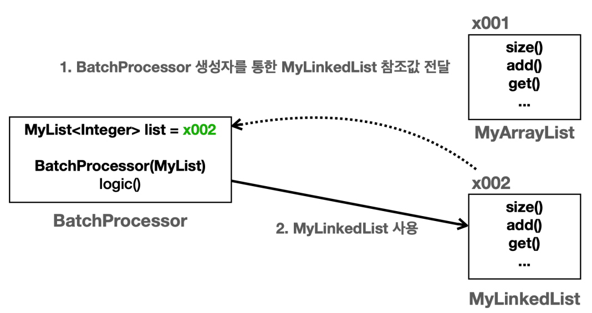

# 자바 - 컬렉션 프레임워크 - List

## 리스트 추상화 - 인터페이스

다형성과 `OCP` 원칙을 가장 잘 활용할 수 있는 곳 중에 하나가 바로 자료 구조이다.

**List 자료 구조**
- 순서가 있고, 중복을 허용하는 자료 구조
- 직접 만든 `MyArrayList`와 `MyLinkedList`는 내부 구현만 다를 뿐 같은 기능을 제공하는 리스트이다.
- 내부 구현이 다르기 때문에 성능은 다를 수 있지만, 핵심은 사용자 입장에서 보면 같은 기능을 제공한다는 것이다.
- 이 둘의 공통 기능을 인터페이스로 뽑아서 추상화하면 다형성을 활용한 다양한 이득을 얻을 수 있다.

**MyList 인터페이스**



**MyArrayList**


**MyLinkedList**


---

## 리스트 추상화 - 의존관계 주입

다음과 같은 코드가 있다고 보자.

```java
public class BatchProcessor {
    private final MyArrayList<Integer> list = new MyArrayList<>();
    
    public void logic(int size) {
        for (int i = 0; i < size; i++) {
            list.add(0, i); //앞에 추가 
        }
    } 
}
```

- 데이터를 앞에서 추가하는 일이 많은 상황이라고 가정한다.
- 데이터를 앞에서 추가하거나 삭제하는 작업은 `MyArrayList` 보다는 `MyLinkedList`를 사용하는 것이 훨씬 효율적이다.
- 그러면 다음과 같이 코드를 변경할 수 있다.

```java
public class BatchProcessor {
    private final MyLinkedList<Integer> list = new MyLinkedList<>(); //코드 변경
    
    public void logic(int size) {
        for (int i = 0; i < size; i++) {
            list.add(0, i); //앞에 추가 
        }
    } 
}
```

- 이 코드는 구체적인 클래스를 의존하고 있다.
- 이렇게 구체적인 클래스를 직접 의존하면 요구사항 또는 성능에 따라 변경할 때마다 여기에 의존하는 코드도 함께 수정해야 한다.
- 이렇게 되면 `OCP` 원칙을 준수할 수 없다. 따라서 **구체적인 클래스에 의존하는 대신 추상적인 인터페이스에 의존하도록 해야 한다.**

```java
public class BatchProcessor {
    private final MyList<Integer> list;
    
    public BatchProcessor(MyList<Integer> list) { 
        this.list = list;
    }
    
    public void logic(int size) {
        for (int i = 0; i < size; i++) {
            list.add(0, i); //앞에 추가 
        }
    } 
}
```
```java
main() {
    new BatchProcessor(new MyArrayList());  //MyArrayList를 사용하고 싶을 때 
    new BatchProcessor(new MyLinkedList()); //MyLinkedList를 사용하고 싶을 때
}
```

- `BatchProcessor`라는 클래스를 생성하는 시점에 생성자를 통해 원하는 리스트 전략(알고리즘)을 선택해서 전달할 수 있다.
- 이렇게 하면 `MyList` 인터페이스를 사용하는 클라이언트 코드인 `BatchProcessor`를 전혀 변경하지 않고, 원하는 리스트 전략을 런타임에 지정할 수 있다.
- **다형성과 추상화를 활용하여 클라이언트 코드를 전혀 변경하지 않고 전략을 변경할 수 있다.**



- 생성자를 통해서 `MyList` 인터페이스 구현체가 전달된다.
- 이것은 외부에서 의존관계가 결정되어서 주입되는 것 같다고 해서 **의존관계 주입**이라 한다.(생성자 의존관계 주입, `DI`)




- `MyArrayList`의 성능이 별로 좋지 않은 것 같다.
- 그래서 `MyLinkedList`를 사용하도록 해야 하는데 다형성과 추상화를 잘 설계한 덕분에 클라이언트(`BatchProcessor`)의 코드는 전혀 변경 없이 다음 코드만 변경하면 된다.




`MyLinkedList`를 사용하여 `O(n)` 에서 `O(1)`로 성능이 훨씬 개선된 것을 확인할 수 있다.

---

## 리스트 추상화 - 컴파일 타임, 런타임 의존관계

- 의존관계는 크게 다음 두가지 의존관계로 나눌 수 있다.
  - **컴파일 타임** : 코드 컴파일 시점
  - **런타임** : 프로그램 실행 시점

### 컴파일 타임 의존관계

- 컴파일 타임 의존관계는 자바 컴파일러가 보는 의존관계이다. 클래스에 모든 의존관계가 다 나타난다.
- 즉 클래스에 바로 보이는 의존관계이다. 그리고 실행하지 않은 소스 코드에 정적으로 나타나는 의존관계이다.



### 런타임 의존관계

- 런타임 의존관계는 실제 프로그램이 작동할 때 보이는 의존관계다. 주로 생성된 인스턴스와 그것을 참조하는 의존관계이다.
- 즉 프로그램이 실행될 때 인스턴스 간에 의존관계로 보면 된다.
- 런타임 의존관계는 프로그램 실행 중에 계속 변할 수 있다.




**정리**
- `MyList` 인터페이스의 도입으로 같은 리스트 자료구조를 그대로 사용하면서 원하는 구현을 변경할 수 있게 되었다.
- 클라이언트(`BatchProcessor`)에서 사용하는 의존관계를 클래스에서 미리 결정하는 것이 아니라, 런타임에 객체를 생성하는 시점으로 미룬다.
- **클라이언트 클래스는 컴파일 타임에 추상적인 것에 의존하고, 런타임에 의존 관계 주입을 통해 구현체를 주입받아 사용함으로써, 이런 이점을 얻을 수 있는 것이다.**

> **전략 패턴(Strategy Pattern)**
> 
> - 전략 패턴은 디자인 패턴 중에 가장 중요한 패턴 중 하나다.
> - 전략 패턴은 위 코드와 같이 알고리즘을 클라이언트 코드의 변경 없이 쉽게 교체할 수 있다.
> - `MyList` 인터페이스가 전략을 정의하는 인터페이스가 되고, 각각의 구현체(`MyArrayList`, `MyLinkedList`)가 전략의 구체적인 구현이 된다.
> - 그리고 전략을 클라이언트 코드(`BatchProcessor`)의 변경 없이 손쉽게 교체할 수 있다.

---

[이전 ↩️ - 자바(컬렉션 프레임워크(LinkedList)) - 제네릭 적용](https://github.com/genesis12345678/TIL/blob/main/Java/mid_2/jcf/linkedlist/Generic.md)

[메인 ⏫](https://github.com/genesis12345678/TIL/blob/main/Java/mid_2/Main.md)

[다음 ↪️ - 자바(컬렉션 프레임워크(List)) - 직접 구현한 리스트 성능 비교]()