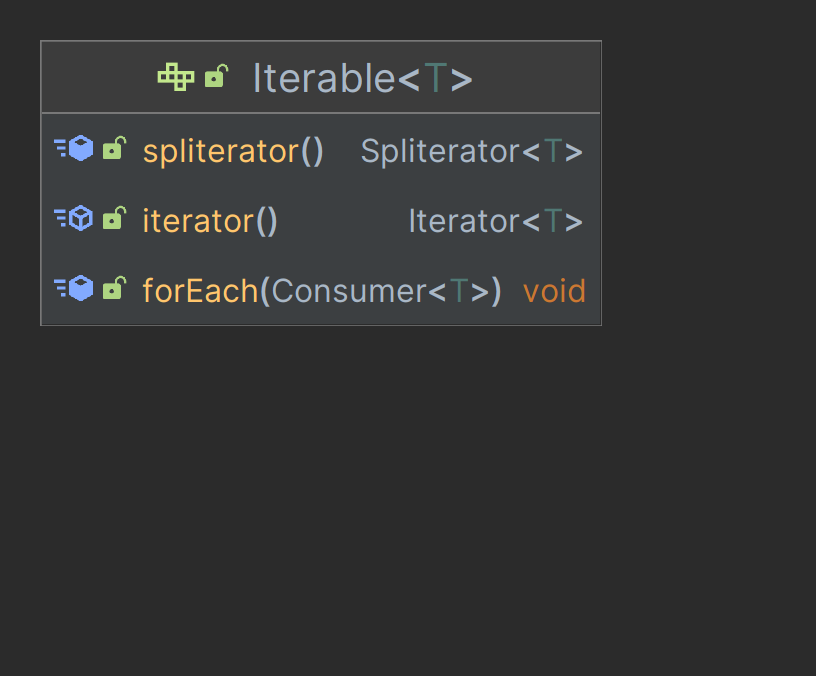
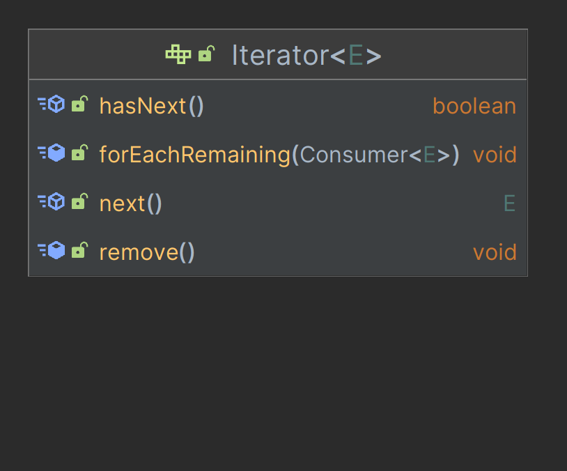
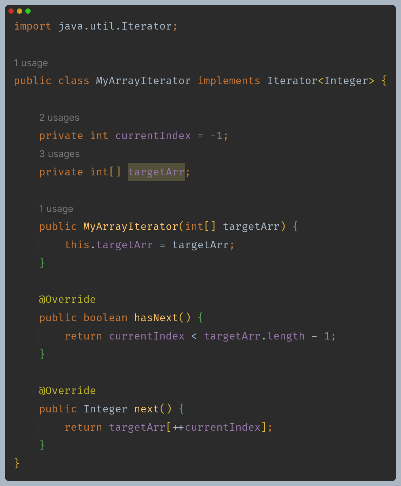
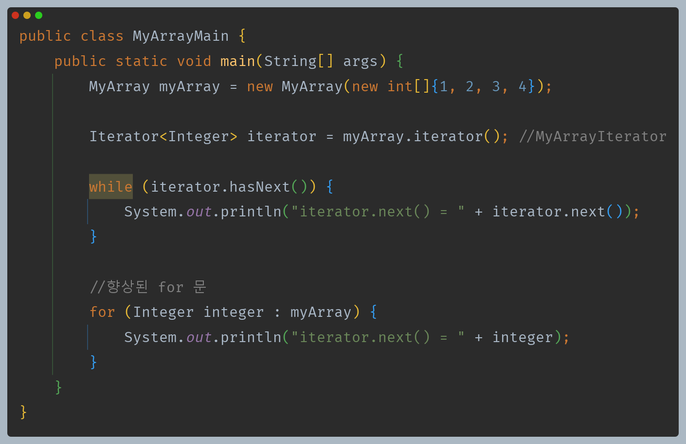
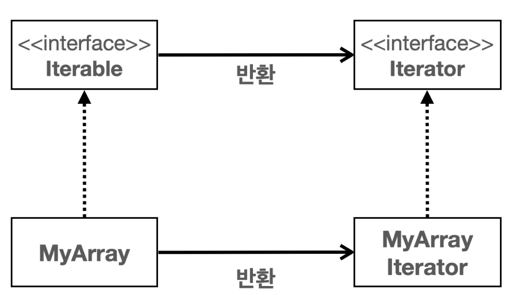

# 자바 - 컬렉션 프레임워크 - 순회, 정렬

## 직접 구현하는 `Iterable`, `Iterator`

- 자료 구조에서 순회는 자료 구조에 들어있는 데이터를 차례대로 접근해서 처리하는 것을 순회라 한다.
- 그런데 자료 구조는 다양하게 있고, 각 자료 구조마다 데이터를 접근하는 방법이 모두 다르다.
- 예를 들어 배열 리스트는 `index`를 차례로 증가하면서 순회해야 하고, 연결 리스트는 노드를 이용해 순회해야 한다.
- 각각의 자료 구조마다 순회하는 방법이 서로 다르기 때문에 각 자료 구조의 순회 방법을 배워야 한다.
- 그리고 순회 방법을 배우려면 자료 구조의 내부 구조도 알아야 한다.
- 하지만 자료 구조를 사용하는 개발자 입장에서는 단순히 자료 구조에 들어있는 모든 데이터에 순서대로 접근하고 싶을 뿐이다.

자료 구조의 구현과 관계 없이 모든 자료 구조를 동일한 방법으로 순회할 수 있는 일관성 있는 방법이 있다면, 자료 구조를 사용하는 개발자 입장에서 매우 편리할 것이다.

**자바는 이런 문제를 해결하기 위해 `Iterable`과 `Iterator` 인터페이스를 제공한다.**

### Iterable, Iterator

- `Iterable` : 반복 가능한
- `Iterator` : 반복자

**Iterable 인터페이스**



- 단순히 `Iterator` 반복자를 반환한다.
- 나머지는 디폴트 메서드다.

**Iterator 인터페이스**



- `hasNext()`와 `next()`가 주요 메서드이다.(나머지는 디폴트 메서드)
- `hasNext()` : 다음 요소가 있는지 확인한다. 다음 요소가 없으면 `false` 반환
- `next()` : 다음 요소를 반환한다. 내부에 있는 위치를 다음으로 이동한다.

자료 구조에 들어있는 데이터를 처음부터 끝까지 순회하는 방법은 단순하다. 자료 구조에 다음 요소가 있는지 물어보고, 있으면 다음 요소를 꺼내는 과정을
반복하면 된다. 만약 다음 요소가 없다면 종료하면 된다. 이렇게 하면 자료 구조에 있는 모든 데이터를 순회할 수 있다.

**`Iterator` 구현체**



- 생성자를 통해 반복자가 사용할 배열을 참조한다. 여기서 참조한 배열을 순회할 것이다.
- `currentIndex` : 현재 인덱스, `next()`를 호출할 때마다 하나씩 증가한다.

`Iterator`는 단독으로 사용할 수 없다. `Iterator`를 통해 순회의 대상이 되는 자료 구조가 필요하다.


- 배열을 가지는 단순한 자료 구조를 만들었다.
- `Iterable` 인터페이스를 구현한다.
  - 이 인터페이스는 이 자료 구조에 사용할 반복자(`Iterator`)를 반환하면 된다.
  - 위에서 만든 반복자(`MyArrayIterator`)를 반환한다.



**클래스 구조도**



- `MyArray`는 `Iterable`(반복 할 수 있는) 인터페이스를 구현한다. `MyArray`는 반복할 수 있다는 의미가 된다.
- `Iterable` 인터페이스를 구현하면 `iterator()` 메서드를 구현해야 한다. 이 메서드는 `Iterator` 인터페이스를 구현한 반복자를 반환한다.

**런타임 메모리 구조도**

- `MyArrayIterator` 인스턴스를 생성할 때 순회할 대상을 지정해야 한다. `MyArray`의 배열을 지정했다.
- `MyArrayIterator` 인스턴스는 내부에서 `MyArray`의 배열을 참조한다.
- 이제 `MyArrayIterator`를 통해 `MyArray`가 가진 내부 데이터를 순회할 수 있다.

### 향상된 for 문


- `Iterable`과 `Iterator`를 사용하면 향상된 for 문을 사용할 수 있다.
- for-each 문으로 불리는 향상된 for 문은 자료 구조를 순회하는 것이 목적이다.
- 자바는 `Iterable` 인터페이스를 구현한 객체에 대해서 향상된 for 문을 사용할 수 있게 해준다.(배열도 가능)

이렇게 하면 자바는 컴파일 시점에 다음과 같이 코드를 변경한다.
```java
while (iterator.hasNext()) {
    System.out.println("iterator.next() = " + iterator.next());
}
```

두 코드는 같은 코드이며, 모든 데이터를 순회한다면 둘 중에 깔끔한 향상된 for 문을 사용하는 것이 좋다.

**정리**
- 특정 자료 구조가 `Iterable`, `Iterator` 인터페이스를 구현한다면 해당 자료 구조를 사용하는 개발자는 단순히 `hasNext()`, `next()` 또는 for-each
  문을 사용해서 순회할 수 있다.
- 자료 구조가 아무리 복잡해도 해당 자료 구조를 사용하는 개발자는 동일한 방법으로 매우 쉽게 자료 구조를 순회할 수 있다.
- 이것이 인터페이스가 주는 큰 장점이다.

---

[이전 ↩️ - 자바(컬렉션 프레임워크) - 스택, 큐, 데크]()

[메인 ⏫](https://github.com/genesis12345678/TIL/blob/main/Java/mid_2/Main.md)

[다음 ↪️ - 자바(컬렉션 프레임워크) - 자바가 제공하는 `Iterable`, `Iterator`]()