# 자바 동시성 프로그래밍 - 비동기 프로그래밍

## 동기 (Synchronous)

- **동기(Synchronous)** 는 작업이 순차적으로 실행되며 한 작업의 시작과 완료가 다음 작업의 시작과 완료와 밀접하게 연결된 방식을 의미한다.
- **하나의 작업이 실행 중인 동안 다른 작업은 대기**해야 하며 작업의 결과를 기다린 후에 다음 작업이 진행된다.
- 작업은 한번에 하나씩 진행해야 하며 작업을 건너 뛰거나 빠뜨릴 수 없다.

### 두 명이 작업을 분담해서 진행할 경우 동기식 처리가 가능한가?

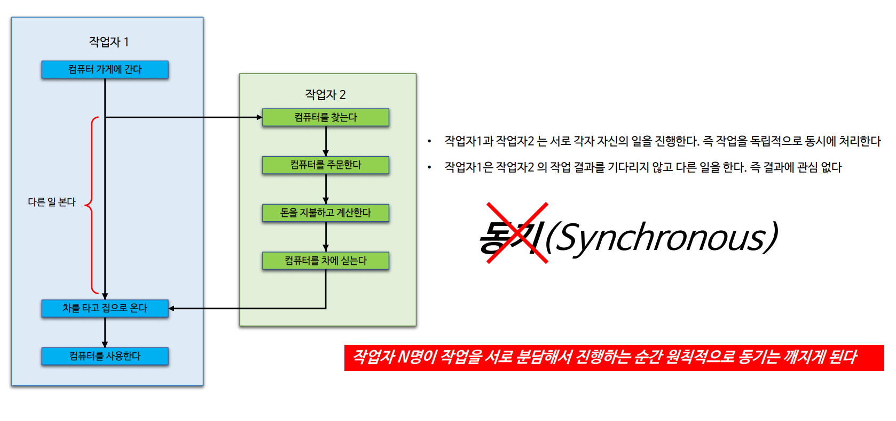

## 비동기(Asynchronous)

- **비동기(Asynchronous)** 는 작업이 순차적으로 실행되지 않고 각 작업이 다른 작업의 완료를 기다리지 않고 독립적으로 실행되는 방식을 의미한다.
- **한 작업이 시작된 후에도 다음 작업이 바로 시작**될 수 있으며 작업의 결과에 관심이 없고 기다리지 않으며 다른 작업을 실행할 수 있다.
- 비동기 작업은 주로 I/O 작업과 같이 시간이 오래 걸리는 작업을 다룰 때 유용하며, 다수의 작업을 동시에 처리하거나 빠른 응답 시간을 보장해야 하는 경우에 활용된다.
- **Fire and Forget** 이라는 용어가 있는데 이는 비동기 프로그래밍 용어로서 작업을 시작하고 그 결과에 대해 더 이상 관심을 가지 않고 진행하는 것을 의미한다.

### 작업을 처리하는 작업자가 두 명인 비동기 상황에서 동기식 처리가 가능한가?

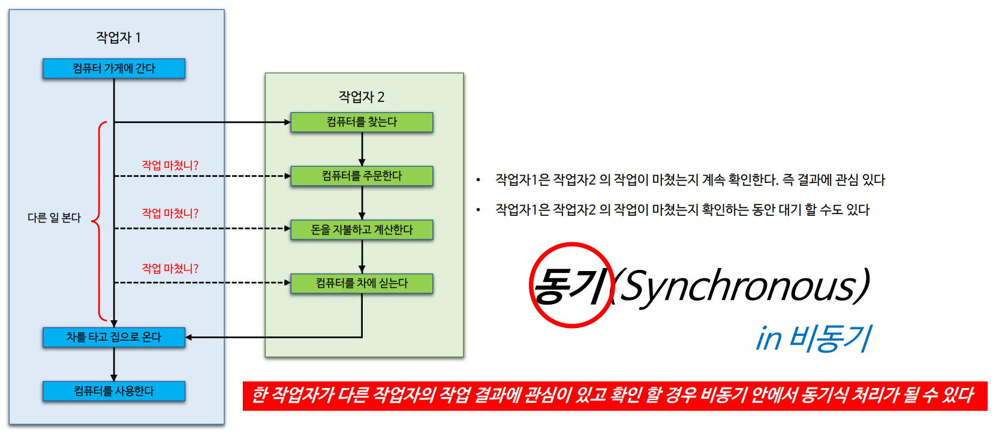

---

## 블로킹 (Blocking)

- **블로킹**은 동기 작업에서 나타나는 현상으로 작업이 완료될 때까지 실행 흐름을 멈추고 대기하는 상태를 의미한다.
- 파일을 읽거나 네트워크에서 데이터를 받아오는 I/O 작업이 블로킹 작업에 해당하는데, 해당 작업이 완료될 때까지 다른 작업은 차단되고 대기 상태에 놓이게 된다.
- 블로킹 작업은 주로 작업이 완료될 때까지 결과를 기다려야 하는 경우에 사용되며 대부분 동기적인 처리에서 나타난다.

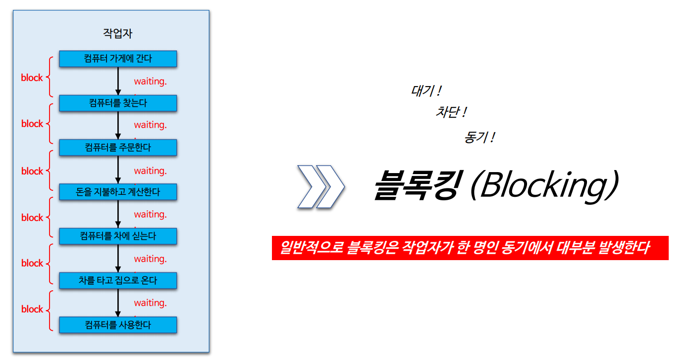

### 작업을 처리하는 작업자가 두 명인 비동기 상황에서 블로킹이 발생할 수 있는가?

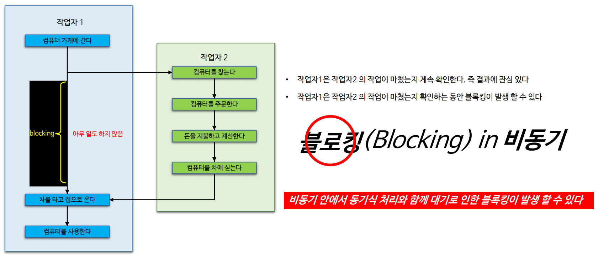

## 논블로킹 (Non Blocking)

- **논블로킹**은 비동기 작업에서 나타나는 현상으로 블로킹 되지 않고 실행 흐름이 지속되는 특성을 나타낸다.
- 특정 작업이 진행 중일 때에도 다른 작업이 계속 실행되며, 작업이 완료되지 않았더라도 대기하지 않고 다음 작업을 처리하는 방식을 의미한다.
- 논블로킹 작업은 다른 작업들과 동시에 진행될 수 있어서 전체 시스템의 응답성을 향상시킬 수 있다.

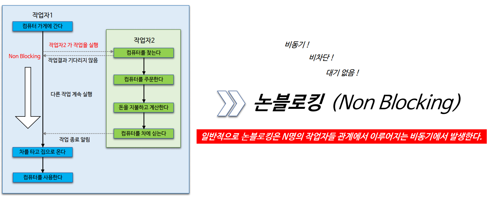

---

## 1. 함수 관점에서 동기와 비동기

- 함수를 호출한 자(`Caller`)와 호출된 함수를 수행하는 주체(`Callee`)가 **동일 스레드이면 동기**, **서로 다른 스레드이면 비동기** 관계가 형성 된다고 할 수 있다.

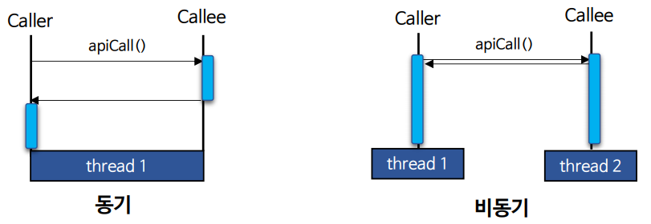

- 함수를 호출한 자(`Caller`)와 호출된 함수의 **작업 결과에 대해 관심을 가지고 있으면 동기**, **없으면 비동기**라 할 수 있다.

> **동기와 비동기는 작업을 실행하는 작업자들 즉, `스레드 간 구성`에 관한 문제이다.**

## 2. 함수 관점에서 블로킹과 논블로킹

- 함수를 호출한 자(`Caller`)와 호출된 함수를 수행하는 주체(`Callee`)가 **동일 스레드이면 블로킹**, **서로 다른 스레드이면 논블로킹**이 발생한다고 볼 수 있다.

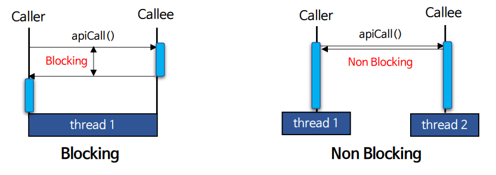

- 함수를 호출한 자(`Caller`)와 호출된 함수를 수행하는 주체(`Callee`)가 **순차적으로 작업을 진행하면 블로킹**, **동시적으로 진행하면 논블로킹** 이라 할 수 있다.

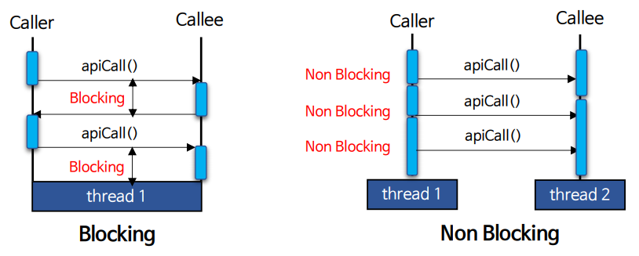

> **블로킹과 논블로킹은 작업자의 작업 즉, `스레드 간 행위`에 관한 문제이다.**

### 예제 코드 - 1 (동기 호출)

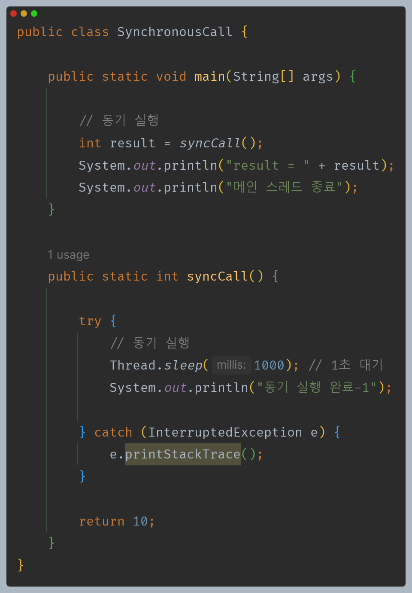

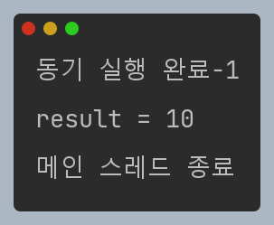

### 예제 코드 - 1 (비동기 호출)

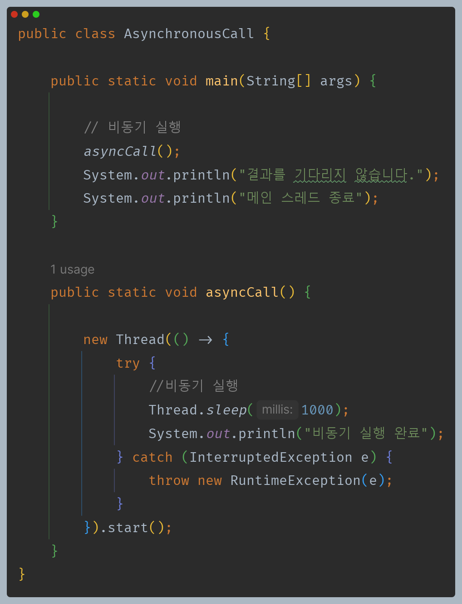

---

## 1. 동기 & 블로킹

- **동기** - 작업을 호출하는 주체와 호출되는 주체가 같은 스레드이기 때문에 모든 작업이 순차적으로 처리되며 처리 결과에 관심을 가진다.
- **블로킹** - 작업을 호출하면 해당 작업이 완료될 때까지 다른 작업을 진행하지 못하고 차단된다.

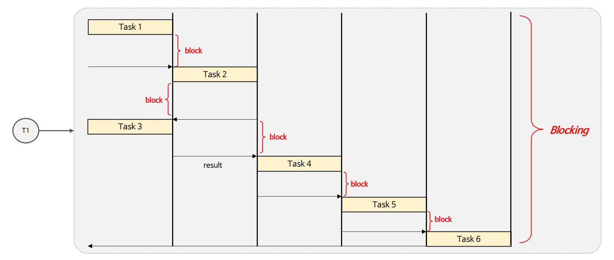

> 스레드가 함수 단위로 콜백을 전달하고 실행하는 경우 콜백의 처리 결과에 당장 관심이 없다 라는 비동기 개념을 가질 수 있으나
> 결국 결과를 만들어 내는 주체는 단일 스레드 자신이기 때문에 비동기적으로 실행 한다고는 볼 수 없다.

### 동기 & 블로킹 예제 코드

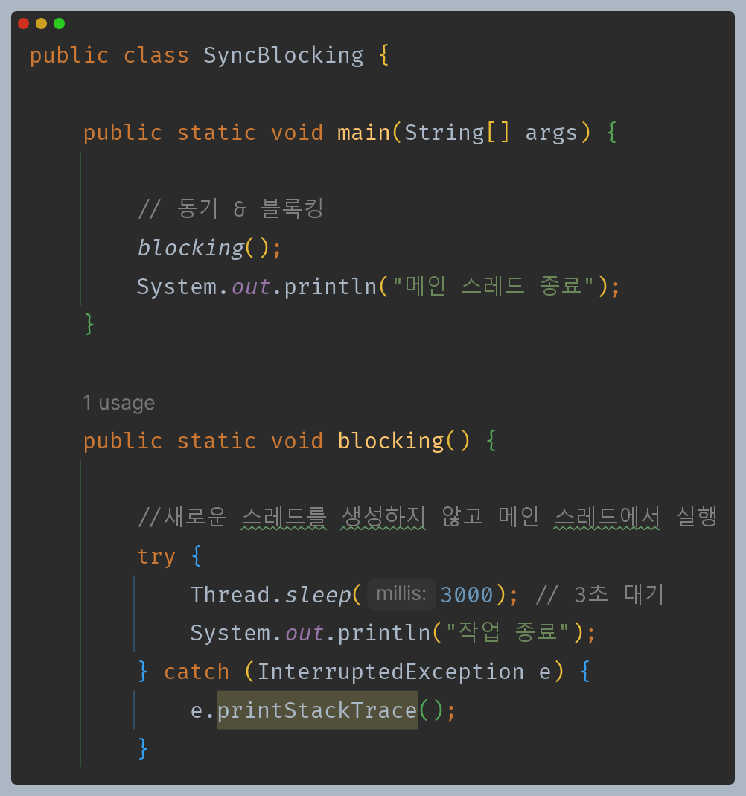

## 2. 동기 & 논블로킹

- **동기** - 작업을 호출하는 주체와 호출되는 주체가 같은 스레드이기 때문에 모든 작업이 순차적으로 처리되며 처리 결과에 관심을 가진다.
- **논블로킹** - 스레드 관계는 비동기이고 스레드마다 독립적으로 작업을 계속 실행해 나가기 때문에 결과를 기다리거나 대기하는 상황이 발생하지 않는다.

> - `T1`은 Task 4에서 `T2`의 작업과 `T3`의 작업이 완료되었는지 대기 및 확인 작업을 하고 있다. 즉, 동기식 처리라고 할 수 있다.
> - `Wait and Acknowledge`는 어떤 작업을 비동기적으로 실행시킨 후 해당 작업의 완료 여부를 체크하면서 작업이 완료되었을 때 그 결과를 확인하고 처리하는 것을 말한다.

### 동기 & 논블로킹 예제 코드

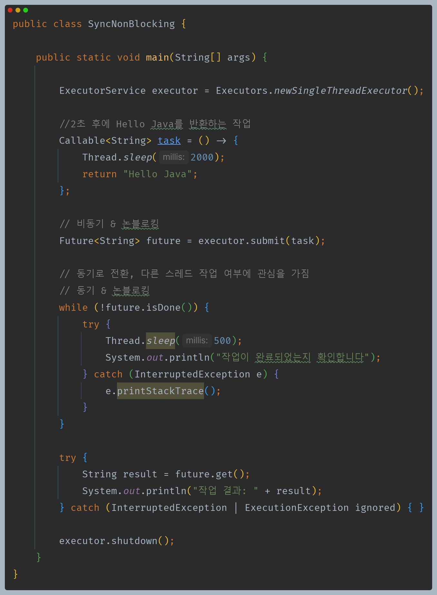

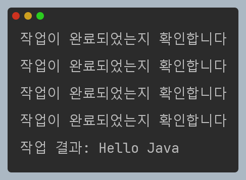

## 3. 비동기 & 블로킹

- **비동기** - 작업을 호출하고 작업을 처리하는 스레드가 서로 다르기 때문에 각각 다른 스택 공간에서 독립적으로 작업을 수행하는 관계를 가진다.
- **블로킹** - 비동기 작업을 수행하다가 외부 리소스(파일, 데이터베이스, 네트워크 등)의 응답을 기다려야 할 때 블로킹이 발생할 수 있다.

> 일반적으로 비동기 & 블로킹 상황이 발생하는 경우는 사용자가 어떤 의도를 가지고 구현 했다기 보다는 실행 환경과 기술 구조에 의해 나타나는 형태라고 볼 수 있으며 흔한 방식은 아니다.

### 비동기 & 블로킹 예제 코드

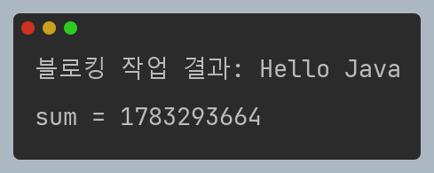

## 4. 비동기 & 논블로킹

- **비동기** - 작업을 호출하고 작업을 처리하는 주체가 서로 다르고 각각 다른 스택 공간에서 독립적으로 작업을 수행하며 다른 스레드의 실행 결과나 응답에 관심이 없다.
- **논블로킹** - 스레드 관계는 비동기이고 스레드마다 독립적으로 작업을 계속 실행해 나가기 때문에 블로킹 현상이 발생하지 않는다.

> - `T1`은 Task 3에서 `T2`를 만들어 Task 3을 수행하도록 하며 결과를 기다리지 않고 바로 Task 4를 수행한다.
> - `T1`은 Task 5에서 `T3`를 만들어 Task 5를 수행하도록 하며 결과를 기다리지 않고 바로 Task 6을 수행한다.
> - 결론적으로 `T1`은 Task 1, 2, 4, 6을 수행하고 나머지는 다른 스레드에 의해 **비동기 & 논블로킹**으로 수행된다.

### 비동기 & 논블로킹 예제 코드

---

[이전 ↩️ - ThreadPoolExecutor - 생명 주기와 상태 & ThreadPoolExecutor 아키텍처](https://github.com/genesis12345678/TIL/blob/main/Java/reactive/ThreadPoolExecutor/LifeCycle.md)

[메인 ⏫](https://github.com/genesis12345678/TIL/blob/main/Java/reactive/Main.md)

[다음 ↪️ - 비동기 프로그래밍 - CompletableFuture](https://github.com/genesis12345678/TIL/blob/main/Java/reactive/AsyncProgramming/CompletableFuture.md)