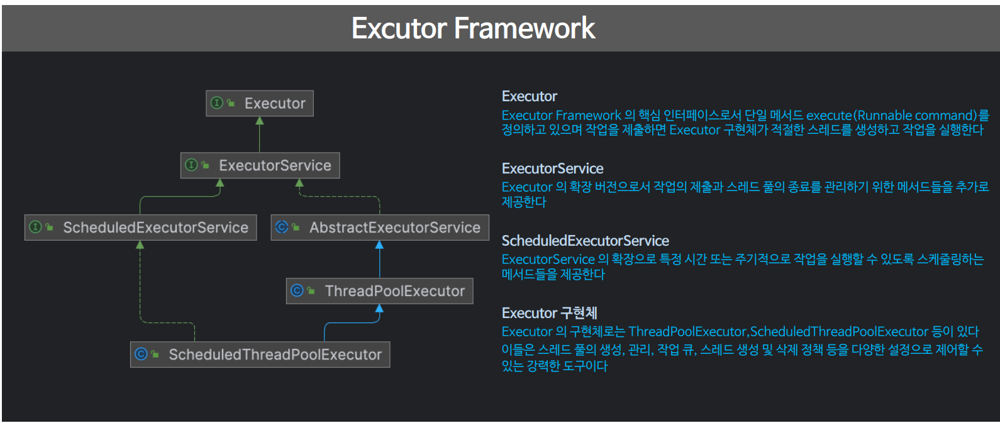
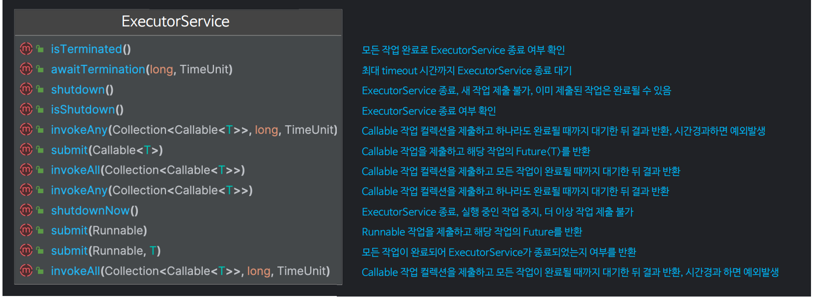
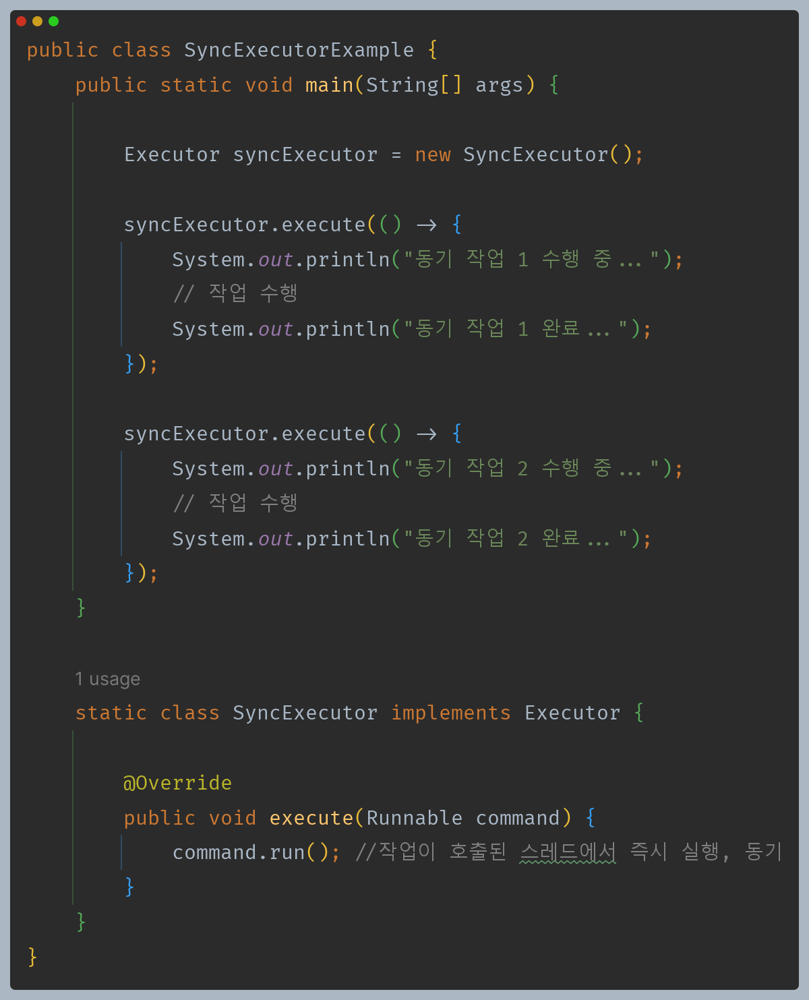
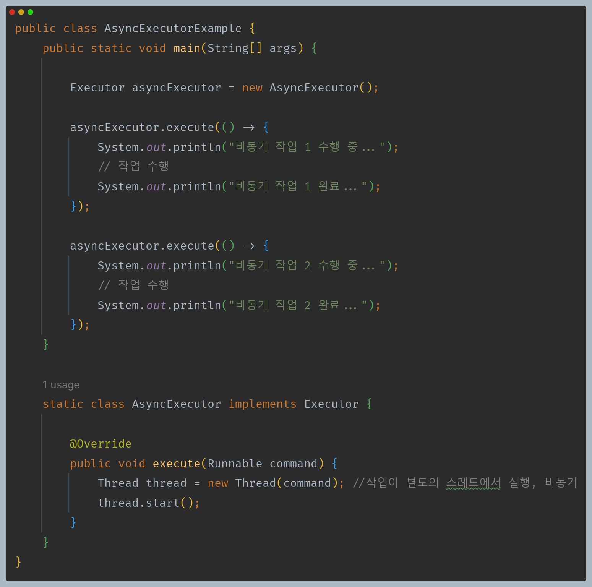

# 자바 동시성 프로그래밍 - Java 동시성 프레임워크

## Executor 프레임워크

- 자바 `Executor` 프레임워크는 자바의 `java.util.concurrent` 패키지에 포함된 스레드 관리와 병렬 처리를 위한 고급 기능들을 제공하는 포괄적인 라이브러리다.
- `Executor` 프레임워크는 복잡한 스레드 생성, 관리, 동기화 등의 작업을 단순화하고 성능을 향상시키기 위한 다양한 클래스와 인터페이스를 제공하고 있다.

---

## Executor

- 제출(submit)된 `Runnable` 작업을 실행(Execute) 하는 객체
- `Executor` 인터페이스는 각 작업의 실행(실행 방법, 스레드 사용, 스케줄링 등의 세부 사항)과 작업의 제출을 분리하는 방법을 제공한다.

- 단 하나의 `execute()` 메서드를 가지고 있으며 **주어진 명령을 미래의 어떤 시점에 실행한다.**
- `Runnable` 명령은 `Executor` 구현 방식에 따라 새 스레드, 풀 스레드 또는 호출 스레드에서 실행 될 수 있다.

### 작업 제출 및 작업 실행

- 직접 스레드를 생성하고 작업을 실행하는 것이 아니라 작업을 제출하면 스레드 생성과 작업 실행은 `Executor` 에서 처리하도록 하는 것이 더 유연하고 좋은 설계이다.

### 더 필요한 기능

- **작업 관리의 부족**
  - 작업의 기본적인 제출과 실행만 다루며, 작업의 상태 추적, 작업 결과 반환, 작업 취소와 같은 작업 관리 기능이 제공되지 않는다.
- **작업 결과 반환의 어려움**
  - 작업이 완료되었을 때 결과를 반환받는 기능이 없어서 작업의 완료 여부 확인이나 결과 처리에 추가적인 구현이 필요하다.
- **스레드 종료의 어려움**
  - 스레드를 명시적으로 종료하거나 정리하는 기능이 없어서 스레드가 더 이상 필요하지 않을 때 스레드를 올바르게 종료하기 어렵다.
- **작업 간 상호작용의 어려움**
  - 작업을 비동기적으로 실행할 경우 작업 결과 공유나 스레드 간 여러 작업의 상호작용이 어렵다.

**`Executor` 를 확장한 `ExecutorService` 인터페이스는 작업 제출과 실행에 더해 작업의 상태 추적, 작업 결과 반환, 작업 취소 등 다양한 작업 관리 기능을 제공한다.**

---

## ExecutorService

- `ExecutorService`는 종료를 관리하는 메서드와 하나 이상의 비동기 작업 신행 상황을 추적하는 데 사용할 수 있는 `Future`를 생성할 수 있는 메서드를 제공하는 `Executor` 이다.

**`ExecutorService`는 작업 제출부터 작업 실행, 작업 완료, 스레드 풀 종료, 자원 회수까지의 과정을 포함하는 라이프 사이클을 가지고 있다.**

---

## Executor 예제 코드

### 동기 실행

### 비동기 실행

---

[이전 ↩️ - Java 동시성 프레임워크 - 스레드 풀](https://github.com/genesis12345678/TIL/blob/main/Java/reactive/javaFramework/ThreadPool.md)

[메인 ⏫](https://github.com/genesis12345678/TIL/blob/main/Java/reactive/Main.md)

[다음 ↪️ - Java 동시성 프레임워크 - Runnable & Callable](https://github.com/genesis12345678/TIL/blob/main/Java/reactive/javaFramework/Runnable.md)