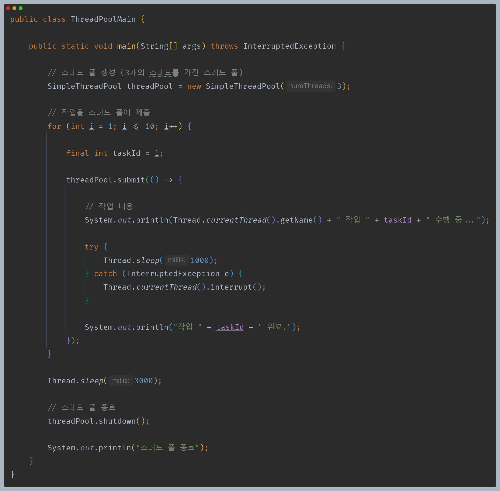
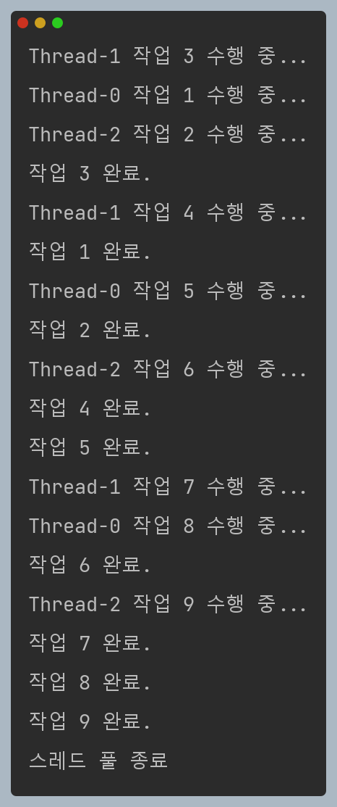

# 자바 동시성 프로그래밍 - Java 동시성 프레임워크

## 스레드 풀

- 스레드 풀 (ThreadPool)은 다수의 스레드를 미리 생성하고 관리하여 작업을 효율적으로 처리하는 디자인 패턴이다.
- 자바에서는 스레드 풀을 사용할 수 있는 `Executor` 프레임워크를 제공하고 있다.

### 스레드 풀이 필요한 이유

1. **스레드 생성 비용 절감**
   - 스레드 생성은 비용이 높다. 그래서 스레드 풀은 미리 스레드를 생성하고 초기화하여 대기 상태로 유지함으로써 스레드 생성 비용을 줄인다.
2. **스레드 재사용**
   - 스레드 풀은 작업이 종료된 스레드를 대기 상태로 전환하여 재사용하며 반복적인 스레드 생성 및 삭제 오버헤드를 피하고 성능을 향상시킨다.
3. **동시성 제어**
   - 스레드 풀은 동시에 실행되는 스레드 개수를 제어함으로써 시스템 리소스의 과도한 사용을 방지하고 스레드 간 경합으로 인한 성능 저하를 예방한다.
4. **대량 요청 시스템 보호**
   - 클라이언트의 동시 접속이 증가하더라도 리소스가 허용하는 한도에서 요청을 대기하도록 함으로써 시스템이 다운되거나 중단되지 않도록 한다.

### 스레드 풀을 구현할 때 필요한 핵심 요소

1. **스레드 생성 및 관리 메커니즘**
   - 스레드 풀을 구현하기 위해 스레드를 생성, 초기화, 재사용, 제거 등을 효율적으로 처리할 수 있는 메커니즘이 필요하다.
2. **작업 큐 (Working Queue)**
   - 작업들을 관리하는 대기열인 작업 큐가 필요하다. 
   - 작업 큐는 작업들을 저장하고 스레드가 작업을 가져와 실행할 수 있는 구조를 제공한다.
3. **동기화 메커니즘**
   - 스레드 간의 경합 상황을 관리하고 동기화를 처리하여 데이터의 일관성과 정확성을 보장한다.
4. **스레드 풀 설정**
   - 동시에 실행되는 스레드의 최대 개수, 작업 큐의 크기, 작업 우선순위 등을 조절하는 파라미터를 포함한다.
5. **스레드 종료 및 리소스 관리**
   - 스레드 풀 내의 스레드가 종료되거나 더 이상 필요하지 않을 때 이를 처리하고 관리하는 메커니즘이 필요하다.
6. **오류 처리 메커니즘**
   - 작업 실행 중에 오류가 발생할 수 있으므로 이를 처리하고 적절한 조치를 취하는 메커니즘이 필요하다.

---

## 스레드 풀 구조

---

## 스레드 풀 예제 코드

3개의 스레드가 있는 스레드 풀을 이용해 작업 10개를 처리한다.

---

[이전 ↩️ - Java 동기화 도구 - CyclicBarrier]()

[메인 ⏫](https://github.com/genesis12345678/TIL/blob/main/Java/reactive/Main.md)

[다음 ↪️ - Java 동시성 프레임워크 - Executor]()