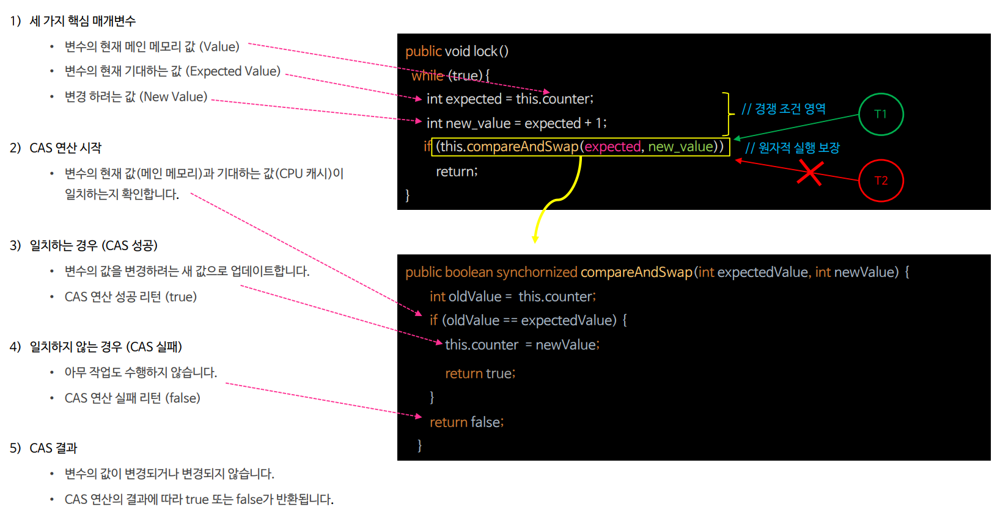
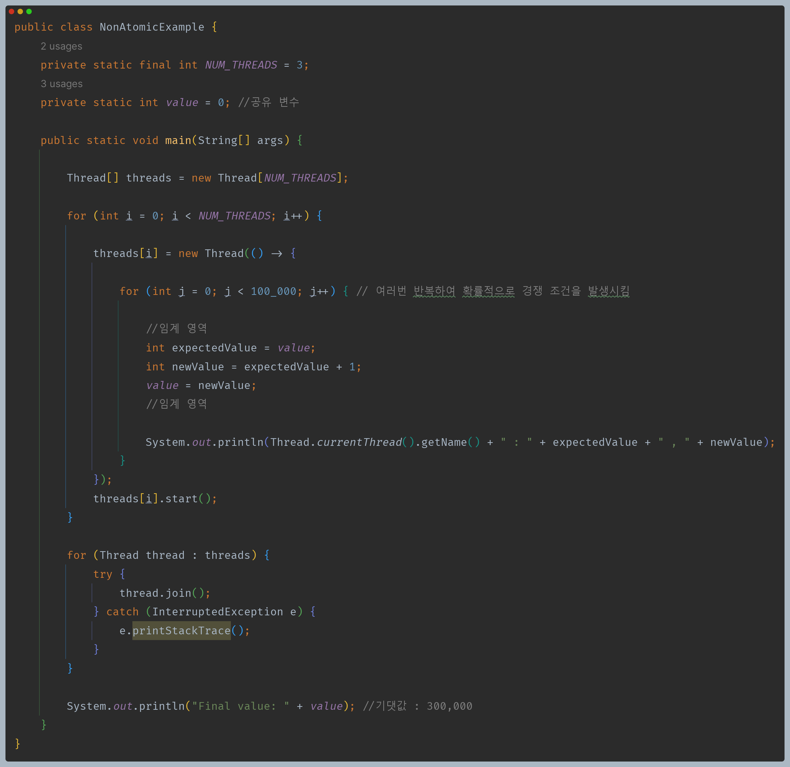
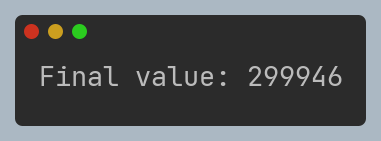
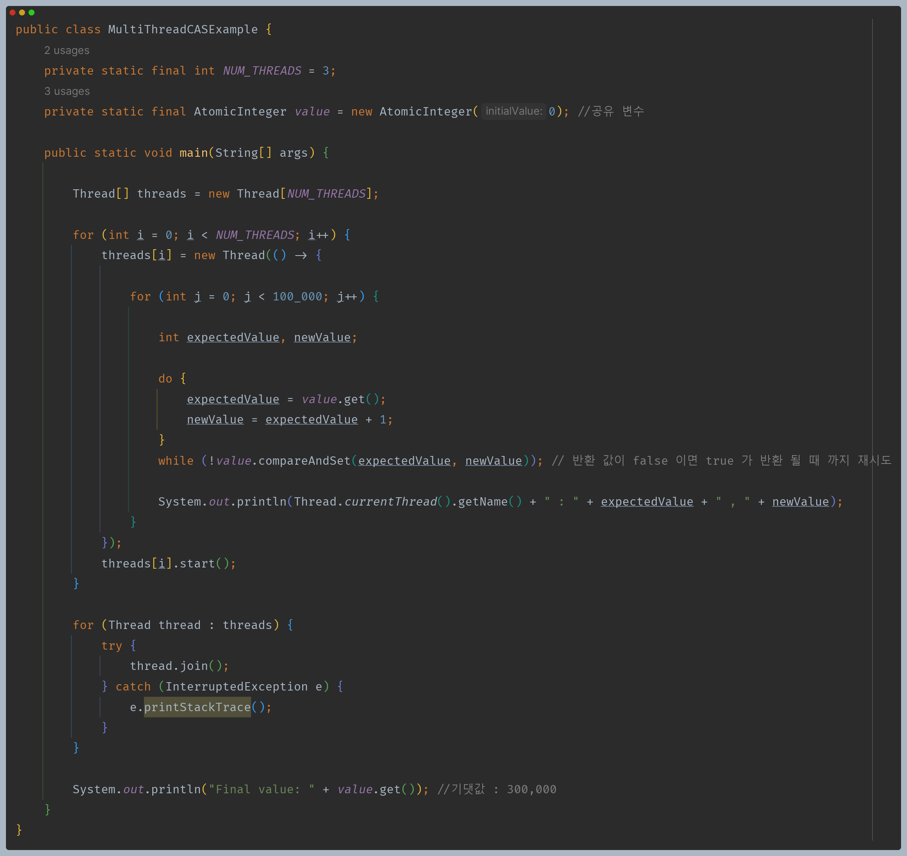
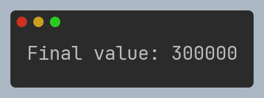

# 자바 동시성 프로그래밍 - Java 동기화 도구

## CAS (Compare and Swap)

- **CAS(Compare and Swap, 비교 후 치환)** 는 멀티 스레드 환경에서 스레드 간의 경쟁 조건을 방지하고 락을 사용하지 않고도 공유 변수의 값을 원자적으로 변경하는 방법을 제공한다.
- **CAS**는 **CPU 캐시와 메인 메모리의 두 값을 비교하고 그 값이 동일할 경우 새로운 값으로 교체하는 동기화 연산**으로 여러 스레드가 공유하는 메모리 영역을 보호하는 데 사용된다.
- **CAS**는 락 기반의 동기화보다 경량화되어 있으며 락을 사용하지 않기 때문에 대기하지 않는 논블로킹 실행이 가능하고 경쟁 조건과 데드락을 피할 수 있다.
- **CAS**는 조건에 따라 실패하고 다시 시도해야 할 수 있기 때문에 동시적으로 접근하는 요청의 수가 많은 경쟁 조건일 경우 효율성이 저하될 수 있다.
- **CAS**는 주로 하드웨어 수준(CPU) 에서 지원되는 연산이며 자바에서는 `java.util.concurrent.atomic` 패키지에 있는 원자적 연산을 통해 **CAS**를 지원하고 있다.

### CAS 동작 방식 예

---

## CAS 예제 코드

### 1. 원자성 보장 X

- 락이나 `synchronized` 등을 통해 동기화를 보장해 주지 않기 때문에 임계 영역 작업 도중 컨텍스트 스위칭으로 공유 변수의 값이 예상하지 못한 결과를 볼 수 있다.

### 2. 원자성 보장 O

- 위와 같은 구조 역시 락이나 `synchronized`를 사용하지 않아 임계 영역에 여러 스레드가 동시 접근이 가능하다.
- 하지만 **CAS** 연산을 통해 조건에 맞지 않으면 대기하고 다른 조건에 맞는 스레드가 연산을 한 후에 접근이 가능해진다.
- 이렇게 락을 사용하지 않고도 동시성 문제를 해결할 수 있다.
- 하지만 스레드의 수가 많을 때 **CAS** 연산에 계속 실패하면 성공할 때까지 대기하기 때문에 성능이 안 좋아 질 수 있다.

---

[이전 ↩️ - Java Locks - Condition]()

[메인 ⏫](https://github.com/genesis12345678/TIL/blob/main/Java/reactive/Main.md)

[다음 ↪️ - Java 동기화 도구 - Atomic Variable]()