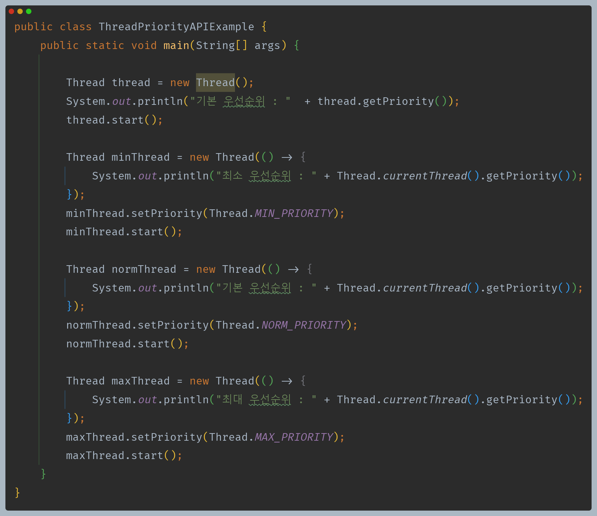
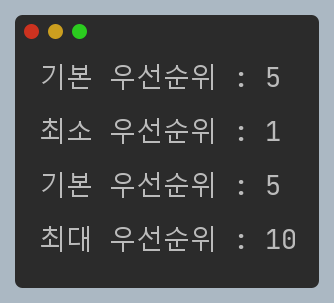
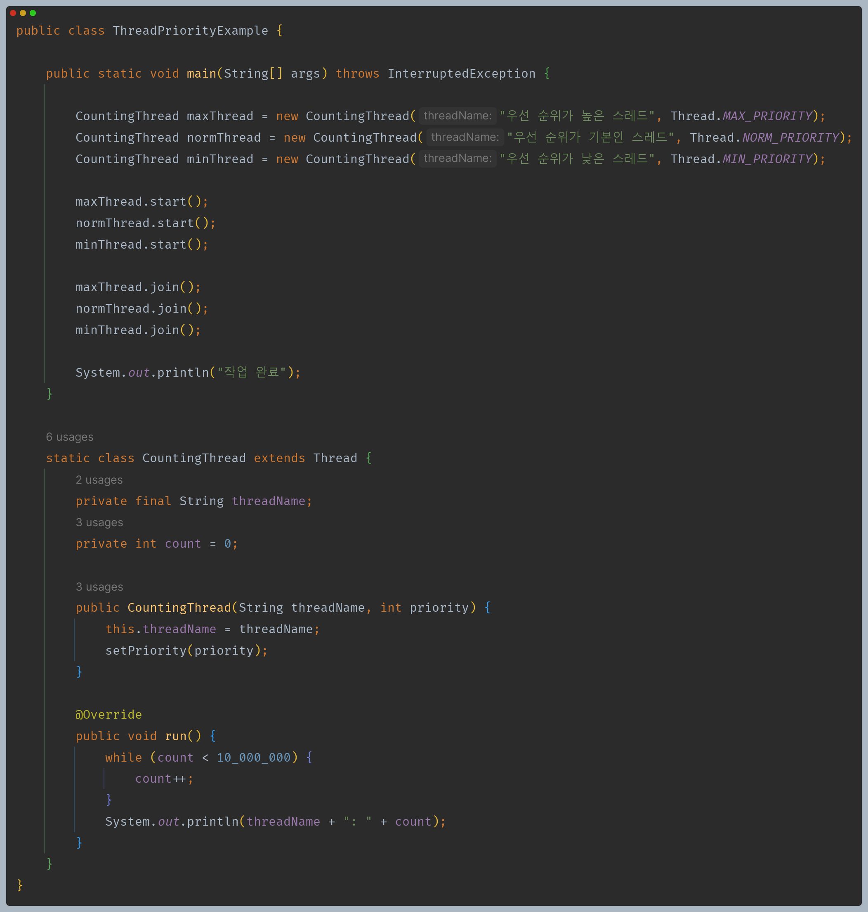

# 자바 동시성 프로그래밍 - Java Thread

## 스레드 우선순위

- 단일 CPU 에서 여러 스레드를 실행하는 것을 스케줄링 이라고 하며, 스레드는 스케줄링에 의해 선점되어 CPU를 할당받는다.
- 자바 런타임은 **고정 우선순위 선점형 스케줄링(fixed-priority pre-emptive scheduling)** 으로 알려진 매우 단순하고 결정적인 스케줄링 알고리즘을 지원한다.
- 이 알고리즘은 실행 대기 상태의 스레드 중에 상대적인 우선 순위에 따라 스레드를 예약한다.

### 우선순위 개념

- 자바에서 스레드의 우선 순위는 1 ~ 10 사이의 정수이며 정수 값이 높을수록 우선순위가 높다.
- 스레드가 생성될 때 우선순위 값이 정해지며 기본 우선순위인 5로 설정된다.
- 스케줄러는 우선순위가 높은 스레드를 실행하다가 해당 스레드가 중지, 양보 또는 실행 불가능이 되는 경우 우선 순위가 낮은 스레드를 실행하기 시작한다.
- 드 스레드의 우선순위가 같을 경우 라운드 로빈 스케줄링 방식(순환 할당)에 의해 다음 스레드를 선택한다.
- **스케줄러가 반드시 우선순위가 높은 스레드를 실행하다고 보장 할 수 없다. 운영체제마다 다른 정책들이 있을 수 있으며 기아 상태를 피하기 위해
    스케줄러는 우선순위가 낮은 스레드를 선택할 수 있다.**

### 우선순위 유형

- 최소 우선순위 - 1
  - `public static int MIN_PRIORITY`
- 기본 우선순위 - 5
  - `public static int NORM_PRIORITY`
- 최대 우선순위 - 10
  - `public static int MAX_PRIORITY`

### 우선순위 변경 및 확인

- `public final void setPriority(int newPriority)`
    - 스레드의 우선순위를 새롭게 변경한다.
    - 스레드에 대해 허용되는 우선순위 값은 1 ~ 10 이며, 이 외에 값을 설정하면 `IllegalArgumentException` 예외가 발생한다.
- ` public final int getPriority()`
  - 스레드의 우선순위를 반환한다.

---

우선순위를 직접 설정한다고 해도 실행 순서가 항상 같지 않은 것을 확인할 수 있다.

---

[이전 ↩️ - Java Thread - `name()` & `currentThread()` & `isAlive()`]()

[메인 ⏫](https://github.com/genesis12345678/TIL/blob/main/Java/reactive/Main.md)

[다음 ↪️ - Java Thread - ]()