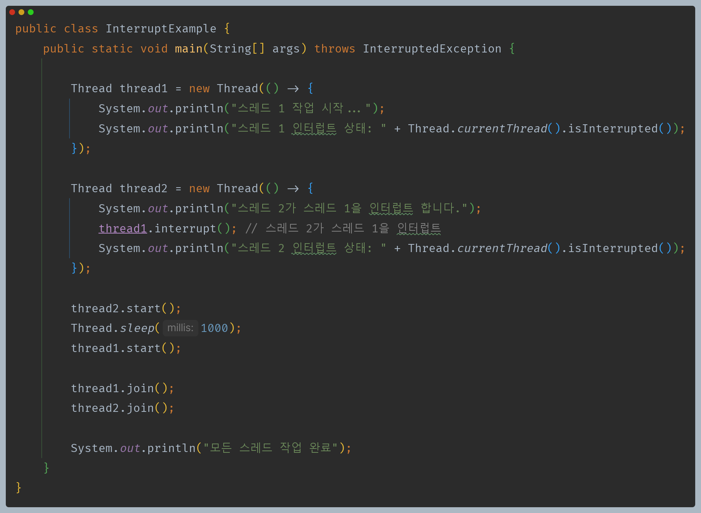
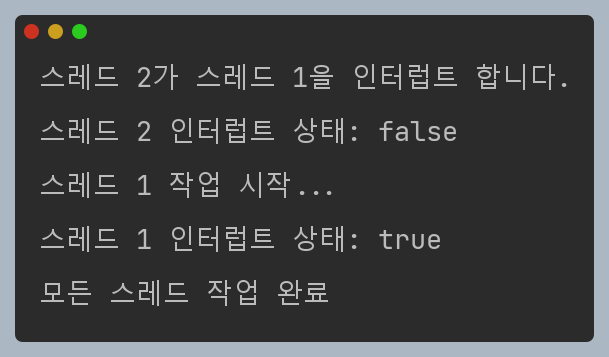
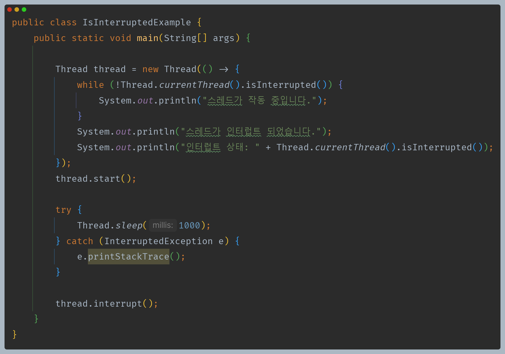
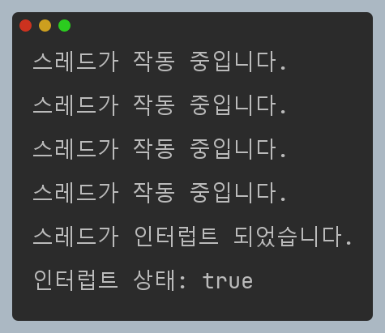
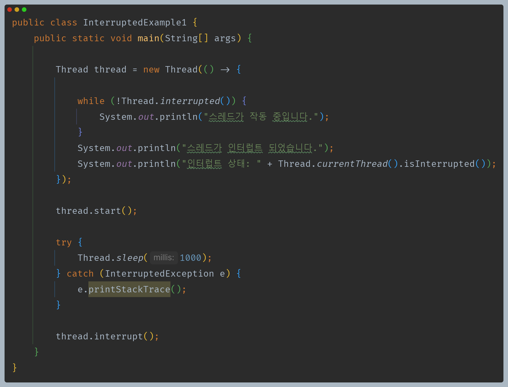
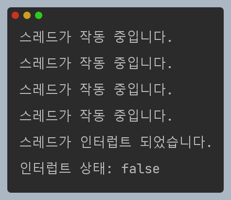
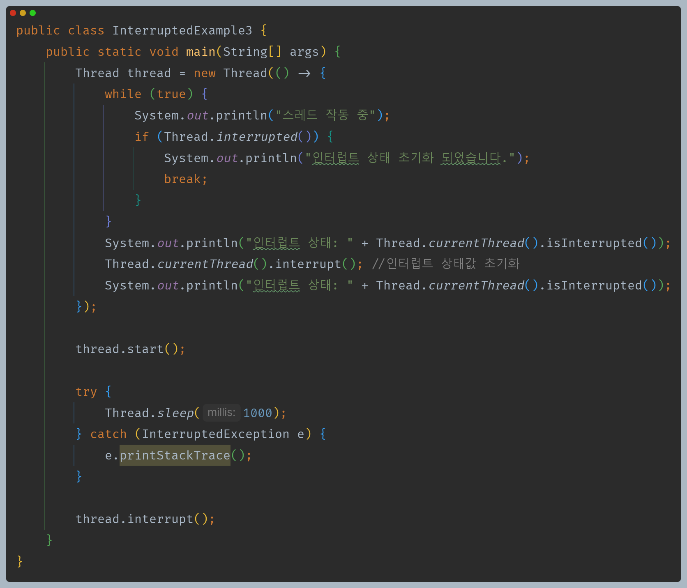
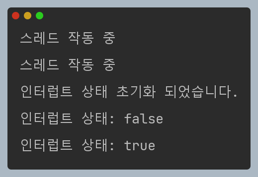
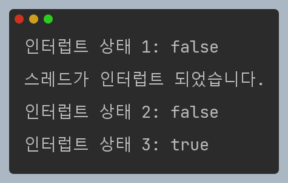

# 자바 동시성 프로그래밍 - Java Thread

## interrupt()

> - `Interrupt`는 "방해하다" 라는 뜻으로, 어떤 주체의 행동이나 실행 흐름을 방해한다는 의미로 해석할 수 있다.
> - 자바 스레드에서 `interrupt()`는 특정한 스레드에게 인터럽트 신호를 알려줌으로써 스레드의 실행을 중단하거나 작업 취소, 강제 종료 등으로 사용할 수 있다.

- `interrupt()`는 스레드에게 인터럽트가 발생했다는 신호를 보내는 메커니즘이다.
- `interrupt()`는 스레드가 현재 실행 흐름을 멈추고 인터럽트 이벤트를 먼저 처리하도록 시그널을 보내는 장치라 할 수 있다.
- **interrupted 속성**
  - 스레드는 인터럽트 상태 `interrupted` 속성을 가지고 있으며 인터럽트 발생 여부를 확인할 수 있는 상태 값이다. (기본값은 `false`)
  - 인터럽트된 스레드가 처리해야 하는 특별한 규칙이나 정해진 기준은 없으나 일반적으로 인터럽트 상태를 사용해서 스레드를 중지하거나, 작업을 취소하거나,
    스레드를 종료 하는 등의 기능을 구현할 수 있다.
  - 한 스레드가 다른 스레드를 인터럽트 할 수도 있고, 자기 자신을 인터럽트 할 수 있다.
  - `interrupt()` 하는 횟수는 제한이 없으며, 인터럽트 할 때 마다 스레드의 인터럽트 상태를 `true`로 변경한다.

---

## 인터럽트 상태 확인 방법

- `public static boolean interrupted()`
  - 스레드의 인터럽트 상태를 반환하는 정적 메서드
  - 만약 현재 인터럽트 상태가 `true`인 경우 `true`를 반환하고, 인터럽트 상태를 `false`로 초기화 하므로 인터럽트를 해제하는 역할을 한다.
  - 인터럽트를 해제하는 경우 다른 곳에서 해당 스레드에 대한 인터럽트 상태를 체크하는 곳이 있다면 별도의 처리가 필요할 수 있다.
  - 인터럽트를 강제로 해제했기 때문에 다시 인터럽트를 걸어서 인터럽트 상태를 유지할 수 있다.
- `public boolean isInterrupted()`
  - 스레드의 인터럽트 상태를 반환하는 인스턴스 메서드
  - 이 메서드는 스레드의 인터럽트 상태를 변경하지 않고 계속 유지한다.
  - 인터럽트 상태를 확인하는 용도로만 사용할 경우 `interrupted()` 보다 이 메서드를 사용하는 것이 좋다.

---

## InterruptedException

- `InterruptedException`은 `interrupt()` 메커니즘의 일부이며, 대기나 차단 등 블록킹 상태에 있거나 블록킹 상태를 만나는 시점의 스레드에 인터럽트 할 때 발생하는 예외이다.
- `InterruptedException`이 발생하면 인터럽트 상태는 자동으로 초기화 된다. 즉, `Thread.interrupted()` 한 것과 같은 상태로 된다.
- 다른 곳에서 인터럽트 상태를 참조하고 있다면 예외 구문에서 대상 스레드에 다시 `interrupt()` 해야 할 수도 있다.
- `InterruptedException`이 발생하는 케이스는 다음과 같다.
  - `Thread.sleep()`, `Thread.join()`, `Object.wait()`
  - `Future.get()`, `BlockingQueue.take()`

---

## 인터럽트 예제 코드

> 다른 스레드에게 인터럽트 하면 인터럽트 상태가 변경되는 것을 확인할 수 있다.(자기 자신에게 인터럽트도 가능)

> 메인 스레드에서 1초 후에 인터럽트를 걸어 `while` 문을 빠져나오게 된다.

> `interrupted()`를 사용하면 인터럽트 상태를 다시 `false`로 초기화 하는 것을 확인할 수 있다.

> 다른 곳에서 해당 스레드의 인터럽트 상태를 참조하고 있다면 인터럽트 상태값을 다시 초기화 할 수 있다.

> `interrupted()` 또는 `InterruptedException` 예외 구문에 올 경우 인터럽트 상태는 초기화 된다.

---

[이전 ↩️ - Java Thread - `join()`]()

[메인 ⏫](https://github.com/genesis12345678/TIL/blob/main/Java/reactive/Main.md)

[다음 ↪️ - Java Thread - `name()` & `currentThread()` & `isAlive()`]()