# 자바 동시성 프로그래밍 - Java Thread

# 스레드 생명주기와 상태

- 자바 스레드는 생성과 실행 그리고 종료에 따른 상태를 가지고 있으며 `JVM` 에서는 6가지의 스레드 상태가 존재한다.(OS 스레드 상태를 의미하지 않는다.)
- 자바 스레드는 어떤 시점이든 6가지 상태 중 오직 하나의 상태를 가질 수 있다.
- 자바 스레드의 현재 상태를 가져오려면 `Thread`의 `getState()` 메서드를 사용하여 가져올 수 있다.
- `Thread` 클래스에는 스레드 상태에 대한 `ENUM` 상수를 정의하는 `Thread.State` 클래스를 제공한다.

**스레드 상태**

| 상태    | ENUM          | 설명                                            |
|-------|---------------|-----------------------------------------------|
| 객체 생성 | **NEW**           | 스레드 객체가 생성됨, 아직 시작되지 않은 스레드 상태                |
| 실행 대기 | **RUNNABLE**      | 실행 중이거나, 실행 가능한 스레드 상태                        |
| 일시 정지 | **WAITING**       | 대기 중인 스레드 상태로서, 다른 스레드가 특정 작업을 수행하기를 기다림      |
| 일시 정지 | **TIMED_WAITING** | 대기 시간이 지정된 스레드 상태로서, 다른 스레드가 특정 작업을 수행하기를 기다림 |
| 일시 정지 | **BLOCKED**       | 모니터 락(`Lock`)이 해제될 때까지 기다리며 차단된 스레드 상태        |
| 종료    | **TERMINATED**    | 실행이 완료된 스레드 상태                                |

---

# 스레드 생명주기

### 1. 객체 생성 상태

- 스레든 객체는 생성 되었지만 아직 `start()` 하지 않은 상태로서 `JVM`에는 객체가 존재하지만 아직 커널로의 실행은 안된 상태라 볼 수 있다.

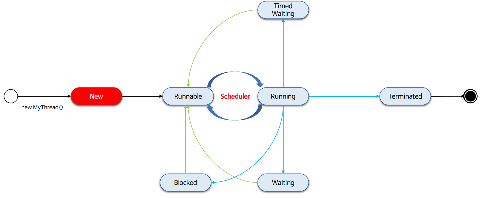

### 2. 실행 대기 상태

- `start()`를 실행하면 내부적으로 커널로의 실행이 일어나고 커널 스레드로 일대일 매핑된다.
- 스레드는 바로 실행 상태가 아닌 언제든지 실행할 준비가 되어 있는 실행 가능한 상태가 된다.
- 스레드가 실행 상태로 전환하기 위해서는 현재 스레드가 어떤 상태로 존재하든지 반드시 실행 대기 상태를 거쳐야 한다.

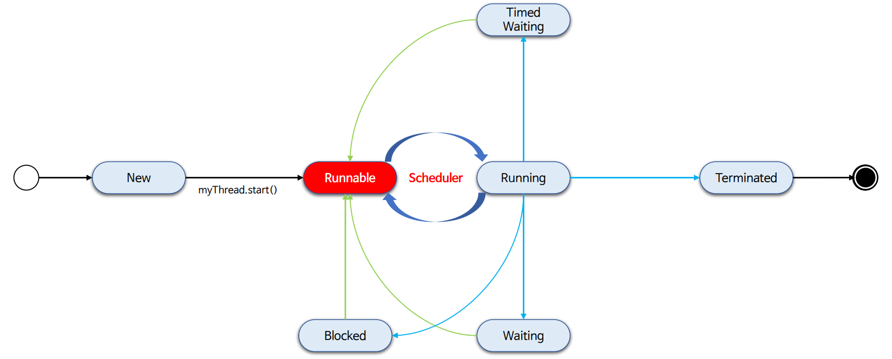

### 3. 스케줄링

- 실행 가능한 상태의 스레드에게 실행할 시간을 제공하는 것은 OS 스케줄러의 책임이다.
- 스케줄러는 멀티 스레드 환경에서 각 스레드에게 고정된 시간을 할당해서 실행 상태와 실행 가능한 상태를 오가도록 스케줄링 한다.

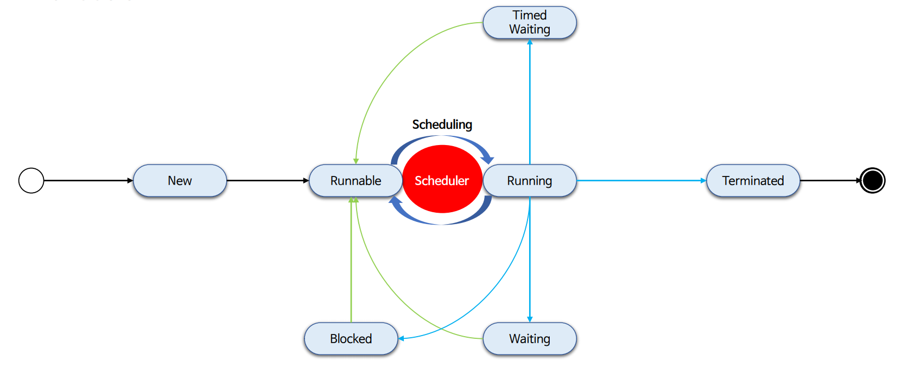

### 4. 실행 상태

- 스레드는 스케줄러에 의해 스케줄링 되면 실행 상태로 전환되고, CPU를 할당 받아 `run()` 메서드를 실행한다.
- 스레드는 아주 짧은 시간동안 실행된 다음 스레드가 실행될 수 있도록 CPU를 일시 중지하고 다른 스레드에 양도하게 된다.
- 실행 상태에서 생성과 종료 상태를 제외한 다른 상태로 전환될 때 스레드 또는 프로세스 간 컨텍스트 스위칭이 일어난다고 할 수 있다.

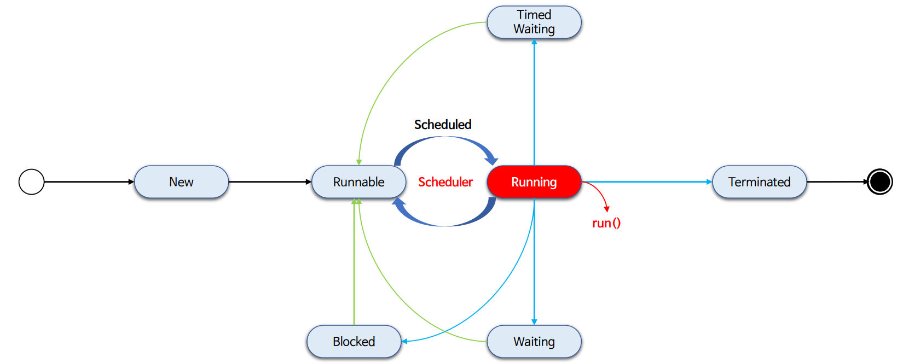

### 4-1-1. 실행 상태 => 실행 대기 상태

- 실행 상태에서 스레드의 `yield()` 메서드를 호출하거나, 운영체제 스케줄러에 의해 CPU 실행을 일시 중지하는 경우 실행 가능한 상태로 전환한다.

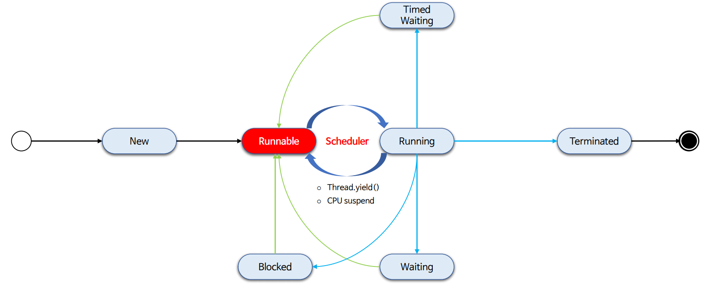

### 4-1-2. 실행 상태로 전환

### 4-2-1. 일시 정지 상태 (지정된 시간이 있는 경우)

- 스레드는 `sleep()` 및 `time-out` 매개 변수가 있는 메서드를 호출할 때 시간이 지정된 대기 상태가 된다.
- 스레드의 대기 시간이 길어지고 CPU의 할당을 계속 받지 못하는 상홍이 발생하면 기아 상태가 발생하게 되는데 이 상황을 피할 수 있다.

### 4-2-2. 실행 대기 상태

- 스레드가 대기 상태의 지정 시간이 완료되거나, 다른 스레드에 의해 인터럽트가 발생하거나, 대기가 해제하도록 통지(`notify`)를 받게 되면 실행 대기 상태가 된다.

### 4-3-1. 임계 영역 동시적 접근

- 멀티 스레드 환경에서 각 스레드가 동기화 된 임계 영역에 접근을 시도

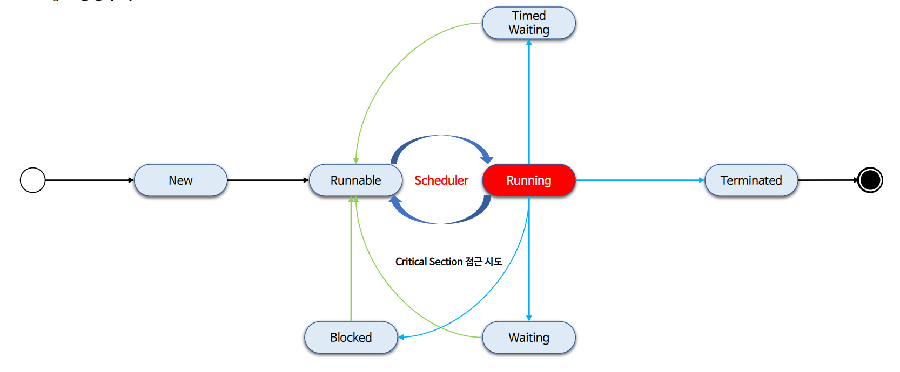

### 4-3-2. 일시 정지 상태 (차단됨)

- 스레드가 동기화 된 임계 영역에 접근을 시도하다가 `Lock`을 획득하지 못해서 차단된 상태
- 스레드는 `Lock`을 획득할 때가지 대기한다.

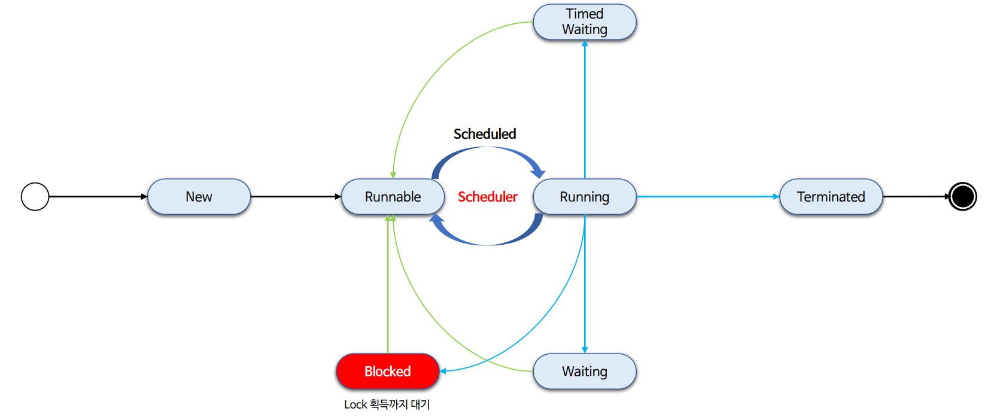

### 4-3-3. 일시 정지 상태 => 실행 대기 상태

- 스레드가 `Lock`을 획득하게 되면 실행 대기 상태가 된다.

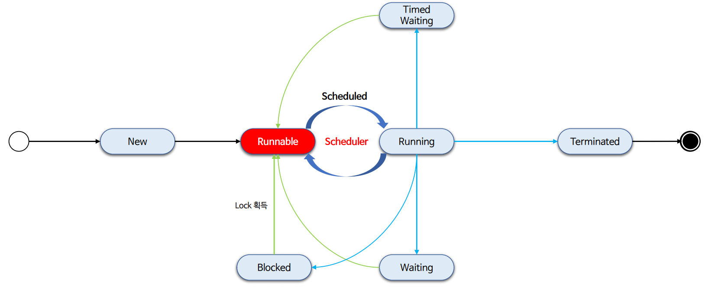

### 4-3-4. 실행 상태로 전환

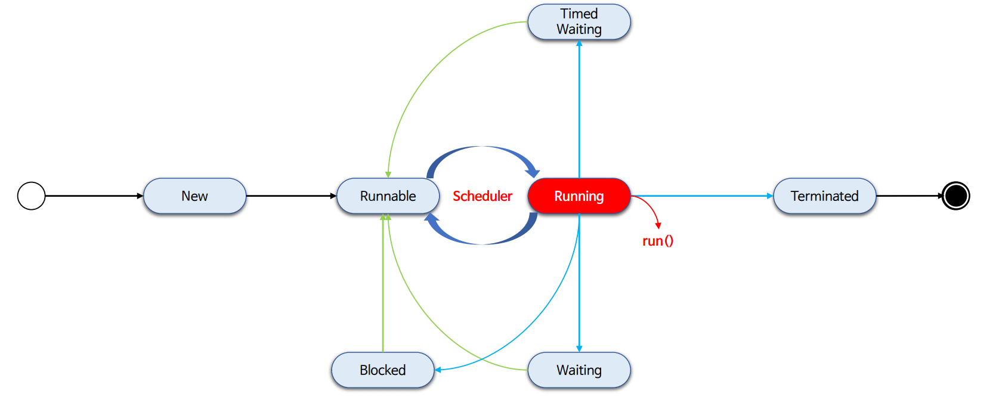

### 4-4-1. 일시 정지 상태

- 스레드가 실행 상태에서 다른 스레드가 특정 작업을 수행하기를 기다리는 상태
- `wait()`은 다른 스레드에 의해 `notify()` 받을 때까지, `join()`은 스레드의 실행이 종료되거나 인터럽트가 발생할 때가지 대기한다.

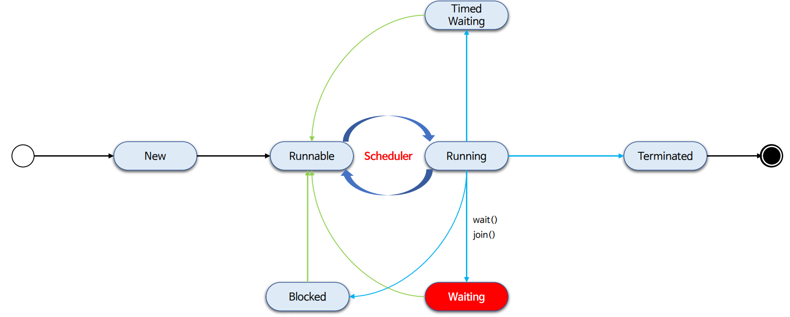

### 4-4-2. 일시 정시 상태 => 실행 대기 상태

- `wait` 상태의 스레드가 다른 스레드에 의해 `notify()` 또는 `notifyAll()`이 일어나면 실행 대기 상태가 된다.
- 다른 스레드에 의해 인터럽트가 발생할 경우 실행 대기 상태로 전환 한다.

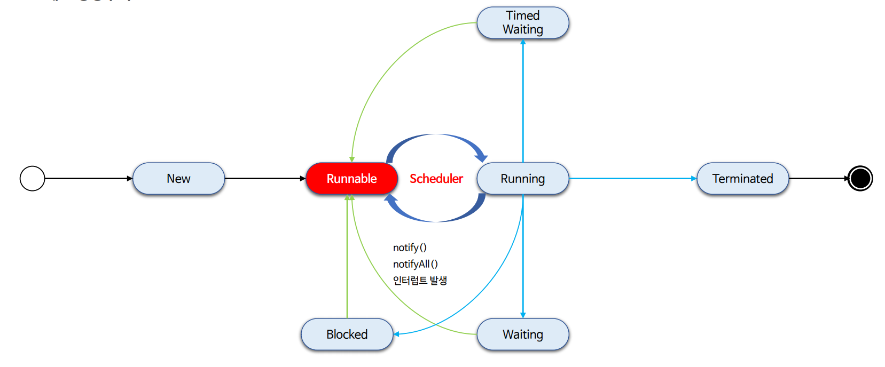

### 4-4-3. 실행 상태로 전환

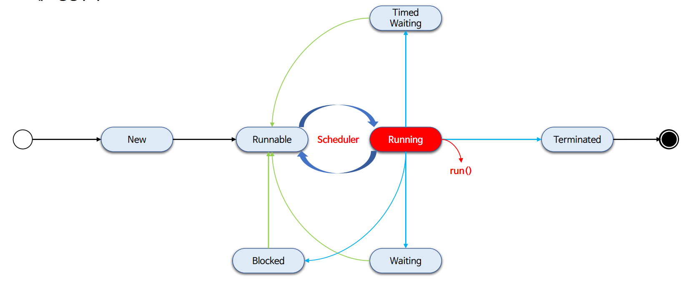

### 5. 실행 종료 상태

- 실행이 완료되었거나 오류 또는 처리되지 않은 예외와 같이 비정상적으로 종료된 상태
- 종료된 스레드는 종료되어 더 이상 사용할 수 없다.

---

# 스레드 생명주기 정리

- 스레드를 효과적으로 잘 운용하기 위해서는 스레드 생명주기와 상태를 잘 알아야 한다.
  - 스레드는 어떤 상황, 시점, 조건에 의해 상태 전이가 일어나는가
  - 스레드의 API를 사용함에 있어 해당 API가 어떤 상태를 일으키며 스레드 간 영향을 미치게 되는가
- 스레드의 실행 관점에서 보면 출발지가 **스레드의 `start()` 메서드 실행** 이라면, 목적지는 **스레드의 `run()` 메서드 실행** 이 된다는 점이다.

---

# 스레드 생명주기 예제 코드

### NEW

### RUNNABLE

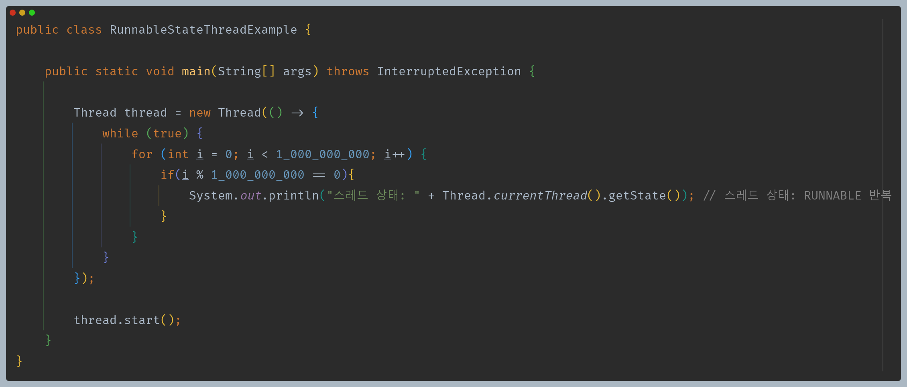

### WAITING

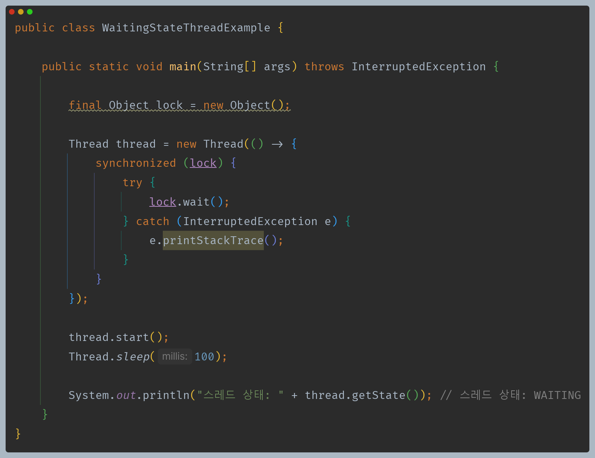

### TIMED_WAITING

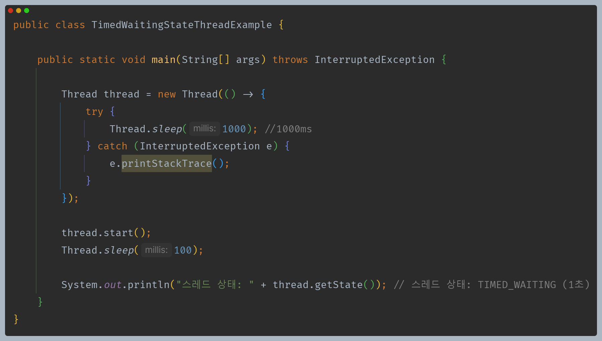

### BLOCKED

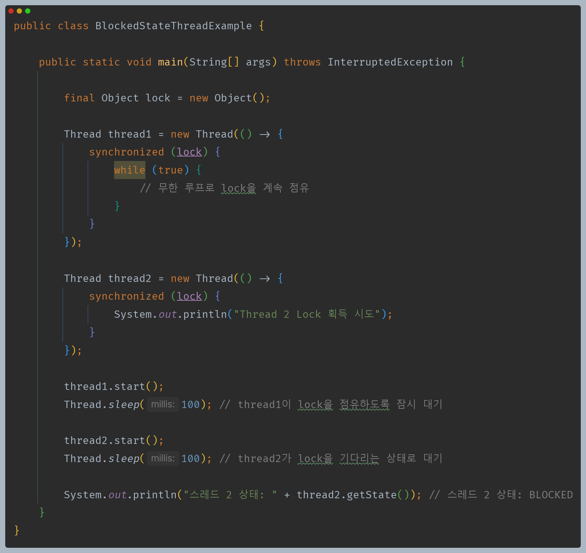

### TERMINATED

---

[이전 ↩️ - Java Thread - 스레드 실행 및 종료]()

[메인 ⏫](https://github.com/genesis12345678/TIL/blob/main/Java/reactive/Main.md)

[다음 ↪️ - Java Thread - ]()