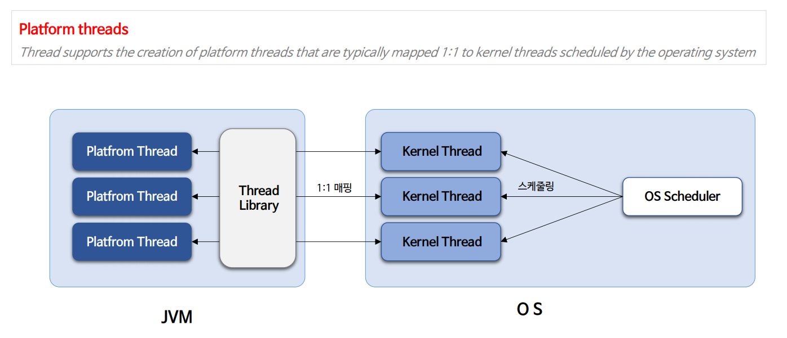
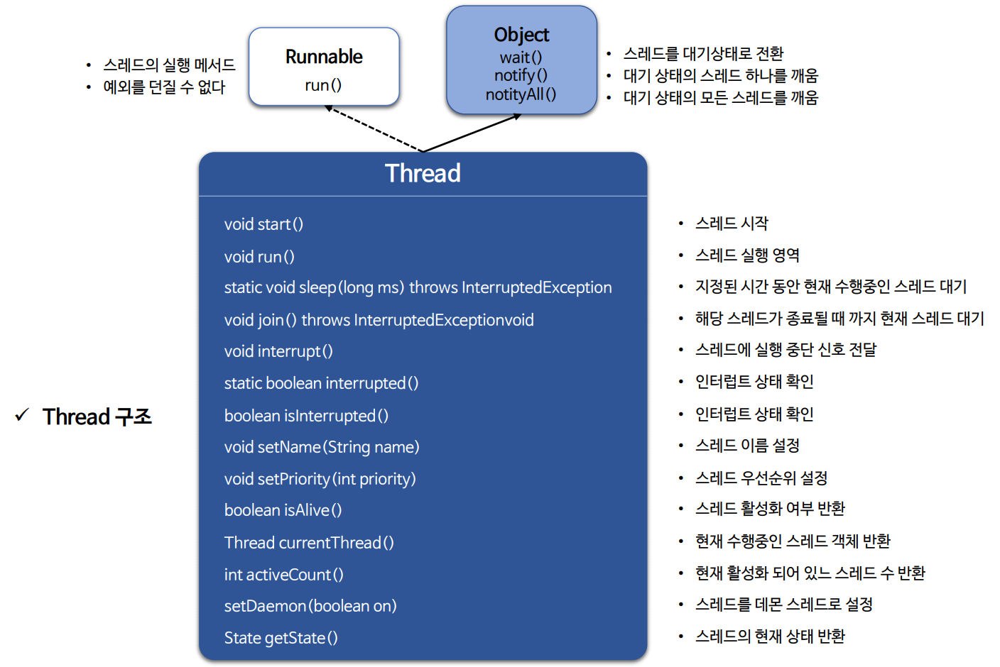
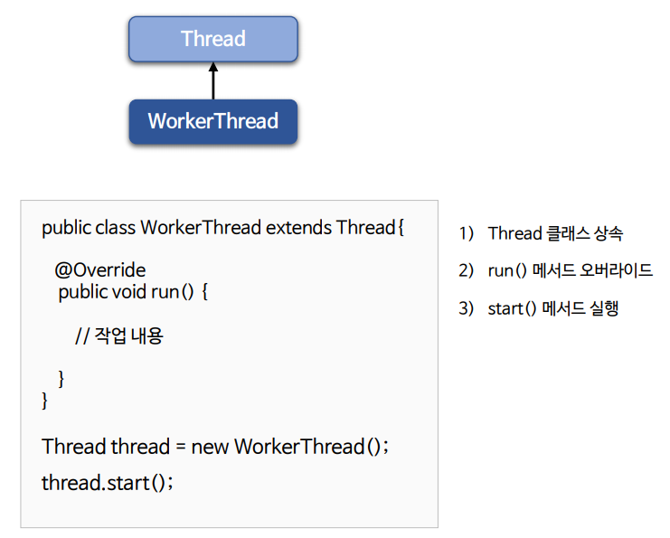
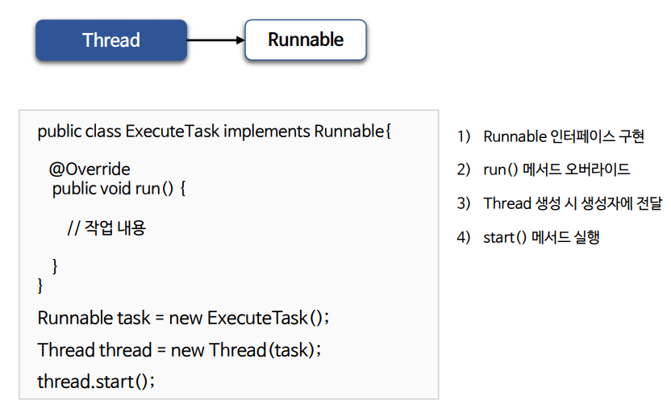
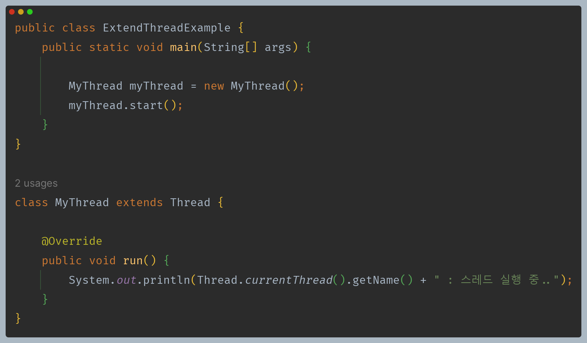
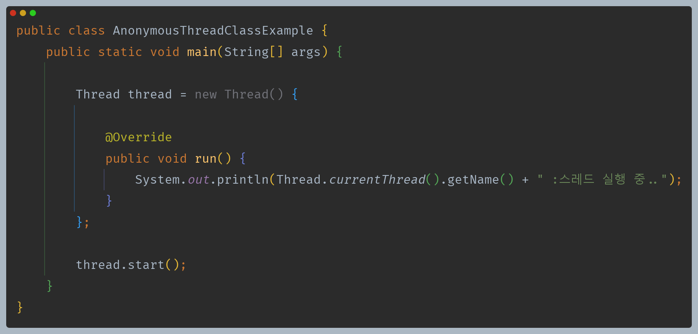
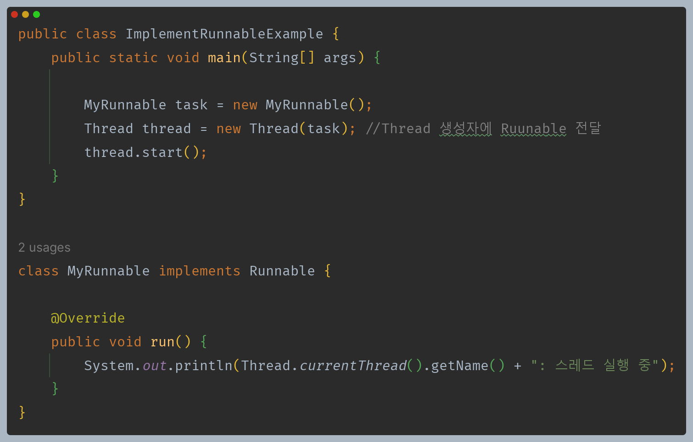
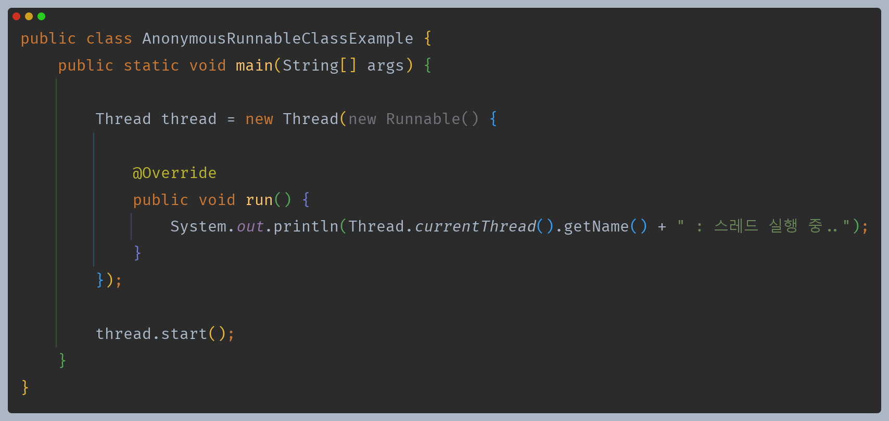

# 자바 동시성 프로그래밍 - Java Thread

- 자바 스레드는 `JVM` 에서 `User Thread`를 생성할 때 시스템 콜을 통해서 커널에서 생성된 `Kernel Thread` 와 일대일로 매핑되어 최종적으로 커널에서 관리된다.
- `JVM`에서 스레드를 생성할 때마다 커널에서 자바 스레드와 대응하는 커널 스레드를 생성한다.
- 자바에서는 `Platform Thread`로 정의되어 있다. 즉, OS 플랫폼에 따라 `JVM`이 사용자 스레드를 매핑하게 된다.

# 스레드 생성

스레드 생성은 크게 두가지 형태로 구현할 수 있다.

## Thread 클래스를 상속하는 방법

작업 내용을 스레드 내부에 직접 재정의해서 실행한다.

## Runnable 인터페이스를 구현하는 방법

작업 내용을 `Runnable`에 정의해서 스레드에 전달하면 스레드는 `Runnable`을 실행한다.

---

# 다양한 스레드 생성 패턴

스레드를 생성하는 다양한 생성 패턴이 있다.

## 1. Thread를 상속한 클래스

- 가장 기본적인 방식이며 `Thread` 클래스를 반드시 상속받아야 한다.
- 상속의 특성상 컴파일 타임 시점에 실행 코드가 결정되어 동적인 기능 변경이 불가능하다는 단점이 있다.

## 2. Thread 익명 클래스

- 스레드 객체를 참조하거나 재활용하지 않고 일회용으로만 사용할 경우

## 3. Runnable 구현

- `Runnable`을 태스크로 활용하는 방식으로 가장 선호하는 방식이다.
- 스레드와 실행하고자 하는 태스크를 분리함으로써 좀 더 유연하고 확장 가능한 구조로 구현이 가능하다.

## 4. Runnable 익명 클래스

- `Runnable` 타입을 참조하거나 재활용하거나 일회용으로만 사용할 경우

## 5. Ruunable 람다 방식

- `Runnable`을 람다 형식으로 구현함으로써 코드가 간결해진다.

---

[이전 ↩️ - 운영 체제 기본 지식 - 사용자 & 커널 수준 스레드]()

[메인 ⏫](https://github.com/genesis12345678/TIL/blob/main/Java/reactive/Main.md)

[다음 ↪️ - Java Thread - 스레드 실행 및 종료]()