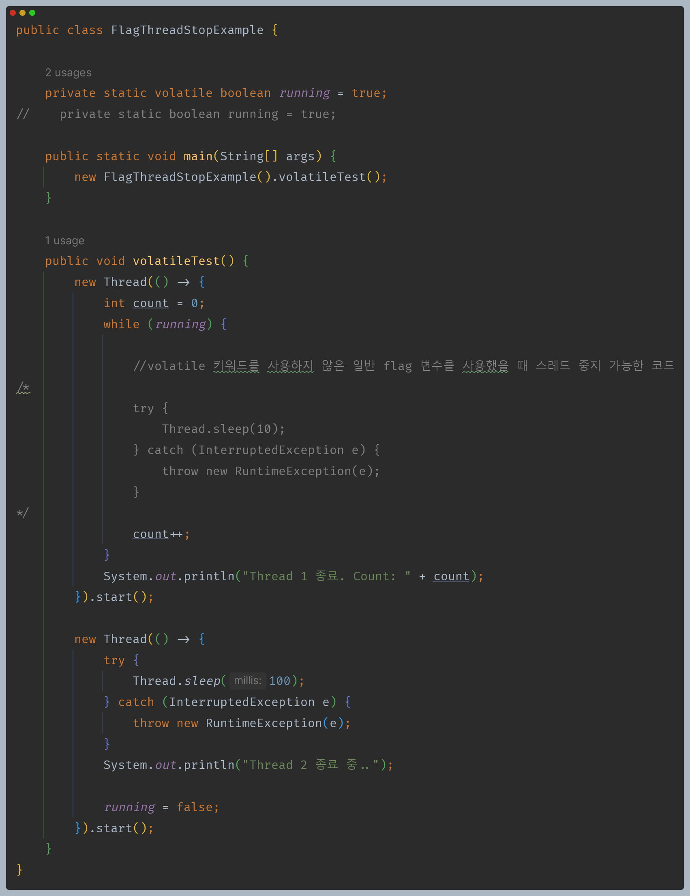
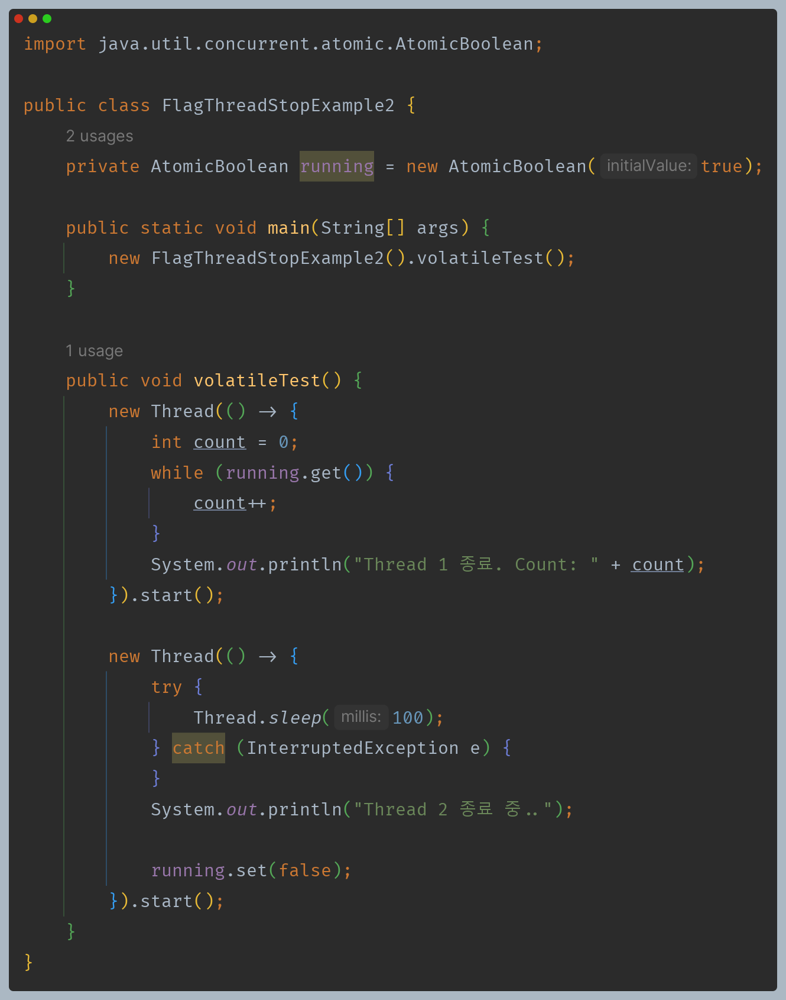
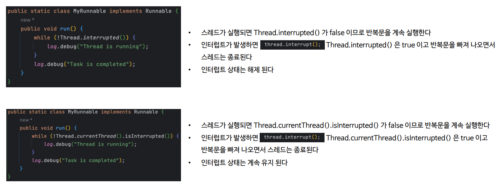
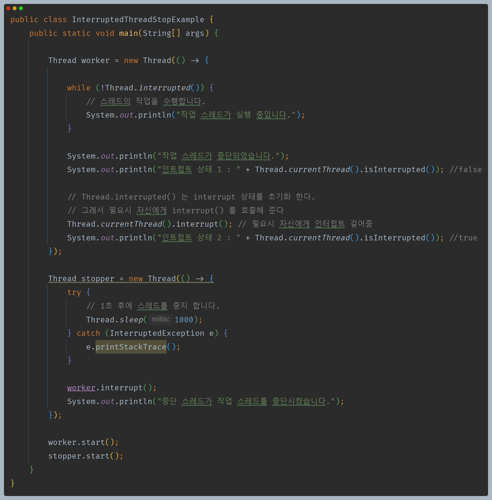
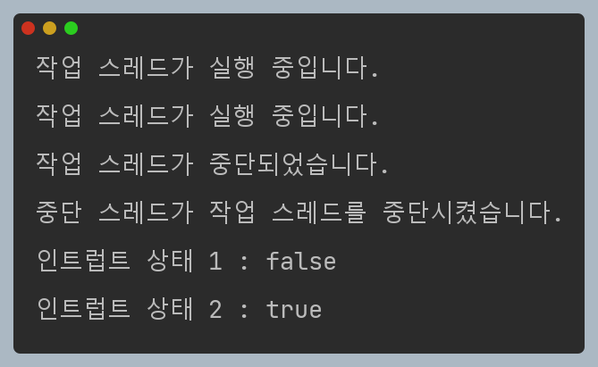
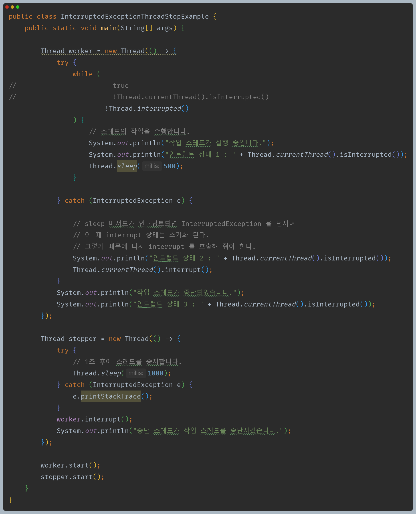
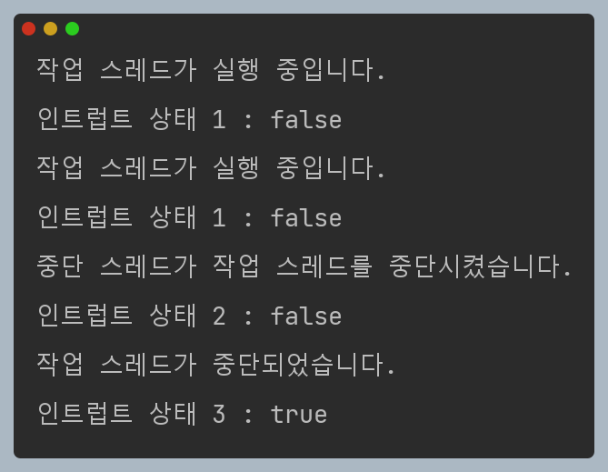
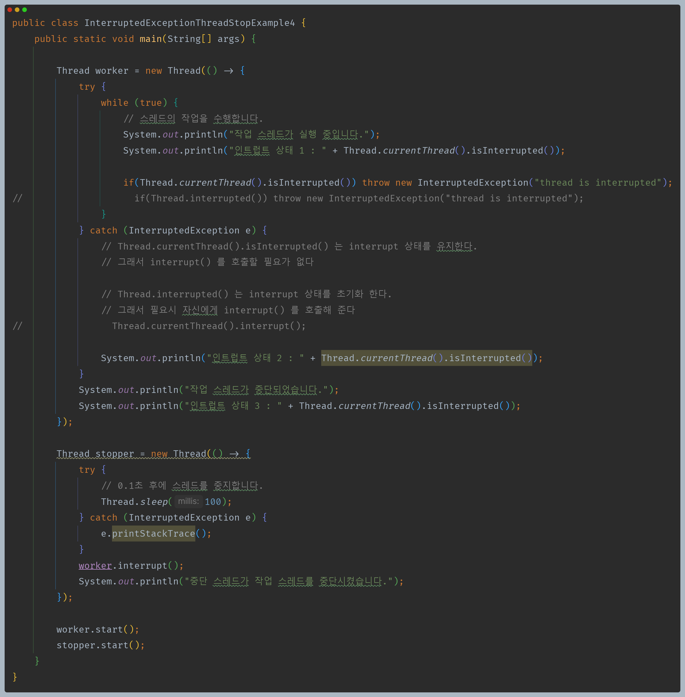
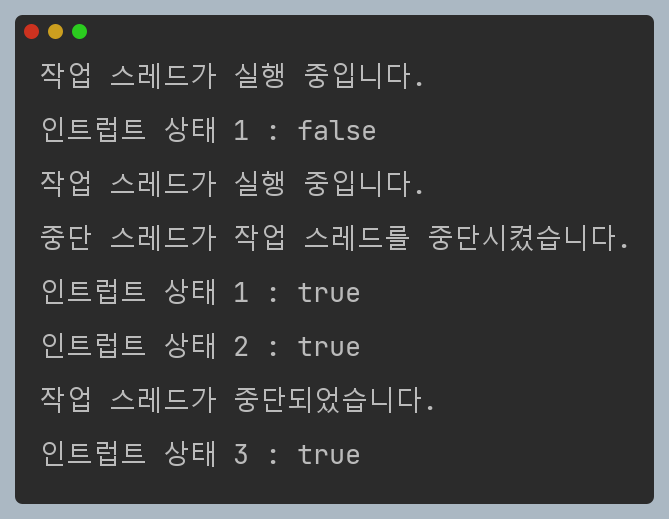

# 자바 동시성 프로그래밍 - Java Thread

## 스레드 중지

- 자바에서 무한 반복이나 지속적인 실행 중에 있는 스레드를 중지하거나 종료할 수 있는 API를 사용할 수 없다.
  - (기존 `suspend()`나 `stop()` 메서드는 Deprecated 되었다.)
- 스레드를 종료하는 방법은 **플래그 변수**를 사용하거나 `interrupt()`를 활용해서 구현할 수 있다.

---

## Flag Variable

- 플래그 변수의 값이 어떤 조건에 만족할 경우 스레드의 실행을 중지하는 방식
- 플래그 변수는 동시성 문제로 가능한 `atomic` 변수나 `volatile` 키워드를 사용하도록 한다.

> - 플래그 변수의 값을 변경한다 하더라도 메모리에 바로 반영되는 것이 아니라 효율을 위해 각 스레드의 캐시 메모리에 우선 저장이 된다.
> - 각 스레드는 서로 다른 캐시 메모리를 사용하기 때문에 다른 스레드에서 플래그 변수 값을 읽을 때 변경된 값을 즉시 읽지 못할 수 있다.
> - `volatile` 키워드는 메인 메모리에 직접 접근하여 모든 스레드가 최산 값을 볼 수 있게 해준다.
> - 또한 컨텍스트 스위칭을 활용하여 같은 효과를 볼 수 있다.
> - 컨텍스트 스위칭 과정에서 캐시 메모리를 초기화하고, 다시 컨텍스트 스위칭 되는 과정에서 메모리 동기화가 이루어지기 때문에 최신 값을 읽어올 수 있다.

> 위와 같이 `atomic` 변수로도 가능하다.

---

## interrupted() & isInterrupted()

- 실행 중인 스레드에 `interrupt()` 하게 되면 인터럽트 상태를 사용해서 종료 기능을 구현할 수 있다.
- **`interrupt()` 한다고 해서 스레드가 처리하던 작업이 중지되는 것이 아니며, 인터럽트 상태를 활용하여 어떤 형태로든 스레드를 제어할 수 있다.**

> 단순히 인터럽트의 상태값을 확인하는 `isInturrupted()`를 사용하여 스레드를 제어할 수 있다.

> 반면 `inturrupted()`는 인터럽트 상태값을 초기화하기 때문에 후속 조치가 필요할 수 있다.

---

## InterruptedException

- 대기 중인 스레드에 `interrupt()` 하게 되면 `InterruptedException` 예외가 발생한다. 이 예외 구문에서 종료 기능을 구현할 수 있다.

---

[이전 ↩️ - Java Thread - 스레드 예외 처리]()

[메인 ⏫](https://github.com/genesis12345678/TIL/blob/main/Java/reactive/Main.md)

[다음 ↪️ - Java Thread - 사용자 스레드와 데몬 스레드]()