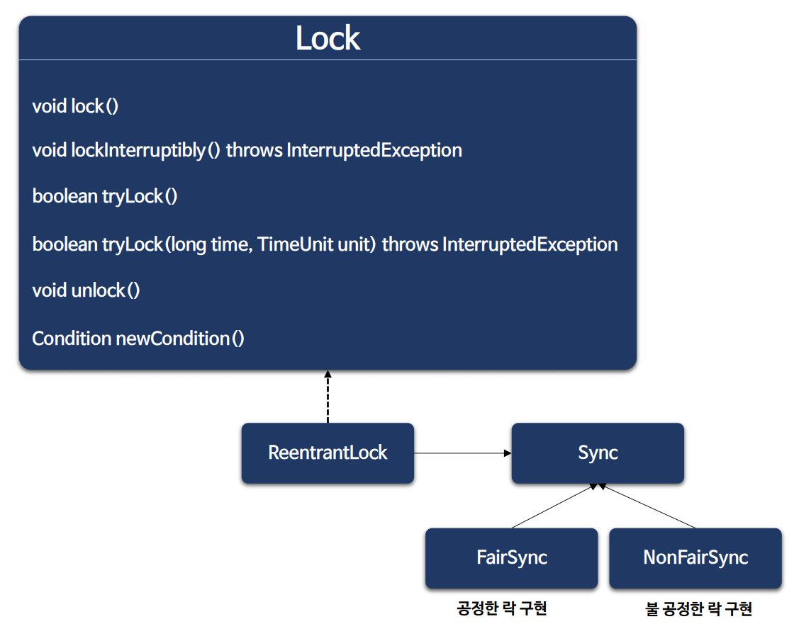
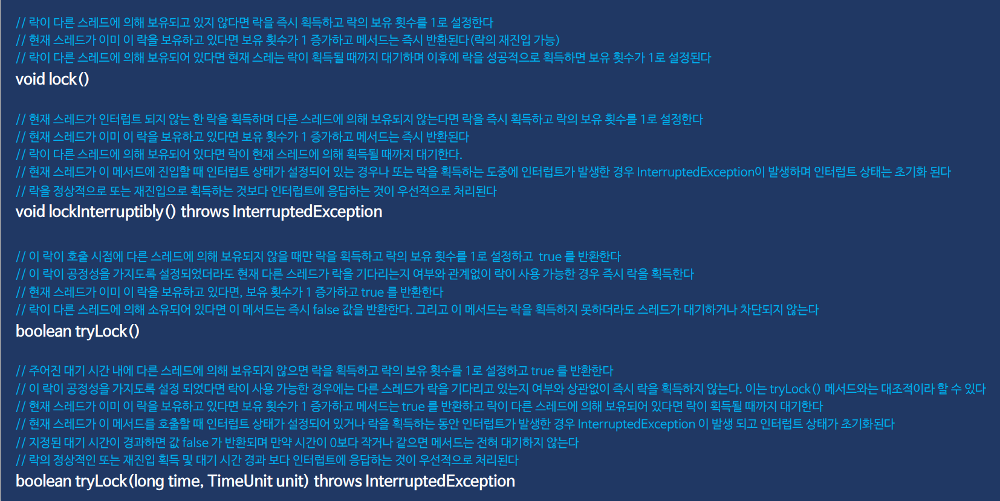
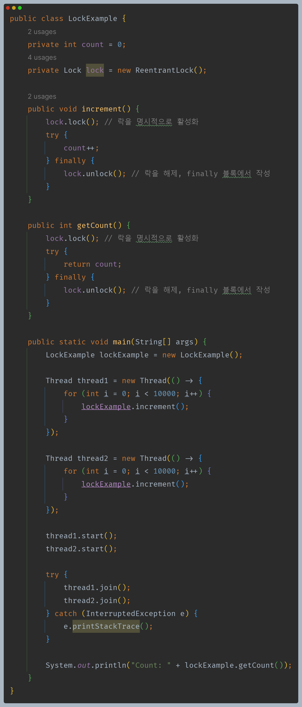
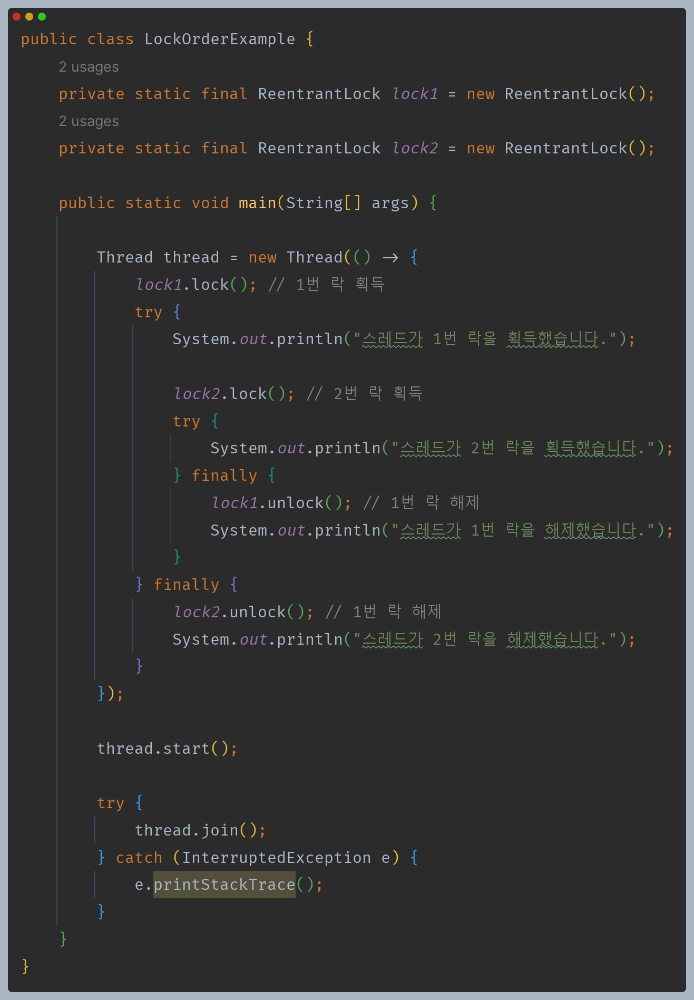
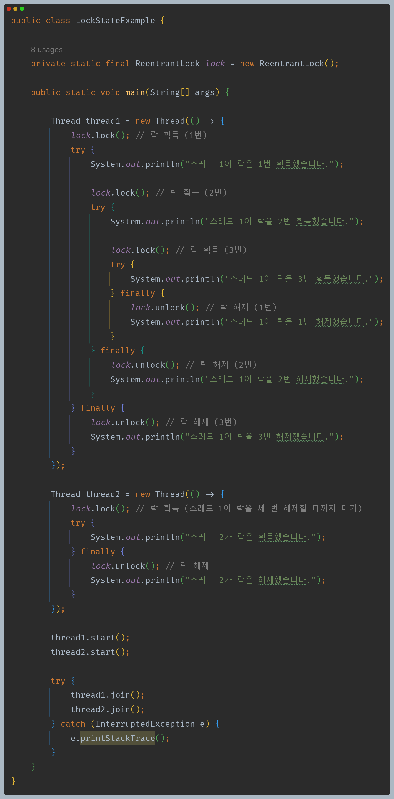
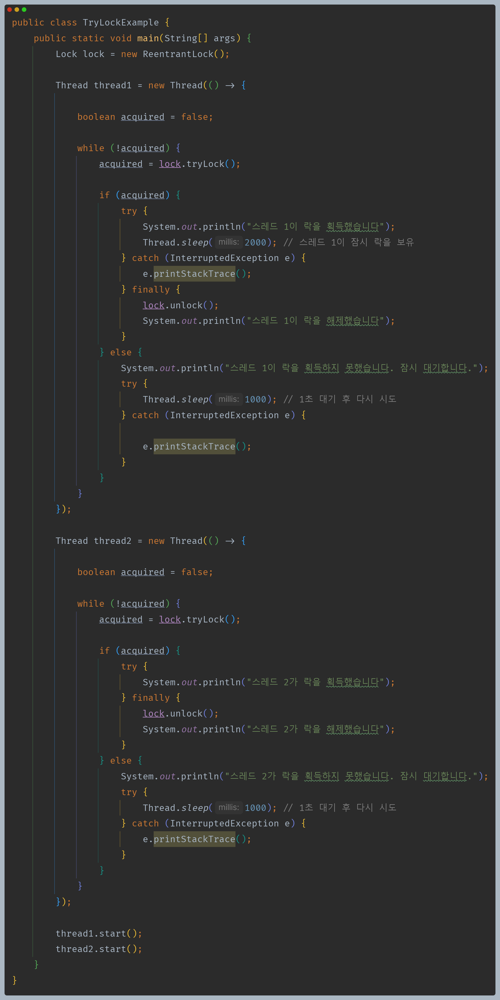
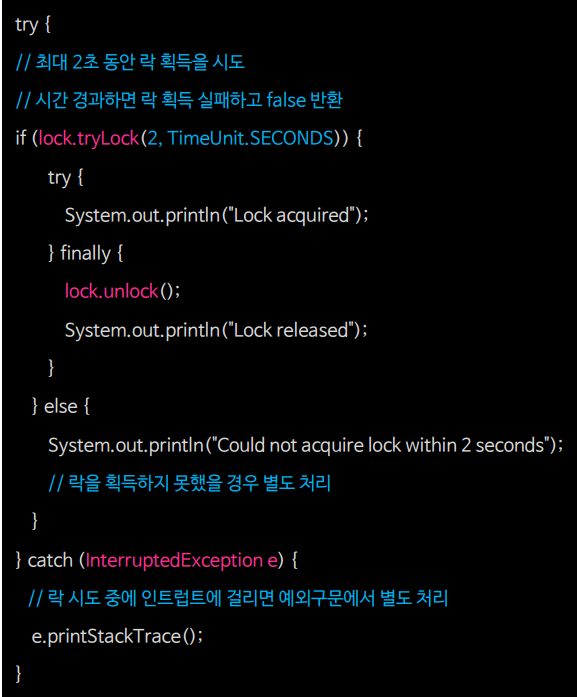
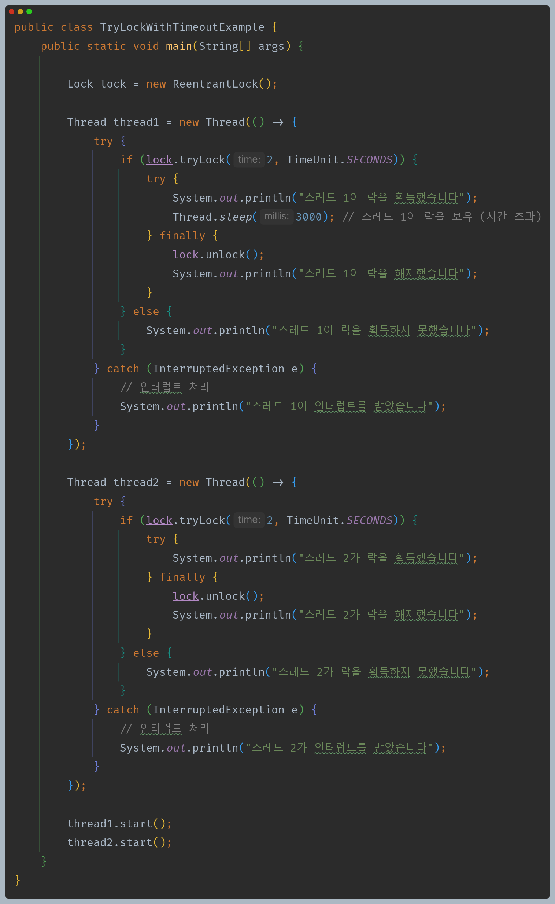
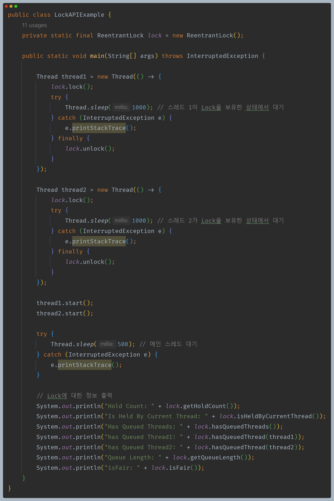
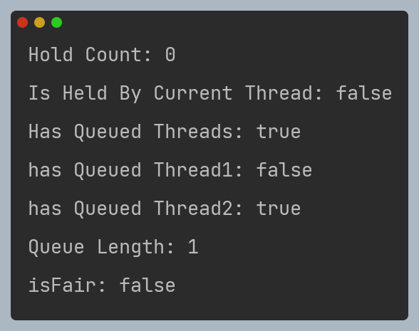

# 자바 동시성 프로그래밍 - Java Locks

## Lock & ReentrantLock

- `Lock` 구현은 `synchronized` 구문과 마찬가지로 **상호 배제**와 **가시성 기능**을 가진 동기화 기법이며 `synchronized` 보다 더 확장된 락 작업을 제공한다.
- `Lock` 구현은 락을 획득 시 블록되지 않는 비 차단 시도(`tryLock()`), 인터럽트가 가능한 방식으로 락을 획득하는 시도(`lockInterruptibly()`) 및 시간 
    제한을 둔 방식으로 락을 획득하는 시도(`tryLock()`)와 같은 추가 기능을 제공한다.
- `synchronized` 사용은 락 획득과 락 해제가 블록 구조화된 방식으로 발생하도록 강제한다.
  - 여러 락을 획득하면 반드시 반대 순서로 해제해야 하며 모든 락은 동일한 문장 블록 범위에서 획득하고 해제되어야 한다.

- **`Lock` 구현은 락을 더 유연한 방식으로 작업할 수 있도록 지원한다.**
- 락을 다른 범위에서 획득하고 해제하도록 허용하며 락을 어떤 순서로든 획득하고 해제할 수 있도록 허용한다.

- `synchronized` 는 블록을 벗어나면 락 해제가 자동으로 이루어지지만 `Lock` 구현은 명시적으로 락을 해제해 주어야 한다.

---

## Lock 구조

- `Lock` 인터페이스의 대표적인 구현체로 `ReentrantLock`이 있고, 내부 추상 클래스 `Sync`를 상속받은 `FairSync`와 `NonFairSync`가 있다.

### ReentrantLock

---

## synchronized 와 Lock 구현 비교

- `synchronized` 구문은 락의 획득과 해제가 내장되어 있어 "암묵적인 락" 이라고 하고, `Lock`은 락의 획득과 해제를 직접 명시해서 사용하므로 "명시적인 락" 이라고 한다.

---

## synchronized 와 Lock 선택 기준

### ReentrantLock

- `tryLock()` : 비차단 락 획득이 필요한 경우
- `lockInterruptibly()` : 락 획득을 시도하거나 대기하는 중에 중단이 필요한 경우
- `tryLock(long time, TimeUnit unit)` : 지정된 시간 안에 락 획득이 필요한 경우
- `new ReentrantLock(true)` : 공정하게 락을 획득하는 정책을 사용하는 경우
- `{ lock.lock() } { ... } { lock.unlock() }` : 락의 획득과 해제가 단일 블록을 벗어나는 경우

### synchronized

- `ReentrantLock` 의 기능이 필요하지 않을 경우
- 사용하기 더 편리하고 익숙하다.
- 성능상 크게 차이가 나지 않으면 락 해제가 불필요하다.
- 복잡하지 않고 문법적으로 더 간단하며 단순한 동기화에서는 가독성이 좋을 수 있다.

---

## Lock 예제 코드

### 1

- `Lock` 인터페이스를 사용하여 `synchronized`와 같은 동기화 효과를 볼 수 있다.

### 2

- `synchronized`와 달리 반드시 락을 획득한 순서와 반대로 락을 해제하지 않아도 된다.

### 3

- 스레드가 이미 보유한 락에 대해 또 락 획득을 시도하면 보유 횟수가 1씩 증가한다.
- 현재 스레드에서는 다른 스레드에서 보유한 락을 모두 해제해야만 락 획득을 할 수 있다.

---

## ReentrantLock API

- `ReentrantLock`은 락 획득 과정에서 스레드가 대기하거나 차단하지 않는 API를 지원하여 유연한 코드 구현이 가능하다.

### tryLock()

- `tryLock()`은 락 획득 여부를 `boolean`으로 반환하기 때문에 이 반환값을 사용하여 코드를 작성할 수 있다.

### lockInterruptibly()

### tryLock(Long time, TimeUnit unit)

- 스레드 1이 먼저 락을 획득한 경우

- 스레드 2가 먼저 락을 획득한 경우

> 스레드 1은 3초간 작업한다. 그런데 스레드 2는 2초만 대기하므로 스레드 1이 먼저 락을 획득하면 스레드 2는 락을 획득하지 못하게 된다. 

### 그 외 API

---

[이전 ↩️ - Java Synchronization - 교착 상태(DeadLock)](https://github.com/genesis12345678/TIL/blob/main/Java/reactive/synchronization/javaSync/Deadlock.md)

[메인 ⏫](https://github.com/genesis12345678/TIL/blob/main/Java/reactive/Main.md)

[다음 ↪️ - Java Locks - ReadWriteLock & ReentrantReadWriteLock](https://github.com/genesis12345678/TIL/blob/main/Java/reactive/locks/ReentrantReadWriteLock.md)