# 자바 동시성 프로그래밍 - Java Locks

## ReadWriteLock & ReentrantReadWriteLock

- `ReadWriteLock`은 읽기 작업과 쓰기 작업을 위해 연관된 두 개의 락(읽기 락, 쓰기 락)을 유지하는 인터페이스이다.
- 일반적으로 락은 데이터를 조작하는 하나의 스레드의 임계 영역을 보호하는 장치이며, 데이터를 읽는 작업만 실행되는 영역은 여러 스레드가 동시에
    접근해도 동시성 문제가 발생하지 않는다.
- 읽기 작업이 많고 쓰기 작업이 적은 영역을 효율적으로 처리하기 위해 다수의 읽기와 하나의 쓰기를 읽기 락과 쓰기 락으로 구분해서 락을 운용하는 것이 필요하다.

### 특징

- **성능 개선**
  - 읽기 락과 쓰기 락의 조합은 상호 배타적인 락을 사용하는 것보다 데이터에 대한 동시 액세스를 허용하므로 동시성이 높아진다.
  - 특히 읽기 작업이 더 빈번한 경우에 효과적이며 읽기 락의 경우 여러 스레드가 동시에 데이터를 읽을 수 있고 쓰기 락의 경우 하나의 스레드만 데이터를 수정할 수 있다.
- **메모리 동기화**
  - 읽기 락 작업은 다른 읽기 락 작업과 상호 작용하는 것이 아니므로 스레드 간 동시에 읽기 작업을 하더라도 메모리의 가시성에 아무런 문제 없다.
  - 쓰기 락 작업은 읽기 작업 및 다른 쓰기 작업과의 메모리 동기화를 보장해야 한다. 즉, 스레드가 쓰기 락을 해제하고 다른 스레드가 읽기 락을 얻었을 때
    이전 쓰기 작업의 업데이트를 볼 수 있어야 한다.
- **사용 기준**
  - 읽기/쓰기 락의 사용은 데이터가 읽히는 빈도와 수정되는 빈도, 읽기 및 쓰기 작업의 지속 시간, 데이터에 대한 경합(동시에 데이터를 읽거나 쓰려는 스레드 수)에 따라 결정된다.
  - 수정은 드물게 일어나고 검색은 빈번히 발생하면 읽기/쓰기 락의 사용에 적합한 이상적인 후보라 할 수 있지만 업데이트가 빈번해지면 데이터가 대부분 배타적으로 작동한다.
  - 읽기 작업 시간이 긴 경우 여러 스레드들이 경합없이 모두 읽는 이점이 있으나 너무 짧은 경우 읽기/쓰기 락 구현의 오버헤드(읽기 작업과 쓰기 작업의 상태를 계속
  확인하기 때문에 상호 배제 락보다 알고리즘이 더 복잡함)가 증가하기 때문에 효율성이 떨어진다.

### ReadWriteLock 구조

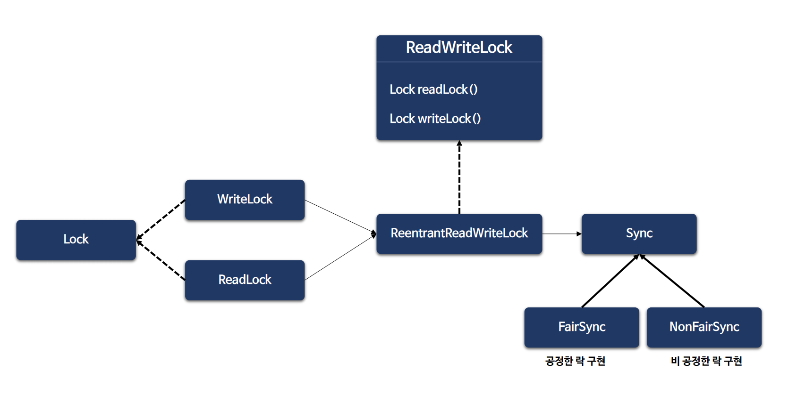

- `ReadWriteLock` 인터페이스의 구현체로 `ReentrantReadWriteLock` 이 있다.
- `ReentrantReadWriteLock`은 내부적으로 `Lock` 인터페이스의 구현체인 `WriteLock`과 `ReadLock`을 내부 정적 클래스로 가지고 있다.
- `ReentrantReadWriteLock`은 내부적으로 정적 추상 클래스 `Sync`가 있으며 이것을 상속받은 `FairSync`와 `NonFairSync`가 있다.

---

## ReadLock & WriteLock

### ReentrantReadWriteLock.ReadLock

- 여러 읽기 스레드가 동시에 읽기 락을 얻을 수 있으며 읽기 락이 보유되는 동안에는 다른 읽기 스레드들도 읽기 락을 얻을 수 있다.
- 쓰기 락은 읽기 락이 보유되는 동안에 얻을 수 없다. 그러나 대기하는 중에도 계속 읽기 락을 요청하는 상황이 발생하면 쓰기 락을 요청한 스레드는 기아 상태가
  될 수 있으므로 쓰기 락을 요청한 상태에서는 더 이상 스레드가 읽기 접근을 할 수 없다.
- 가장 큰 장점은 여러 스레드가 상호 배제 없이 동시에 데이터를 읽을 수 있어서 동시성이 증가한다는 점이다.

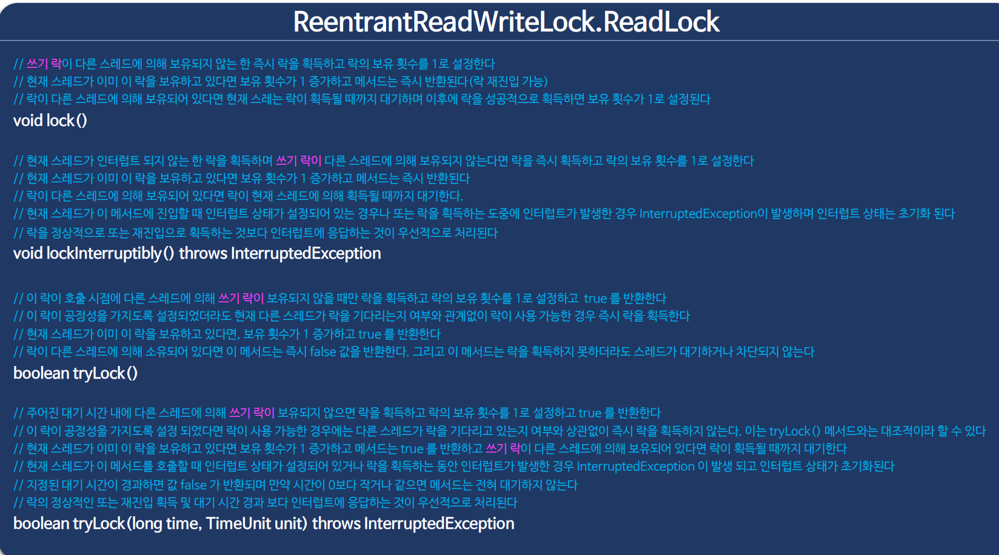

- 기본적인 작업은 `Lock` 인터페이스와 동일하다.
- 다만 읽기 락은 쓰기 락과 상호 배제로 동작한다.

### ReentrantReadWriteLock.WriteLock

- 쓰기 락은 배타적이며 한 번에 하나의 스레드만 쓰기 락을 보유할 수 있고 쓰기 락을 보유하는 동안에는 다른 어떤 스레드도 읽기 락이나 쓰기 락을 얻을 수 없다.
- 쓰기 락이 보유되는 동안데 데이터를 수정하는 작업이 수행되며 이 작업이 완료될 때까지 다른 스레드가 해당 락을 얻지 못한다.

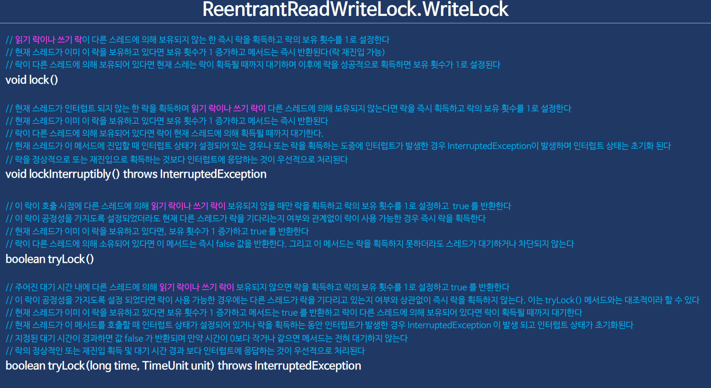

- 기본적인 작업은 `Lock` 인터페이스와 동일하다.
- 다만 쓰기 락은 쓰기 락과 읽기 락에 대해 상호 배제로 동작한다.

### ReentrantReadWriteLock 예제 코드

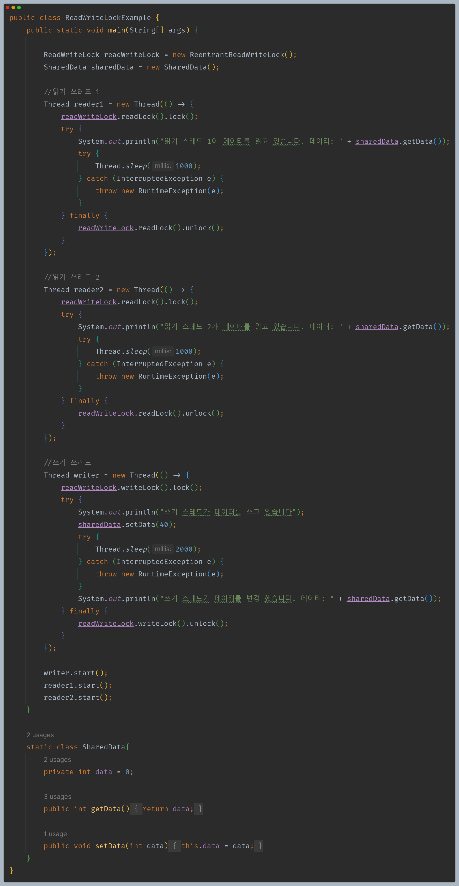

- 읽기 쓰레드끼리는 동시에 읽기 락을 얻을 수 있다.
- 읽기 락을 획득하면 쓰기 락은 얻을 수 없다.
- 쓰기 락을 획득하면 상호 배제 방식으로 동작한다.

---

## ReentrantReadWriteLock API

다음 API 들은 모니터 용으로만 사용하는 것이 좋다.

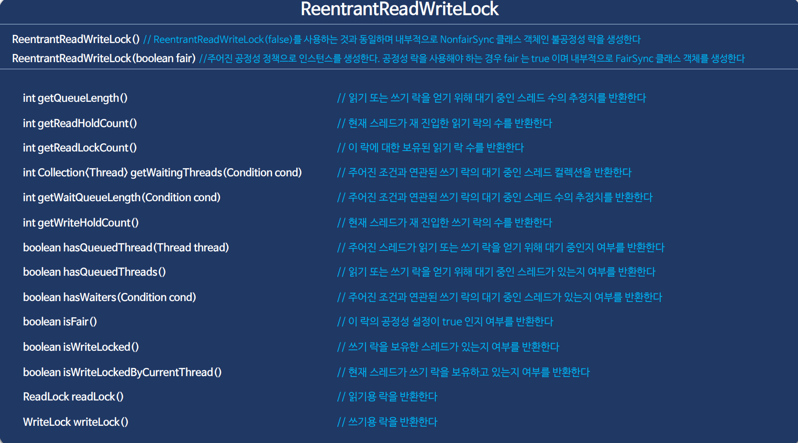

### 예제 코드

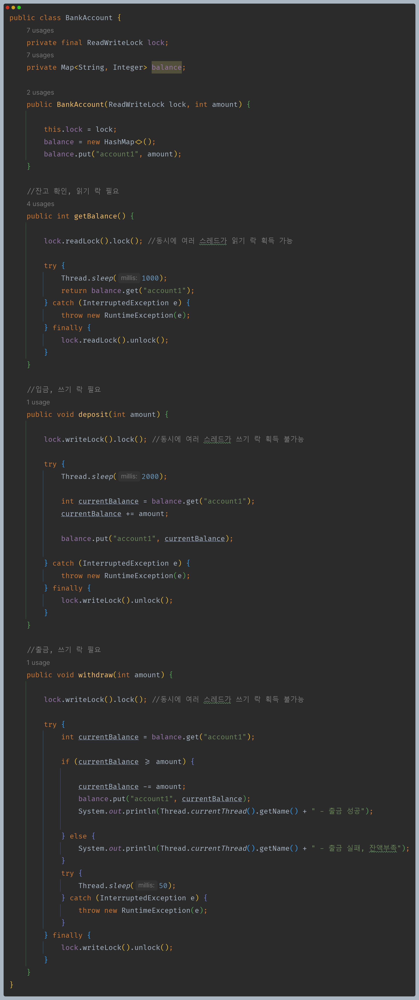

### 1. 읽기 락 > 쓰기 락

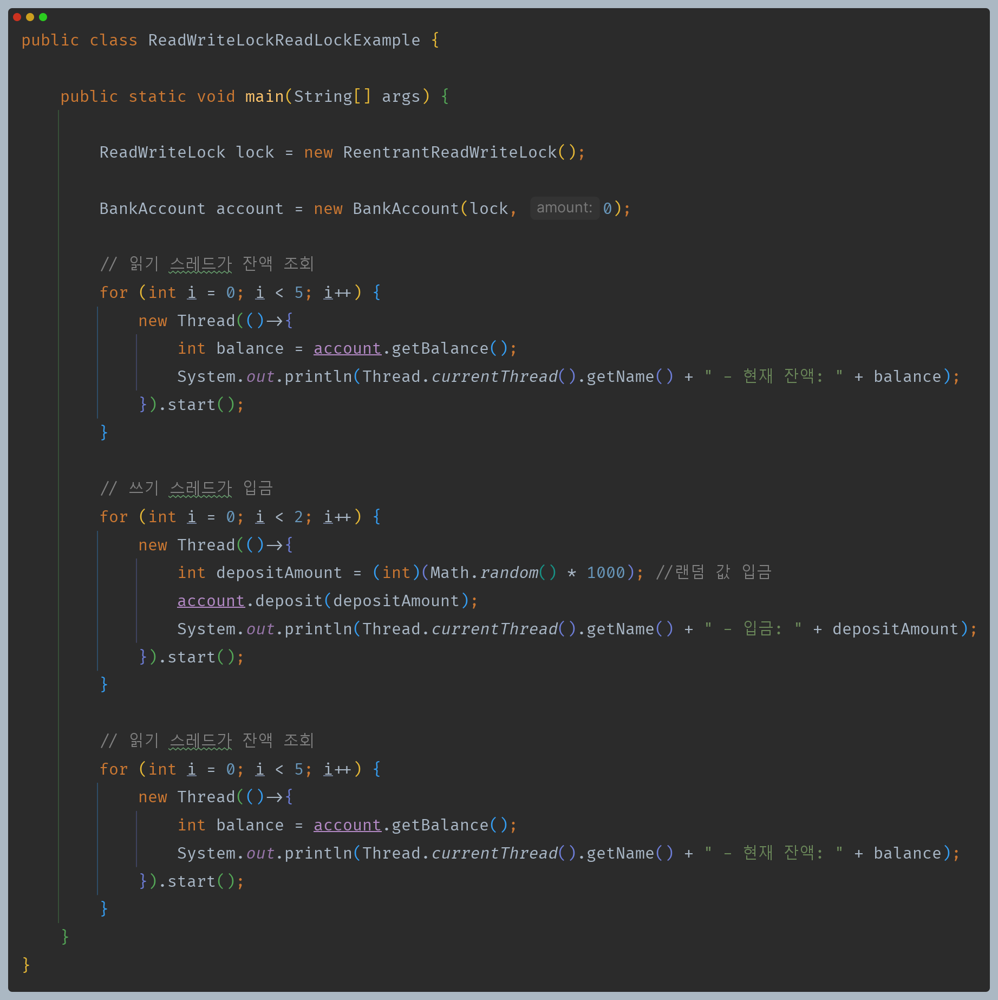

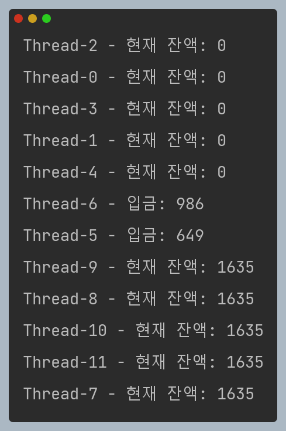

- 잔고 확인은 1초가 걸린다.
- 일반적인 락 같은 경우 각각의 스레드가 상호 배제로 실행되기 때문에 스레드 수 만큼 시간이 걸렸을 것이다.
- 하지만 읽기 락 같은 경우 동시적으로 락 획득이 가능하므로 1초 안에 병렬적으로 실행 가능해진다.

### 2. 쓰기 락 > 읽기 락

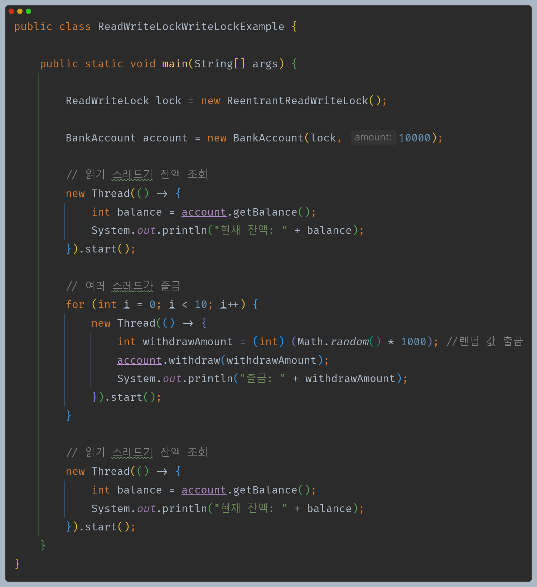

- 쓰기 락을 획득하면 다른 스레드는 읽기 락과 쓰기 락을 모두 가질 수 없다.(상호 배제)
- 때문에 쓰기 락을 얻어 안전하게 데이터를 변경하고 다른 스레드에서 읽을 수 있다.

### 그 외 API

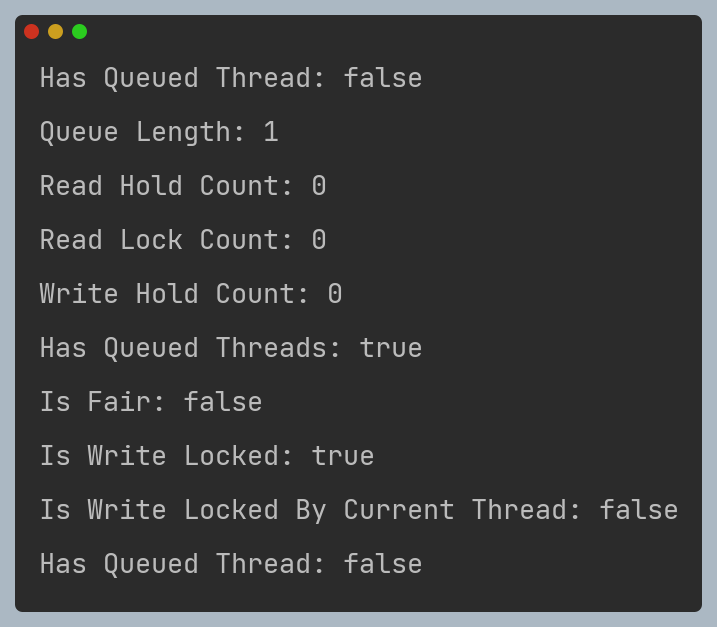

---

## ReentrantLock 공정성 정책

- `ReentrantLock`은 두 종류의 락 공정성 설정을 지원한다. **불공정 방법**과 **공정 방법**이며 생성자에서 `boolean` 인자로 공정성을 지정할 수 있다.(디폴트=불공정)

### 불공정성

- 불공정한 락으로 생성된 경우 경쟁 상황에서 읽기 및 쓰기 락에 대한 진입 순서는 정해지지 않으며 하나 이상의 읽기 또는 쓰기 스레드를 무기한으로 연기할 수 있으나
  일반적으로 공정한 락보다 더 높은 처리량을 가진다.
- 불공정성은 락을 획득하려는 시점에 락이 사용 중이라면 대기열에 들어가게 되고 락이 해제되었다면 대기열에 대기중인 스레드를 건너뛰고 락을 획득하게 하는 정책이다.
- 대부분의 경우 공정하게 처리해서 얻는 장점보다 불공정하게 처리해서 얻는 성능상 이점이 더 크다. 왜냐하면 락을 사용하고자 하는 스레드가 있을 때
  바로 획득하게 하는 것이 대기 중인 스레드를 찾아 락을 획득하도록 처리하는 시간보다 더 빠르기 때문이다.

### 공정성

- 공정한 락으로 생성된 경우 스레드는 도착 순서 정책을 사용하여 진입하는 데 현재 보유 중인 락이 해제될 때 가장 오래 기다린 단일 쓰기 스레드가 쓰기 락을 할당받거나
 모든 대기하는 쓰기 스레드보다 더 오래 기다린 읽기 스레드 그룹이 있는 경우 해당 그룹이 읽기 락을 할당받게 된다.
- 공정한 읽기 락(재진입이 아닌 경우)을 획득하려는 스레드는 쓰기 락이 보유 중이거나 대기 중인 쓰기 스레드가 있는 경우 차단되며 가장 오래 대기 중인 쓰기 스레드가
  쓰기 락을 획득하고 해제한 후에 읽기 락을 획득한다.
- 물론 대기 중인 쓰기 스레드가 대기를 포기하고 쓰기 락이 해제되어 읽기 락이 가능한 상태가 되면 해당 읽기 스레드들이 읽기 락을 할당받게 된다.
- 공정한 쓰기 락(재진입이 아닌 경우)을 획득하려는 스레드는 읽기 락과 쓰기 락 모두 대기하는 스레드가 없을 경우 락을 획득하고 그 외에는 차단된다.
- 공정성 락은 성능을 감수하더라도 기아 상태를 방지해야 하는 상황이 꼭 필요할 경우 좋은 해결책이 될 수 있다.
- `ReentrantLock.tryLock()` 메서드는 공정성을 따르지 않고 대기 중인 스레드와 관계없이 락을 즉시 획득하며,
  `ReentrantLock.tryLock(timeout, TimeUnit)`은 공정성을 따른다.

### 예제 코드

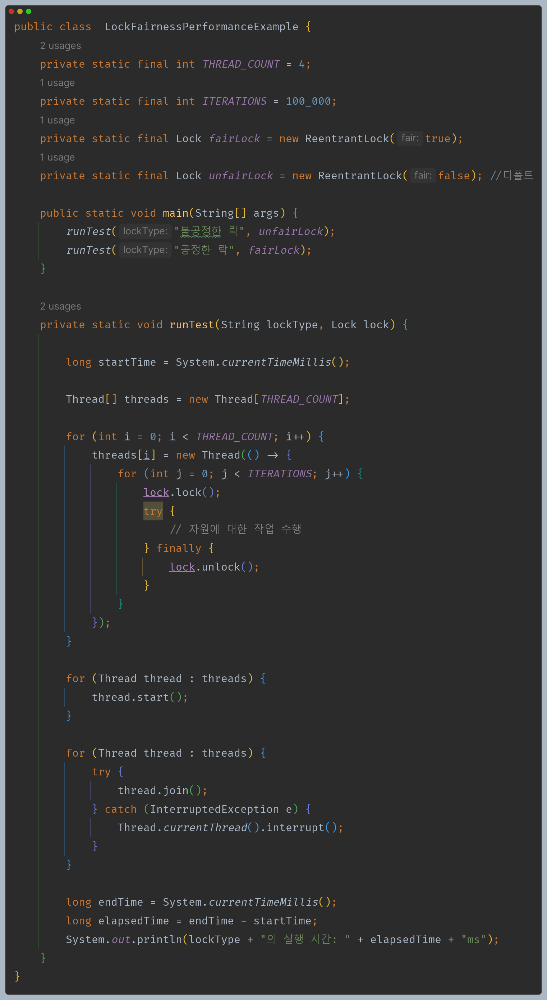

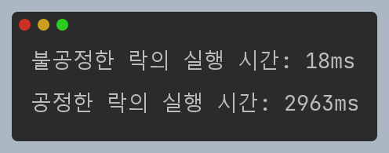

---

## ReentrantReadWriteLock 재진입 정책

- 이 락은 `ReetrantLock`과 같이 읽기 및 쓰기 락을 다시 획득할 수 있도록 재진입을 허용하며 쓰기 락을 보유하고 있는 스레드가 모든 쓰기 락을
  해제하기 전까지는 재진입이 아닌 읽기 스레드를 허용하지 않는다.
- **쓰기 스레드는 읽기 락을 획득할 수 있지만 읽기 스레드가 쓰기 락을 획득하려고 하면 실패하게 된다.**
- 쓰기 락을 보유한 스레드가 읽기 락 아래에서 읽기를 수행하는 메서드 또는 콜백 호출 시 재진입이 유용할 수 있다.

**락 다운그레이드**

- 재진입성은 쓰기 락에서 읽기 락으로 다운그레이드 할 수 있게 해준다.
- 이를 위해 쓰기 락을 획득하고 그런 다음 읽기 락을 획득하고 마지막으로 쓰기 락을 해제한다.

**락 업그레이드**

- 읽기 락에서 쓰기 락으로 업그레이드 하는 것은 불가능하다.
- 읽기 락은 여러 스레드가 동시에 보유할 수 있기 때문에 업그레이드가 허용되지 않는다.

> - 쓰기 락을 획득하면 다른 스레드는 어떤 형태로든 락을 획득할 수 없지만 읽기 락을 사용하면 원하는 경우 모든 스레드가 읽기 락을 획득할 수 있게 한다.
> - 여기서 락을 다운그레이드 한다는 것은 쓰기 락을 보유한 상태에서 읽기 락을 획득한 다음 쓰기 락을 해제하여 읽기 락만 유지하도록 전화할 수 있음을 의미한다.
> - 예를 들어 매우 중요한 작업은 쓰기 락으로 시작해서 상호 배제를 구현하고 중요 작업을 마친 후에는 동시적인 읽기 접근을 허용하는 읽기 락 스레드를 가질 수 있다.
> 
> 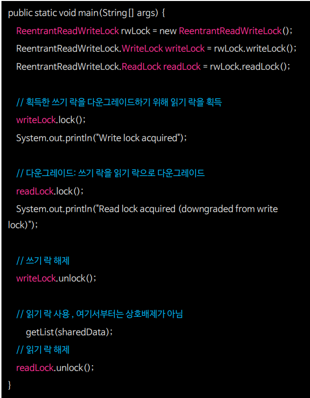

### 예제 코드

### 1. 다운그레이드

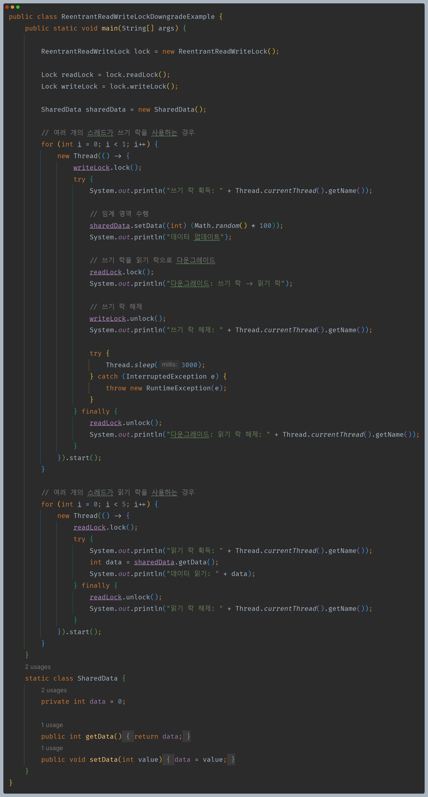

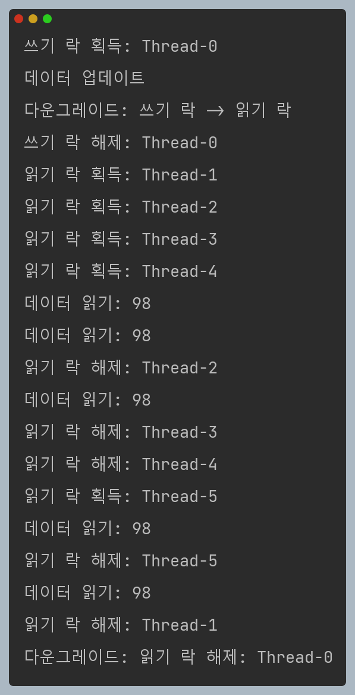

- 임계 영역 부분만 쓰기 락으로 상호 배제를 하고 임계 영역이 끝난 지점부턴 읽기 락으로 다운그레이드 하여 더욱 효율적인 작업이 가능해진다.

### 2. 업그레이드

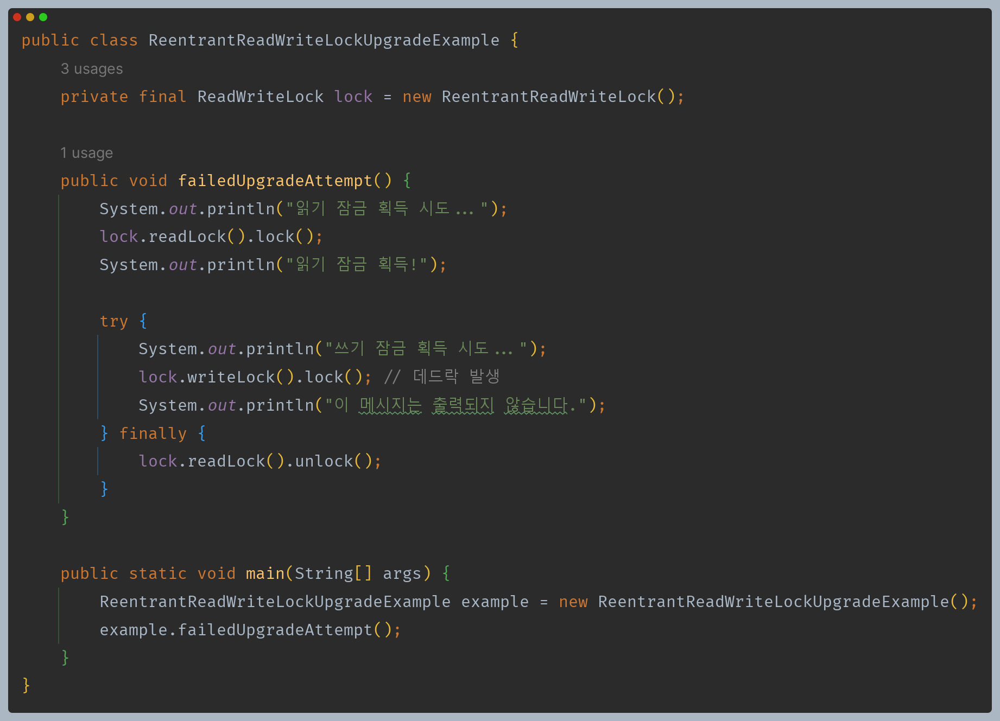

- 읽기 락에서 쓰기 락으로 업그레이드 하는 것은 불가능하기 때문에 프로그램은 종료되지 않는다.

---

[이전 ↩️ - Java Locks - Lock & ReentrantLock]()

[메인 ⏫](https://github.com/genesis12345678/TIL/blob/main/Java/reactive/Main.md)

[다음 ↪️ - Java Locks - Condition]()