# 자바 동시성 프로그래밍 - Java Synchronization

## 교착 상태 (DeadLock)

- **DeadLock** 이란 프로세스나 스레드들이 서로가 소유하고 있는 자원을 기다리며 무한히 대기하고 있는 상태를 말한다.
- 교착 상태에서는 아무런 진전도 이루어지지 않아 작업이 진행되지 않는 문제가 발생한다.
- 이것은 동일한 환경과 코드에서 발생할 수도 있고 발생하지 않을 수도 있다.

**대표적인 DeadLock 예시로 "식사하는 철학자"가 있다.**

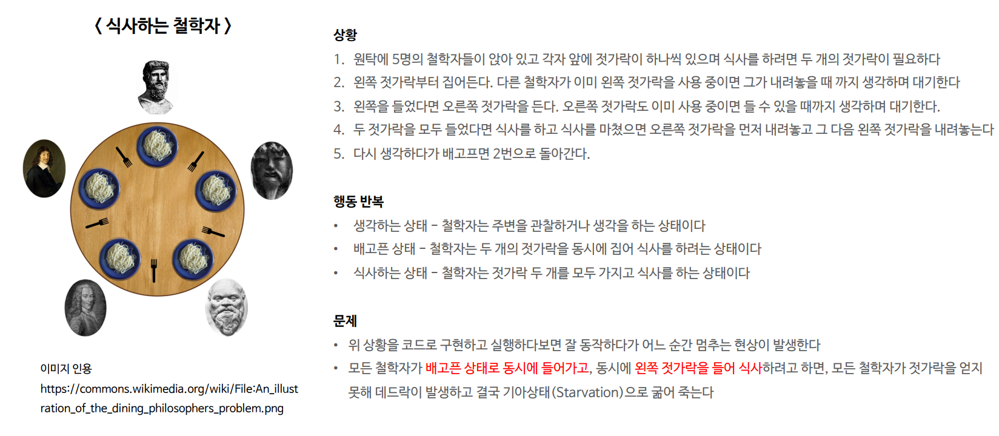

---

## 데드락 발생 조건

- 데드락은 다음 네 가지 필요 조건을 동시에 만족할 때 발생한다.
- 한 가지라도 만족하지 않으면 데드락이 발생하지 않는다.

### 1. 상호 배제 (Mutual Exclusion)

- 자원은 한 번에 하나의 스레드만 사용할 수 있다.
  - 철학자는 한 번에 하나의 젓가락을 사용할 수 있으므로 상호 배제를 구현하여 젓가락을 동시에 두 명 이상의 철학자가 사용하지 못하도록 한다.

### 2. 점유 대기 (Hold and Wait)

- 스레드가 최소한 하나의 자원을 보유한 상태에서 다른 자원을 기다리고 있다.
  - 철학자들은 젓가락을 기다리는 상태에서 무한히 대기할 수 있으며, 다른 철학자가 젓가락을 반납하기를 기다릴 수 있다.

### 3. 비선점 (No Preemption)

- 자원을 할당 받은 스레드가 자원을 스스로 반납하기 전까지 자원을 강제로 빼앗을 수 없다.
  - 철학자들은 젓가락을 사용하는 동안 다른 철학자에 의해 젓가락이 강제로 반납 될 수 없으며, 젓가락은 해당 철학자에 의해 반납될 때까지 보유된다.

### 4. 순환 대기 (Circular Wait)

- 각 스레드는 순환적으로 다음 스레드가 요구하는 자원을 가지고 있어 사이클이 형성된다.
  - 각 철학자는 서로 다른 두 개의 젓가락을 사용해야 하므로 순환적으로 다음 철학자가 요구하는 젓가락을 가지고 있을 수 있어 사이클이 형성된다.

---

## 데드락 예

### 1. 락 순서에 의한 데드락

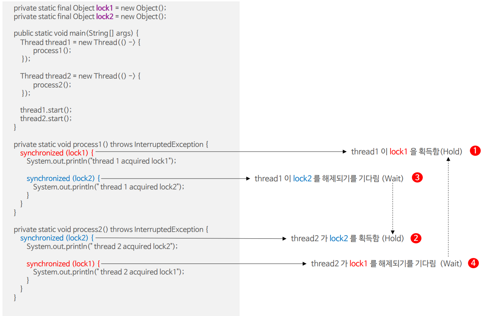

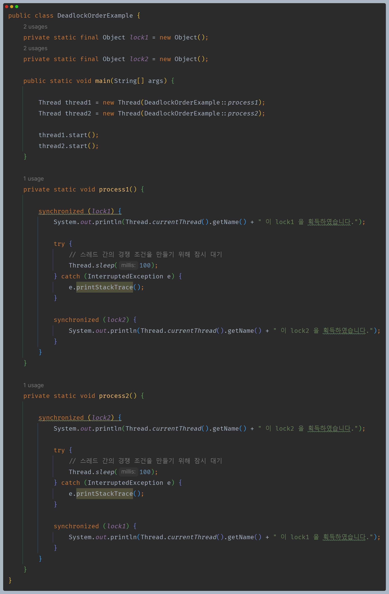

- 프로그램이 종료되지 않고 무한 대기에 빠지게 된다.

### 2. 동적인 락 순서에 의한 데드락

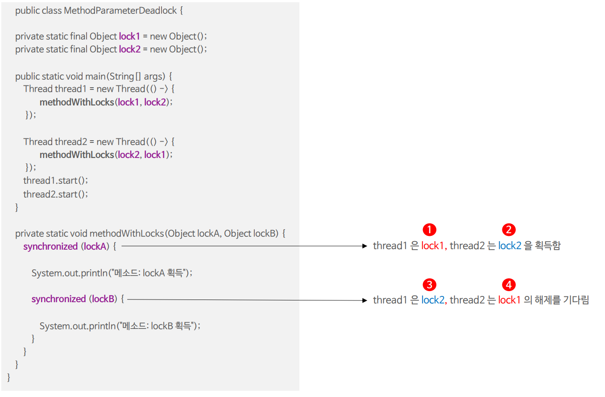

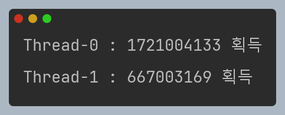

- 프로그램이 종료되지 않고 무한 대기에 빠지게 된다.

### 3. 객체 간의 데드락

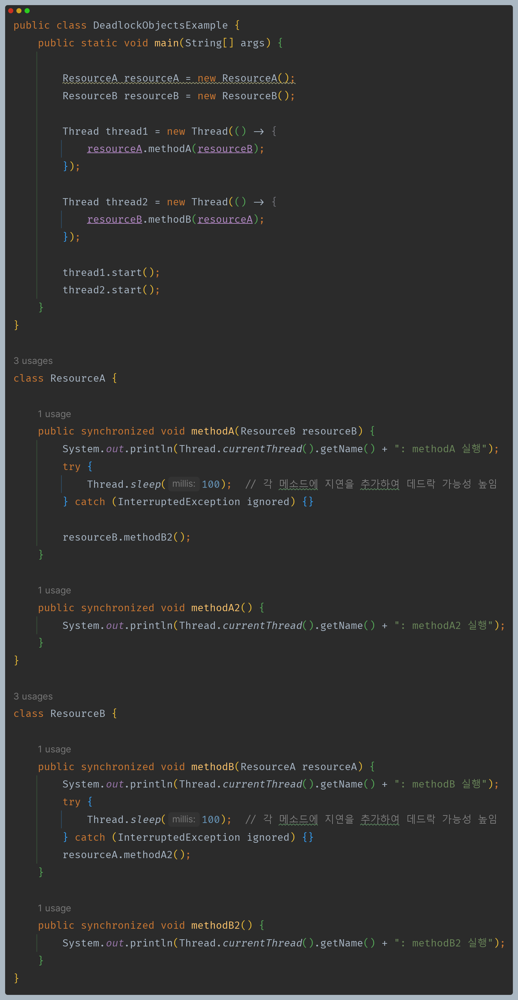

- 프로그램이 종료되지 않고 무한 대기에 빠지게 된다.

---

## 데드락 방지와 원인 추적

- 데드락 방지는 데드락 발생 조건 네 가지 중에서 최소한 1가지를 방지함으로서 네 가지를 모두 만족하지 않게 하는 기법이다.
- 일단 데드락이 발생하면 애플리케이션 단에서 데드락을 해소하는 것은 어렵고 서버를 재기동하거나 종료하는 것 밖에 현실적으로 다른 해결책은 없다.

### 1. 한번에 하나 이상의 락을 사용하지 않는다.

- 데드락은 스레드가 락을 중첩으로 제어하면서 발생하는 경우가 많기 때문에 가능한 한 스레드가 두 개 이상의 락을 제어하는 상황을 만들지 않도록 하는 것이 좋다.

### 2. 락의 순서를 잘 조정한다.

- 불가피하게 여러 개의 락을 사용해야 한다면 락의 점유 순서를 일정한 순서로 정해주도록 함으로서 데드락이 발생할 수 있는 조건 중 하나의 순환 대기를 방지하도록 한다.

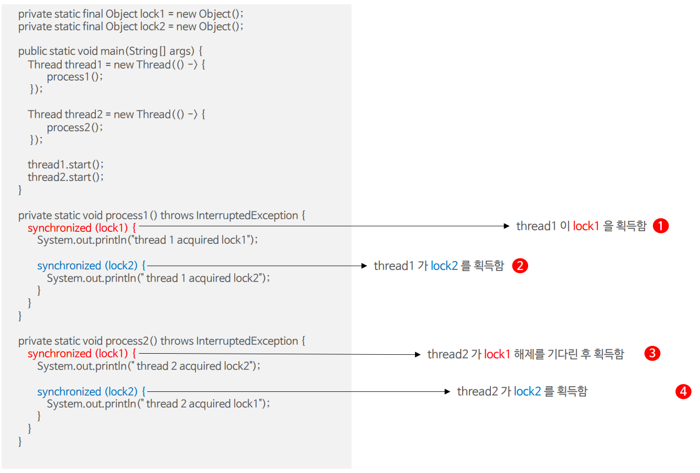

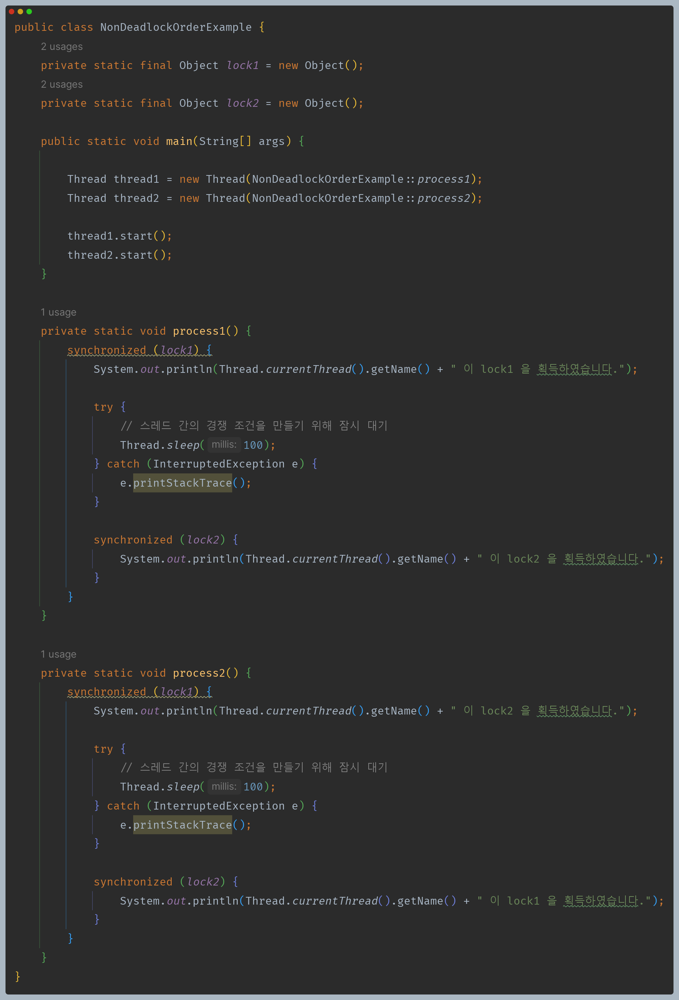

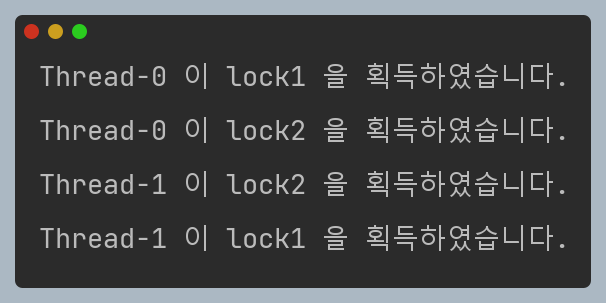

### 3. 락 타임아웃을 건다.

- 락을 요청할 때 일정 시간 이내에 락을 얻지 못하면 다른 작업을 수행하도록 타임아웃을 설정한다.
- 락 획득에 타임아웃 오류가 나면 오래 기다리지 않고 제어권이 다시 돌아오기 때문에 현재 소유한 락을 해제하고 잠시 기다리다가 데드락 상황이 지나가면 다시 정상으로 동작할 수 있다.

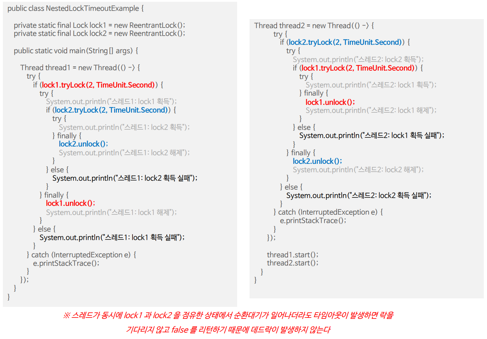

### 4. 메서드는 오픈 호출 형태로 구현한다.

- 락을 전혀 확보하지 않은 상태에서 메서드를 호출하는 것을 오픈 호출 이라고 하며, 락을 전체 메서드에 적용하지 않고 락이 필요한 임계 영역만 보호하도록 한다.
- 여러 개의 락을 호출하더라도 동시에 락을 점유하는 것이 아닌 순차적으로 락을 획득하고 해제하는 방식으로 메서드를 호출하도록 한다.

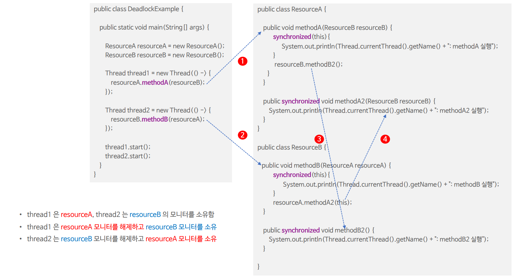

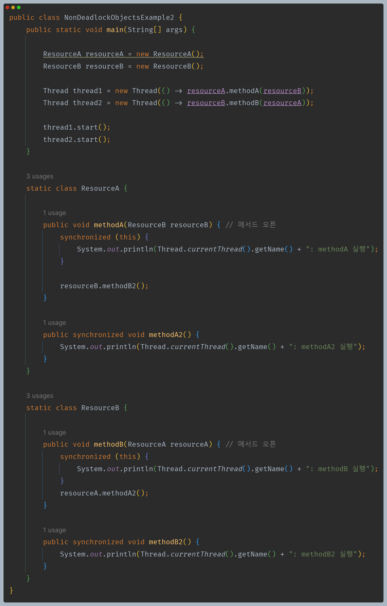

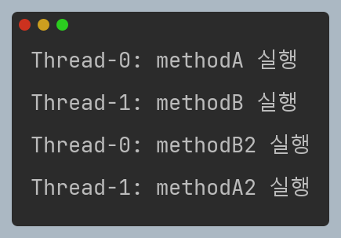

### 5. 스레드 덤프를 활용한다.

- 스레드 덤프에는 실행 중인 스레드의 모든 스택 트레이스가 담겨져 있고 락과 관련된 정보도 포함되어 있기 때문에 이를 활용해서 어디에서, 어떤 스레드가,
    어느 시점에, 왜 데드락이 발생했는지 원인을 추적 및 분석하고 해결 방안을 모색할 수 있다.

---

## 그 외 활동성 문제

### 1. 기아 상태 (Starvation)

- 멀티 스레드 환경에서 한 스레드가 자원을 계속해서 얻지 못하여 영원히 대기하는 상태를 말한다.
- 다른 스레드들이 우선적으로 자원을 점유하거나 실행되어 해당 스레드가 자원을 얻지 못하게 되면 기아 상태가 발생한다.
- 기아 상태를 해결하기 위해서는 우선순위를 기반으로 한 스케줄링이 아니라 공정성을 고려하여 모든 스레드가 공평하게 실행될 수 있도록
    우선순위를 조정하는 등의 설계가 뒷받침 되어야 한다.

### 2. 라이브락 (Livelock)

- 데드락과 비슷한 상태로, 여러 스레드가 서로의 자원을 기다리면서 진행이 지연되는 상태를 말한다.
- 라이브락은 데드락과는 다르게 작업이 멈추지 않고 계속해서 진행되지만, 실질적인 작업이 진행되지 않거나 진행이 제대로 이루어지지 않는 상태를 의미한다.
- 라이브락 상태에서는 스레드가 서로의 자원을 기다리기 때문에 작업이 충분히 느려질 수 있으며, 서로가 양보하는 동작이 반복되면서 진행이 지연되는 상태가 발생한다.

- 서로 양보하기만 하고 프로그램은 종료되지 않는다.

---

[이전 ↩️ - Java Synchronization - `volatile`(메모리 동기화)](https://github.com/genesis12345678/TIL/blob/main/Java/reactive/synchronization/javaSync/volatile.md)

[메인 ⏫](https://github.com/genesis12345678/TIL/blob/main/Java/reactive/Main.md)

[다음 ↪️ - Java Locks - Lock & ReentrantLock]()