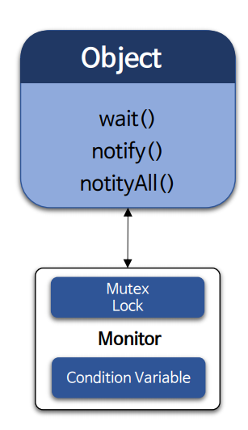
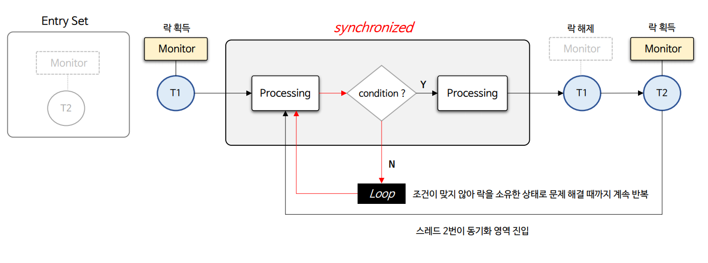
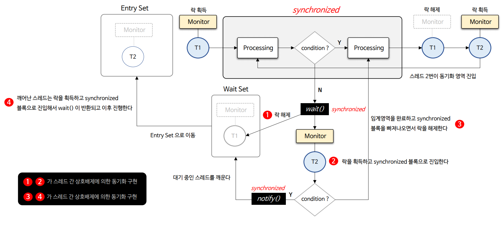
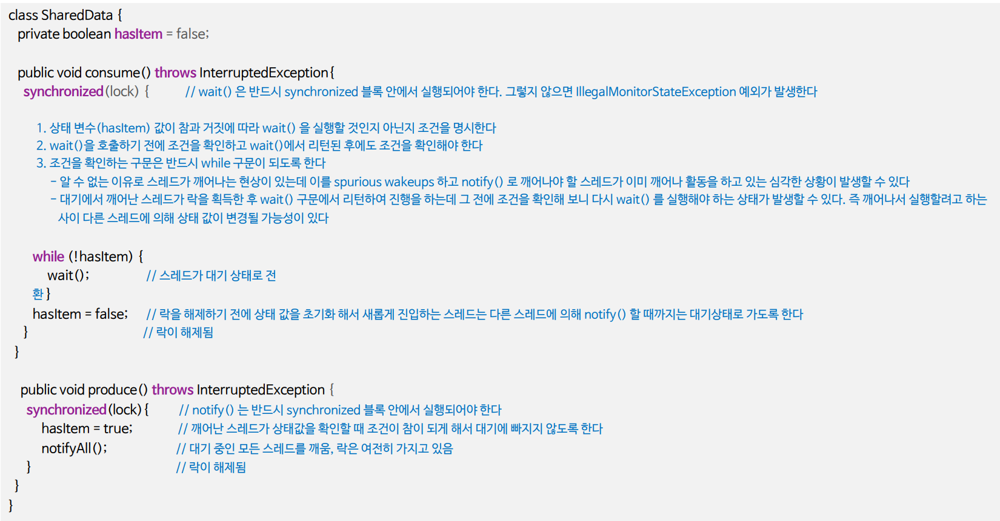

# 자바 동시성 프로그래밍 - Java Synchronization

## 스레드 간 협력 - `wait()` & `notify()`

- `wait()`, `notify()`, `notifyAll()`은 모니터 객체의 조건 변수와 함께 사용해서 동기화를 구현할 수 있는 동기화 메커니즘이라 할 수 있다.
- `wait()`, `notify()`, `notifyAll()`은 뮤텍스(상호 배제) 동기화 기법으로 충족되지 않는 동기화 문제를 해결할 수 있는 협력에 의한 동기화 장치이다.
- `wait()`, `notify()`, `notifyAll()`은 반드시 `synchronized` 블록 안에서만 사용해야 하며 이는 스레드가 모니터 락을 확보한 상태에서 이 API 들이 작동한다는 것을 의미한다.

### `wait()`

- 스레드를 대기 상태로 전환시키고 모니터 락은 해제되며 다른 스레드가 모니터 락을 획득하여 작업을 수행할 수 있다.
- 조건 변수와 함께 사용되어 특정 조건이 만족될 때까지 대기하게 되며 이를 통해 스레드 간의 효율적인 협력을 구현할 수 있다.
- 다른 스레드가 동일한 모니터 락을 획득하고 `notify()` 또는 `notifyAll()` 메서드를 호출하면 대기 중의 한 스레드 또는 모든 스레드가 깨어난다.
- 스레드는 깨어난 상태에서 바로 실행하는 것이 아니라 락을 획득해야 하며 락을 획득한 스레드는 `wait()` 다음부터 구문을 수행하게 된다.
- `wait(long timeout)` 을 사용하여 일정 시간 동안 대기하도록 타임아웃을 지정할 수 있으며 타임아웃이 경과하면 스레드는 자동으로 깨어난다.
- 인터럽트가 걸리면 `InterruptedException` 예외가 발생하고 인터럽트 된 스레드는 대기에서 깨어나게 된다. (예외 처리가 필요하다.)

### `notify()` & `notifyAll()`

- `notify()`는 같은 모니터의 조건 변수에서 대기 중인 스레드 중에서 임의의 하나를 깨우며 `notifyAll()`은 스레드 전체를 깨운다.
- 어떤 스레드가 깨어날 것인지 알 수 없으며 무작위로 선택되기 때문에 `notify()` 보다 `notifyAll()`을 사용하는 것을 선호한다.
- 깨어난 스레드가 다시 실행되어야 할 때는 해당 객체의 모니터 락을 다시 획득하기 위해 경쟁해야 한다.
- 스레드를 깨울 때 우선순위가 높은 스레드가 깨어날 것이라는 보장은 없다. 운영체제와 JVM의 스케줄링 정책에 따라 결정된다.
- 메서드 호출 후 `synchronized` 블록이 끝나기 전까지 락이 해제되지 않으면 해당 블록에서 빠져나가야 락이 해제된다.

---

## 기본 동작 구조

- `wait()`은 대기(락 해제) 하게 하고, `notify()`는 통지(락 획득) 함으로써 스레드간 상호 배제와 상호 협력으로 동기화를 구현할 수 있다.
- **스레드가 동기화 영역에서 특정한 조건이 만족될 때까지 다음으로 진행하지 못한다면 다음과 같은 문제점을 가지게 된다.**
  - 이미 락을 소유한 스레드가 특정한 조건이 만족될 때까지 동기화 영역을 빠져나오지 못하므로 다른 스레드들은 락을 무한정 기다려야 하는 상황이 발생할 수 있다.
  - 특정한 조건이 만족될 때까지 계속 반복하면서 상태를 확인(`SpinLock`) 해야 하므로 CPU 부하 등 쓸데없는 자원 낭비로 이어질 수 있다.

**동기화 영역에서 특정한 조건이 만족될 때까지 다음으로 진행하지 못할 경우 조건 변수는 좋은 해결책이 된다.**

- 이미 락을 소유한 스레드가 특정한 조건이 만족될 때까지 가지고 있는 락을 해제하고 대기하도록 한다.
- 다른 스레드가 락을 획득한 후에 특정한 상황을 해결하고 대기 중인 스레드들을 깨우면 깨어난 스레드는 락을 다시 획득한 후 계속 프로세스를 진행한다.
- 스레드는 조건이 만족될 때까지 계속 반복 수행 할 필요가 없으며 스레드 간 협력을 통해서 상호 배제 동기화를 유지하면서 문제를 해결해 나갈 수 있다.

---

## 스레드 간 협력 예제 코드

- 큐에 담을 수 있는 데이터의 개수를 제한해 한번에 모든 데이터의 삽입을 하지 않도록 한다.
- 코드에서는 5개의 데이터를 생산하면 생산하는 스레드를 대기시키고, 소비하는 스레드를 깨운다.
- 소비하는 스레드에서 모든 데이터를 소비하면 소비하는 스레드를 대기시키고, 생산하는 스레드를 깨운다.
- 이렇게 대기하고 깨우는 작업을 통해 스레드 간 협력을 구현할 수 있다.

---

[이전 ↩️ - Java Synchronization - `synchronized` 기본]()

[메인 ⏫](https://github.com/genesis12345678/TIL/blob/main/Java/reactive/Main.md)

[다음 ↪️ - Java Synchronization - `volatile`(메모리 동기화)]()