# 자바 동시성 프로그래밍 - Java Synchronization

## 자바 `synchronized` 기본

- 자바는 단일 연산 특성을 보장하기 위해 `synchronized` 키워드를 제공하고 있으며 `synchronized` 구문을 통해 모니터 영역을 동기화 할 수 있다.
- `synchronized`는 명시적으로 락을 구현하는 것이 아닌 자바에 내장된 락으로서 이를 "암묵적인 락" 또는 "모니터락" 이라고 한다.
- **`synchronized`는 동일한 모니터를 가진 객체에 대해 오직 하나의 스레드만 임계 영역에 접근할 수 있도록 보장**하며, 모니터의 조건 변수를 통해 스레드간 협력으로 동기화를 보장해준다.
- **`synchronized`가 적용된 한 개의 메서드만 호출해도 같은 모니터의 모든 `synchronized` 메서드까지 락에 잠기게 되어** 락이 해제될 때 까지는 접근이 안되는 특징을 가지고 있다.
- **락은 스레드가 `synchronized` 블록에 들어가기 전에 자동 확보**되며 정상적이든 비정상적이든 예외가 발생해서든 **해당 블롯을 벗어날 때 자동으로 해제된다.**

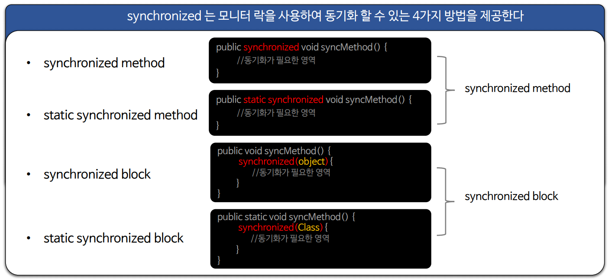

### 메서드 동기화 방식 - synchronized method

- 메서드 전체가 임계 영역이 된다. 즉, 메서드 내의 모든 코드가 동기화 된다.
- 동시성 문제를 한번에 편리하게 제어할 수 있다는 장점이 있지만, 메서드 내 코드의 세부적인 동기화 구조를 가지기 어렵다.
- 메서드 전체를 동기화하기 때문에 동기화 영역이 클 경우 성능 저하를 가져온다.
- **인스턴스 메서드 동기화**와 **정적 메서드 동기화 방식**이 있다.

### 블록 동기화 방식 - synchronized block

- 특정 블록을 정해서 임계 영역을 구성한다. 즉, 블록 내의 코드만 동기화 된다.
- 메서드 동기화 방식에 비해 좀 더 세부적으로 임계 영역을 정해서 필요한 블록만 동기화 구조를 가질 수 있다.
- 메서드 전체를 동기화 하는 것보다 동기화 영역이 작고 효율적인 구성이 가능하기 때문에 성능 저하가 덜하다.
- **인스턴스 블록 동기화**와 **정적 블록 동기화 방식**이 있다.

> **스레드 간 객체의 메서드를 동기화하기 위해서는 같은 객체의 모니터를 참조하고 있어야 한다.**

- `instanceMethod`와 `instanceBlock`이 사용하는 모니터는 서로 같다.
- `staticMethod`와 `staticBlock`이 사용하는 모니터는 서로 같다.
- 그 외 다른 조합들이 사용하는 모니터는 서로 다르다.
- 즉, 인스턴스 메서드나 인스턴스 블록의 락을 한 스레드가 가져가면 동기화로 인해 나머지 인스턴스 메서드 또는 인스턴스 블록에 진입할 수 없다. 
- 그리고 정적 메서드나 정적 블록의 락을 한 스레드가 가져가면 동기화로 인해 나머지 정적 메서드 또는 정적 블록에 진입할 수 없다.
- 반면 인스턴스 메서드나 인스턴스 블록이 사용하는 모니터는 정적 메서드나 정적 블록이 사용하는 모니터와 다르기 때문에 서로 다른 스레드가 동시에 진입할 수 있다.

---

## synchronized 메서드 동기화

### 1. 인스턴스 메서드 동기화

- 인스턴스 단위로 모니터가 동작하며 동일한 인스턴스 안에서 `synchronized` 가 적용된 곳은 하나의 락을 공유한다.
- 인스턴스가 여러개일 경우 인스턴스 별로 모니터 객체를 가지므로 스레드는 모니터 별로 락을 획득해서 동기화 영역에 진입하고 빠져 나올 때 락을 해제 할 수 있다.

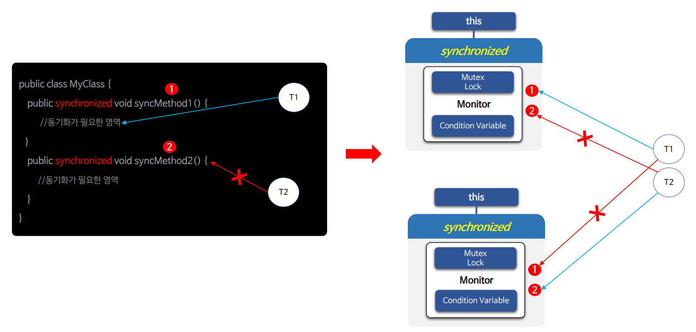

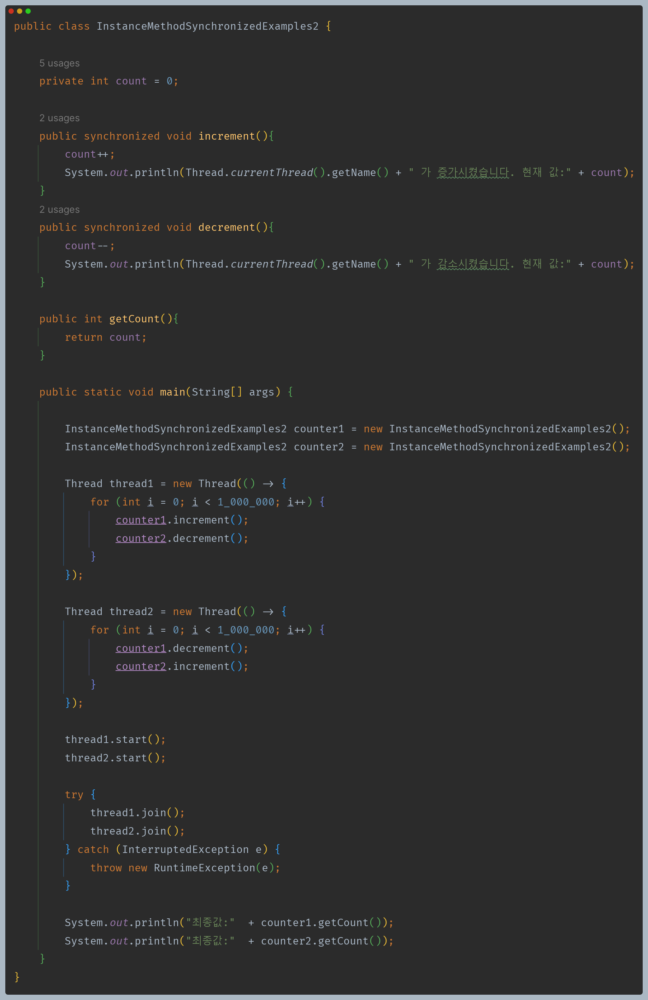

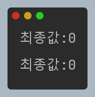

- `synchronized`가 붙은 두 개의 메서드는 서로 같은 모니터를 사용하기 때문에 동기화로 인해 정상적으로 출력된다.

### 2. 정적 메서드 동기화

- 클래스 단위로 모니터가 동작하여 `synchronized`가 적용된 곳은 하나의 락을 공유한다.
- 인스턴스와는 별개의 모니터를 가지고 임계 영역을 동기화 하기 때문에 인스턴스 단위로 메서드를 호출할지라도 락은 클래스 단위로 스레드간 공유된다.
- 클래스는 메모리에 오직 하나만 존재하므로 하나의 모니터를 공유해서 동기화 하고자 할 때 사용할 수 있다.

### 3. 인스턴스 메서드 동기화 + 정적 메서드 동기화

- 두 가지가 혼용되었을 경우 각 모니터 별로 동기화를 진행한다.
- 모니터가 섞여 있기 때문에 동기화가 의도한 대로 정확하게 동작하는지 주의가 필요하다.

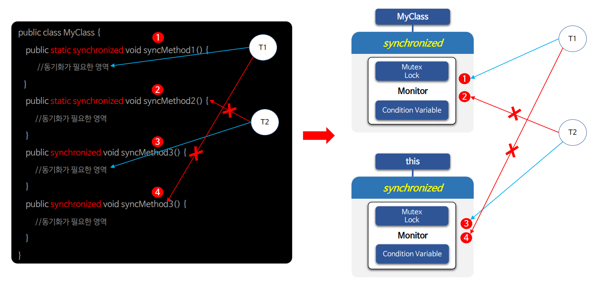

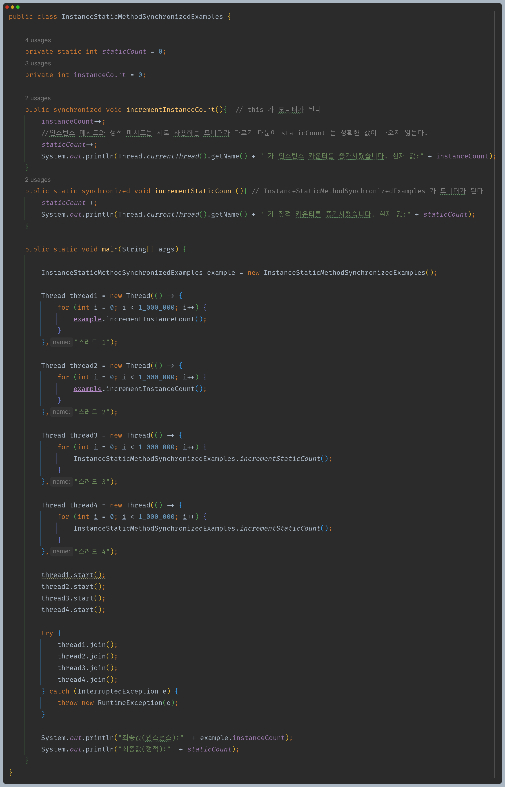

- 정상적인 결과는 인스턴스와 정적의 최종값 모두 `2,000,000`이 나와야 한다.
- 하지만 인스턴스 메서드 동기화 영역 내에서 정적 메서드에서 사용하는 자원에 접근했고, 둘은 서로 사용하는 모니터가 같지 않기 때문에 동시성 문제가 발생하여
    의도하지 않은 결과가 나오게 된다.

---

## synchronized 블록 동기화

### 1. 인스턴스 블록 동기화

- 인스턴스 단위로 모니터가 동작하며 `synchronized`가 적용된 곳은 하나의 락을 공유한다.
- 모든 인스턴스가 모니터를 가지기 때문에 모니터를 여러 인스턴스로 구분해서 동기화를 구성할 수 있다.
- 클래스의 인스턴스가 여러 개일 경우 인스턴스별로 모니터 객체를 가지며 스레드는 모니터 별로 락을 획득해서 `synchronized` 영역을 진입하고 빠져 나올 때 락을 해제할 수 있다.

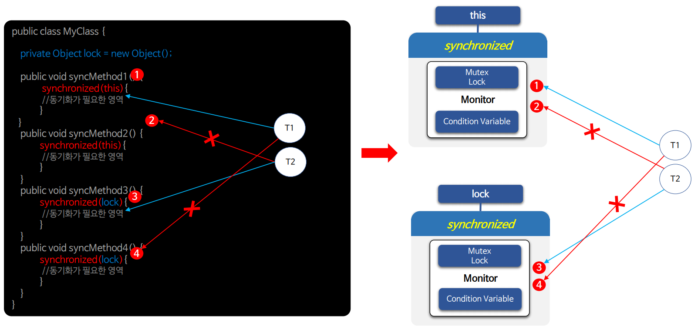

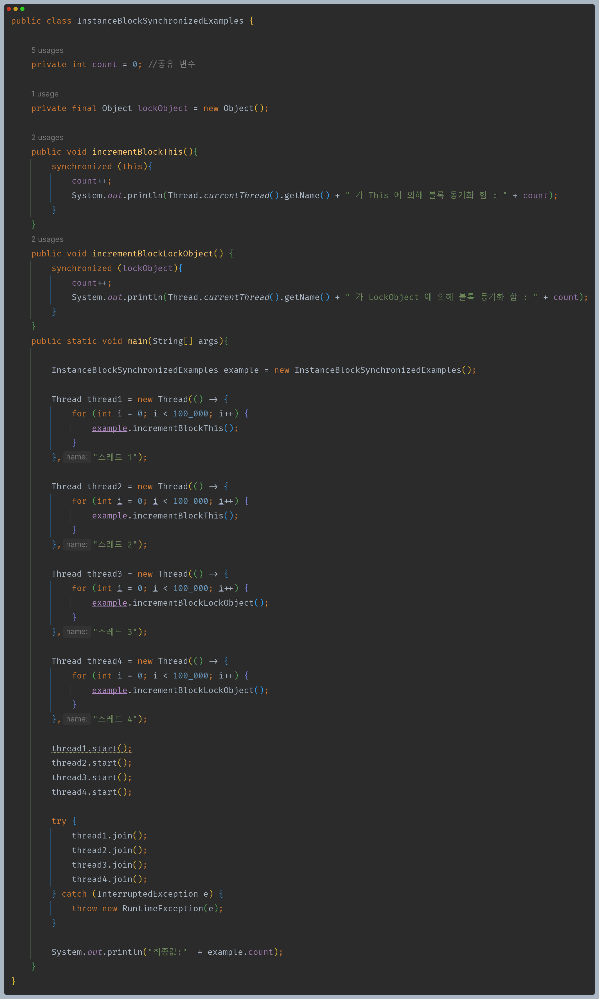

- 공유 변수를 사용하는 두 개의 메서드는 서로 다른 모니터를 사용하기 때문에 공유 변수에 동시 접근이 가능하다. 그래서 정확한 결과가 출력되지 않는다.

### 2. 정적 블록 동기화

- 클래스 단위로 모니터가 동작하며 `synchronized` 가 적용된 곳은 하나의 락을 공유한다.
- 모든 클래스가 모니터를 가지기 때문에 모니터를 여러 클래스로 구분해서 동기화를 구성할 수 있다.
- 클래스 모니터가 여러 개일 경우 스레드는 모니터 별로 락을 획득해서 `synchronized` 영역을 진입하고 빠져 나올 때 락을 해제할 수 있다.

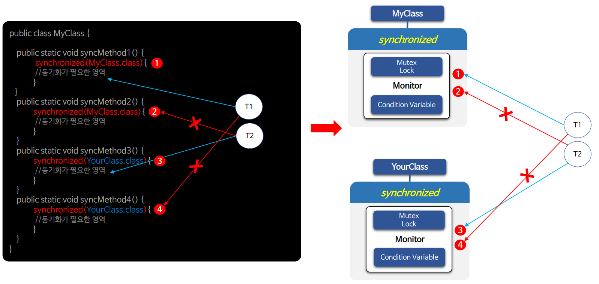

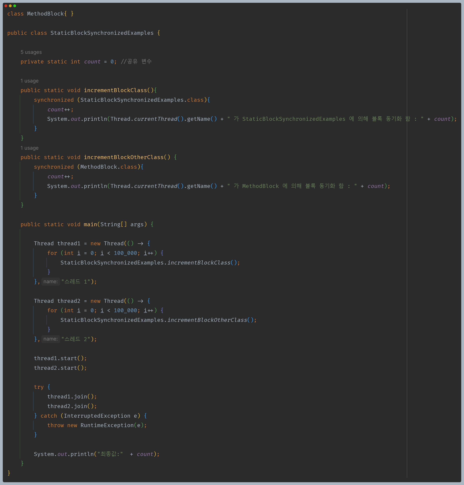

- 공유 변수를 사용하는 두 개의 메서드는 서로 다른 모니터를 사용하기 때문에 공유 변수에 동시 접근이 가능하다. 그래서 정확한 결과가 출력되지 않는다.

### 3. 인스턴스 블록 동기화 + 정적 블록 동기화

- 두 가지가 혼용되었을 경우 각 모니터 별로 동기화를 진행한다.
- 모니터가 섞여 있기 때문에 동기화가 의도한 대로 정확하게 동작하는지 주의가 필요하다.

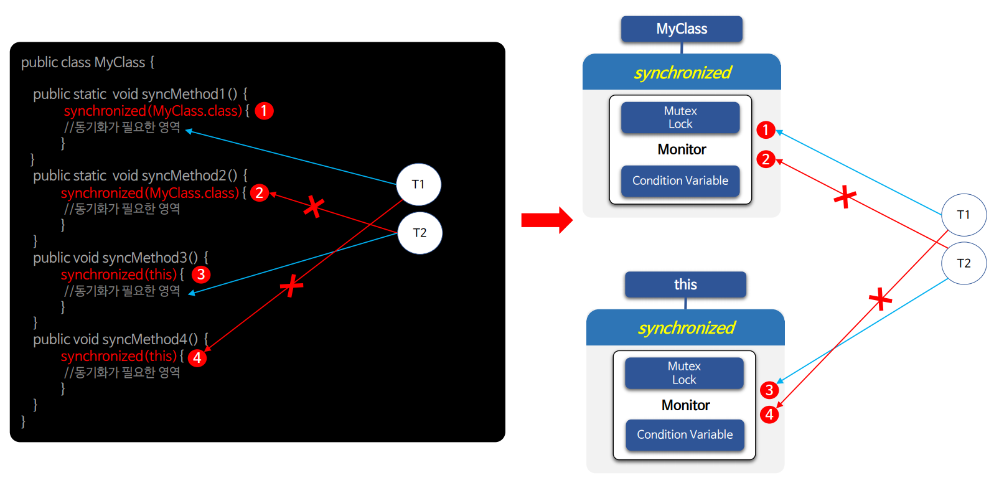

### 4. 메서드 동기화 + 블록 동기화

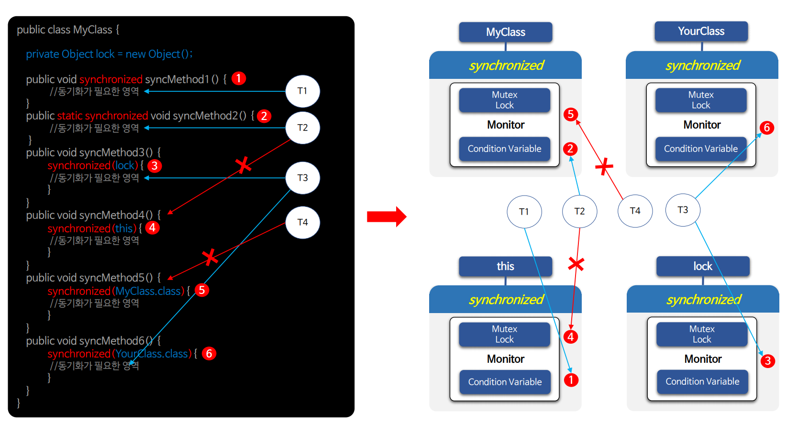

- 모니터는 `lock`, `MyClass`, `this`, `YourClass` 4개가 존재한다.
- 1번 메서드와 4번 블록은 같은 모니터를 사용한다.(`this`)
- 2번 메서드와 5번 블록은 같은 모니터를 사용한다.(`MyClass`)
- 3번과 6번은 각각 `lock`과 `YourClass` 모니터를 사용한다.

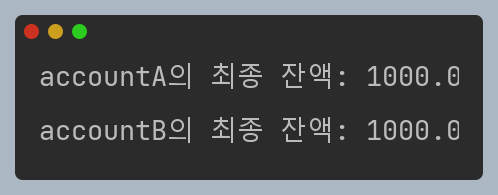

- 주의해야 할 부분은 `transfer()` 메서드이다.
- 일단 `this.lock`과 `to.lock`은 당연히 서로 다른 모니터다.
- 송금을 위한 출금은 동시성 문제가 발생할 수 있기 때문에 락을 획득해야 한다.
- 그리고 락을 획득한 블록 안에서 받는 인스턴스의 락도 획득해야 한다. 왜냐하면 다른 스레드에서 `to.deposit()`을 실행하면 `balance`의 공유 값이 변경 되어 버린다.
- 즉 입금과 출금을 하나의 단위로 보장하기 위함이다.

---

## `synchronized` 특성

### 재진입성

- 모니터 내에서 이미 `synchronized` 영역에 들어간 스레드가 다시 같은 모니터 영역에 들어갈 수 있는데, 이를 **모니터 재진입**이라고 한다.
- 재진입 가능하다는 것은 락의 획득이 호출 단위가 아닌 스레드 단위로 일어난다는 것을 의미하며 이미 락을 획득한 스레드는 같은 락을 얻기 위해
    대기할 필요 없이 `synchronized` 블록을 만났을 때 같은 락을 확보하고 진입한다.

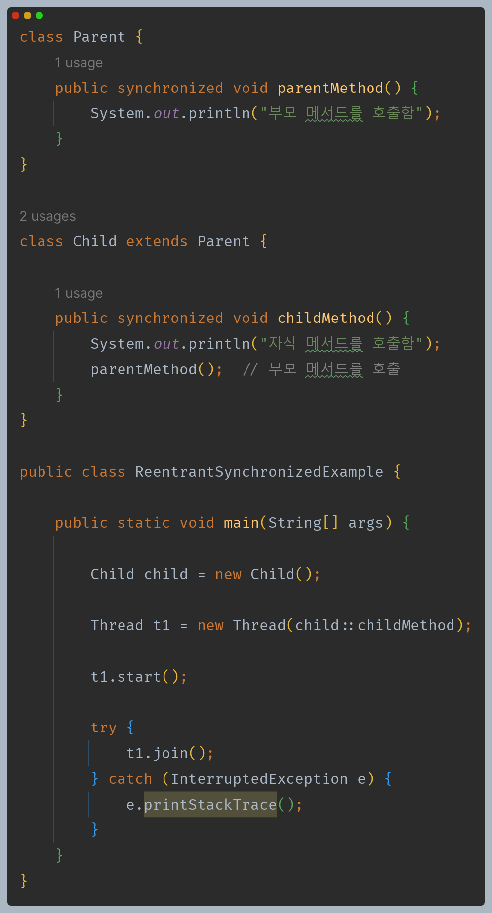

- 상속하게 되면 자식은 부모의 락과 동일한 락을 가지게 된다.
- 동기화 된 메서드에서 다른 동기화 된 메서드를 호출하는 경우 이미 락을 가지고 있는 스레드가 같은 락을 확보하고 재진입 시 데드락이 발생하지 않고
    정상적으로 진행할 수 있게 된다.

### 가시성

- **가시성**이란 한 스레드가 공유 자원을 수정하거나 쓰기 작업을 했을 때 다른 스레드가 수정한 내용이 보이는 것을 말한다.
- [참고 - `volatile`]()

### 그 외

- `sleep()`을 실행한 스레드는 동기화 영역에서 대기 중이더라도 획득한 락을 놓거나 해제하지 않는다.
- `synchronized`의 동기화 영역에 진입하지 못하고 대기 중인 스레드는 인터럽트 되지 않는다.
- `synchronized`의 동기화 영역에 진입하지 못하고 대기 중인 스레드가 다시 경쟁해서 모니터를 획득하는 것은 순서가 정해져 있지 않다.(비공정성)
  - 모니터를 계속 획득하지 못하는 기아 상태의 스레드가 나올 수도 있지만 스케줄러가 적절하게 조절한다.

---

[이전 ↩️ - 동기화 기법 - 스핀락](https://github.com/genesis12345678/TIL/blob/main/Java/reactive/synchronization/%EA%B8%B0%EB%B2%95/SpinLock.md)

[메인 ⏫](https://github.com/genesis12345678/TIL/blob/main/Java/reactive/Main.md)

[다음 ↪️ - Java Synchronization - 스레드 간 협력(`wait()` & `notify()`)]()