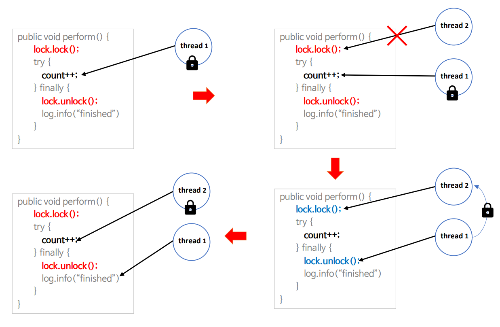
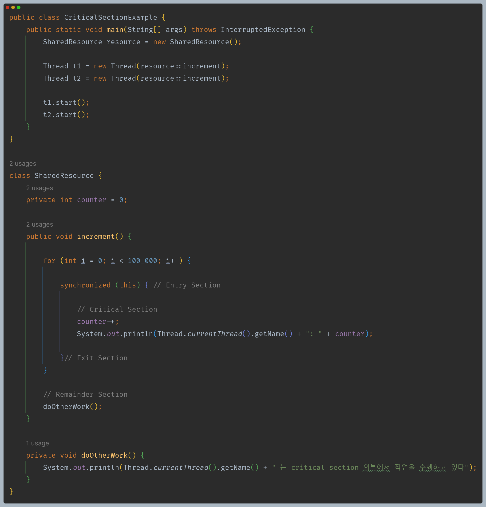
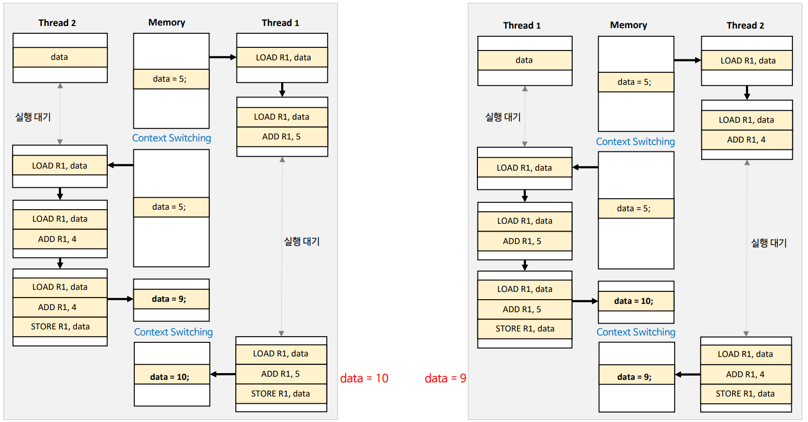
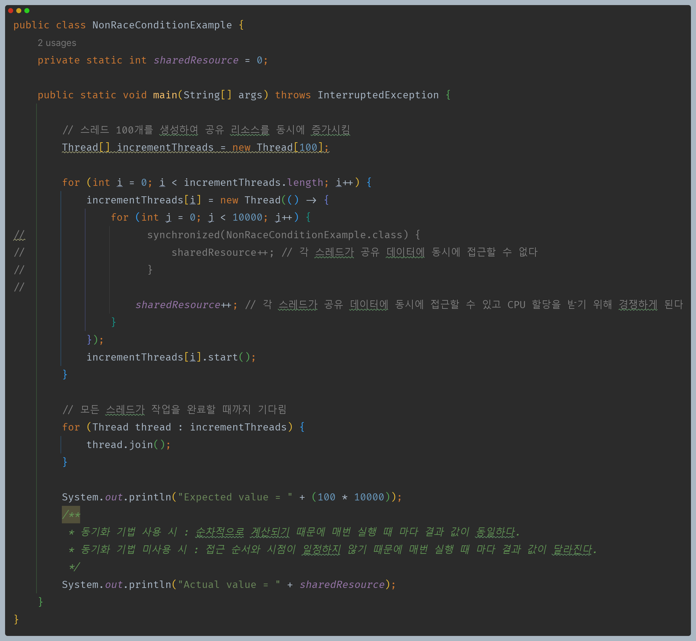

# 자바 동시성 프로그래밍 - 동기화 개념

## 임계 영역 (Critical Section, 공유 변수 영역)

- 둘 이상의 스레드가 동시에 접근해서는 안되는 공유 자원(자료 구조 또는 장치)에 접근하는 코드 영역을 말한다.
- 임계 영역은 `entry section`, `critical section`, `exit section`, `remainder section` 으로 구성 된다.

---

## Critical Section Problem

- 한 스레드가 임계 영역을 실행하고 있을 때 다른 스레드가 같은 임계 영역을 사용해 발생하는 문제다.
- 이 문제의 해결을 위해서는 3가지 충족 조건이 요구된다.
  - **Mutual Exclusion(상호 배제)**
    - 어떤 스레드가 임계 영역을 실행 중이면 다른 스레드는 동일한 임계 영역을 실행할 수 없다.
  - **Progress(진행)**
    - 임계 구역에서 실행 중인 스레드가 없고 임계 구역에 진입하려는 스레드가 있을 때 어떤 스레드가 들어갈 것인지 적절히 선택해 줘야 하며
        이러한 결정은 무한정 미뤄져선 안된다.
  - **Bounded Waiting(한정 대기)**
    - 다른 스레드가 임계 영역에 들어가도록 요청한 후 해당 요청이 수락되기 전에 기존 스레드가 임계 영역에서 실행할 수 있는 횟수에 제한이 있어야 한다.
    - 기아 상태가 발생하지 않도록 한다.

### 동기화 도구들

- 뮤텍스, 세마포어, 모니터, CAS(Compare and Swap) 와 같은 동기화 도구를 통해 **Critical Section Problem**이 발생하지 않도록 할 수 있으며
    자바에서는 `synchronized` 키워드를 포함한 여러 동기화 도구들을 제공하고 있다.

---

## Race Condition (경쟁 상태, 경쟁 조건, 경합 상태)

- 여러 스레드가 동시에 공유 자원에 액세스하고 조작할 때 스레드 간 액세스하는 순서나 시점에 따라 실행 결과가 달라질 수 있는데 이것을 **경쟁 상태**라고 한다.
- 경쟁 상태는 **Critical Section Problem**이 해결되지 않은 상태에서 여러 스레드가 동시에 임계 영역에 접근해서 공유 데이터를 조작함으로써 발생하는 상태라 할 수 있다.

---

[이전 ↩️ - 동기화 개념 - 동기화와 CPU 관계](https://github.com/genesis12345678/TIL/blob/main/Java/reactive/synchronization/%EA%B0%9C%EB%85%90/CPU.md)

[메인 ⏫](https://github.com/genesis12345678/TIL/blob/main/Java/reactive/Main.md)

[다음 ↪️ - 동기화 개념 - 안전한 스레드 구성](https://github.com/genesis12345678/TIL/blob/main/Java/reactive/synchronization/%EA%B0%9C%EB%85%90/ThreadSafe.md)