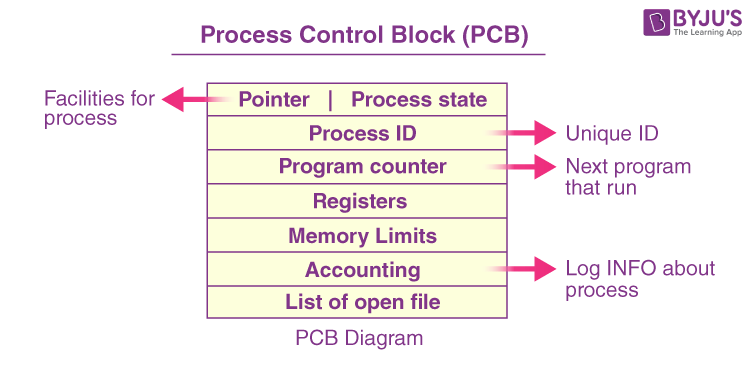
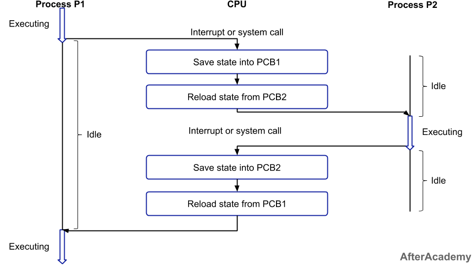
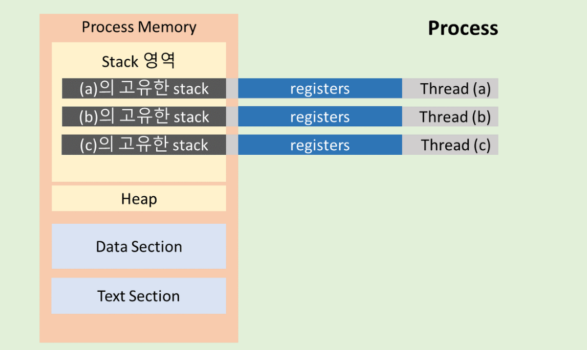
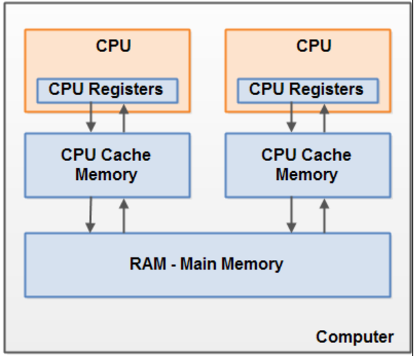

# PCB & Context Switching

## 컨텍스트 스위칭
> CPU가 한 프로세스에서 다른 프로세스로 전환할 때 발생하는 일련의 과정을 말한다.

동작 중인 프로세스가 대기를 하면서 해당 프로세스의 상태를 보관하고, 대기하고 있던
다음 순서의 프로세스가 동작하며너 이전에 보관했던 프로세스의 상태를 복구하는 작업이다. 
**이러한 컨텍스트 스위칭이 일어날 때 다음번 프로세스는 스케줄러가 결정하게 된다. 즉, 컨텍스트 스위칭을 하는 주체는 스케줄러이다.**

 

## 프로세스 제어 블록 (Process Control Block, PCB)
> 운영체제에서 프로세스를 관리하기 위해 해당 프로세스의 상태 정보를 담고 있는 자료구조이다. 

프로세스를 컨텍스트 스위칭할 때 기존 프로세스의 상태를 어딘가에 저장해 둬야 다음에 똑같은 작업을
이어서 할 수 있을 것이고, 새로 해야 할 작업의 상태 또한 알아야 어디서부터 다시 작업을
시작할지 결정할 수 있을 것이다. 즉, PCB는 프로세스 스케줄링을 위해 필요한 정보를 담고 있는 **임시 저장소**이다. 
**PCB는 프로세스가 생성될 때마다 생성되며, 프로세스가 종료되면 제거된다.** 

### PCB에 저장되는 정보

- **포인터(Pointer)** : 프로세스가 사용하는 주소 공간을 가리키는 포인터
- **프로세스 상태(Process State)** : 프로세스의 상태 정보(new, ready, running, waiting, terminated를 저장)
- **프로세스 아이디(Process ID, ``PID``)** : 프로세스를 구분하기 위한 고유한 아이디
- **프로그램 카운터(Program Counter)** : 프로세스가 다음에 실행할 명령어의 주소
- **레지스터(Registers)** : 프로세스의 레지스터 상태를 저장
- **메모리 제한(Memory Limits)** : 운영체제에서 프로세스가 사용할 수 있는 메모리의 범위
- **열린 파일 목록(List of Open Files)** : 프로세스를 위해 열린 파일 목록

**각 PCB는 주소가 있고, 다음에 실행할 명령어의 주소도 갖고 있으니 연결리스트(Linked List)로 관리된다.**
 

## 컨텍스트 스위칭 과정

1. CPU는 Process P1을 실행한다.(Executing)
2. 일정 시간이 지나 Interrupt 또는 system call이 발생한다.(CPU는 idle(대기) 상태)
3. CPU는 현재 실행 중인 Process P1의 상태를 PCB에 저장한다.(Saving)
4. Process P2의 상태를 PCB에서 읽어 CPU가 실행한다.(Loading)
5. CPU는 Process P2를 실행한다.(Executing)
6. 일정 시간이 지나 Interrupt 또는 system call이 발생한다.(CPU는 idle(대기) 상태)
7. CPU는 현재 실행 중인 Process P2의 상태를 PCB에 저장한다.(Saving)
8. Process P1의 상태를 PCB에서 읽어 CPU가 실행한다.(Loading)
9. CPU는 Process P1을 중간 시점부터 실행한다.(Executing)

 

## Context Switching의 Overhead
> Context Switching은 매우 빠르게 일어나지만, 그럼에도 불구하고 오버헤드가 발생한다.

- PCB 저장 및 복원 비용
- CPU Cache 초기화 비용
- 프로세스 스케줄링 비용

컨텍스트 스위칭 오버헤드는 대표적으로 위와 같은 행위에 의해서 발생한다. 
컨텍스트 스위칭은 프로세스 뿐만 아니라 여러개의 스레드들끼리도 발생한다.
멀티 스레드라고 하면 여러개의 스레드가 동시에 돌아가니 프로그램 성능이 좋아질 것 같지만,
실제로는 컨텍스트 스위칭 오버헤드 때문에 성능이 떨어질 수 있다.

 

## 스레드 스케줄링
> 프로세스 스케줄링과 마찬가지로 스레드 스케줄링도 스레드를 관리하기 위한 작업이다. 
> 스레드 스케줄링 알고리즘은 프로세스 스케줄링 알고리즘과 유사하다. 다만 차이점은 하나의 프로세스 내에서
> 다수의 스레드가 동작하는 형태이기 때문에 스레드 간의 상호작용과 동기화 문제를 고려 해야 한다.

프로세스 스케줄링

 

## 스레드 컨텍스트 스위칭
> 멀티 스레딩 환경에서 스레드 간의 실행을 전환하는 기술로, 프로세스 컨텍스트 스위칭과 다른 점은
> 스레드 컨텍스트 스위칭은 하나의 프로세스 내의 스레드들을 교환한다는 점이다.

 

## TCB(Thread Control Block)
> PCB처럼 TCB(스레드 제어 블록)는 각 스레드마다 운영체제에서 유지하는 스레드에 대한 정보를
> 담고 있는 자료구조이다.

그림처럼 TCB는 PCB 안에 들어있다. 그리고 역시 연결리스트로 구현되어 있다. 
TCB도 스레드가 생성될 때 생성되며, 실행을 마치고 소멸될 때 함께 소멸된다. 
또한 스레드 간의 자원 공유와 동기화도 TCB를 사용하여 관리된다. 예를 들어 **뮤텍스**나 **세마포어**
와 같은 동기화 기법을 사용할 때, TCB에서 해당 스레드의 뮤텍스나 세마포어 정보를 관리하고, 스레드가
해당 자원에 대한 접근 권한을 획득하거나 반납할 때 TCB의 정보를 업데이트하게 된다.

- ``뮤텍스(mutex)`` : 임계 구역에 1개의 스레드만 들어갈 수 있는 동기화 기법
- ``세마포어(semaphore)`` : 임계 구역에 여러 스레드가 들어갈 수 있고, counter를 두어서 허용 가능한 스레드를 제한하는 기법

 

## 프로세스 vs 스레드 컨텍스트 스위칭

> 모두 멀티태스킹 환경에서 여러 프로세스 또는 스레드들을 동시에 실행하기 위한 기술이다.

### 1. TCB와 PCB의 차이점

- 프로세스 내의 스레드들은 text, data, heap 영역 메모리를 공유하고,
TCB에는 stack 및 간단한 레지스터 포인터 정보만을 저장하기 때문에 PCB보다 TCB가 가벼워
더 빨리 읽고 쓸 수 있다.

### 2. 캐시 메모리 초기화 여부
> CPU 캐시 메모리는 CPU와 메인 메모리 사이에 위치하여 CPU에서 한번 이상 읽은 데이터를 저장해 두었다가
> 다시 CPU가 요청하면 메인 메모리가 아닌 캐시 메모리에서 읽어오기 때문에 빠른 속도로 데이터를 읽고 쓸 수 있다.

- 프로세스 컨텍스트 스위칭이 일어날 경우, 다른 프로세스의 실행으로 인해 CPU가 새로운 명령어와 데이터를
로드해야 하기 때문에 캐시 메모리를 초기화하는데 이것이 오버헤드를 발생시킬 수 있어 부담이 되는 요소이다. 
- 스레드 컨텍스트 스위칭이 일어날 경우, 프로세스 내 스레드 간에 스택과 레지스터값 등 일부 컨텍스트
정보만 변경되기 때문에 캐시 메모리를 초기화할 필요가 없다. 다만 스레드가 다른 CPU 코어에서 실행될 때는
해당 코어의 캐시 메모리에 스레드 컨텍스트 정보가 없기 때문에 캐시 메모리를 초기화해야 한다.

### 3. 자원 동기화 문제
> 스레드 컨텍스트 스위칭이 발생해 다른 스레드가 heap 영역에 접근할 때, 이전 스레드가 이미 
> 공유 자원을 사용하고 있는 경우 동기화 문제가 발생할 수 있다. 
> 예를 들어, 두 개의 스레드가 동시에 하나의 변수를 수정하려고 할 때 스레드 컨텍스트 스위칭이 발생하면
> 두 스레드가 동시에 변수를 수정하려고 하기 때문에 예상치 못한 결과가 발생할 수 있다.
> 이것을 스레드 간에 **경쟁 조건 (race condition)** 이라고 한다.

