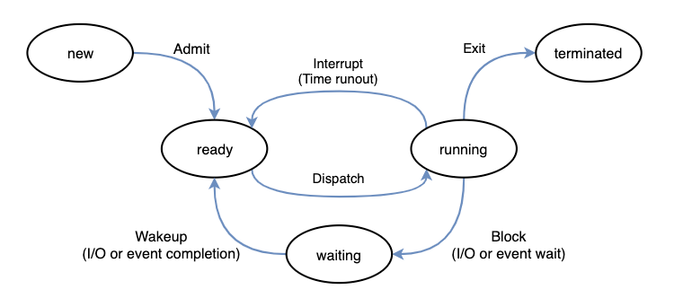

# Process - 프로세스

 

## 프로그램과 프로세스

- **프로그램** : ``*.exe``파일 같은 컴퓨터에서 실행할 수 있는 파일을 말한다. 
**아직 파일을 실행하지 않은 상태이며, 아직은 그냥 코드 덩어리이다.** 
HDD에 저장되어 있고, 실행되기 전까지는 메모리에 올라가지 않는다.(정적인 상태)

- **프로세스** : 실행된 프로그램을 말한다. 
코드 덩어리인 프로그램을 실행 시켜 동적으로 변하고 메모리에 올라가 실행되고 있음을 의미한다. 

 

## 스레드(Thread)

### 스레드의 개념
> 스레드는 하나의 프로세스 내에서 실행되는 여러 흐름의 단위이다. 

우리는 크롬 브라우저를 사용하면서 유튜브도 보고, 구글 검색도 하고, 게임을 하고 있다. 

즉, 하나의 프로세스 안에서 여러가지 작업들 흐름이 동시에 진행되기 때문에 가능한 것인데,
이러한 작업들의 흐름을 스레드라고 하며 여러개가 있다면 멀티 스레드라고 한다. 
당연히 스레드 수가 많을수록 동시에 하는 작업이 많아져 프로그램 속도 성능이 올라간다. 

일반적으로 하나의 프로그램은 하나 이상의 프로세스를 가지고 있고, 하나의 프로세스는 반드시
하나 이상의 스레드를 가지고 있다. 
즉, 프로세스를 생성하면 기본적으로 하나의 main 스레드가 생성이 되고, 이 main 스레드를 기반으로
개발자가 필요에 의해 추가적으로 스레드를 생성할 수 있다. 

 

## 프로세스의 자원 구조

프로그램이 실행되어 프로세스가 만들어지면 메모리 공간이 할당된다. 

[메모리](https://github.com/genesis12345678/TIL/blob/main/OS/OperatingSystem/memory/memory.md)

 

## 스레드의 자원 공유
> 스레드는 프로세스 내에서 실행되는 흐름의 단위이기 때문에 프로세스 내의 자원을 공유한다.
> 스레드끼리 프로세스 실행 흐름의 일부가 되기 때문에 동시 작업이 가능하다.

이때 프로세스의 4가지 메모리 영역 중에서 스택 영역만 할당받아 복사하고 **코드, 데이터, 힙 영역은 스레드끼리 공유**한다. 

> 스택 영역은 스레드마다 독립적으로 할당되기 때문에 스레드마다 독립적인 함수 호출이 가능하다. 
> 그래서 스레드마다 독립적인 실행 흐름을 가지고 있다고 볼 수 있다. 

**하나의 프로세스를 다수의 실행 단위인 스레드로 구분하여 자원을 공유하고, 자원의 생성과 관리으
중복성을 최소화하여 수행 능력을 올릴 수 있다.**

 

## CPU의 멀티 태스킹

### 멀티 태스킹
> 멀티 태스킹은 하나의 CPU가 여러 프로세스를 동시에 실행하는 것을 말한다. 
> 하나의 CPU가 여러 프로세스를 한꺼번에 실행하는 것처럼 보이는데, 실제로는 매우 짧은 시간에
> 여러 프로세스를 번갈아가며 실행하는 것이다. 

### CPU의 작업 처리 방식
1. **병렬 처리** : 여러 개의 작업을 동시에 처리하는 것
> 2개 이상의 코어가 각기 다른 프로세스의 명령을 실행해서 각 프로세스가 같은 순간에 
> 실행되도록 하는 방법이다.

2. **병행 처리** : 하나의 작업을 여러 개의 작업으로 나누어서 조금씩 처리하는 것
> 하나의 코어가 여러 프로세스의 명령을 번갈아가며 실행해서 **각 프로세스가 동시에 실행되는 것처럼 보이게** 하는 방법이다.
> 이때 진행 중인 작업들이 바뀌는 것을 ``Context Switching``이라고 한다.

 

## 프로세스와 스레드의 생명 주기
> 프로세스와 스레드는 각각의 생명 주기를 가지고 있다. 
> 운영체제는 이러한 생명 주기를 관리하고 프로세스와 스레드를 조정하여
> 시스템 자원을 효율적으로 사용할 수 있게 된다.

CPU 스케줄링

 

## 프로세스의 상태
> 프로세스의 상태는 프로세스가 실행되는 동안 변경되는 고유 상태를 의미한다. 
> 프로세스가 생성되어 실행하기 까지 여러가지의 상태를 갖게 되고, 상태의 변화에 따라 프로세스가 동작한다.
> 프로세스의 상태는 크게 5가지로 나눌 수 있다.

| **프로세스 상태** | **설명**                                                                                      |
|-------------|---------------------------------------------------------------------------------------------|
| 생성(new)     | 프로세스가 생성되고 아직 준비가 되지 않은 상태                                                                  |
| 준비(ready)   | 프로세스가 CPU를 사용하기 위해 기다리는 상태 CPU를 할당받을 수 있는 상태이며, 언제든지 실행될 준비가 되어있다.                       |
| 실행(running) | 프로세스가 CPU를 사용하여 실행되는 상태                                                                     |
| 대기(waiting) | 프로세스가 특정 이벤트(입출력 요청 등)가 발생하여 대기하는 상태 CPU를 할당받지 못하며, 이벤트가 발생하여 다시 ready 상태로 전환될 때까지 기다린다. |
| 종료(terminated) | 프로세스가 실행을 완료하고 종료된 상태 더 이상 실행될 수 없으며, 메모리에서 제거된다.                                        |

 

## 프로세스의 상태 전이
> 프로세스가 실행되는 동안 OS에 의해 변경되는 것을 말한다. 
> 운영체제는 프로세스의 상태를 감시하고, 프로세스 상태를 기반으로 프로세스 스케줄링을 통해
> 프로세스를 관리하고 제어한다.

1. **Admit(new -> ready)** : 프로세스 생성을 승인 받음
2. **Dispatch(ready -> running)** : 준비 상태에 있는 여러 프로세스들 중 하나가 스케줄러에 의해 실행된다.
3. **Interrupt(running -> ready)** : ``Timeout``, 예기치 않은 이벤트가 발생하여 현재 실행 중인
프로세스를 준비 상태로 전환하고, 해당 작업을 먼저 처리한다.
4. **I/O or event wait(running -> waiting)** : 실행 중인 프로세스가 입출력이나 이벤트를
처리해야 하는 경우, 입출력이나 이벤트가 끝날 때까지 대기 상태로 전환된다.
5. **I/O or evnet completion(waiting -> ready)** : 입출력이나 이벤트가 모두 끝난 프로세스를 다시
준비 상태로 만들어 스케줄러에 의해 선택될 수 있는 상태로 전환한다.

 

