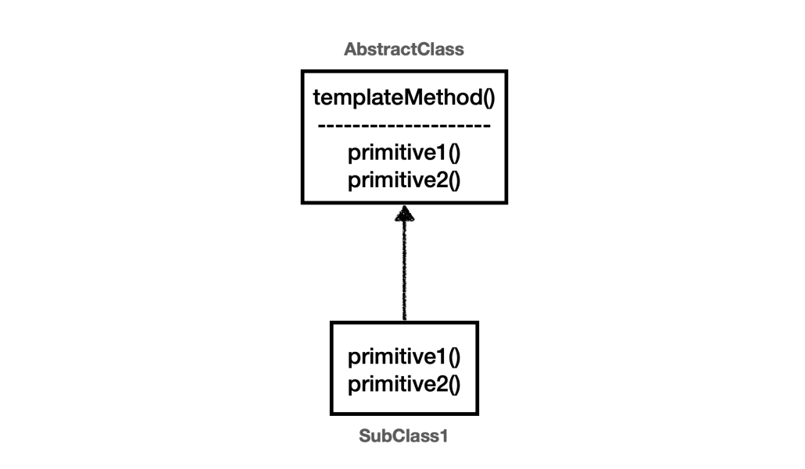

# 로그 추적기 - V4

```java
@RequiredArgsConstructor
public abstract class AbstractTemplate<T> {
    private final LogTrace trace;

    public T execute(String message) {
        TraceStatus status = null;

        try {
            status = trace.begin(message);
            //로직 호출
            T result = call();
            trace.end(status);

            return result;
        } catch (Exception e) {
            trace.exception(status, e);
            throw e;
        }
    }
    //변하는 부분(비즈니스 로직), 상속으로 구현한다.
    protected abstract T call();
}
```

```java
@RestController
@RequiredArgsConstructor
public class OrderControllerV4 {
    private final OrderServiceV4 orderService;
    private final LogTrace trace;

    @GetMapping("/v4/request")
    public String request(String itemId) {

        AbstractTemplate<String> template = new AbstractTemplate<>(trace) {
            @Override
            protected String call() {
                orderService.orderItem(itemId);
                return "OK";
            }
        };
        return template.execute("OrderController.request()");
    }
}

@Service
@RequiredArgsConstructor
public class OrderServiceV4 {
    private final OrderRepositoryV4 orderRepository;
    private final LogTrace trace;

    public void orderItem(String itemId) {

        AbstractTemplate<Void> template = new AbstractTemplate<>(trace) {
            @Override
            protected Void call() {
                orderRepository.save(itemId);
                return null;
            }
        };
        template.execute("OrderService.orderItem()");
    }
}

@Repository
@RequiredArgsConstructor
public class OrderRepositoryV4 {

    private final LogTrace trace;

    public void save(String itemId) {

        AbstractTemplate<Void> template = new AbstractTemplate<>(trace) {
            @Override
            protected Void call() {
                if (itemId.equals("ex")) {
                    throw new IllegalStateException("예외 발생!");
                }
                sleep();
                return null;
            }
        };
        template.execute("OrderRepository.save()");
    }

    private void sleep() {
        try {
            Thread.sleep(1000);
        } catch (InterruptedException e) {
            throw new RuntimeException(e);
        }
    }
}
```

## 템플릿 메서드 패턴 정리

템플릿 메서드 패턴을 적용하여 핵심 기능에 집중할 수 있게 되었다.

**좋은 설계**
- 로그를 남기는 부분을 모아서 하나로 모듈화하고 비즈니스 로직 부분을 분리했다. 이제 로그를 남기는 로직을 변경해야 한다면 `AbstractTemplate` 코드만 변경하면 된다.
- 변경 지점을 하나로 모아서 변경에 쉽게 대처할 수 있는 구조를 만들어 `SRP`원칙을 지킬 수 있게 되었다.

> **템플릿 메서드 패턴 정의**
> 
> `GOF` : 작업에서 알고리즘의 골격을 정의하고 일부 단계를 하위 클래스로 연기한다. 템플릿 메서드를 사용하면 하위 클래스가 알고리즘의 구조를 변경하지 않고도
> 알고리즘의 특정 단계를 재정의 할 수 있다.



## 템플릿 메서드 패턴 단점

**템플릿 메서드 패턴은 상속을 사용한다.** 따라서 상속에서 오는 단점들을 그대로 안고 가는데 특히 자식 클래스가 부모 클래스와 컴파일 시점에 강하게 결합되는 문제가 있다.

이것은 의존관계에 대한 문제이다. 자식 클래스 입장에서는 부모 클래스의 기능을 전혀 사용하지 않는다. 그럼에도 불구하고 템플릿 메서드 패턴을 위해 자식 클래스는 부모 클래스를
상속 받아야 한다.

**상속을 받는다는 것은 특정 부모 클래스에 의존하고 있다는 것이다.** 자식 클래스의 코드에 부모 클래스의 코드가 명확하게 적혀 있다.(강하게 의존한다.)

자식 클래스 입장에서는 부모 클래스의 기능을 전혀 사용하지 않는데 부모 클래스를 알아야 한다. 부모 클래스를 수정하면 자식 클래스에도 영향을 줄 수 있다.(좋은 설계가 아니다.)
또 상속 구조를 사용하기 때문에 별도의 클래스나 익명 내부 클래스를 만들어야 한다.

**템플릿 메서드 패턴과 비슷한 역할을 하면서 상속의 단점을 제거할 수 있는 `전략 패턴`이라는 디자인 패턴을 사용할 수 있다.(상속 보단 위임)**