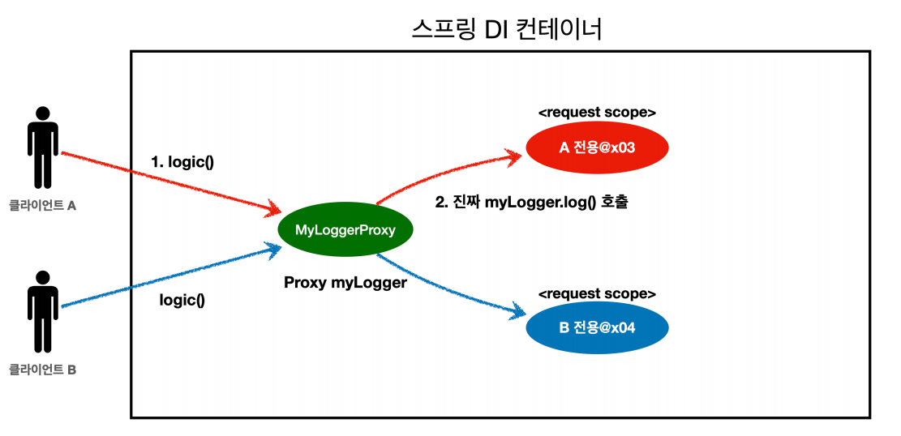

# 스프링 빈 스코프 - 2

## 웹 스코프

- **웹 스코프 특징**
  - 웹 환경에서만 동작한다.
  - 프로토타입과 다르게 스프링이 해당 스코프의 종료시점까지 관리한다. 따라서 종료 메서드가 호출된다.
- **웹 스코프 종류**
  - **request** : HTTP 요청 하나가 들어오고 나갈 때까지 유지되는 스코프로 각각의 HTTP 요청마다 별도의 빈
                인스턴스가 생성되고 관리된다.
  - **session** : HTTP Session과 동일한 생명주기를 가지는 스코프
  - **application** : 서블릿 컨텍스트와 동일한 생명주기를 가지는 스코프
  - **websocket** : 웹 소켓과 동일한 생명주기를 가지는 스코프

## request 스코프

```java
@Component
@Scope(value = "request")
public class MyLogger {

    private String uuid;
    private String requestURL;

    public void setRequestURL(String requestURL) {
        this.requestURL = requestURL;
    }

    public void log(String message) {
        System.out.println("[" + uuid + "]" + "[" + requestURL + "] " + message);
    }

    @PostConstruct
    public void init() {
        uuid = UUID.randomUUID().toString();
        System.out.println("[" + uuid + "] request scope bean create: " + this);
    }

    @PreDestroy
    public void close() {
        System.out.println("[" + uuid + "] request scope bean close: " + this);
    }
}
```
```java
@Controller
@RequiredArgsConstructor
public class LogDemoController {

    private final LogDemoService logDemoService;
    private final MyLogger myLogger;

    @RequestMapping("/log-demo")
    @ResponseBody
    public String logDemo(HttpServletRequest request) throws InterruptedException {
        String requestURL = request.getRequestURL().toString();
        myLogger.setRequestURL(requestURL);

        myLogger.log("controller test");
        sleep(1000);
        logDemoService.logic("testId");

        return "OK";
    }
}
```
```java
@Service
@RequiredArgsConstructor
public class LogDemoService {

    private final MyLogger myLogger;

    public void logic(String testId) {
        myLogger.log("service id = " + testId);
    }
}
```

위 코드를 그대로 실행하면 오류가 발생하고 서버가 띄워지지 않는다. 왜냐하면 컨트롤러와 서비스 코드에 `myLogger`를 의존 관계 주입을 해야 하는데
스프링 애플리케이션 실행 시점에는 request 스코프 빈이 아직 생성되지 않는다. 이 빈은 실제 고객의 요청이 와야 생성할 수 있다.

- ObjectProvider 사용
```java
@Controller
@RequiredArgsConstructor
public class LogDemoController {
    private final LogDemoService logDemoService;
    private final ObjectProvider<MyLogger> myLoggerProvider;
    
    @RequestMapping("log-demo")
    @ResponseBody
    public String logDemo(HttpServletRequest request) {
        String requestURL = request.getRequestURL().toString(); 
        
        MyLogger myLogger = myLoggerProvider.getObject();
        myLogger.setRequestURL(requestURL); 
        myLogger.log("controller test");
        
        logDemoService.logic("testId");
        return "OK";
    } 
}

@Service
@RequiredArgsConstructor
public class LogDemoService {
  private final ObjectProvider<MyLogger> myLoggerProvider;
  
  public void logic(String id) {
    MyLogger myLogger = myLoggerProvider.getObject();
    myLogger.log("service id = " + id);
  }
}
```

문제는 해결이 됐지만 myLogger를 꺼내오기 위한 중복되는 코드를 줄일 수 있다.
```java
@Component
@Scope(value = "request", proxyMode = ScopedProxyMode.TARGET_CLASS)
public class MyLogger { ... }
```

이렇게 하면 MyLogger의 가짜 프록시 클래스를 만들어두고 HTTP requerst와 상관 없이 가짜 프록시 클래스를 다른 빈에 미리 주입해 둘 수 있다.

스프링 컨테이너에는 "myLogger"라는 이름으로 진짜 대신에 이 가짜 프록시 객체를 등록한다. 그래서 의존관계 주입도 가짜 프록시 객체가 주입된다.



**가짜 프록시 객체는 요청이 오면 그때 내부에서 진짜 빈을 요청하는 위임 로직이 들어있다.**
- 가짜 프록시 객체는 내부에 진짜 myLogger를 찾는 방법을 알고 있다.
- 가짜 프록시 객체는 원본 클래스를 상속 받아서 만들어졌기 때문에 이 객체를 사용하는 클라이언트 입장에서는 원본인지 아닌지도 모르고 동일하게 사용할 수 있는 것이다.(다형성)
- 이 가짜 프록시 객체는 실제 request scope와는 관계가 없다. 그냥 가짜이고, 내부에 단순한 위임 로직만 있고 싱글톤 처럼 동작한다.
- Provider를 사용하든 프록시를 사용하든 핵심 아이디어는 **진짜 객체 조회를 꼭 필요한 시점까지 지연처리 한다는 점이다.**
- 이런 특별한 scope는 꼭 필요한 곳에서만 최소화해서 사용하는 것이 좋다. 무분별하게 사용하면 유지보수하기 어려워진다.