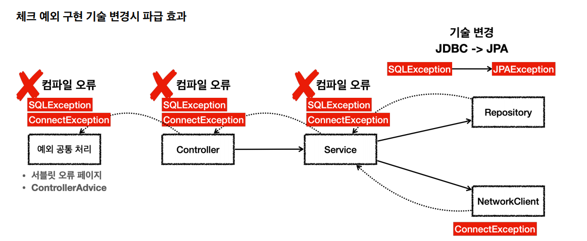

# 체크 예외
> `Exception`과 그 하위 예외는 모두 컴파일러가 체크하는 체크 예외다. 단 `RuntimeException`은 예외로 한다.
> 
> 체크 예외는 잡아서 처리하거나 밖으로 던지도록 선언해야 한다. 그렇지 않으면 컴파일 오류가 발생한다.

```java
package hello.jdbc.exception.basic;

import lombok.extern.slf4j.Slf4j;
import org.junit.jupiter.api.Test;

import static org.assertj.core.api.Assertions.*;

@Slf4j
public class CheckedTest {

    @Test
    void checked_catch() {
        Service service = new Service();
        service.callCatch();
    }

    @Test
    void checked_throw() {
        Service service = new Service();
        assertThatThrownBy(service::callThrow).isInstanceOf(MyCheckedException.class);
    }


    /**
     * Exception을 상속받은 예외는 체크 예외가 된다.
     */
    static class MyCheckedException extends Exception {
        public MyCheckedException(String message) {
            super(message);
        }
    }

    /**
     * Check 예외는 예외를 잡아서 처리(catch)하거나
     * 던지거나(throws) 둘 중 하나를 선택해야 한다.
     */
    static class Service{
        Repository repository = new Repository();

        /**
         * 예외를 잡아서 처리하는 코드
         */
        public void callCatch() {
            try {
                repository.call();
            } catch (MyCheckedException e) {
                // 예외 처리 로직
                log.info("예외 처리, message={}", e.getMessage(), e);
            }
        }

        /**
         * 체크 예외를 밖으로 던지는 코드
         * 체크 예외는 예외를 잡지 않고 밖으로 던지려면 throws 예외를 메소드에 필수로 선언해야 한다.
         * @throws MyCheckedException
         */
        public void callThrow() throws MyCheckedException {
            repository.call();
        }
    }

    static class Repository{
        public void call() throws MyCheckedException {
            throw new MyCheckedException("ex");
        }
    }
}
```

**체크 예외 장단점**<br>
체크 예외는 예외를 잡아서 처리할 수 없을 때 예외를 밖으롣 던지는 `throws {예외}`를 필수로 선언해야 한다. 그렇지 않으면 컴파일 오류가 발생하는 데 이것 때문에 장단점이 동시에 존재한다.

- 장점 : 개발자가 실수로 예외를 누락하지 않도록 컴파일러를 통해 문제를 잡아주는 훌륭한 안전장치가 될 수 있다.
- 단점 : 개발자가 모든 체크 예외를 반드시 잡거나 던지도록 처리해야 하기 때문에 너무 번거로운 일이 된다. 크게 신경쓰고 싶지 않은 예외까지 모두 챙겨야 한다.

<br>

## 체크 예외 활용

- **기본적으로 `언체크(런타임) 예외`를 사용한다.**
- 체크 예외는 비즈니스 로직상 의도적으로 던지는 예외에만 사용한다.
  - 해당 예외를 잡아서 반드시 처리해야 하는 문제일 때만 체크 예외를 사용해야 한다.
    - 계좌 이체 실패 예외
    - 로그인 ID, PW 불일치 예외
  - 이 경우에도 무조건 체크 예외로 만들어야 하는 것은 아니고 계좌 이체 실패처럼 매우 심각한 문제는 개발자가 실수로 예외를 놓치면 안 된다고 판단할 수 있다. 이 경우
    체크 예외로 만들어 두면 컴파일러를 통해 놓친 예외를 인지할 수 있다.

체크 예외는 컴파일러가 예외 누락을 체크해주기 때문에 개발자가 실수로 예외를 놓치는 것을 막아준다. 그래서 항상 명시적으로 예외를 잡아서 처리하거나 처리할 수 없을 때는
예외를 던지도록 `throws {예외}`를 선언해야 한다.

**체크 예외가 언체크 예외보다 더 안전하고 좋아보이는데 왜 언체크 예외를 사용해야 할까?**


서비스와 컨트롤러는 두 예외를 처리할 수 없으므로 `throws`를 통해 밖으로 던지게 된다. 웹 애플리케이션이라면 서블릿의 오류 페이지나 스프링 MVC가 제공하는 `ControllerAdvice`
에서 이런 예외를 공통으로 처리한다.

이런 문제들은 보통 사용자에게 어떤 문제가 발생했는지 자세히 설명하기 어렵기 때문에 일반적인 메시지를 보여준다.(API라면 HTTP 상태코드 500)<br>
이렇게 해결이 불가능한 공통 예외는 별도의 오류 로그를 남기고 개발자가 오류를 빨리 인지할 수 있도록 해야한다.

```java
public class CheckedAppTest {

    @Test
    void checked() {
        Controller controller = new Controller();
        assertThatThrownBy(controller::request)
                .isInstanceOf(Exception.class);
    }

    static class Controller{
        Service service = new Service();

        public void request() throws SQLException, ConnectException {
            service.logic();
        }
    }

    static class Service{
        Repository repository = new Repository();
        NetworkClient networkClient = new NetworkClient();

        public void logic() throws ConnectException, SQLException {
            repository.call();
            networkClient.call();
        }
    }

    static class NetworkClient{
        public void call() throws ConnectException {
            throw new ConnectException("연결 실패");
        }
    }

    static class Repository{
        public void call() throws SQLException {
            throw new SQLException("ex");
        }
    }
}
```
**크게 2가지 문제가 있다.**
1. **복구 불가능한 예외**
   - 대부분의 예외는 복구가 불가능하다. 예를 들어 `SQLException`은 SQL 문법 문제, DB 자체 문제, DB 서버가 중간에 다운 되었을 수도 있다. 이런 문제들은 대부분
   복구가 불가능하다. 특히 서비스나 컨트롤러는 이런 문제를 해결 할 수 없다. 이런 문제들은 일관성 있게 공통으로 처리해야 한다. 오류 로그를 남기고 해당 오류를 빠르게
     인지하는 것이 필요하다. `서블릿 필터`, `스프링 인터셉터`, 스프링의 `ControllerAdvice`를 사용하여 처리할 수 있다.
2. **의존 관계에 대한 문제**
   - 체크 예외이기 때문에 본인이 처리할 수 없어도 어쩔 수 없이 `throws`를 통해 던지는 예외를 선언해야 한다.
   - 필수로 선언을 해야 하기에 서비스, 컨트롤러에서 `java.sql.SQLException`을 의존하는 것이 문제가 된다.(불필요한 의존 관계)
   - 향후 JDBC 기술을 다른 기술로 변경한다면 모든 서비스, 컨트롤러의 코드를 고쳐야 한다.

