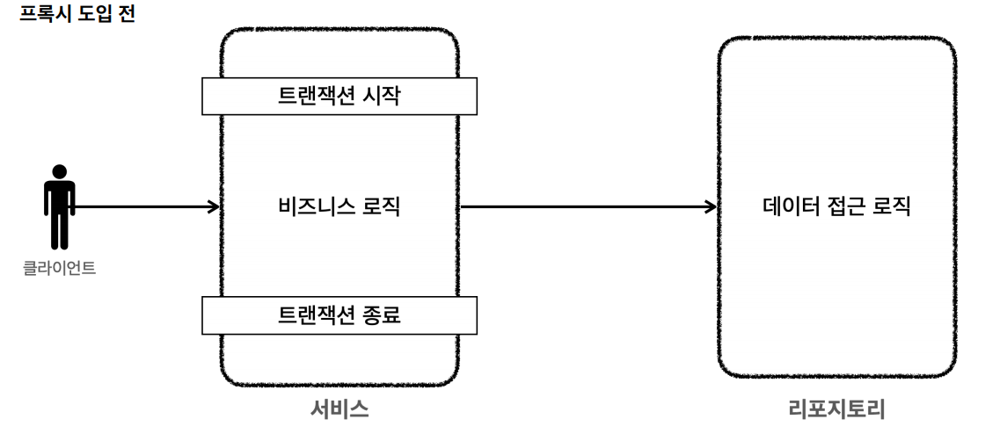
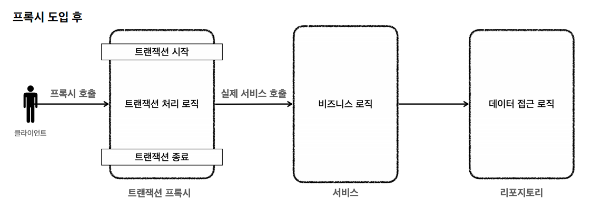
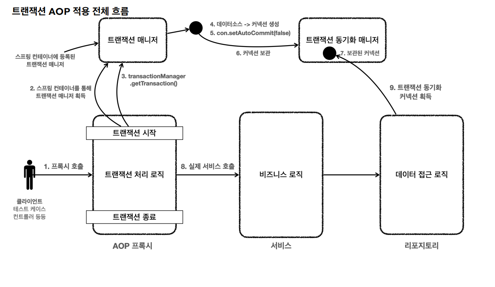

# 트랜잭션 AOP
> 트랜잭션을 편리하게 처리하기 위해서 트랜잭션 추상화, 트랜잭션 템플릿을 도입해봤는데 반복 코드는 해결할 수 있었지만 서비스 계층에 순수한 비즈니스 로직만을
> 남기진 못했다. `스프링 AOP`를 통해 프록시를 도입하면 문제를 해결할 수 있다.


프록시를 도입하기 전에는 서비스 로직에서 트랜잭션을 직접 시작한다.


프록시를 사용하면 트랜잭션을 처리하는 객체와 비즈니스 로직을 처리하는 서비스 객체를 명확하게 분리할 수 있다.

## 트랜잭션 AOP 적용
```java
/**
 * 트랜잭션 - @Transactional AOP
 */
@Slf4j
public class MemberServiceV3_3 {

    private final MemberRepositoryV3 memberRepository;

    public MemberServiceV3_3(MemberRepositoryV3 memberRepository) {
        this.memberRepository = memberRepository;
    }

    @Transactional
    public void accountTransfer(String fromId, String toId, int money) throws SQLException {
        bisLogic(fromId, toId, money);
    }

    private void bisLogic(String fromId, String toId, int money) throws SQLException {
        Member fromMember = memberRepository.findById(fromId);
        Member toMember = memberRepository.findById(toId);

        memberRepository.update(fromId, fromMember.getMoney() - money);
        validation(toMember);
        memberRepository.update(toId, toMember.getMoney() + money);
    }

    private void validation(Member toMember) {
        if (toMember.getMemberId().equals("ex")) {
            throw new IllegalStateException("이체중 예외 발생");
        }
    }
}
```
스프링이 제공하는 트랜잭션 AOP를 적용하기 위해 `@Transactional` 어노테이션을 추가한다.<br>
`@Transactional`은 메서드에 붙여고 되고, 클래스 레벨에 붙여도 된다. 클래스에 붙이면 외부에서 호출 가능한 `pulbic`메서드가 AOP 적용 대상이 된다.

- 테스트 코드
```java
/**
 * 트랜잭션 - @Transactional AOP
 */
@SpringBootTest
@Slf4j
class MemberServiceV3_3Test {

    public static final String MEMBER_A = "memberA";
    public static final String MEMBER_B = "memberB";
    public static final String MEMBER_EX = "ex";

    @Autowired private MemberRepositoryV3 memberRepository;
    @Autowired private MemberServiceV3_3 memberService;

    @TestConfiguration
    static class TestConfig{
        @Bean
        DataSource dataSource() {
            return new DriverManagerDataSource(URL, USERNAME, PASSWORD);
        }

        @Bean
        PlatformTransactionManager transactionManager() {
            return new DataSourceTransactionManager(dataSource());
        }

        @Bean
        MemberRepositoryV3 memberRepositoryV3() {
            return new MemberRepositoryV3(dataSource());
        }

        @Bean
        MemberServiceV3_3 memberServiceV3_3() {
            return new MemberServiceV3_3(memberRepositoryV3());
        }
    }

    @AfterEach
    void afterEach() throws SQLException {
        memberRepository.delete(MEMBER_A);
        memberRepository.delete(MEMBER_B);
        memberRepository.delete(MEMBER_EX);
    }

    @Test
    @DisplayName("AOP 확인")
    void AopCheck() {
        log.info("memberService class={}", memberService.getClass());
        log.info("memberRepository class={}", memberRepository.getClass());
        assertThat(AopUtils.isAopProxy(memberService)).isTrue();
        assertThat(AopUtils.isAopProxy(memberRepository)).isFalse();
    }

    @Test
    @DisplayName("정상 이체")
    void accountTransfer() throws SQLException {
        //given
        Member memberA = new Member(MEMBER_A, 10000);
        Member memberB = new Member(MEMBER_B, 10000);
        memberRepository.save(memberA);
        memberRepository.save(memberB);

        //when
        memberService.accountTransfer(memberA.getMemberId(), memberB.getMemberId(), 2000);

        //then
        Member findMemberA = memberRepository.findById(memberA.getMemberId());
        Member findMemberB = memberRepository.findById(memberB.getMemberId());

        assertThat(findMemberA.getMoney()).isEqualTo(8000);
        assertThat(findMemberB.getMoney()).isEqualTo(12000);
    }

    @Test
    @DisplayName("이체 중 예외 발생")
    void accountTransferEx() throws SQLException {
        //given
        Member memberA = new Member(MEMBER_A, 10000);
        Member memberEx = new Member(MEMBER_EX, 10000);
        memberRepository.save(memberA);
        memberRepository.save(memberEx);

        //when
        assertThatThrownBy(() -> memberService.accountTransfer(memberA.getMemberId(), memberEx.getMemberId(), 2000))
                .isInstanceOf(IllegalStateException.class);

        //then
        Member findMemberA = memberRepository.findById(memberA.getMemberId());
        Member findMemberB = memberRepository.findById(memberEx.getMemberId());

        assertThat(findMemberA.getMoney()).isEqualTo(10000);
        assertThat(findMemberB.getMoney()).isEqualTo(10000);
    }
}
```
- `@SpringBootTest` : 스프링 AOP를 적용하려면 스프링 컨테이너가 필요한데 이 어노테이션이 있으면 테스트시 스프링 부트를 통해 스프링 컨테이너를 생성한다.
그리고 테스트에서 `@Autowired`등을 통해 스프링 컨테이너가 관리하는 `빈`들을 사용할 수 있다.
- `@TestConfiguration` : 테스트 안에서 내부 설정 클래스를 만들어서 이 어노테이션을 붙이면 스프링 부트가 자동으로 만들어주는 빈들에 추가로 필요한 스프링 빈들을 등록하고
테스트를 수행할 수 있다.

스프링이 제공하는 트랜잭션 AOP는 스프링 빈에 등록된 트랜잭션 매니저를 찾아서 사용하기 때문에 트랜잭션 매니저를 스프링 빈으로 등록해야 한다.

`AopCheck()` 실행 결과를 보면 `memberService`는 프록시(`CGLIB`)이 적용이 됐고, `memberRepository`에는 AOP를 적용하지 않았기 때문에 프록시가 적용되지 않았다.

<br>

## 트랜잭션 AOP 흐름



### 선언전 트랜잭션 관리와 프로그래밍 방식 트랜잭션 관리

- 선언전 트랜잭션 관리
  - `@Transactional` 어노테이션 하나만 선언해서 매우 편리하게 트랜잭션을 적용하는 것을 `선언전 트랜잭션 관리`라고 한다.
  - 이름 그대로 해당 로직에 트랜잭션을 적용하겠다 라고 어딘가에 선언하기만 하면 트랜잭션이 적용하는 방식이다.
- 프로그래밍 방식 트랜잭션 관리
  - 트랜잭션 매니저 또는 트랜잭션 템플릿 등을 사용해서 트랜잭션 관련 코드를 직접 작성하는 것을 말한다.
- 실무에서는 대부분 선언전 트랜잭션 관리를 사용한다.

<br>

## 스프링 부트 자동 리소스

기존에는 데이터 소스와 트랜잭션 매니저를 직접 스프링 빈으로 등록해야 했다.
```java
@Bean
DataSource dataSource() {
    return new DriverManagerDataSource(URL, USERNAME, PASSWORD);
}

@Bean
PlatformTransactionManager transactionManager() {
    return new DataSourceTransactionManager(dataSource());
}
```

스프링 부트가 나오면서 자동화 되었다.

- 데이터소스(`DataSource`)를 스프링 빈에 자동으로 등록한다.
- 자동으로 등록되는 스프링 빈 이름 : `dataSource`
- 개발자가 직접 빈으로 등록하면 스프링 부트는 데이터소스를 자동으로 등록하지 않는다.

스프링 부트는 `application.properties`에 있는 속성을 사용해서 `DataSource`를 생성하고 스프링 빈에 등록한다.
```properties
spring.datasource.url=jdbc:h2:tcp://localhost/~/test
spring.datasource.username=sa
spring.datasource.password=
```
- 스프링 부트가 기본으로 생성하는 데이터소스는 커넥션 풀을 제공하는 `HikariDataSource`이다. 커넥션 풀과 관련된 설정도 `application.properties`를 통해 지정할 수 있다.
- `spring.datasource.url` 속성이 없으면 내장 데이터베이스(메모리 DB)를 생성하려고 시도한다.

스프링 부트는 적절한 트랜잭션 매니저(`PlatformTransactionManager`)도 자동으로 스프링 빈에 등록하는데 `transactionManager`라는 이름으로 등록된다.
어떤 트랜잭션 매니저를 선택할지는 현재 등록된 라이브러리를 보고 판단한다.

- 데이터소스, 트랜잭션 매니저 자동 등록 테스트 코드
```java
/**
 * 트랜잭션 - Datasource, transactionManager 자동 등록
 */
@SpringBootTest
@Slf4j
class MemberServiceV3_4Test {

    public static final String MEMBER_A = "memberA";
    public static final String MEMBER_B = "memberB";
    public static final String MEMBER_EX = "ex";

    @Autowired private MemberRepositoryV3 memberRepository;
    @Autowired private MemberServiceV3_3 memberService;

    @TestConfiguration
    @RequiredArgsConstructor
    static class TestConfig{
        @Autowired private final DataSource dataSource;
        
        @Bean
        MemberRepositoryV3 memberRepositoryV3() {
            return new MemberRepositoryV3(dataSource);
        }

        @Bean
        MemberServiceV3_3 memberServiceV3_3() {
            return new MemberServiceV3_3(memberRepositoryV3());
        }
    }

    @AfterEach
    void afterEach() throws SQLException {
        memberRepository.delete(MEMBER_A);
        memberRepository.delete(MEMBER_B);
        memberRepository.delete(MEMBER_EX);
    }

    @Test
    @DisplayName("AOP 확인")
    void AopCheck() {
        log.info("memberService class={}", memberService.getClass());
        log.info("memberRepository class={}", memberRepository.getClass());
        assertThat(AopUtils.isAopProxy(memberService)).isTrue();
        assertThat(AopUtils.isAopProxy(memberRepository)).isFalse();
    }

    @Test
    @DisplayName("정상 이체")
    void accountTransfer() throws SQLException {
        //given
        Member memberA = new Member(MEMBER_A, 10000);
        Member memberB = new Member(MEMBER_B, 10000);
        memberRepository.save(memberA);
        memberRepository.save(memberB);

        //when
        memberService.accountTransfer(memberA.getMemberId(), memberB.getMemberId(), 2000);

        //then
        Member findMemberA = memberRepository.findById(memberA.getMemberId());
        Member findMemberB = memberRepository.findById(memberB.getMemberId());

        assertThat(findMemberA.getMoney()).isEqualTo(8000);
        assertThat(findMemberB.getMoney()).isEqualTo(12000);
    }

    @Test
    @DisplayName("이체 중 예외 발생")
    void accountTransferEx() throws SQLException {
        //given
        Member memberA = new Member(MEMBER_A, 10000);
        Member memberEx = new Member(MEMBER_EX, 10000);
        memberRepository.save(memberA);
        memberRepository.save(memberEx);

        //when
        assertThatThrownBy(() -> memberService.accountTransfer(memberA.getMemberId(), memberEx.getMemberId(), 2000))
                .isInstanceOf(IllegalStateException.class);

        //then
        Member findMemberA = memberRepository.findById(memberA.getMemberId());
        Member findMemberB = memberRepository.findById(memberEx.getMemberId());

        assertThat(findMemberA.getMoney()).isEqualTo(10000);
        assertThat(findMemberB.getMoney()).isEqualTo(10000);
    }
}
```
`TestConfig` 부분만 수정했다. 스프링 부트가 만들어준 데이터소스 빈을 주입 받았다.
