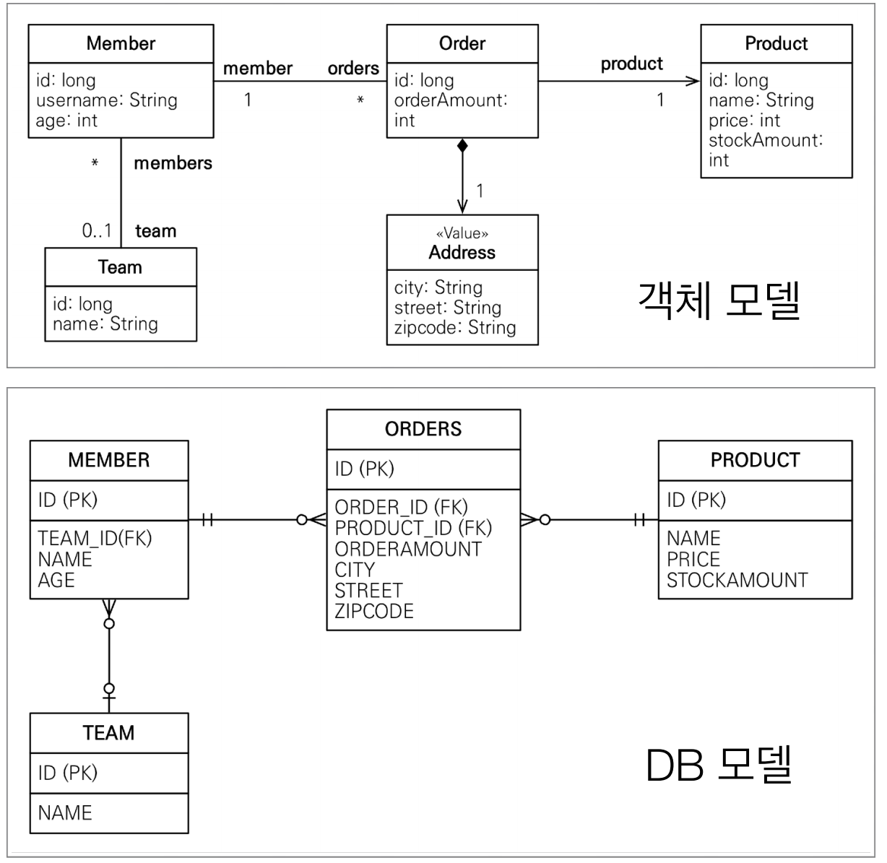

# JPQL
> JPQL : Java Persistence Query Language
> 
> - 객체지향 쿼리 언어로, 테이블을 대상으로 쿼리하는 것이 아니라 엔티티 객체를 대상으로 쿼리한다.
> - SQL을 추상화해서 특정 데이터베이스 SQL에 의존하지 않는다.
> - JPQL은 결국 SQL로 변환된다.

기본 모델링

<br>

## 프로젝션
> `SELECT`절에 조회할 대상을 지정할 수 있다. 프로젝션 대상으로 엔티티, 임베디드 타입, 스칼라 타입(숫자, 문자 등 기본 데이터)이 있다.

- 엔티티 프로젝션
```java
select m from Member m
select m.team from Member m
```
처음은 회원을 조회하고 두 번째는 회원과 연관된 팀을 조회한다. **이렇게 조회한 엔티티는 영속성 컨텍스트에서 관리된다.**

두 번째는 다음처럼 변경할 수도 있다.
```java
select t from Member m join m.team t
```
실행되는 쿼리는 똑같다. 차이점이라고 한다면 개발자가 이 쿼리는 `조인`을 통해 데이터를 가져오는구나라고 인지하는 것 정도다.

- 임베디드 타입 프로젝션
```java
select o.address from Order o
```
임베디드 타입은 값 타입이기 때문에 조회의 시작점이 될 수 없다.
```java
//잘못된 쿼리
select a from Address a
```

- 스칼라 타입 프로젝션
```java
select m.name, m.age from Member m
```
이렇게 두 개의 타입이 다른 필드를 프로젝션해서 타입을 지정할 수 없으므로 `TypeQuery`를 사용할 수 없다.

`NEW`명령어를 통하여 바로 DTO로 변환할 수 있다.
```java
@AllArgsConstructor
@Getter
public class MemberDto {
    private String name;
    private int age;
}

em.createQuery("select new hellojpa.MemberDto(m.name, m.age) from Member m", MemberDto.class).getResultList();
```
- 패키지 명을 포함한 전체 클래스명을 입력해야 한다.
- 순서와 타입이 일차하는 생성자가 필요하다.

## 페이징
JPA는 페이징을 다음 API로 추상화했다.
- **setFirstResult(int startPosition)** : 조회 시작 위치(0부터 시작)
- **setMaxResult(int maxResult)** : 조회할 데이터 수

```java
em.createQuery("select m from Member m order by m.age desc", Member.class)
  .setFirstResult(0)
  .setMaxResults(10)
  .getResultList();
```

## 조인

- 내부 조인
```java
em.createQuery("select m from Member m inner join m.team t where t.name = :teamName", Member.class)
  .setParameter("teamName", teamName)
  .getResultList();
```
회원과 팀을 내부 조인해서 teamName에 소속된 회원을 찾는다. `inner`는 생략 가능하다.

- 외부 조인
```java
em.createQuery("select m from Member m left outer join m.team t", Member.class)
  .getResultList();
```
`outer`는 생략 가능하다.

- 세타 조인
```java
em.createQuery("select m from Member m, Team t where m.name = t.name", Member.class)
  .getResultList();
```

- ON 절
```java
em.createQuery("select m from Member m left join m.team t on t.name = 'teamA'", Member.class)
  .getResultList();
```
회원과 팀을 조인할 때 팀의 이름이 "teamA"로 조인 대상을 필터링할 수 있다.

```java
em.createQuery("select m,t from Member m left join Team t on m.name = t.name")
  .getResultList();
```
회원의 이름과 팀의 이름이 같은 대상을 외부 조인한다.

## 서브 쿼리

- 나이가 평균보다 많은 회원을 찾는다.
```java
select m from Member m
where m.age > (select avg(m2.age) from Member m2)
```

- 한 건이라도 주문한 고객을 찾는다.
```java
select m from Member m
where (select count(o) from Order o where m = o.member) > 0

//컬렉션 값 연관 필드의 size 기능을 사용해서도 가능
select m from Member m
where m.orders.size > 0
```

### 서브 쿼리 지원 함수

- **[not] exists (subquery)**
```java
//팀A에 소속인 회원
select m from Member m
where exists (select t from m.team t where t.name = '팀A')
```
서브 쿼리에 결과가 존재하면 참이다. `not`은 반대

- **all, any, some (subquery)**
```java
//전체 상품 각각의 재고보다 주문량이 많은 주문들
select o from Order o
where o.orderAmount > all(select p.stockAmount from Product p)

//어떤 팀이든 팀에 소속된 회원
select m from Member m
where m.team = any(select t from Team t)
```
비교 연산자와 같이 사용하며 `all`은 조건을 모두 만족해야 참이고 `any`나 `some`은 하나라도 만족하면 참이다.

- **[not] in (subquery)**
```java
//20세 이상을 보유한 팀
select t from Team t
where t in(select t2 from Team t2 join t2.member m2 where m2.age >= 20)
```
서브쿼리의 결과 중 하나라도 같은 것이 있으면 참이다.

## CASE 식
- 기본 CASE 식
```java
String query = "select " +
        "case when m.age<=10 then '학생요금' " +
        "     when m.age>=60 then '경로요금' " +
        "     else '일반 요금' " +
        "end " +
        "from Member m";
em.createQuery(query, String.class)
  .getResultList();
```

- COALESCE
```java
select coalesce(m.name, '이름 없는 회원') from Member m
```
사용자 이름이 없으면 '이름 없는 회원'을 반환한다.

- NULLIF
```java
select nullif(m.name, '관리자') from Member m
```
사용자 이름이 '관리자'면 `null`을 반환하고 나머지는 이름을 그대로 반환한다.
