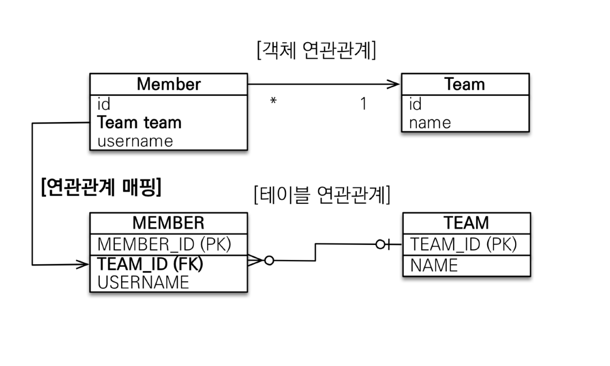
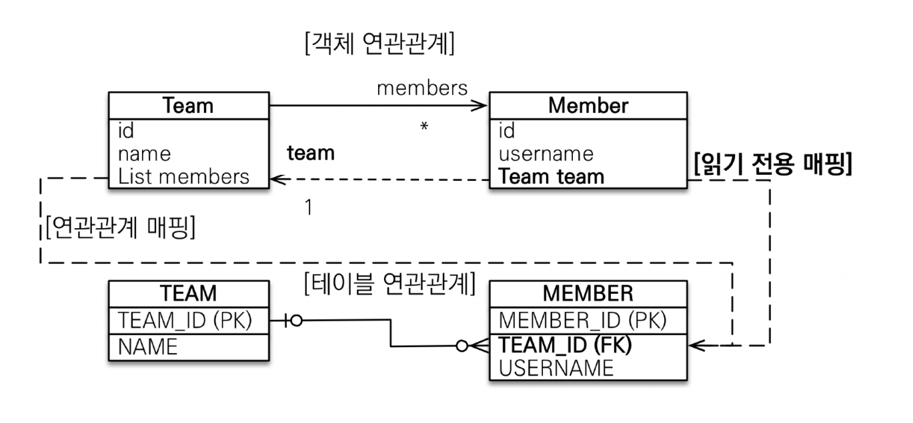

# 연관 관계 매핑
> 객체는 참조를 사용해서 관계를 맺고, 테이블은 외래 키(`FK`)를 사용해서 관계를 맺는다. 객체와 테이블은 완전히 다른 특징을 가지기 때문에
> 객체 관계 매핑(`ORM`)에서 가장 어렵고 중요한 부분이 객체와 테이블 연관관계를 매핑하는 작업이다.

- **방향** : `단방향`, `양방향`
- **다중성** : `다대일(N:1)`, `일대다(1:N)`, `일대일(1:1)`, `다대다(N:N)`
- **연관관계의 주인** : **객체를 양방향 연관관계로 만들면 연관관계의 주인을 정해야 한다.**

## 단방향 연관관계
`회원`과 `팀`이 있다고 가정해본다면 `회원`은 하나의 `팀`에만 소속될 수 있기 때문에 `회원`과 `팀`은 **다대일 관계**다. 



**객체 관점**에서는 필드(멤버변수)로 팀 객체와 연관관계를 맺는다. 그리고 회원은 팀을 필드를 통해 알 수 있지만 팀은 회원을 알 수 없기 때문에 **단방향 관계이다.**

**테이블 관점**에서는 외래 키(`FK`)로 팀 테이블과 연관관계를 맺는다. 그리고 외래 키를 사용해 `조인`을 할 수 있으므로 **양방향 관계다.**

`JPA`를 사용하여 둘의 관계를 매핑해보자.


```java
@Entity
public class Member {

    @Id @GeneratedValue
    @Column(name = "member_id")
    private Long id;
    
    private String name;

    @ManyToOne
    @JoinColumn(name = "team_id")
    private Team team;
}

@Entity
public class Team {

    @Id @GeneratedValue
    @Column(name = "team_id")
    private Long id;

    private String name;
}
```

- `@ManyToOne` : 연관관계를 매핑할 때 이렇게 다중성을 나타내는 어노테이션을 필수로 사용한다.
- `@JoinColumn` : 외래 키를 매핑할 때 사용한다. `name` 속성에 매핑할 외래 키 이름을 지정한다.
  - 생략 가능한데 생략하면 기본 전략을 사용한다.
  - `필드명` + `_` + `참조하는 테이블의 컬럼명`
  - 예: team_team_id

연관관계 매핑으로 인해 객체지향스럽게 작업이 가능하다.
```java
//저장
em.persist(team);
member.setTeam(team);
em.persist(member);

//조회
Member findMember = em.find(Member.class, member.getId());
Team findTeam = findMember.getTeam();//참조를 사용한다.

//수정
member.setTeam(newTeam);

//연관관계 제거
Member findMember = em.find(Member.class, member.getId());
findMember.setTeam(null);
```

## 양방향 연관관계


객체에서 하나의 팀은 여러 회원을 가질 수 있으니 컬렉션(`List`)을 사용해야 한다.

```java
//Member 추가
//연관관계 설정
public void setTeam(Team team){
    this.team = team;
}

//Team 추가
@OneToMany(mappedBy = "team")
private List<Member> members = new ArrayList<>();
```

## 연관관계의 주인
> `mappedBy`는 왜 필요할까?

객체에는 서로 다른 단방향 연관관계 2개를 연결해서 양방향인 것처럼 보이는 것 뿐 실제로는 양뱡향 연관관계 라는 것은 없지만 DB 테이블은 외래 키(`FK`)하나로
양쪽이 서로 조인할 수 있기 때문에 양방향 연관관계를 맺는다.

**엔티티를 단방향으로 매핑하면 참조를 하나만 사용하므로 이 참조로 외래 키를 관리하면 된다.** 그런데 엔티티를 양방향으로 매핑하면 서로를 참조하기 때문에 객체의 
연관관계를 관리하는 포인트는 2곳이 된다.<br>
**엔티티를 양방향 연관관계로 설정하면 객체의 참조는 둘인데 외래 키는 하나이기 때문에** 둘 사이에 차이가 발생한다. JPA에서는 **두 객체 연관관계 중 하나를 정해서
테이블의 외래 키를 관리해야 하는데 이것을 연관관계의 주인이라고 한다.**

### 양방향 매핑 규칙
**연관관계의 주인만이 DB 연관관계와 매핑되고 외래 키를 관리(등록, 수정, 삭제)할 수 있다. 주인이 아닌 쪽은 읽기만 할 수 있다.**

어떤 연관관계를 주인으로 정할지는 `mappedBy` 속성을 사용하면 된다.
- 주인은 `mappedBy` 속성을 사용하지 않는다.
- 주인이 아니면 `mappedBy` 속성을 사용해서 속성의 값으로 연관관계의 주인을 지정해야 한다.

**연관관계의 주인은 외래 키(`FK`)가 있는 곳으로 정하자.**

회원 테이블이 외래 키를 가지고 있으므로 `Member.team`이 주인이 된다. 주인이 아닌 `Team.members`에는 `mappedBy="team"` 속성을 사용해서 주인이 아님을 설정한다.
여기서 `mappedBy`의 값으로 사용된 `team`은 연관관계의 주인인 `Member` 엔티티의 `team`필드를 말한다.



> **참고** : DB 테이블의 `다대일`, `일대다` 관계에서는 항상 `다` 쪽이 외래 키를 가진다. `다` 쪽인 `@ManyToOne`는 항상 연관관계의 주인이 되므로
> `mappedBy` 속성이 없다.

**양향뱡 연관관계를 맺을 때 주의할 점**
- **연관관계의 주인이 아닌 쪽에만 값을 입력하지 말자.**

> 연관관계의 주인인 `Member`쪽에서만 `setTeam()`을 해도 `Member`에서 외래 키를 관리하기 때문에 주인이 아닌 방향은 값을 설정하지 않아도 DB에 외래 키 값이
> 정상 입력된다.(`team.getMembers().add(member)`가 필요 없다는 뜻)
> 
> 그런데 주인이 아닌 `Team`쪽에서 값을 설정하면 `Member`테이블에는 외래 키가 `null`값이 입력된다.
> 
> 연관관계의 주인에만 값을 저장해도 되지만 **객체 관점에서 양쪽 방향에 모두 값을 입력해주는 것이 가장 안전하다.**<br>
> 그래서 이런 `연관관계 편의 메서드`를 만들어서 사용할 수 있다.
> ```java
> //Member에 추가
> private void setTeam(Team team) {
>     if (this.team != null) {
>         this.team.getMembers().remove(this);
>     }
>     this.team = team;
>     team.getMembers().add(this);
> }
> ```

- **무한루프에 빠지지 않게 조심하자.**

> 양방향 연관관계를 맺은 채 `ToString`같은 메서드를 호출하면 서로가 서로를 참조하니 무한루프에 빠질 수 있다.

<br>

## 정리
- **단방향 매핑만으로 테이블과 객체의 연관관계 매핑은 이미 완료되었다.**
- **단방향을 양방향으로 만들면 반대방향으로 객체 그래프 탐색 기능이 추가된 것 뿐이다.**
- **양방향 연관관계를 매핑하려면 객체에서 양쪽 방향을 모두 관리해야 한다.**

양방향 매핑은 복잡한 작업이니 우선 단방향 매핑을 사용하고 반대 방향으로 객체 그래프 탐색이 필요할 때 양방향을 사용하도록 코드를 추가해도 된다.