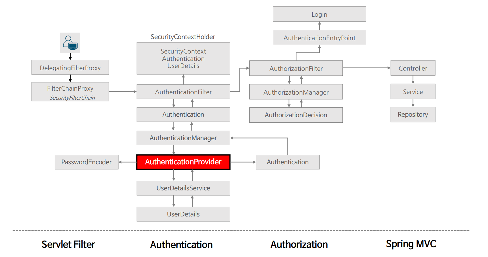
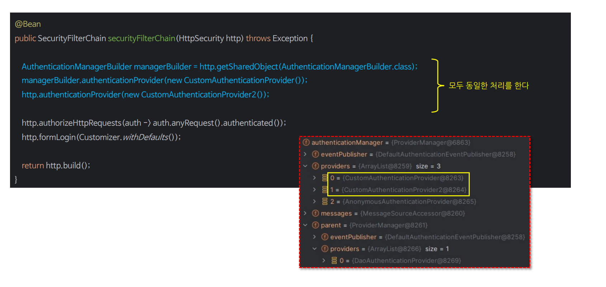
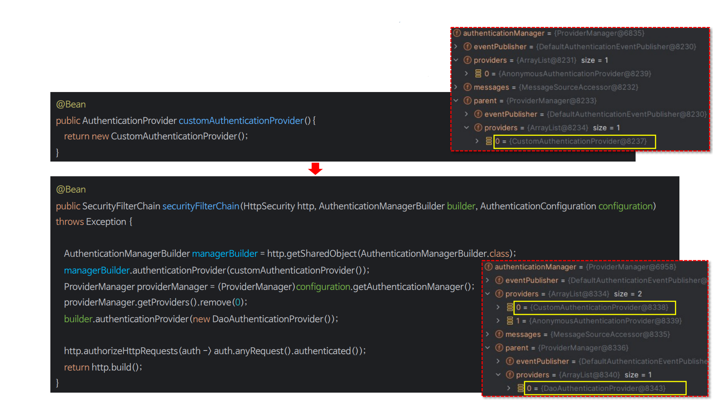
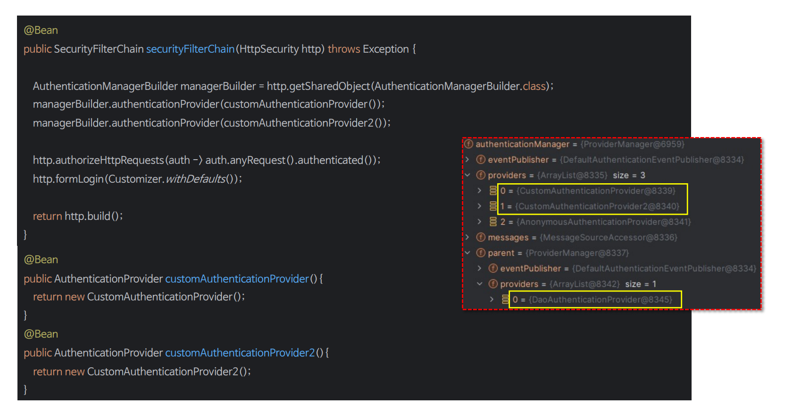

# 인증 제공자



---

## AuthenticationProvider

- 사용자의 자격 증명을 확인하고 인증 과정을 관리하는 클래스로 사용자가 시스템에 액세스하기 위해 제공한 정보(아이디, 비밀번호 등)가 유효한지 검증하는 과정을 포함한다.
- 다양한 유형의 인증 인증 메커니즘을 지원할 수 있는데, 예를 들어 표준 사용자 이름과 비밀번호를 기반으로 한 인증, 토큰 기반 인증, 지문 인식 등을 처리할 수 있다.
- 성공적인 인증 후에는 `Authentication` 객체를 반환하며 이 객체에는 사용자의 신원 정보와 인증된 자격 증명을 포함한다.
- 인증 과정 중에 문제가 발생한 경우 `AuthenticationException` 과 같은 예외를 발생시켜 문제를 알리는 역할을 한다.


- `authenticate()` : `AuthenticationManager`로부터 `Authentication` 객체를 전달 받아 인증을 수행한다.
- `supports()` : 인증을 수행할 수 있는 조건인지를 검사한다.


---

## AuthenticationProvider - 일반 객체로 생성



```java
public class CustomAuthenticationProvider implements AuthenticationProvider {
    @Override
    public Authentication authenticate(Authentication authentication) throws AuthenticationException {
        String loginId = authentication.getName();
        String password = (String) authentication.getCredentials();

        return new UsernamePasswordAuthenticationToken(
                loginId, password, List.of(new SimpleGrantedAuthority("ROLE_USER"))
        );
    }

    @Override
    public boolean supports(Class<?> authentication) {
        return true;
    }
}
```
```java

public class CustomAuthenticationProvider2 implements AuthenticationProvider {
    @Override
    public Authentication authenticate(Authentication authentication) throws AuthenticationException {
        String loginId = authentication.getName();
        String password = (String) authentication.getCredentials();

        return new UsernamePasswordAuthenticationToken(
                loginId, password, List.of(new SimpleGrantedAuthority("ROLE_USER"))
        );
    }

    @Override
    public boolean supports(Class<?> authentication) {
        return authentication.isAssignableFrom(UsernamePasswordAuthenticationToken.class);
    }
}
```
```java
@Configuration
@EnableWebSecurity
public class SecurityConfig {

    @Bean
    public SecurityFilterChain securityFilterChain(HttpSecurity http) throws Exception {

        AuthenticationManagerBuilder builder = http.getSharedObject(AuthenticationManagerBuilder.class);
        builder.authenticationProvider(new CustomAuthenticationProvider());
        builder.authenticationProvider(new CustomAuthenticationProvider2());

        http
                .authorizeHttpRequests(auth -> auth
//                        .requestMatchers("/").permitAll()
                        .anyRequest().authenticated())
                .formLogin(Customizer.withDefaults())
//                .authenticationProvider(new CustomAuthenticationProvider())
//                .authenticationProvider(new CustomAuthenticationProvider2())
        ;

        return http.build();
    }
}
```

---

## AuthenticationProvider - 빈으로 생성(빈을 한 개만 정의)

- `AuthenticationProvider`를 빈으로 정의하면 `DaoAuthenticationProvider`를 자동으로 대체하게 된다.



```java
@Configuration
@EnableWebSecurity
public class SecurityConfig {
    
    @Bean
    public SecurityFilterChain securityFilterChain(HttpSecurity http,
                                                   AuthenticationManagerBuilder builder,
                                                   AuthenticationConfiguration configuration) throws Exception {
        
        AuthenticationManagerBuilder managerBuilder = http.getSharedObject(AuthenticationManagerBuilder.class);
        managerBuilder.authenticationProvider(customAuthenticationProvider());

        ProviderManager authenticationManager = (ProviderManager) configuration.getAuthenticationManager();
        authenticationManager.getProviders().remove(0);
        builder.authenticationProvider(new DaoAuthenticationProvider());

        http
                .authorizeHttpRequests(auth -> auth
                        .requestMatchers("/").permitAll()
                        .anyRequest().authenticated())
                .formLogin(Customizer.withDefaults())
        ;

        return http.build();
    }
}
```

---

## AuthenticationProvider - 빈으로 생성(빈을 두 개 이상 정의)



```java

@Configuration
@EnableWebSecurity
public class SecurityConfig3 {

    @Bean
    public SecurityFilterChain securityFilterChain(HttpSecurity http) throws Exception {

        AuthenticationManagerBuilder builder = http.getSharedObject(AuthenticationManagerBuilder.class);
        builder.authenticationProvider(customAuthenticationProvider());
        builder.authenticationProvider(customAuthenticationProvider2());

        http
                .authorizeHttpRequests(auth -> auth
//                        .requestMatchers("/").permitAll()
                        .anyRequest().authenticated())
                .formLogin(Customizer.withDefaults())
//                .authenticationProvider(new CustomAuthenticationProvider())
//                .authenticationProvider(new CustomAuthenticationProvider2())
        ;

        return http.build();
    }

    @Bean
    public AuthenticationProvider customAuthenticationProvider() {
        return new CustomAuthenticationProvider();
    }

    @Bean
    public AuthenticationProvider customAuthenticationProvider2() {
        return new CustomAuthenticationProvider2();
    }
}
```