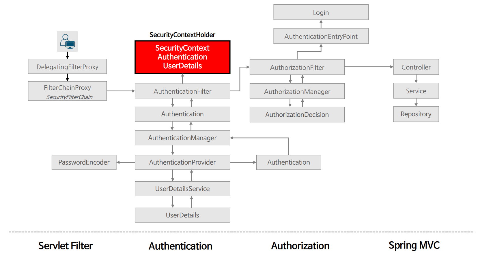
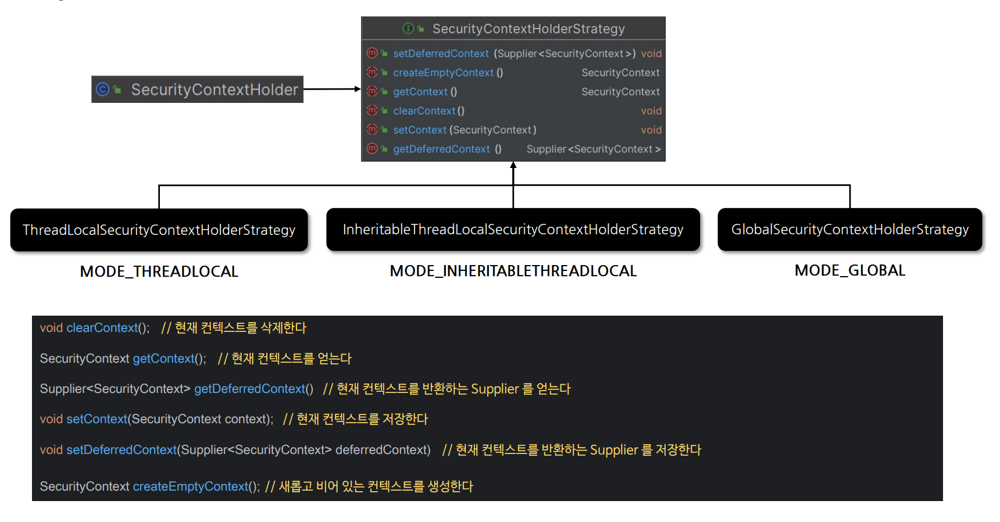

# 인증 컨텍스트



---

## SecurityContext

- **Authentication 저장** : 현재 인증된 사용자의 `Authentication` 객체를 저장한다.
- **ThreadLocal 저장소 사용** : `SecurityContextHolder`를 통해 접근되며 `ThreadLocal` 저장소를 사용해 각 스레드가 자신만의 보안 컨텍스트를 유지한다.
- **애플리케이션 전반에 걸친 접근성** : 애플리케이션의 어느 곳에서나 접근 가능하며 현재 사용자의 인증 상태나 권한을 확인하는 데 사용된다.

---

## SecurityContextHolder

- **SecurityContext 저장** : 현재 인증된 사용자의 `Authentication` 객체를 담고 있는 `SecurityContext` 객체를 저장한다.
- **전략 패턴 사용** : 다양한 저장 전략을 지원하기 위해 `SecurityContextHolderStrategy` 인터페이스를 사용한다.
  - `MODE_THREADLOCAL` : 기본 모드, 각 스레드가 독립적인 보안 컨텍스트를 가진다. 대부분의 서버 환경에 적합하다.
  - `MODE_INHERITABLETHREADLOCAL` : 부모 스레드로부터 자식 스레드로 보안 컨텍스트가 상속되며 작업을 스레드 간 분산 실행하는 경우 유용할 수 있다.
  - `MODE_GLOBAL` : 전역적으로 단일 보안 컨텍스트를 사용하며 서버 환경에서는 부적합하고, 간단한 애플리케이션에 적합하다.
- **전략 모드 지정** : `SecurityContextHolder.setStrategyName(String)`
- **SecurityContext 참조** : `SecurityContext.getContextHolderStartegy().getContext()`
- **SecurityContext 삭제** : `SecurityContext.getContextHolderStartegy().clearContext()`

---

## 구조



---

## SecurityContextHolder & SecurityContext 구조


- 스레드마다 할당 되는 전용 저장소에 `SecurityContext`를 저장하기 때문에 동시성의 문제가 없다.
- 스레드 풀에서 운용되는 스레드일 경우 새로운 요청이더라도 기존의 `ThreadLocal`이 재사용될 수 있기 때문에 클라이언트로 응답 직전에 항상 `SecurityContext`를 삭제해 주고 있다.

---

## SecurityContextHolderStrategy 

- 기존 방식
```java
SecurityContext context = SecurityContextHolder.createEmptyContext();
context.setAuthentication(authentication);
SecurityContextHolder.setContext(context);
```

위 코드는 `SecurityContextHolder`를 통해 `SecurityContext`에 정적으로 접근할 때 여러 애플리케이션 컨텍스트가 `SecurityContextHolderStartegy`를 지정하려고 할 때 경쟁 조건을 만들 수 있다.

- 변경 방식
```java
SecurityContextHolderStrategy securityContextHolderStrategy = SecurityContexyHolder.getContextHolderStrategy();
SecurityContext context = securityContextHolderStrategy.createEmptyContext();
context.setAuthentication(authentication);
securityContextHolderStrategy.setContext(context);
```

애플리케이션이 `SecurityContext`를 정적으로 접근하는 대신 `SecurityContextHolderStrategy`를 자동 주입이 될 수 있도록 하여
각 애플리케이션 컨텍스트는 자신에게 가장 적합한 보안 전략을 사용할 수 있게 된다.

---

[이전 ↩️ - 인증(`Authentication`)](https://github.com/genesis12345678/TIL/blob/main/Spring/security/AuthenticationArchitecture/Authentication.md)

[메인 ⏫](https://github.com/genesis12345678/TIL/blob/main/Spring/security/main.md)

[다음 ↪️ - 인증 관리자(`AuthenticationManager`)](https://github.com/genesis12345678/TIL/blob/main/Spring/security/AuthenticationArchitecture/AuthenticationManager.md)